# FFXI - Fantasy Castle of Deepest Dark

!!! warning "This page is a WIP and frequently updated. Ctrl + F5 to refresh."

## Before You Begin

=== "Event Duration"

    - The event runs from 7/30/26 (17:00 JST) to 9/10/26 (12:59 JST). 
    - Part II of the event, which covers the third run was released on 8/13/26. 

=== "FFXI Legendary Adventurers"

    - [Zeid](/adventurers/legendary-adventurers/details/Zeid.md) 
    - [Iroha](/adventurers/legendary-adventurers/details/Iroha.md) 
    - [Prishe](/adventurers/legendary-adventurers/details/Prishe.md)

=== "Free Event Unit"

    - When heading to the Royal Capital for the first time, there will be a cutscene for the start of the event. Afterwards, there may be an adventurer you can talk to who talks about a suspicious looking man in the Beginning Abyss. 
    - Alternatively, if you enter the Royal Capital again after viewing the initial cutscene for the event, the cutscene for the adventurers talking about the suspicious man will automatically trigger.
    - Head to entrance of the Beginning Abyss and head inside to the 1st floor. There will an NPC right beside you (X:5, Y:1) that will give you a choice of any one of the Legendary Event adventurers (Zeid, Iroha, Prishe), Abenius, Red Beard, or Arboris. 

=== "Event Cursed Wheel"

    - The event has its own Cursed Wheel (CW). It can be accessed via the EVENT (yellow shield) button. Note that it is not accessible if you are in a dungeon. 
    - The collaboration has a total of 3 runs and each will require you to do a full reset. Here are the steps:
        - Select the EVENT button and then click the purple Cursed Wheel button at the bottom of the page. 
        - Click the Errand from Northern Hollow node. This will take you back to the Royal Capital where you will need to re-watch the opening cutscenes and re-accept the primary request from the Tavern > Requests > Featured tab. 
        - Each node has multiple toggles that register key decisions throughout each run. Before resetting, make sure they are all toggled properly to the "good" outcomes to avoid subsequent runs not triggering properly.  

=== "Event Unlock Triggers"

    === "Systems" 
    
        - The event has several new systems that unlock based on progression. On your first run it is **critical that you exit back to Northern Hollow every time you unlock a new Harken** as the cutscenes can be missed and require CW-ing to fix. 
        - Zone 3 - Goblin Blacksmith and Relic Weapons
            - Unlock the Zone 3 Harken. Go to any town that has a Jeweler.  
            - Go to Jeweler > Exchange > Fantasy Castle of the Deepest Dark tab, which will now offer 7 relic weapons for 1,000 Gil each. You must purchase at least one of them to trigger the next set of scenes.
            - Note: Some people have reported needing to buy all 7 relics. Whether this is a bug or not, or if they changed things with the last update remains unclear. 
            - Go to the event dungeon for a cutscene. This plays while you are on the floor selection screen. 
            - Return to Northern Hollow and click on the Remote Blacksmith icon for a cutscene with your new goblin blacksmith! 
            - Now you have access to the Reforge and Remake options for the Relic Weapons. Dedicated section [here](#relic-weapopns). 
        -  Zone 4 - Mining 
            - Unlock the Zone 4 Harken and exit back to Northern Hollow. 
            - In the Item shop you can now purchase a consumable item called the Northcleft Pickaxe. Northern Hollow is the only location in the game where these can be purchased. 
            - The Jeweler will now exchange 500 Gil for 1 Gold Northcleft Pickaxe. The gold version triples (3x) anything that you mine. As of the 8/13 update they also work on the event dispatches. 
            - Mining nodes are scattered across each floor. Both types of pickaxes have a 50% chance to break per swing. Based on community data the long-term average is 2 swings per pickaxe. 
        - Zone 6 - Trading 
            - The Zone 6 Harken is right before the final event boss. 
            - Return to Northern Hollow and go to the Tavern. The Trader will give you a brief tutorial on how the process works. 
            - Trading is the primary way of upgrading your Relic weapons. 

    === "Dispatches"

        - There are a total of 3 special dispatches that can be accepted in the Royal Capital. They are blue-colored and near the center of the dispatch list, so they are easy to miss if you are scrolling quickly. 
        - The dispatches are tied to having the Harkens unlocked on Zone 2, 3, and 5. The 8/13 patch fixed Harken's reverting back to being unlocked if you CW. If a dispatch disappears, you will have to manually go back to each floor and restore the Harken again. 

## Guide 

??? note "1st Run"

    === "Guide" 
    
        1. Go to the Royal Capital to trigger a cutscene. Next, enter the Guild to watch another set of cutscenes. The choice does not matter. 
        2. At the Guild select Request > Featured tab and accept the event request, which will unlock Village of Northern Hollow on the world map. 
        3. Select the world map and go to the Village of Northern Hollow. Speak with all the NPCS, then go to the Tavern and speak with everyone. This will unlock Ghost Castle of the Northcleft on the world map. 
        4. Enter Zone 1 and speak with the goblin blocking your way. Give him any basic healing item or scroll.
        5. Take the left or right path and head north. They both connect at the Keep entrance along with the first Harken.
        6. At the Keep entrance you will see Cait Sith. She will ignore you and run inside. Proceed to Zone 2 and you will get into a scripted ambush fight. Prishe will show up to assist. After the battle she will tell you that she is hungry and will not move until you give her something to eat. You have several options at this point. If you have a Mackerel sandwich from A2 you can speak with her again to progress. If not, you will have to complete 1 of 2 side quests. See "Feeding Prishe Sidequest" for details. 
        7. After feeding Prishe head north to step on a switch to unlock the door. Zone 2 is a large area with several side areas. Head to the top right-side of the map where you will meet Iroha who will open the door for you. Unlock the nearby Harken and proceed to Zone 3. It is important that you return back to town every time you unlock a Harken on a floor as new features (blacksmithing, trading, etc.) are triggered at these specific points and can be missed. Exiting at Zone 3 unlocks the Goblin Blacksmith and Relic Weapon systems.  
        8. Proceed through Zone 3 until you reach the central area where you will meet Zeid. Unlocking the door requires completing a mini-puzzle that requires temporarily sacrificing 2 party members. The Gorgon statues are located at (X:6, Y:17) and (X:20, Y:17). You will not lose any party members permanently. The only effect is that it increases their "hatred" toward you, which you cannot do anything about on your first run.  
        9. After unlocking the door, proceed north to see a cutscene between Lion and Zeid. The Shadowlord will appear and absorb both of them. Unlock the nearby Harken, go back to town, and then return and head to Zone 4. 
        10. In Zone 4 there are 3 portals, which take you do self-contained areas on the map. The left-most takes you to the left area; the central portal takes you to the bottom-right area; and, the right-hand portal takes you to the 3 Doors puzzle, which is where we want to go to proceed with the main story. The side areas have NM spawn locations, so they are worth investigating on a regular basis if you are farming for Attestations or Fragment drops.  
        11. Take the right-hand portal where you will encounter Prishe again in front of the 3 Doors puzzle. The basic idea is that each door corresponds to an alignment (Good-Neutral-Evil). Whatever party members do not match that alignment will incur a penalty and an increase in hatred toward the MC. The door you select does not matter for this run (but does matter on the second run). If you return to this area in the future on your first run the entire mechanic is disabled so you can explore and farm freely. 
        12. Go through the portal after the 3 Doors and proceed until you encounter a cutscene between Prishe and Ulmia. There will be a mini-boss fight. The Shadowlord will appear again and absorb both of them. Unlock the nearby Harken, return to town, and then proceed to Zone 5. The Mining system is now unlocked and you can purchase pickaxes at the Northern Hollow's Item Shop. Or, the gold version at any Jeweler in exchange for 500 Gil.   
        13. In Zone 5 you will meet Iroha again. After the brief conversation proceed to the central area where you will see 2 portals. Each has a pressure plate you need to step on to unlock the door. Once that is done unlock the Harken, return to town, etc. When you are ready proceed to Zone 6. 
        14. Zone 6 is a straight bridge. Continue north until the cutscene between Iroha and Tenzen triggers. Another mini-boss fight against Tenzen will ensue. The Shadowlord will appear again and absorb both of them. Proceed north afterward for another cutscene where the eldest brother will also be absorbed by the Shadowlord. Unlock the Harken, exit, and return to Northern Hollow to unlock the Trading system in the Tavern.  
        15. Warning! Per usual, the first run is a "bad" ending. The upcoming fight is a scripted loss and your entire team will die and need to be revived. You will need to do enough damage to the Shadowlord to trigger the cutscene where he begins to absorb your teammates. If you are strong enough you can bring fewer party members or units that you do not care about. This is not recommended for newer players as you may not be able to do enough damage to trigger the scripted loss scene. As you are dying Lulu will comment that you should seek out Cait Sith for answers. Upon death you will be forced back to the CW to reset the event for your 2nd run.  
        
    === "Tips" 
    
        - To avoid having to do the Feed Prishe sidequest you can get a Mackerel Sandwich in the Port Town if you have completed A2. 

    === "Feeding Prishe Sidequest"
    
        - After speaking with Prishe exit the event dungeon and head back to Northern Hollow. Go to the Tavern and talk to the Chef.
        - He will request rabbit meat or barley as ingredients. These are 2 separate side quests and either are sufficient to feed Prishe.
        - Option 1: Rabbit Meat 
            - Rabbit meat can be obtained from any fight against Vorpal Bunnies, which are in almost every Abyss and side dungeon.
        - Option 2: Barley 
            - The barley request is more involved. Exit the Tavern and speak with the NPC asking for help against a pack of goblins. 
            - Accept and after the fight he requests that you eliminate all the goblins in a nearby cave as a long-term solution. This will unlock the Goblin Abode on the world map. 
            - The Goblin Abode is a small side dungeon. The goal is to kill every enemy. Lulu will comment when you are done. Note that it is easy to miss some of the mobs, so comb the area carefully.
            - After you are done speak with the NPC back in town and the request will be completed and he will hand over the barley and a small Gold reward.
        - When finished with either option return to the chef and had over the rabbit meat and/or barley. He will give you a sandwich and soup in return. 
        - Return to Prishe and give her either item and proceed to the rest of Zone 2. 

    === "Goblin's Abode Map"
        

??? note "2nd Run"

    === "Guide" 
    
        1. Full reset the event CW. Repeat all of the steps from the 1st run and head to the Keep entrance in Zone 1. Cait Sith will be there, but disappears.
        2. Redo the Feed Prishe sidequest. At the end of Zone 2 you will encounter Iroha again. Unlike the 1st run you can now try to catch Caith Sith. Return to the large central room. Her locations are randomized and she can sometimes be hard to see if she is standing next to a pillar so search carefully. The options you select do not seem to matter. After 3-4 encounters you will be offered the Guidelight Bugs (Valuable item), which will light up when you are in close proximity to a Crystal of Hope. It will turn green when you are several tiles away and purple when it is in close proximity. The crystals appear as shiny, white interactable objects. They can be on the floor or walls and are easy to miss.   
        3. For the 2nd run you have 3 primary objectives:
            - Collect all 3 Crystals of Hope that correspond to each event unit's companion (Lion, Ulmia, Tenzen). 
            - Use the corresponding crystal before the mini-boss fight ("Hold it up like a sword") to prevent the Shadowlord from absorbing each pair. 
            - Eliminate the party's "hatred" toward the MC by successfully completing the Stone Gorgon and 3 Doors puzzles, which will create new toggles on your CW. 
        4. Lion's crystal is in Zone 2. There are 3 different locations where it can randomly appear. They are all located in the side areas branching out from the central room.  
        5. Go to Zone 3 and interact with one of the Gorgon statues. You will now be offered the option to sacrifice yourself. This action prevents the team's "hatred" from growing. There is no need to interact with the 2nd Gorgon as the door will now be open. If you do -not- sacrifice yourself, then the CW toggle will not register properly. 
        6. Procced through the door and watch the scene between Zeid and Lion. This time you will be offered 3 options. Select "Hold it up like a sword". If you do not select this option, then the crystal will break and you will see the "bad" ending again where both of them are absorbed. 
        7. Warning! Before entering Zone 4 read the 3 Doors Puzzle tab and decide how you would like to proceed. 
        8. When you enter Zone 4 your two tasks are to 1) find Ulmia's crystal and 2) complete the 3 Doors puzzle correctly if you want the CW toggle. The location of Ulmia's crystal is randomized, but tends to appear in the area immediately after stepping on one of the 3 portals from the central zone. This is the elevated area with a fixed enemy a few spaces away. To proceed to the mini-boss fight take the right-hand portal from the central area. 
        9. Same process as before. Hold up the crystal and clear all the enemies. Remember that your formation will be moved around. The Shadowlord will appear again but will be unable to absorb Prishe or Ulmia. 
        10. Tenzen's crystal is located in Zone 5. It generally appears in one of the side areas to the left or right, including the 1-way rooms. An enemy may be standing on its tile. Like last time you will need to unlock the door by taking the central 2 portals and stepping on their respective switches. Proceed to Zone 6. 
        11. Same process. Hold up the crystal and defeat Tenzen. Both are saved. Unlock the Harken and prepare for the Shadowlord boss fight. When ready enter Zone 7. 
        12. Before the fight starts you will need to assign a pair of collab units to protect each of the 3 brothers. Assignments do not seem to matter outside brief flavor text. 
        12. See Boss: Shadowlord tab for details.
        13. After the fight speak with everyone and you will be automatically returned to town. Return to the Royal Capital to turn in the request.
        14. Lulu comments that things do not seem right and that you should speak with Cait Sith. 
        15. CW back to the second node and head to the Keep entrance. Since you now have possession of the 3 Crystals of Hope she will tell you to come back later. Exit the dungeon, re-enter, and speak with her again. This is the start of the 3rd run. 

    === "3 Doors Puzzle"
    
        - To register the CW toggle correctly everyone in your party must be the -same- alignment as MC. A party size of 2-3 works fine if you are strong enough to kill the fixed mobs blocking the path. 
        - As previously noted, each of the 3 doors corresponds to Good-Neutral-Evil alignment. Make sure you read the text when you interact with the door to go through the correct one. 
        - If completed successfully you will get new Lulu text ("Did you change our party lineup specifically for this door, by chance?"). You can return back to town before the Ulmia mini-boss fight. 
        - Notes 
            - You can still progress the main story with a mixed alignment team. The only consequence is 1) the penalty to non-matching units and 2) the CW toggle not registering.
            - After going through the door once the mechanic is disabled, so it is safe to farm the area for NMs and mining in the future. 
            - If you completed -both- the Stone Gorgon and 3 Doors puzzles correctly, then none of your teammates should turn on you during the Shadowlord boss fight. 

    === "Boss: Shadowlord" 
    
        === "Dark Lord Immunity" 
        
            - The second run adds a new gimmick to the fight. He can completely nullify all physical or magical attacks depending on his current state. 
            - He will rotate back-and-forth between both states. It is clearly sign-posted and you will see an icon above his head letting you know which type of attack will be nullified. 
            - Recommend you bring at least 1 physical and 1 magical DPS unit to the fight
            - Alternatively, you can bring mainly physical DPS with support units. When he has physical immunity you can use those turns to heal, buff, defbuff, etc. 
        
        === "Strategy" 
        
            - You will have the collab units as guest allies during the fight. If you own any collab units, they will not be listed as an guest unit.
            - Can be suretied relatively easily. Is immune to CT down and turn delaying effect, but can be debuffed with other status downs.
            - Does not have conventional HP amount. Rather, a certain amount of damage needs to be dealt per phase, otherwise the battle does not seem to progress. The phases are before he casts the physical barrier, before he casts implosion, and after it is cast.
            - He will randomly enrage two of your allies during the fight, including guest units, which makes them attack allies albeit with a big damage penalty.
            - All of his moves are telegraphed. He will typically alternate between Dark Nova and Giga Slash. Dark Nova is a full team dark AOE. Giga Slash is a physical row AOE to either front or back row.
            - After doing enough damage, he will become invulnerable to physical attacks. After doing enough magic damage, he will swap to a magic barrier instead on his next turn, but also any allies that are enraged in your team will be cleansed by the Crystal's Powers (cutscene). After this, he will ready Swath of Silence which on his next turn will cast Implosion, which is a full team dark AOE, and then follow up immediately with a -ga spell (Aeroga, Firaga, etc), a magic row AOE. After this point it's possible for him to swap immunities again if you take long enough.
        
        === "Picture"
        
            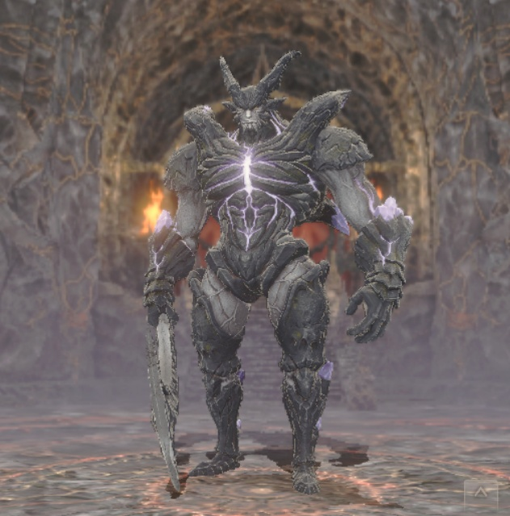

    === "Bondmates" 
    
        - Completing the request will reward you with a bondmate for each of the side companions (Lion, Ulmia, and Tenzen). 
        - We do -not- recommend that you farm these bondmates until the 3rd run, which is more efficient and allows you to level up the 4th and final bondmate at the same time. 

??? note "3rd Run" 

    1. Cursed wheel again to the point where you can talk to Cait Sith at the Zone 1 castle entrance.  
    2. Leave through the Harken and come back to talk to Cait Sith again. You'll learn that this time you need to find six ~~FFXI expansion advertisements~~ Crystals instead of three.  
    3. Continue through the request as normal.  (Meet and feed Prishe in Zone 2.)  
    4. There are crystals randomly located in both Zones 2 and 3 before Zeid now.  Get both of them before doing the Gorgon puzzle.  
    5. Continue through the request as before. (Hold up the Crystal like a sword, defeat Lion).  
    6. On Zone 4, there are also two crystals this time, again randomly located.  Find them both and don't forget to bring a single alignment party before taking the right teleporter so that you can proceed through the doors without setting off the trap.  Again, you can use the teleporter to return to the middle of the room both to get your regular party back and find any other crystals you missed before going through the north door to confront Ulmia.  *Note* a crystal can spawn in the room leading to the 3 doors. You'll see the indicator light up on nearby hallways, and should be able to home in on it's general location. Just don't go in there the first time without a single-alignment party.
    7. On Zone 5, there are also two crystals this time. Find them, the activate both switches, then go to zone 6.  
    8. Meet and beat up Tenzen in zone 6.  
    9. Go to zone 7, confront the Arch Shadow Lord.  Same general fight, this time he'll cast a second implosion so avoid letting HP get too low especially for the MC.  
    10. You win.  

    Rewards: Completing the request with all six crystals and having saved all three friends will reward you with [the same bondmates as before plus Cait Sith as a bondmate](#bondmates).
    
## Maps

??? map "Zone 1"
    { width="500" }
    
??? map "Zone 2"
    { width="600" }
    
??? map "Zone 3"
    { width="700" }
    
??? map "Zone 4"
    { width="800" }
    
??? map "Zone 5"
    { width="900" }
    
??? map "Zone 6"
    { width="1000" }
    
??? map "Zone 7"
    { width="1100" }
    
??? map "Goblin's Abode"
    

## Enemies  
- Enemies in the Castle to scale with player level/grade.  
- A mix of traditional monsters include Goblins, Hobgoblins, Slimes, and Rabbits in rhe Entrance region.  Undead skeletons and specters also appear inside the castle.  
- New enemies include Kindred Demons and Tonberry.  
    - Kindred Demons:  
        - Considered a different race than traditional Demons, they are not affected by regular demon-slayer weapons or demon-resistant armor.  They are all dark-type and respond as expected to dark and light type attacks and allies. See Type Advantage, Disadvantage, and Armor Modifiers.  
        - There are several classes and varieties of Kindred demons.  The stronger types have glowing purple chests. Additionally the Warlocks carry staves while the others carry weapons.  
        - Among the Kindred Demons there are special minibosses called [Notorious Monsters](#notorious-monsters) that appear as non moving demons in the dungeon.  
    - Tonberry:
        - Tonberrys are small, light-type green creatures in robes carrying a knife and lantern.  
        - They can appear alone, in groups of three, or with other regular monsters.  
        - They have unique combat behavior. They start on far rows, 'approach' one row at a time, and then attempt a devastating stab attack.
        - They also have a counterattack that has a chance of reacting to any PHYSICAL MELEE attack and increases in damage with the number of Tonberry's you have ever killed (~17x).  By the end of the event you should expect the counterattack to 1-shot kill any ally of any level.  
        -  They will always drop some [Necropsyche (lantern) relic materials](#relic-equipment-and-materials).  
        -  There is a Tonberry King that can be fought once certain conditions are met. (more info pending).  
  
### Notorious Monsters  

- There are a number of unique Kindred Demons called Notorious Monsters (NM) that randomly spawn in different locations throughout the castle.  See [maps of spawn locations below](#potential-spawning-locations).  
- These Demons are much more powerful than the random wandering Kindred demons. They are individually named, and each has slightly different combat behaviors. (more details pending)  
    - All of them have high speed, a large HP pool, can start the combat with multiple attacks, and can cast multiple buffs and debuffs rendering their melee attacks able to one-shot any member of your team.  
    - Some will be alone, others will start with several regular mobs, others can summon other monsters and entities throughout the fight.  
- Defeated NMs always leave a chest and have a high chance of dropping [Attestation or Fragment relic materials](#relic-equipment-and-materials).  

#### Potential Spawning Locations 

=== "Zone 1" 

    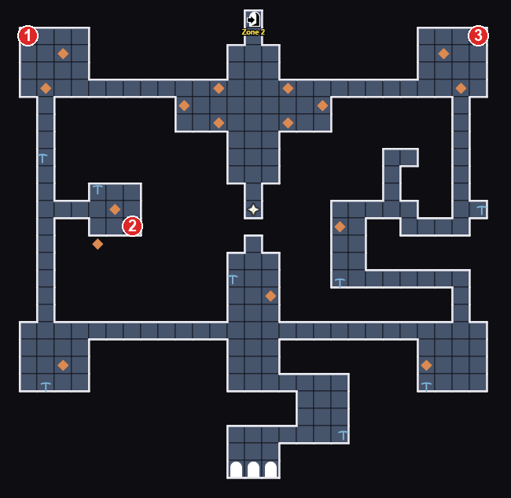

=== "Zone 2"

    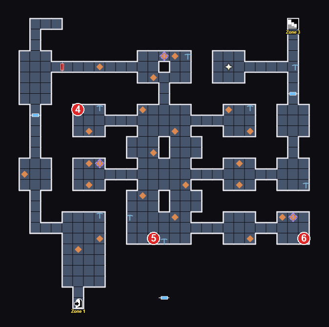
    
=== "Zone 3"

    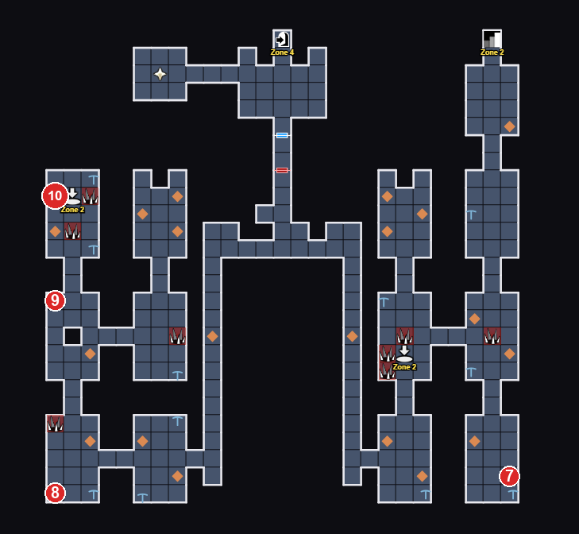

=== "Zone 4"

    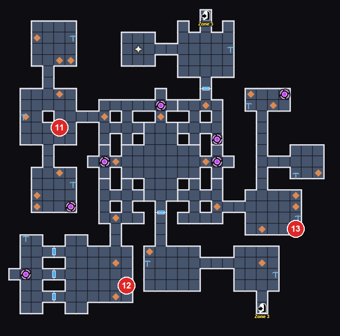

=== "Zone 5" 

    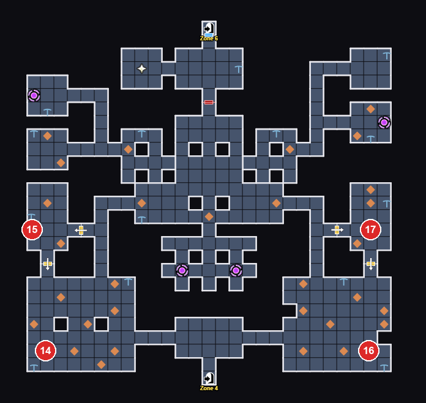

## Harken's Blessings  
The Harkens in the event can provide both the basic blessings and unique Event blessings that will only be active in the Event dungeon. They still follow the 'only one blessing' per day rule, and you can reset through normal means if that feels important to you.  The Event unique blessings are:

| Name                        | Description                                                                                                                             |  
|-----------------------------|-----------------------------------------------------------------------------------------------------------------------------------------|  
| Blessing of Earthstrike   | Harken's Blessing has increased your earth-type damage.                                                        |  
| Blessing of Lightstrike   | Harken's Blessing has increased your light-type damage.                                                        |  
| Blessing of Waterstrike   | Harken's Blessing has increased your water-type damage.                                                        |  
| Hammer of Kindred Demons  | Harken's Blessing has increased the damage you do to Kindred demons.                                           |  
| Kindred Demon Rejection   | Harken's Blessing has reduced the damage you take from Kindred demons.                                         |  
| Blessing of Earthstrike II | Harken's Blessing has increased your earth-type damage.                                                        |  
| Blessing of Lightstrike II | Harken's Blessing has increased your light-type damage.                                                        |  
| Blessing of Waterstrike II | Harken's Blessing has increased your water-type damage.                                                        |  
| Kindred Demon Hunter       | Harken's Blessing has increased the damage you do to Kindred demons and reduced the damage you take from them. |  

## Bondmates

- Lion, Tenzen, and Ulima will become bondmates after saving them with Crystals of Hope and completing the Good Ending.
- Cait Sith will become a bondmate after completing the 3rd run with all six crystals.  (This will also give the other three bondmates if they are saved.)
- Bonds can be leveled by simply using the Cursed Wheel to leap back to right before the final fight, winning the battle, and turning in the Request.  
- Bonds can achieve level 5 with 11 completions.  
- These event bonds are unique, in that they provide one set of benefits for all adventurers, but also an bonus set of benefits if bonded to their specific friend (Lion with Zeid, Ulmia with Prishe, and Tenzen with Iroha, and Cait Sith with any of those three).

!!! note "FFXI Bondmate Details"  
    
    ??? note "Lion, Pirate's Daughter"  
        
          
        
        - Lion's Determination: Provides about 17% Stun Tolerance at +5  
        - The Bond Between Lion and Zeid: Provides 4 extra Surety if put on Zeid at +5  
        
    ??? note "Ulmia the Songstress"  
        
          
        
        - Ulmia's Song of Prayer: Provides 8 Resistance at +5  
        - The Bond Between Ulmia on Prishe: Also provides 8 extra ATK if put on Prishe at +5  
        
    ??? note "Tenzen, Samurai of the Far East"  
        
          
        
        - Tenzen's Ultimate Aim: Provides about 17% Paralysis Tolerance at +5  
        - The Bond Between Tenzen and Iroha: Also provides 4 extra ATK and DIV if put on Iroha at +5  

    ??? note "Cait Sith"  
        
          
        
        - Cait Sith's Guidance: Increases HP.
        - The Bond Between Cait Sith and Heroes: Also increases SP and MP if put on Prishe, Iroha, or Zeid
        

## Relic Equipment and Materials 

!!! note "Availability"
    Relic items, the relic blacksmith, and mining unlock at various points after restoring the Zone 3 Harken where Lulu hints you should go see if anything has changed. (*Never ignore blatant game hints!*)  
    Players have reported things not unlocking after continuing through the story without returning. We recommend you return to town at each new Harken after floor 3.  Wheeling back to these points may be necessary for unlock if you've progressed too far.

- The event includes unique "Relic Weapons and Armor" (completely unrelated to Relicbrews and related material). These items start as low rank items but can be gradually upgraded (through Reforging and Remaking) into some of the more interesting items in the game.   
- The starting items are obtained from the Event Jeweler Exchange for 1000 Gil each after the Zone 3 Harken has been reached. Reforging materials can be obtained at the Event Jeweler Exchange, by farming the event dungeon, and through the trading mechanism described above.  
- There is no level or story progress restriction to possessing any of the relic upgrade materials, but getting drops of the highest level does seem limited for lowest level players. Through various means it is still possible for even the lowest level event participant to finish with some Silver rank equipment.  

???+ tip "Relic Item details"  

    - Relic items of all levels are always 4* Red (4 unlocked blessings) with Silver level blessings. 
    - FAS also apply silver-level blessing increases. You can enhance and FAS at any time at any level with no loss of potential stat range.  
    - Blessing types are fixed. L/FASing them keeps blessing types the same and just rerolls the values, similar to Master Rings from class trials.  
    - Enhancement:  
        - Limited by item level:  Level 0 (Bronze) +5, Level 1 (Iron) +10, Level 2 (Steel) +15, Levels 3 and 4 (Ebon and Silver) +20.  
        - Costs for all levels follow the Silver (Special) item tables. (2.4M gp for 2H Sword, ~1M for the rest).  
        - Blessings and increases all follow the Silver level table ranges for 1H and 2H items (even if you enhance at lower relic level).  
        - Reforging has no affect on enhancement level or blessings.  
    - Remaking:  
        - Can be done only on max-reforged, Silver level (Level 4) equipment
        - What it does:
            - Reverts enhancement level to 0
            - Allows you to reroll ONLY milestone blessing boosts when enhancing equipment again
            - Removes ALL blessing refinements (Boosts from refinement stones)
        - Does not modify:
            - Reforge level (No need to farm materials again)
            - Base blessing values (Need a LFAS or FAS for this)
            - Altered blessings (Through common alteration stones)
            - FAS bonus blessing amounts
    - Silver Tier Skills:  
        - At Silver Reforge Level, items gain an active and a passive skill for to the bearer when equipped.  
        - Active skill damage is approximately equivalent to Lvl 6 Heavy Attack on physical weapons, and Lvl 6 Cones for the staff.
        - Buffs/debuffs from the effects are not affected by turn-extending effects.
        - Active Skill costs are 31-34 SP (or MP for the staff).

### Relic item upgrade strategy
!!! tip ""  
    There were many unknowns regarding the relic reforging, enhancing, remaking, L/FAS'ing, etc. mechanics when the event started.  This has been almost entirely cleared up. Key details are that *Reforge Level has Zero Impact* on potential blessings and when you can enhance and alter your relic item. You cannot brick your item by enhancing early.  Items will use Silver cost and Blessing tables *at any Reforge level*.  

- Relic items are prime candidates for using L/FAS to maximize blessing rolls since you don't have to worry about the blessing types.  
- Items have a maximum of four blessing score components:  (#1) Initial roll, (#2) +5/10/15/20 Milestone enhancment increase, (#3) FAS bonus if you used one, (#4) Refinement bonus. (A FAS bonus has the same values as a Milestone enhancement bonus).  
- Relics are unique because of the Remake option. Remake sets the item enhancement back to +0 removing the Milestone enhancement blessing component (#2) and any Refinement bonuses (#4). All other blessing components remain unchaged. The game keeps track of the individual components even though the player only sees the total value.  
-If you never remake, general strategy is the same as for Master Fighter/Mage Ring: (1) L/FAS until you're happy with the stats, (2) Alter away one stat if desired, (3) enhance and hope for good milestone rolls (If rolls are bad, you always have the option to re-FAS, understanding that any altered slot will revert to its original type.) (4) finally Refine. 
- To take advantage of Remake, you want to only L/FAS before enhancing because:  
    - FAS before enhancing - you can note the milestone increase values and decide if they're worth keeping.  
    - FAS after enhancing - Milestone blessings are rerolled along with everything else and you don't know if that piece was high or low and whether a Remake will be worthwhile.  

!!! tip "TL;DR: recommended Relic improvement process"  
    *Use the [Blacksmithing Enhancement tables for Silver items](/equipment/blacksmithing/#silver) to determine how good your rolls are.*
    
    1. Note the starting blessings from when you first got the item.  
    2. If you are going to L/FAS do it before enhancing to +5.  
        - For LFAS just compare to initial values.  For FAS compare with Initial+FAS ranges.  
    3. Repeat (2) until happy with the rolls or out of L/FAS.  
    4. Alter any one slot you want with a good alter stone. Reroll Alter until you are happy with the roll.  
    5. Before enhancement note (screenshot) your blessing values.  *This is what a Remake will return you to*.  
    6. Begin enhancing to +20. Note your milestone blessing increases.  *This is what Remake will remove*.  
    7. On the way to +20, if you get a bad milestone decide if you want to try again. If so, *stop enhancing*. Don't waste gp if you know you're going to Remake. 
    8. If you're happy with 7, Refine and you're done.  
    9. Remake if unhappy with 7. (finish Reforging to Silver level if necessary).  
    10. Return to step 5. Continue from there.  

    This process isolates the milestone enhancement from the FAS related rerolls, giving you more control and allowing you to preserve good FAS results rather than rerolling everything from one bad component.  If you did enhance before using FAS, your can still get roll the same range of blessings.  You just won't know until your first Remake what values you will return to in step 5.  
    
### Relic Material Totals  
??? tip "Relic Material Count Table"  
    === "Materals by item type"  
        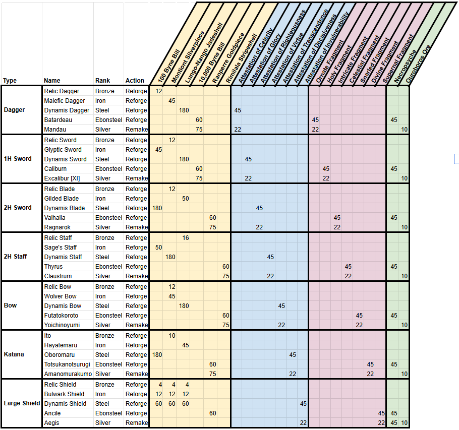  
    
    === "Materials by rank"  
        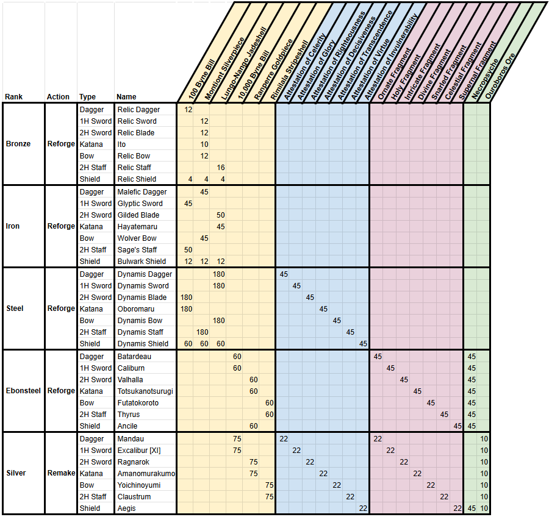  

Total material required to make all Relic items:

Item | 100 Byne Bill 	| Montiont Silverpiece 	| Lungo-Nango Jadeshell 	| 10,000 Byne Bill 	| Ranperre Goldpiece 	| Rimilala Stripeshell 	| Attestation of Celerity 	| Attestation of Glory 	| Attestation of Righteousness 	| Attestation of Virtue 	| Attestation of Transcendence 	| Attestation of Decisiveness 	| Attestation of Invulnerability 	| Ornate Fragment 	| Holy Fragment 	| Intricate Fragment 	| Celestial Fragment 	| Snarled Fragment 	| Divine Fragment 	| Supernal Fragment |  Necropsyche 	| Ouroboros Ore 	|  
|----| ---------	| ---------	| ---------	| ---------	| ---------	| ---------	| ---------	| ---------	| ---------	| ---------	| ---------	| ---------	| ---------	| ---------	| ---------	| ---------	| ---------	| ---------	| ---------	| ---------	| ---------	| --------- |  
| Total to build each item | 543 	| 392 	| 727 	| 120 	| 180 	| 120 	|  45 	| 45 	| 45 	| 45 	| 45 	| 45 	| 45 	| 45 	| 45 	| 45 	| 45 	| 45 	| 45 	| 45 	 |  315 	| 0 	|   
| Total with one Remake each | 543 	| 392 	| 727 	| 270 	| 330 	| 270 	|  67 	| 67 	| 67 	| 67 	| 67 	| 67 	| 67 	| 67 	| 67 	| 67 	| 67 	| 67 	| 67 	| 67 	 |  360 	| 70 	|   

### Relic Equipment Information Tables

??? tip "Relic Weapons and Armor full details"
    
    === "Reforge Materials By Tier"
    
        | Type         | Stage      | Weapon           | Rank      | Materials                                                                                                  |
        |--------------|------------|------------------|-----------|------------------------------------------------------------------------------------------------------------|
        | Dagger       | T1         | Relic Dagger     | Bronze    | -                                                                                                          |
        | Dagger       | T2         | Malefic Dagger   | Iron      | 100 Byne Bill ×12                                                                                          |
        | Dagger       | T3         | Dynamis Dagger   | Steel     | Montiont Silverpiece ×45                                                                                   |
        | Dagger       | T4         | Batardeau        | Ebonsteel | Attestation of Celerity ×45; Lungo-Nango Jadeshell ×180                                                    |
        | Dagger       | T5 (Final) | Mandau           | Silver    | Ornate Fragment ×45; Necropsyche ×45; 10,000 Byne Bill ×60                                                 |
        | Dagger       | Remake     | Mandau           | Silver    | Ouroboros Ore ×10; Attestation of Celerity ×22; Ornate Fragment ×22; 10,000 Byne Bill ×75                  |
        | 1H Sword     | T1         | Relic Sword      | Bronze    | -                                                                                                          |
        | 1H Sword     | T2         | Glyptic Sword    | Iron      | Montiont Silverpiece ×12                                                                                   |
        | 1H Sword     | T3         | Dynamis Sword    | Steel     | 100 Byne Bill ×45                                                                                          |
        | 1H Sword     | T4         | Caliburn         | Ebonsteel | Attestation of Glory ×45; Lungo-Nango Jadeshell ×180                                                       |
        | 1H Sword     | T5 (Final) | Excalibur [XI]   | Silver    | Holy Fragment ×45; Necropsyche ×45; 10,000 Byne Bill ×60                                                   |
        | 1H Sword     | Remake     | Excalibur [XI]   | Silver    | Ouroboros Ore ×10; Attestation of Glory ×22; Holy Fragment ×22; 10,000 Byne Bill ×75                       |
        | Katana       | T1         | Ito              | Bronze    | -                                                                                                          |
        | Katana       | T2         | Hayatemaru       | Iron      | Montiont Silverpiece ×10                                                                                   |
        | Katana       | T3         | Oboromaru        | Steel     | Lungo-Nango Jadeshell ×45                                                                                  |
        | Katana       | T4         | Totsukanotsurugi | Ebonsteel | Attestation of Decisiveness ×45; 100 Byne Bill ×180                                                        |
        | Katana       | T5 (Final) | Amanomurakumo    | Silver    | Divine Fragment ×45; Necropsyche ×45; Ranperre Goldpiece ×60                                               |
        | Katana       | Remake     | Amanomurakumo    | Silver    | Ouroboros Ore ×10; Attestation of Decisiveness ×22; Divine Fragment ×22; Ranperre Goldpiece ×75            |
        | 2H Sword     | T1         | Relic Blade      | Bronze    | -                                                                                                          |
        | 2H Sword     | T2         | Gilded Blade     | Iron      | Montiont Silverpiece ×12                                                                                   |
        | 2H Sword     | T3         | Dynamis Blade    | Steel     | Lungo-Nango Jadeshell ×50                                                                                  |
        | 2H Sword     | T4         | Valhalla         | Ebonsteel | Attestation of Righteousness ×45; 100 Byne Bill ×180                                                       |
        | 2H Sword     | T5 (Final) | Ragnarok         | Silver    | Intricate Fragment ×45; Necropsyche ×45; Ranperre Goldpiece ×60                                            |
        | 2H Sword     | Remake     | Ragnarok         | Silver    | Ouroboros Ore ×10; Attestation of Righteousness ×22; Intricate Fragment ×22; Ranperre Goldpiece ×75        |
        | 2H Staff     | T1         | Relic Staff      | Bronze    | -                                                                                                          |
        | 2H Staff     | T2         | Sage's Staff     | Iron      | Lungo-Nango Jadeshell ×16                                                                                  |
        | 2H Staff     | T3         | Dynamis Staff    | Steel     | 100 Byne Bill ×50                                                                                          |
        | 2H Staff     | T4         | Thyrus           | Ebonsteel | Attestation of Virtue ×45; Montiont Silverpiece ×180                                                       |
        | 2H Staff     | T5 (Final) | Claustrum        | Silver    | Celestial Fragment ×45; Necropsyche ×45; Rimilala Stripeshell ×60                                          |
        | 2H Staff     | Remake     | Claustrum        | Silver    | Ouroboros Ore ×10; Attestation of Virtue ×22; Celestial Fragment ×22; Rimilala Stripeshell ×75             |
        | Bow          | T1         | Relic Bow        | Bronze    | -                                                                                                          |
        | Bow          | T2         | Wolver Bow       | Iron      | Montiont Silverpiece ×12                                                                                   |
        | Bow          | T3         | Dynamis Bow      | Steel     | Montiont Silverpiece ×45                                                                                   |
        | Bow          | T4         | Futatokoroto     | Ebonsteel | Attestation of Transcendence ×45; Lungo-Nango Jadeshell ×180                                               |
        | Bow          | T5 (Final) | Yoichinoyumi     | Silver    | Snarled Fragment ×45; Necropsyche ×45; Rimilala Stripeshell ×60                                            |
        | Bow          | Remake     | Yoichinoyumi     | Silver    | Ouroboros Ore ×10; Attestation of Transcendence ×22; Snarled Fragment ×22; Rimilala Stripeshell ×75        |
        | Heavy Shield | T1         | Relic Shield     | Bronze    | -                                                                                                          |
        | Heavy Shield | T2         | Bulwark Shield   | Iron      | 100 Byne Bill ×4; Montiont Silverpiece ×4; Lungo-Nango Jadeshell ×4                                        |
        | Heavy Shield | T3         | Dynamis Shield   | Steel     | 100 Byne Bill ×12; Montiont Silverpiece ×12; Lungo-Nango Jadeshell ×12                                     |
        | Heavy Shield | T4         | Ancile           | Ebonsteel | Attestation of Invulnerability ×45; 100 Byne Bill ×60; Montiont Silverpiece ×60; Lungo-Nango Jadeshell ×60 |
        | Heavy Shield | T5 (Final) | Aegis            | Silver    | Supernal Fragment ×45; Necropsyche ×45; Ranperre Goldpiece ×60                                             |
        | Heavy Shield | Remake     | Aegis            | Silver    | Ouroboros Ore ×10; Attestation of Invulnerability ×22; Supernal Fragment ×22; Necropsyche ×45              |
    
    === "+0 Base Stats By Tier"
    
        | Type         | Tier       | Weapon           | Rank      | ATK       | MAG       | DIV       | ACC     | EVA     | SUR     | DEF      | MDEF     |
        |--------------|------------|------------------|-----------|-----------|-----------|-----------|---------|---------|---------|----------|----------|
        | Dagger       | T1         | Relic Dagger     | Bronze    | 8         |           |           | 15      | -6      | -4      |          |          |
        | Dagger       | T2         | Malefic Dagger   | Iron      | 19 (+11)  |           |           | 15      | -4 (+2) | -3 (+1) |          |          |
        | Dagger       | T3         | Dynamis Dagger   | Steel     | 29 (+10)  |           |           | 15      | -2 (+2) | -2 (+1) |          |          |
        | Dagger       | T4         | Batardeau        | Ebonsteel | 43 (+14)  |           |           | 15      | 0 (+2)  | -1 (+1) |          |          |
        | Dagger       | T5 (Final) | Mandau           | Silver    | 53 (+10)  |           |           | 20 (+5) | 2 (+2)  | 0 (+1)  |          |          |
        | 1H Sword     | T1         | Relic Sword      | Bronze    | 12        |           |           | 2       | -6      |         |          |          |
        | 1H Sword     | T2         | Glyptic Sword    | Iron      | 24 (+12)  |           |           | 4 (+2)  | -4 (+2) |         |          |          |
        | 1H Sword     | T3         | Dynamis Sword    | Steel     | 36 (+12)  |           |           | 6 (+2)  | -2 (+2) |         |          |          |
        | 1H Sword     | T4         | Caliburn         | Ebonsteel | 51 (+15)  |           |           | 8 (+2)  | 0 (+2)  |         |          |          |
        | 1H Sword     | T5 (Final) | Excalibur [XI]   | Silver    | 64 (+13)  |           |           | 10 (+2) | 2 (+2)  |         |          |          |
        | Katana       | T1         | Ito              | Bronze    | 12        | 9         |           | 6       | -8      |         |          |          |
        | Katana       | T2         | Hayatemaru       | Iron      | 26 (+14)  | 20 (+11)  |           | 8 (+2)  | -6 (+2) |         |          |          |
        | Katana       | T3         | Oboromaru        | Steel     | 45 (+19)  | 41 (+21)  |           | 10 (+2) | -4 (+2) |         |          |          |
        | Katana       | T4         | Totsukanotsurugi | Ebonsteel | 68 (+23)  | 63 (+22)  |           | 10      | -2 (+2) |         |          |          |
        | Katana       | T5 (Final) | Amanomurakumo    | Silver    | 82 (+14)  | 76 (+13)  |           | 10      | 0 (+2)  |         |          |          |
        | 2H Sword     | T1         | Relic Blade      | Bronze    | 25        |           |           | 6       | -10     | -4      |          |          |
        | 2H Sword     | T2         | Gilded Blade     | Iron      | 48 (+23)  |           |           | 6       | -8 (+2) | -3 (+1) |          |          |
        | 2H Sword     | T3         | Dynamis Blade    | Steel     | 68 (+20)  |           |           | 6       | -6 (+2) | -2 (+1) |          |          |
        | 2H Sword     | T4         | Valhalla         | Ebonsteel | 108 (+40) |           |           | 6       | -4 (+2) | -1 (+1) |          |          |
        | 2H Sword     | T5 (Final) | Ragnarok         | Silver    | 132 (+24) |           |           | 15 (+9) | -2 (+2) | 0 (+1)  |          |          |
        | 2H Staff     | T1         | Relic Staff      | Bronze    | 14        | 8         | 8         |         | -4      |         |          |          |
        | 2H Staff     | T2         | Sage's Staff     | Iron      | 20 (+6)   | 32 (+24)  | 32 (+24)  |         | -4      |         |          |          |
        | 2H Staff     | T3         | Dynamis Staff    | Steel     | 25 (+5)   | 56 (+24)  | 56 (+24)  |         | -4      |         |          |          |
        | 2H Staff     | T4         | Thyrus           | Ebonsteel | 33 (+8)   | 88 (+32)  | 88 (+32)  |         | -4      |         |          |          |
        | 2H Staff     | T5 (Final) | Claustrum        | Silver    | 40 (+7)   | 108 (+20) | 108 (+20) |         | -4      |         |          |          |
        | Bow          | T1         | Relic Bow        | Bronze    | 24        |           |           | -4      |         |         |          |          |
        | Bow          | T2         | Wolver Bow       | Iron      | 46 (+22)  |           |           | -2 (+2) |         |         |          |          |
        | Bow          | T3         | Dynamis Bow      | Steel     | 64 (+18)  |           |           | 0 (+2)  |         |         |          |          |
        | Bow          | T4         | Futatokoroto     | Ebonsteel | 92 (+28)  |           |           | 2 (+2)  |         |         |          |          |
        | Bow          | T5 (Final) | Yoichinoyumi     | Silver    | 113 (+21) |           |           | 4 (+2)  |         |         |          |          |
        | Heavy Shield | T1         | Relic Shield     | Bronze    |           |           |           | -2      | -10     |         | 1        | -8       |
        | Heavy Shield | T2         | Bulwark Shield   | Iron      |           |           |           | -2      | -8 (+2) |         | 8 (+7)   | -6 (+2)  |
        | Heavy Shield | T3         | Dynamis Shield   | Steel     |           |           |           | -2      | -6 (+2) |         | 14 (+6)  | -4 (+2)  |
        | Heavy Shield | T4         | Ancile           | Ebonsteel |           |           |           | -2      | -4 (+2) |         | 24 (+10) | -2 (+2)  |
        | Heavy Shield | T5 (Final) | Aegis            | Silver    |           |           |           | -2      | -1 (+3) |         | 38 (+14) | 45 (+47) |
    
    === "T5 Enhancement Values"
    
        | Type         | Weapon         | Rank   | Level | ATK       | MAG       | DIV       | ACC | EVA | SUR | DEF     | MDEF    |
        |--------------|----------------|--------|-------|-----------|-----------|-----------|-----|-----|-----|---------|---------|
        | Dagger       | Mandau         | Silver | +0    | 53        |           |           | 20  | 2   |     |         |         |
        | Dagger       | Mandau         | Silver | +5    | 71 (+18)  |           |           | 20  | 2   |     |         |         |
        | Dagger       | Mandau         | Silver | +10   | 89 (+18)  |           |           | 20  | 2   |     |         |         |
        | Dagger       | Mandau         | Silver | +15   | 107 (+18) |           |           | 20  | 2   |     |         |         |
        | Dagger       | Mandau         | Silver | +20   | 125 (+18) |           |           | 20  | 2   |     |         |         |
        | 1H Sword     | Excalibur [XI] | Silver | +0    | 64        |           |           | 10  | 2   |     |         |         |
        | 1H Sword     | Excalibur [XI] | Silver | +5    | 82 (+18)  |           |           | 10  | 2   |     |         |         |
        | 1H Sword     | Excalibur [XI] | Silver | +10   | 100 (+18) |           |           | 10  | 2   |     |         |         |
        | 1H Sword     | Excalibur [XI] | Silver | +15   | 118 (+18) |           |           | 10  | 2   |     |         |         |
        | 1H Sword     | Excalibur [XI] | Silver | +20   | 136 (+18) |           |           | 10  | 2   |     |         |         |
        | Katana       | Amanomurakumo  | Silver | +0    | 82        | 76        |           | 10  |     |     |         |         |
        | Katana       | Amanomurakumo  | Silver | +5    | 100 (+18) | 96 (+20)  |           | 10  |     |     |         |         |
        | Katana       | Amanomurakumo  | Silver | +10   | 118 (+18) | 115 (+19) |           | 10  |     |     |         |         |
        | Katana       | Amanomurakumo  | Silver | +15   | 136 (+18) | 134 (+19) |           | 10  |     |     |         |         |
        | Katana       | Amanomurakumo  | Silver | +20   | 154 (+18) | 154 (+20) |           | 10  |     |     |         |         |
        | 2H Sword     | Ragnarok       | Silver | +0    | 132       |           |           | 15  | -2  |     |         |         |
        | 2H Sword     | Ragnarok       | Silver | +5    | 165 (+33) |           |           | 15  | -2  |     |         |         |
        | 2H Sword     | Ragnarok       | Silver | +10   | 191 (+26) |           |           | 15  | -2  |     |         |         |
        | 2H Sword     | Ragnarok       | Silver | +15   | 214 (+23) |           |           | 15  | -2  |     |         |         |
        | 2H Sword     | Ragnarok       | Silver | +20   | 231 (+17) |           |           | 15  | -2  |     |         |         |
        | 2H Staff     | Claustrum      | Silver | +0    | 40        | 108       | 108       |     | -4  |     |         |         |
        | 2H Staff     | Claustrum      | Silver | +5    | 73 (+33)  | 136 (+28) | 136 (+28) |     | -4  |     |         |         |
        | 2H Staff     | Claustrum      | Silver | +10   | 99 (+26)  | 162 (+26) | 162 (+26) |     | -4  |     |         |         |
        | 2H Staff     | Claustrum      | Silver | +15   | 122 (+23) | 190 (+28) | 190 (+28) |     | -4  |     |         |         |
        | 2H Staff     | Claustrum      | Silver | +20   | 139 (+17) | 216 (+26) | 216 (+26) |     | -4  |     |         |         |
        | Bow          | Yoichinoyumi   | Silver | +0    | 113       |           |           | 4   |     |     |         |         |
        | Bow          | Yoichinoyumi   | Silver | +5    | 146 (+33) |           |           | 4   |     |     |         |         |
        | Bow          | Yoichinoyumi   | Silver | +10   | 172 (+26) |           |           | 4   |     |     |         |         |
        | Bow          | Yoichinoyumi   | Silver | +15   | 195 (+23) |           |           | 4   |     |     |         |         |
        | Bow          | Yoichinoyumi   | Silver | +20   | 212 (+17) |           |           | 4   |     |     |         |         |
        | Heavy Shield | Aegis          | Silver | +0    |           |           |           | -2  | -1  |     | 38      | 45      |
        | Heavy Shield | Aegis          | Silver | +5    |           |           |           | -2  | -1  |     | 47 (+9) | 50 (+5) |
        | Heavy Shield | Aegis          | Silver | +10   |           |           |           | -2  | -1  |     | 53 (+6) | 55 (+5) |
        | Heavy Shield | Aegis          | Silver | +15   |           |           |           | -2  | -1  |     | 59 (+6) | 60 (+5) |
        | Heavy Shield | Aegis          | Silver | +20   |           |           |           | -2  | -1  |     | 65 (+6) | 65 (+5) |
    
    === "Weapon Fixed Blessings"
    
        | Type         | Weapon         | Slot 1 | Slot 2 | Slot 3 | Slot 4 |
        |--------------|----------------|:------:|:------:|:------:|:------:|
        | Dagger       | Mandau         | ATK    | SUR    | EVA    | ATK%   |
        | 1H Sword     | Excalibur [XI] | ATK    | ACC    | EVA    | ATK%   |
        | Katana       | Amanomurakumo  | ATK    | MAG    | EVA    | ATK%   |
        | 2H Sword     | Ragnarok       | ATK    | SUR    | EVA    | ATK%   |
        | 2H Staff     | Claustrum      | MAG    | DIV    | MAG%   | DIV%   |
        | Bow          | Yoichinoyumi   | ATK    | ACC    | ASPD   | ATK%   |
        | Heavy Shield | Aegis          | MDEF   | MDEF%  | EVA    | DEF    |
    
    === "Weapon Attack Skills"
    
        | Type     | Weapon         | Skill            | Cost  | Description                                                                                                                                              | Turns | Effect                            |
        |----------|----------------|------------------|:-----:|----------------------------------------------------------------------------------------------------------------------------------------------------------|:-----:|-----------------------------------|
        | Dagger   | Mandau         | Mercy Stroke     | 31 SP | Major physical attack with high Accuracy on 1 enemy. Increases own Surety for 3 turns.                                                                   | 3     | +13 SUR                           |
        | 1H Sword | Excalibur [XI] | Knights of Round | 31 SP | Major physical attack with high Accuracy on 1 enemy. Continuously restores minor HP to self for 3 turns.                                                 | 3     | HP regen                          |
        | Katana   | Amanomurakumo  | Tachi: Kaiten    | 34 SP | Major physical attack with high Accuracy on 1 enemy. Continuously restores minor SP to self for 3 turns.                                                 | 3     | +3 SP per turn                    |
        | 2H Sword | Ragnarok       | Scourge          | 31 SP | Major physical attack with high Accuracy on 1 enemy. Increases own Surety for 3 turns.                                                                   | 3     | +13 SUR                           |
        | 2H Staff | Claustrum      | Gate of Tartarus | 35 MP | Major untyped spell attack on 1 enemy. Chance to reduce the Attack Power of 1 enemy for 3 turns, and continuously restores minor MP to self for 3 turns. | 3     | -15% Attack Power; +3 MP per turn |
        | Bow      | Yoichinoyumi   | Namas Arrow      | 31 SP | Major physical attack with high Accuracy on 1 enemy. Increases own Accuracy for 3 turns.                                                                 | 3     | +13 ACC                           |
    
    === "Weapon Passive Skills"
    
        | Type         | Weapon         | Passive                | Effect                                                                                            | Values                     |
        |--------------|----------------|------------------------|---------------------------------------------------------------------------------------------------|----------------------------|
        | Dagger       | Mandau         | Power of Mandau        | Chance to inflict Poison on a direct hit with a normal attack or attack skill.                    |                            |
        | 1H Sword     | Excalibur [XI] | Power of Excalibur     | Low chance of dealing increased damage on direct hits; bonus scales with the user's remaining HP. | Up to +20% DMG             |
        | Katana       | Amanomurakumo  | Power of Amanomurakumo | Chance to reduce enemy Attack Power on a direct hit.                                              | -20% Attack Power, 4 turns |
        | 2H Sword     | Ragnarok       | Power of Ragnarok      | Continuously increases Surety.                                                                    | +12 SUR                    |
        | 2H Staff     | Claustrum      | Power of Claustrum     | Chance to dispel 1 buff off an enemy on a direct hit.                                             |                            |
        | Bow          | Yoichinoyumi   | Power of Yoichinoyumi  | Increases damage and Accuracy against flying enemies.                                             | +20% DMG, +20 ACC          |
        | Heavy Shield | Aegis          | Power of Aegis         | Continuously increases Magic Defense.                  

### Material Trading

Trading for relic materials unlocks after reaching the 5th or 6th Harken (confirmation needed). Arriving back in the town will show a cutscene. Head into the tavern and talk to the merchant for a short tutorial and to begin trading.  

Trading is the main source of obtaining the event currency, Gil, and a reliable way to obtain materials you need for reforging relic equipment. There are two options, Delivery Support and Procurement Request.

#### Delivery Support

This allows you to help fulfill other people's requests for certain items. There will typically be a reward of some sorts for providing a specific item, with Gil always being given to the player providing support. Usually, more Gil is given the higher the tier of the materials. Buying the trading pass from the Jeweler's shop will boost Gil gain from these transactions by 50%.  Blue dots highlight requests that you have the ability to fulfill.

Players in the list will typically prioritize those on your friends list before strangers, so it can be easy to help friends or coordinate trading materials for Gil. However, there is a 24 HR limit to the refreshing of the list, which can be bypassed by spending 300 green gems.  Note that only the general materials can be exchnaged for gold, so difficult-to-obtain materials will not be lost in the process, they will simply be traded for other equal-value items (in addition to getting a Gil reward for completing the exchange.) Note that Attestations exchanged for Fragments at a 10:1 ratio, but you can only place requests to go from Attestations to Fragments.  To exchange Fragments back to Attestations you need to fulfill someone else's requset on this Delivery Support page.

#### Procurement Request

There are three slots here that allow you to post requests for certain items, with a three hour cooldown per successful request. Typically, you can pay for general relic materials with gold or by exchanging for similarly valued material.  Attestations and Fragments, however, can only be traded for other Attestations and Fragments.  Attestations can be traded up for Fragments at a 10:1 ratio. You cannot request to get Attestations back for Fragments, that conversion can only be done by fulfilling someone else' Delivery Support request. 

One notable thing is that while real players can fulfill your requests, there are bots that will also guarantee that your request is fulfilled within the 3 hour cooldown of each request. This guarantees a stable source of certain materials that are difficult to get if you simply just wait for the trades to be fulfilled.  For Attestations and Fragments in particular where the process of getting the specific weapon type you need in-dungeon can be difficult, with Requests you can slowly but surly convert anything you do find to what you actually need.

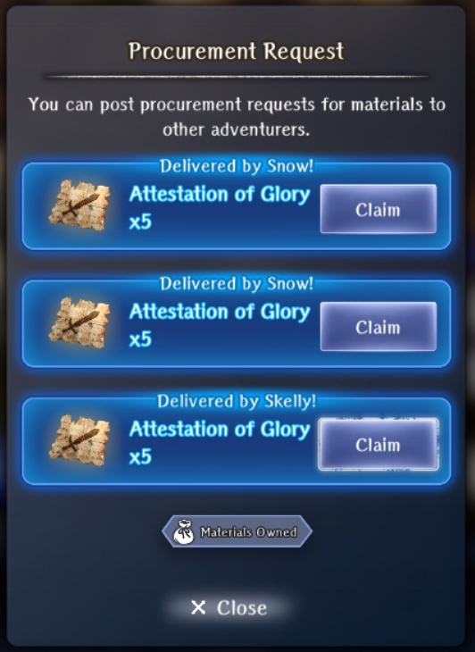

## Farming
(Work in Progress)
  
### Mining for Ore  

- After unlocking Relics and the blacksmith, an interaction outside of the Castle will occur with people discussing mining for ore in the castle.  At this point you can go back to the town where the shop will sell you pickaxes under Consumable items for 100gp.  There will also be Golden Pickaxes in the Jeweler Exchange for 500 Gil.  
- In the Castle if you have any type of pickaxe in your inventory (no, the Digging Mattock doesn't count), you can click on any of the multi-colored rock formations in the walls and attempt to mine it for ore. Black formations are 'dead' and cannot be mined. See locations on the Maps below. You will almost always get one type of ore/stone and one type of sellable each mining attempt.  
- After a certain number of mining attemptes, the rock formation will 'shatter' and be 'dead' for the rest of that time in the dungeon. Leaving and returning to the dungeon will randomly respawn fresh gems to mine.  
- Pickaxes are consumable and they will break every 1-3 uses.  Golden pickaxes don't last any longer, and they do cost event currency (500 Gil), but they produce 3x the mining return per use.
- Mining products:
    - Enhancement ore: low, mid, high, fine, and silver grade  
    - Ouroboros Ore (see Relic Material list above)  
    - Alteration and refinement stones (includig LFAS / FAS) ranging from 1-5 star quality.
    - Sellables: mainly translucent gems
- Tips:
    - Mining products are not limited by player progress or rank. This is one of the few free-to-play ways in the game to get early access to higher levels of ore than you can normally find. This is especially valuable if you are trying to Reforge Relic items to material Ranks higher tha your current main story progress allows.  
    - Keeping a supply of Mining Pickaxes in storage lets you quickly refill from the inventory screen outside the castle without heading back to town.
    - At least at the start while you're still accumulating currency, it's probably best to just stick to loading up on as many regular pickaxes as you can carry.  Later, after you have cleared out the Exchnage shop, you can splurge on the Golden ones to triple your mining output.
    - There are several locations with one or two mining spots and no mobs near entrances and Harkens (Zone 1 Main entrance , Zone 2-5 Harkens). If you want to do nothing but mine, you can repeatedly jump in and out of those locations to mine when they refresh.  

??? map "Mining Maps"
    Mining locations marked with checkmarks below.
   
    === "Floor 1"  
        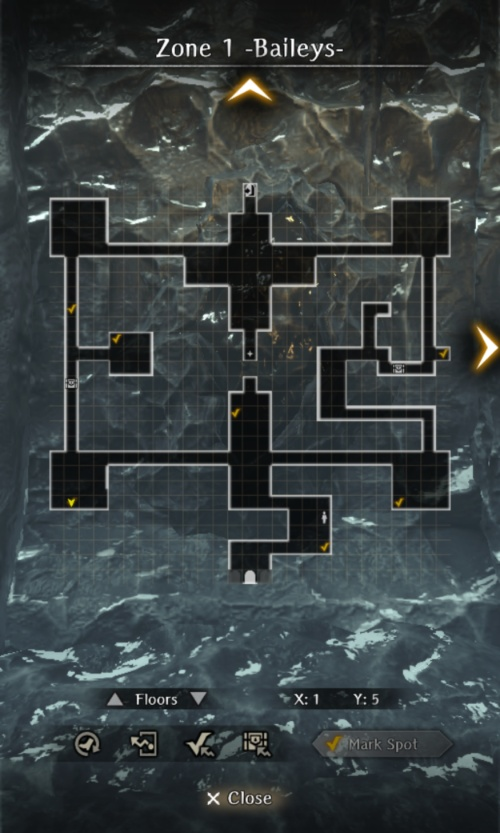  
        
    === "Floor 2"  
        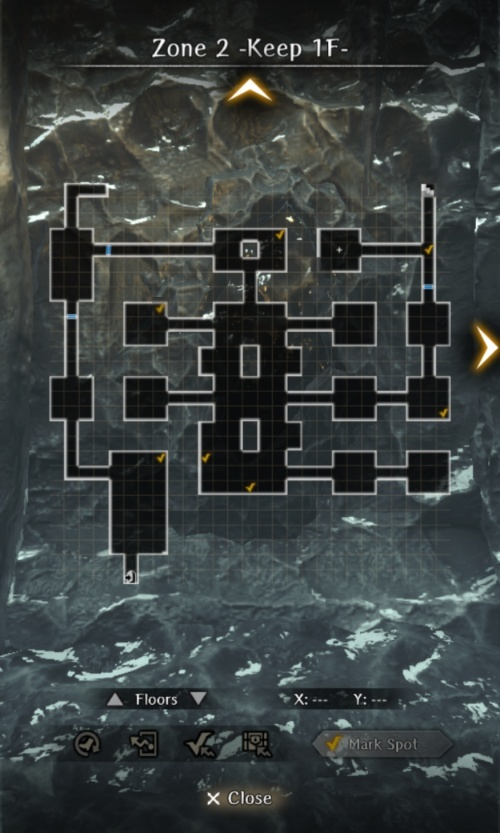  

    === "Floor 3"  
        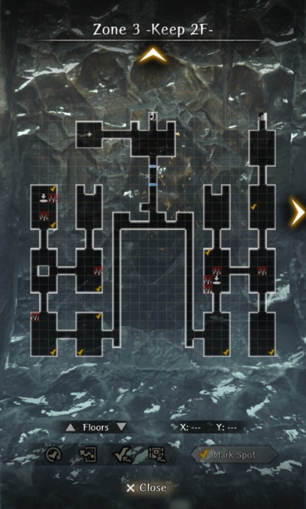  

    === "Floor 4"  
        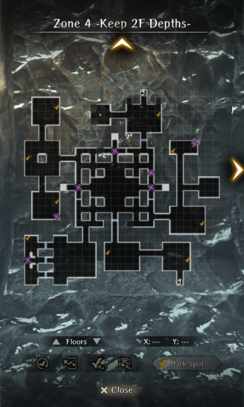  

    === "Floor 5"  
        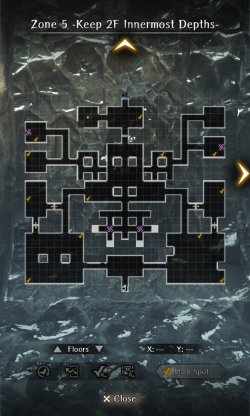  

### Relic Materials
- Note - as of Aug 14 some relic materials are available in the Exchange. Likely you will still need far more than are available.  
- There are ~four general categories of relic items, each of which needs to be farmed in different ways:  
    1. General relic materials: Byrne Bills, Shells, and Silver/Goldpieces needed to reforge items up to Steel rank. These materials drop from regular chests either spawed on entering the dungeon or from random mob chests. See Chest/Junk Drop section for farming details.  
    2. Attestations (papers) and Fragments (boxes): Specific to each relic item, these are needed to Reforge items to Ebonsteel and Silver ranks, respectively and to Remake silver-rank items. These items only drop from two sources: encounters with Notorious monsters (non-wandering demons with a random chance at occurring at set spawn points on Zones 1-5), and roaming packs of 8 demons that spawn in the farthest southern corners of the big rooms on Zone 5 (only appearing on second and subsequent dungeon resets). Depending on your junk/level/progress tier all of these encounters have a chance of dropping 4-5 of each item.  The NMs are named, and each has set spawn locations and types of items dropped.  See [NM location maps](#potential-spawning-locations) above.  
        - It has been noted that the 8-demon packs always spawn closest to the farthest southern corners of the big rooms. Additionally, while auto-walking you can bring up the map and all mobs stop moving (you can still run into them.) The west room has a generally mob-free straight path to the corner if you auto-walk from the floor entrance.  If you set an auto walk point to the corner, upon entering the floor you can immediately walk-to-check then bring up the map and you should walk there uninterrupted. Then on arrival you can quickly find and attack the closest mob, likely to be the 8-demon pack. Note this seems to also avoid aggro-ing as many other mobs on your way in. Doing both rooms with this method, the second room will likely have had mobs wandering decreasing effectiveness of the approach.  
        - Certain NMs only spawn once daily. Others have a chance to repsawn once each time you enter the dungeon, and each time you re-enter the floor that chance of them appearing re-rolls. So you can clear the general mobs from a floor, if no NM switch floors, go back to that floor and see if the demon has spawned. (If he hasn't another random mob will be there instead.) E.g., this can be done on Zone 1 by clearing the northeast room, stepping through the gate into Zone 2, stepping back into Zone 1, checking that NE room again for the demon, repeating until he appears, after defeating him leaving the dungeon, and then repeating the process.  Other floors provide similar farming opportunities, such as the big rooms on Zone 5. (more details pending)  
    3. Necropsyche: lanterns carried by Tonberrys needed to Reforge items to silver rank and to Remake silver-rank items - Tonberrys randomly spawn throughout zones 2-5 as smaller enemies and can appear alone, with other random monsters, or as a group of three tonberries. Each battle will drop 4-5 Necropsyche, no matter how many Tonberrys in the battle. Tonberrys are light-type and have unique combat behavior. They start on far rows, 'approach' one row at a time, and then attempt a devastating stab attack. They also have a counterattack that has a chance of reacting to any PHYSICAL MELEE attack and increases in damage with the number of Tonberry's you have ever killed (~17x). MONTINO/Voice Theft can prevent the counterattack, but MONTINO can be removed. They are susceptible to sleep and stun. Encountering one? Terminate with extreme prejudice.  Encountering three? Flee.  Just not worth it.  You're gonna need to kill a lot of these guys to get all relics up to Silver.
    4. Ouroboros Ore: Special ore needed only for Remaking an item. Can be rarely obtained by [Mining for Ore (see above)](#mining-for-ore) in the castle. Also available in unlimited quantities in the Exchange Shop for 15,000 Gil (Each Remake requires 10 Ore, so 150,000 Gil each). If you're lucky with your enhancement rolls you may never need to Remake a Relic.  In the process of mining for other rare drops, you may get what you need.  But with the ease of farming Gil through the Trader, it may be easist to just plan to Exchange for whatever ore you need. 
  
### Chest / Junk Drops

- Chests will drop some combination of sellable items (translucent gems, azure ore, etc.), relic materials, and unique consumables, equipment junk, and event currency (Gil).
- Unique consumables include:
    - Potion and Hi-Potion: 55hp and 300hp heal, respectively (can also be thrown as weapons at Undead).
    - Elixir and Megalixir: restores all HP/SP/MP to 1 ally or whole party, respectively.
    - Gold Needle: Cures one ally of Stone.
    - Fool's Drink: Renders 1 ally immune to magical damage for 3 turns.
    - Scroll of Instant Stonega: deals minor earth damage to 1 enemy row.
    - Scroll of Instant Blizzaga: deals minor untyped damage to 1 enemy row with a chance to inflict Chill.
- The event can drop everything from bronze to silver junk, but availability of higher tiers is locked behind a combination of MC Grade and main story progress.  
- More details pending.
  
### Bondmates  

- After having saved each bondmate with a Crystal of Hope once, you can farm just by Cursed Wheel leaping to just before the final battle, defeating the Shadow Lord, and turning in the completed request.  

