# FFXI - Fantasy Castle of Deepest Dark

!!! warning "This page is a WIP and frequently updated. Ctrl + F5 to refresh."

## Free Event Unit

When heading to the Royal Capital for the first time, there will be a cutscene for the start of the event. Afterwards, there may be an adventurer you can talk to who talks about a suspicious looking man in the Beginning Abyss. Alternatively, if you enter the Royal Capital again after viewing the initial cutscene for the event, the cutscene for the adventurers talking about the suspicious man will automatically trigger.

Head to entrance of the Beginning Abyss and head inside to the 1st floor. There will an NPC right beside you (X:5, Y:1) that will give you a choice of any one of the Legendary Event adventurers (Zeid, Iroha, Prishe), Abenius, Red Beard, or Arboris. 

## Guide 

### 1st Run - Bad Ending

!!! note "It's highly recommended to have completed Abyss 2 at least to the point in which you receive a Mackerel Sandwich (and have an extra one in your inventory) before proceeding with the 1st Run. This will save some time in this event."

1. Head to the Royal Capital, which will trigger a cutscene about some men going to the Adventurer's Guild. Head into the Adventurer's Guild and play out the cutscene. The options selected here does not matter. 
2. Go into the Featured Tab and accept the Request. Select the option that you'll do it and you'll gain access to the event town from the World Map.
3. Head to the Village of Northern Hollow from the event map. You'll need to go into the Tavern and talk to some people to get some information. This will unlock the Ghost Castle of the Northcleft on the World Map. Head there into Zone 1.
4. The goblin blocking your way wants an item. Any will do.
5. Make your way to the entrance of the castle at the very north of the Map, in which you'll see Cait Sith. She will ignore you and simply run inside. Follow her, and upon traversing to a certain point in Zone 2, you will be ambushed but saved by Prishe. However, she will promptly block your path by sitting down being hungry. If you have a Mackerel Sandwich from Abyss 2, you can simply talk to her again and give it to her, which opens the path. Skip to Step 7 if so, otherwise go to Step 6.
6. Head back to Northern Hollow's Tavern and talk to the Chef. He will request rabbit meat and barley. Head outside talk to a man who requests help clearing goblins. You will be sent into a fight with some goblins and Hobbers, but afterwards he wants you to eliminate all the goblins in a nearby cave to solve the problem. This will unlock the Goblin Abode on the world map. Simple head to the cave and defeat all the enemies in the cave. Returning to the town will complete the request and give you some Barley and some gold. Rabbit Meat can be obtained from any area with Vorpal Rabbits. Upon collecting both meat and barley, head back to the Tavern and turn in the ingredients to receive a sandwich and some soup. Head back to Prishe and give her either food item.
7. Go into the hallway that Prishe was blocking and step on the switch to open the door. Make your way to the top right side of Zone 2, and you will meet Iroha. She will open the door for you. Head to Zone 3.
8. Head to the top middle of Zone 3 and meet Zeid. There will be a puzzle blocking the door that requires you to temporarily sacrifice two party members, one at each statue, in order to open the door. Doing so will make your party members temporarily at minimum trust level with you, but will go back to normal upon leaving the castle. The locations in which to sacrifice your team members are located at (X:6, Y:17) and (X:20, Y:17). 
9. Go past the door and see a cutscene between Lion and Zeid. The Shadow Lord will unfortunately absorb both of them. Continue on to Zone 4.
10. In Zone 4, move to the center of the floor and go through the right portal. There will be some enemies blocking the way. Prishe will be in front of a new puzzle, where there are three doors. It does not matter which door you go through at this point, but basically any allies with the wrong alignment will simply take 200ish damage and temporarily be set to minimum trust with you. Continue onwards to the end of Zone 4, where you will see a cutscene of Prishe and Ulmia. You will have to fight here. In the end, the Shadow Lord absorbs both of them.
11. You will meet Iroha in Zone 5, simply head to the middle of the floor and head slightly south to find two portals. You will need to head into each one and step on a pressure plate, which will unlock the door of Zone 5. Head to Zone 6.
12. Zone 6 is a straight bridge. Simply head to the middle and see a cutscene between Iroha and Tenzen. Defeat Tenzen then watch both Tenzen and Iroha get absorbed by the Shadow Lord. Heading further across, you will see the eldest sibling of whom you are trying to rescue get absorbed by the Shadow Lord. Before continuing to Zone 7...

!!! danger "As per usual with Wizardry Variants Daphne, the first run typically results in a Bad Ending. In this case it is a scripted loss, with all teammates typically being killed. It's highly recommended to bring as few teammates as possible, preferably ones you don't care about, as you will still need to do enough damage to enter the phase where the scripted loss begins."

12. Go to Zone 7, and watch a cutscene and engage the Shadow Lord. You will need to do enough damage (varies via grade obviously) for him to begin enraging your allies. This is a scripted loss, as he will begin one-shotting your entire party and slowly absorbing them one by one. As you die, Lulunarde will tell you to probably seek out Cait Sith for some answers. You now will be forcibly Cursed Wheeled to the beginning of the event.

### 2nd Run Good Ending?

1. Accept the request in the Royal Capital and head back to the Entrance of Zone 1. Cait Sith will be there again but avoid you.

2. Everything is the same except upon reaching the end of Zone 2, where you meet Iroha again. Instead of continuing, you will now try to catch Cait Sith. They will typically be located randomly around the big room in the center of the map and you will need to find them 3-4 times before they will talk to you. They will give you Guidelight Bugs which will allow you to find Crystals of Hope that will basically prevent the Shadow Lord from absorbing everyone. For the first one, you will need to walk around Zone 2 and find a Crystal of Hope when the Guidelight Bugs glow purple. The Location will be random. You will need to do this two more times on later floors for their respective encounters.

3. Head to Zone 3 and interact with one of the Gorgons. You will be offered a new option to sacrifice yourself. Select this option, you will be turned to stone, and your team will drag you to the door. Sacrificing yourself prevents your team from becoming angry with you. You can now proceed to through the door and do not need to interact with the 2nd Gorgon. Continue to the cutscene, but this time choose the option of holding the crystal up like a sword. (If you do not choose this option, then you will get the "bad" ending). You will enter a fight afterwards, but Lion and Zeid will be saved. Before you continue to Zone 4 however....

!!! note "To solve the 3-door puzzle (Good-Neutral-Evil) everyone must be the same alignment, including the MC. You will get special Lulu text ("Did you change our party lineup specifically for this door, by chance?") if done correctly. The good news is that defeating Ulmia is not required. You can exit back to town if you need to change your team for the boss fight. This toggle also prevents any of your units from being enraged during the boss fight as everyone is at 0 "Hate"."  

4. There is a Crystal of Hope in Zone 4 for Ulmia. You may need to look up on the wall for it. As per usual, it is randomly located so check every portal. For the puzzle, you will need to bring a party of only 1 alignment and go through that door. Continue onwards, and engage in a fight with some demons. Afterwards, like with Lion and Zeid, hold up the crystal up like a sword to save both Ulmia and Prishe. Head onwards to Zone 5.
5. There will be Crystal of Hope in Zone 5 for Tenzen. You may need to fight an enemy standing on the same tile as it. As per usual, it is randomly located in the map. Unlock the door and head to Zone 6. You will need to fight Tenzen, and once again hold the crystal up. Tenzen and Iroha are saved. Continue onwards to Zone 7.

!!! note "It is recommended to bring at least one physical and one magical damage dealer for this fight, as the Shadow Lord can become immune to one or the other during the fight"

6. Because you saved every single group of adventurers, you are able to assign each to protect someone, which allows you to freely fight the Shadow Lord.

??? danger "Shadow Lord"

    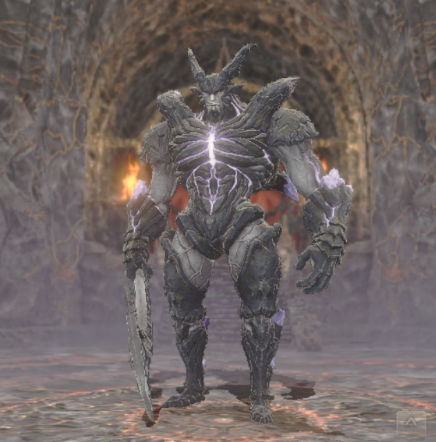

    - You will have the collab units as guest allies during the fight. If you own any collab units, they will not be listed as an guest unit.
    - Can be suretied relatively easily. Is immune to CT down and turn delaying effect, but can be debuffed with other status downs.
    - Does not have conventional HP amount. Rather, a certain amount of damage needs to be dealt per phase, otherwise the battle does not seem to progress. The phases are before he casts the physical barrier, before he casts implosion, and after it is cast.
    - He will randomly enrage two of your allies during the fight, including guest units, which makes them attack allies albeit with a big damage penalty.
    - All of his moves are telegraphed. He will typically alternate between Dark Nova and Giga Slash. Dark Nova is a full team dark AOE. Giga Slash is a physical row AOE to either front or back row.
    - After doing enough damage, he will become invulnerable to physical attacks. After doing enough magic damage, he will swap to a magic barrier instead on his next turn, but also any allies that are enraged in your team will be cleansed by the Crystal's Powers (cutscene). After this, he will ready Swath of Silence which on his next turn will cast Implosion, which is a full team dark AOE, and then follow up immediately with a -ga spell (Aeroga, Firaga, etc), a magic row AOE. After this point it's possible for him to swap immunities again if you take long enough.

7. Talk to the three brother NPCs in Zone 7 after defeating the Shadow Lord to leave. Head back to the town to view a cutscene. Return to the Royal Capital to turn in the request. Lulunarde will recommend you to go talk to Cait Sith, which requires you to Cursed Wheel a third time to talk to Cait Sith at the entrance to the Castle in Zone 1 again.

Rewards:  Completing the request will reward you with [Lion, Ulmia, and Tenzen bondmates](#Bondmates).

### 3rd Run

This is unavailable for now and will be unlocked later during the event.

### Maps

??? map "Zone 1"
    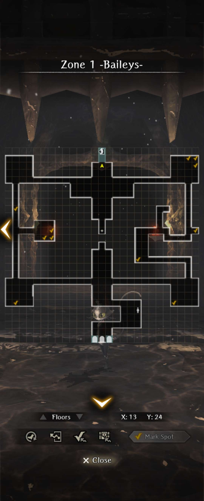
    
??? map "Zone 2"
    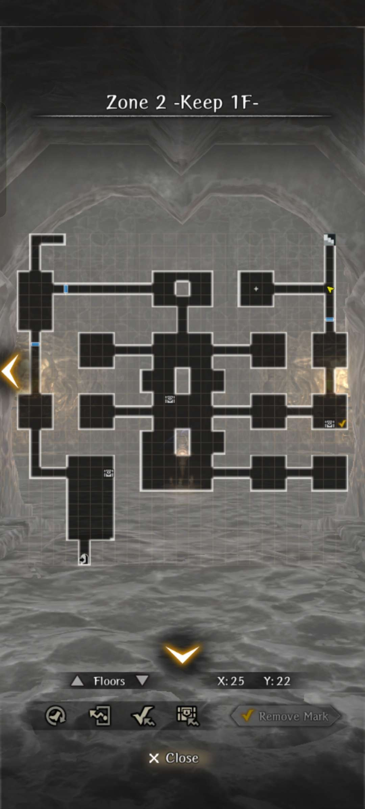
    
??? map "Zone 3"
    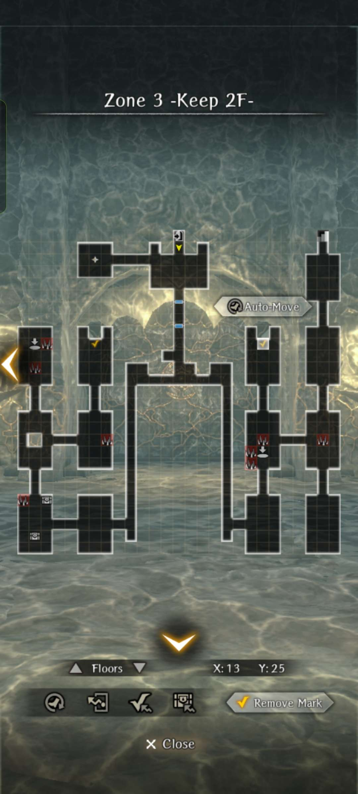
    
??? map "Zone 4"
    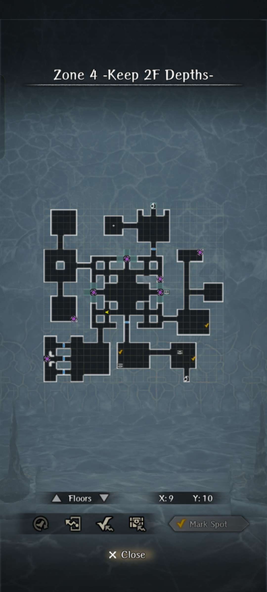
    
??? map "Zone 5"
    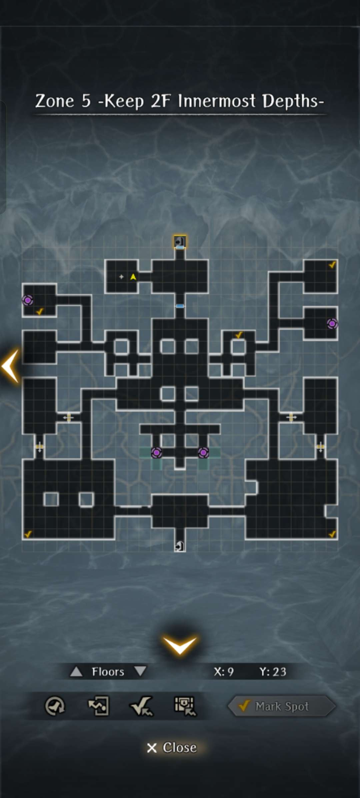
    
??? map "Zone 6"
    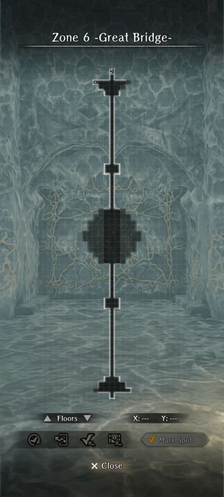
    
??? map "Zone 7"
    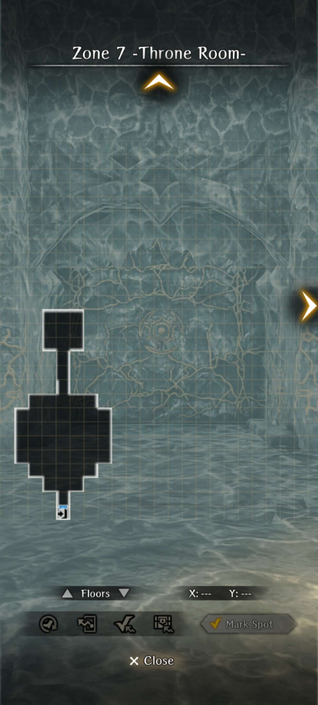
    
??? map "Goblin's Abode"
    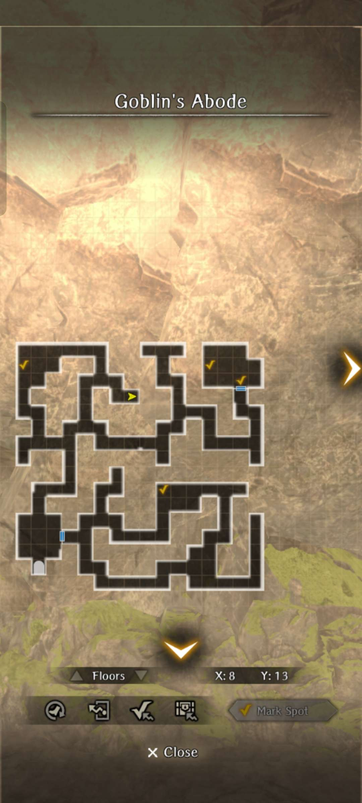

## Bondmates

- Lion, Tenzen, and Ulima will become bondmates after achieving the Good Ending.  
- Bonds can be leveled by simply using the Cursed Wheel to leap back to right before the final fight, winning the battle, and turning in the Request.  
- Bonds can achieve level 5 with 11 completions.  
- These event bonds are unique, in that they provide one set of benefits for all adventurers, but also an bonus set of benefits if bonded to their specific friend (Lion with Zeid, Ulmia with Prishe, and Tenzen with Iroha).

!!! note "FFXI Bondmate Details"  

    !!!! note "Lion, Pirate's Daughter"  
          
        
        - Lion's Determination: Provides about 17% Stun Tolerance at +5  
        - The Bond Between Lion and Zeid: Provides 4 extra Surety if put on Zeid at +5  

    !!!! note "Ulmia the Songstress"  
          

        - Ulmia's Song of Prayer: Provides 8 Resistance at +5  
        - The Bond Between Ulmia and Prishe: Provides 8 extra ATK if put on Prishe at +5  

    !!!! note "Tenzen, Samurai of the Far East"  
          

        - Tenzen's Ultimate Aim: Provides about 17% Paralysis Tolerance at +5  
        - The Bond Between Tenzen and Iroha: Provides 4 extra ATK and DIV if put on Iroha at +5  

## Trading

Trading unlocks after the 1st Run of the event is completed. Arriving in the town will show a cutscene. Head into the tavern and talk to the merchant to begin trading.

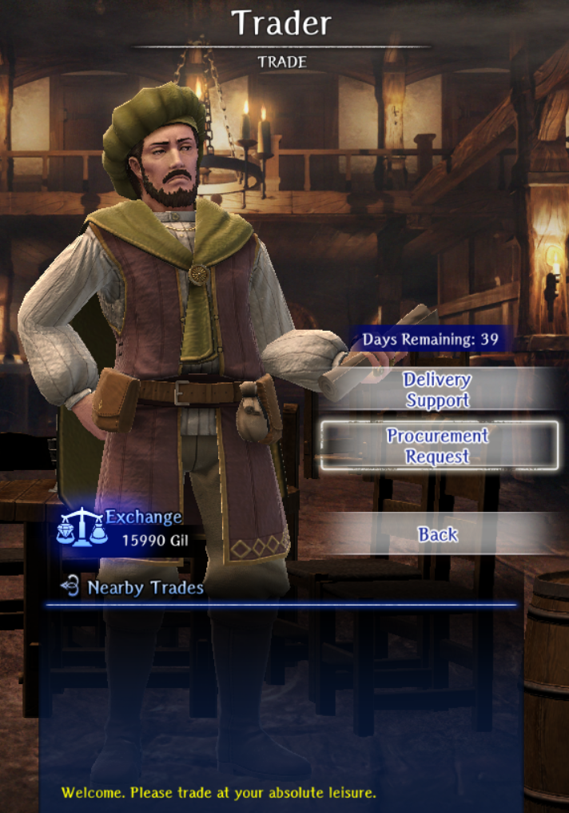

Trading is the main source of obtaining the event currency, Gil, and a reliable way to obtain materials you need for reforging relic equipment. There are two options, Delivery Support and Procurement Request.

### Delivery Support

This allows you to help fulfill other people's requests for certain items. There will typically be a reward of some sorts for providing a specific item, with Gil always being given to the player providing support. Usually, more Gil is given the higher the tier of the materials. Buying the trading pass from the Jeweler's shop will boost Gil gain from these transactions by 50%.

Players in the list will typically prioritize those on your friends list before strangers, so it can be easy to help friends or coordinate trading materials for Gil. However, there is a 24 HR limit to the refreshing of the list, which can be bypassed by spending 300 green gems.

### Procurement Request

There are three slots here that allow you to post requests for certain items, with a three hour cooldown per successful request. Typically, you can pay for relic equipment material in gold. However, Attestations can only be traded for Attestations of other weapon types, and Fragments can only be traded for Fragments/Attestations of other weapon types. 

One notable thing is that while real players can fulfill your requests, there are bots that will also guarantee that your request is fulfilled within the 3 hour cooldown of each request.This guarantees a stable source of certain materials that are difficult to get if you simply just wait for the trades to be fulfilled.

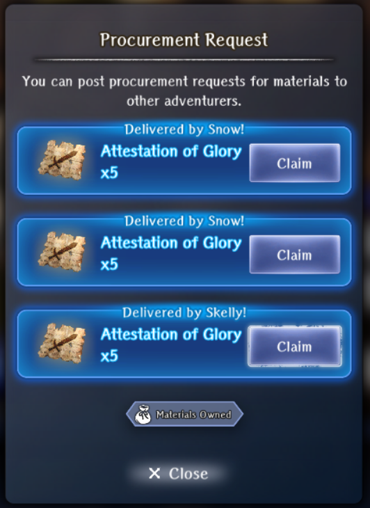

## Relic Equipment  

!!! note "Availability"
    Relic equipment availability, the special blacksmith for reforging, and mining for materials unlock at various points after restoring the Zone 3 Harken. Lulu hints to you at Zone 3 you should return to see if anything has changed. Players have reported continuing to progress through the story without returning and the unlock conditions not occurring. It is recommended you return to town at each Harken in between each new floor to ensure conditions activate.  Wheeling back to these points may be necessary for unlock if you've progressed to far.

The event has added unique equipment called "Relic Weapons and Armor" (not in any way related to Relicbrews and related material). These items start as rather poor, low stat items, but can be gradually upgraded at a special Forge to become some of the more interesting items in the game. Below is a table of items along with the materials needed to "Reforge" them to the next item/material level, or to "Remake" the highest/Silver level (essentially undoing its milestone blessings if you aren't happy with them the first time around.)  

The starting items can be obtained from the Event Jeweler Exchange for 1000 Gil each after the Zone 3 Harken has been reached. Reforging materials can be obtained by farming the event dungeon and through the trading mechanism described above.  

There appears to be no level or story progress restriction to obtaining any of the relic upgrade materials, so even the lowest level event participant can theoretically finish the event with a set of Silver rank equipment.  

Some quick facts:  

- Relic items of all levels are always 4* Red (4 unlocked blessings) with Silver level blessings.  
- Their blessings types are all locked, so FASing them will keep the blessing types the same and just reroll the values, similar to Master Rings from class trials.  
- Enhancement:  
    - Enhancement is limited by item level:  Level 0 (Bronze) +5, Level 1 (Iron) +10, Level 2 (Steel) +15, Levels 3 and 4 (Ebon and Silver) +20.  
    - Enhancement costs for all levels follow the Silver tables.  
    - Enhancement blessing increases also follow Silver level table ranges.  
    - Enhancement levels are preserved when Reforging to a higher item level.  
    - FAS also apply silver-level blessing increases. You can enhance and FAS at any time at any level with no loss of potential stat range.  
    - (unverified) "Remake"-ing a Level 4 item seems to return an enhanced item to +0 so you can enhance snd reroll milestone blessings again. It is unconfirmed how this interacts with FAS bonus milestone blessing.  
- Silver Tier Skills:  
    - At reforging to Level 4, items gain traits granting an active and a passive skill to the bearer.  
    - The active skill's damage typically is equivalent to Lvl 6 Heavy Attack on physical weapons, and lvl 6 Cones for the magic weapon. The buffs/debuffs from the effects are not affected by turn-extending effects.  

### Relic Equipment Reforge Material Table

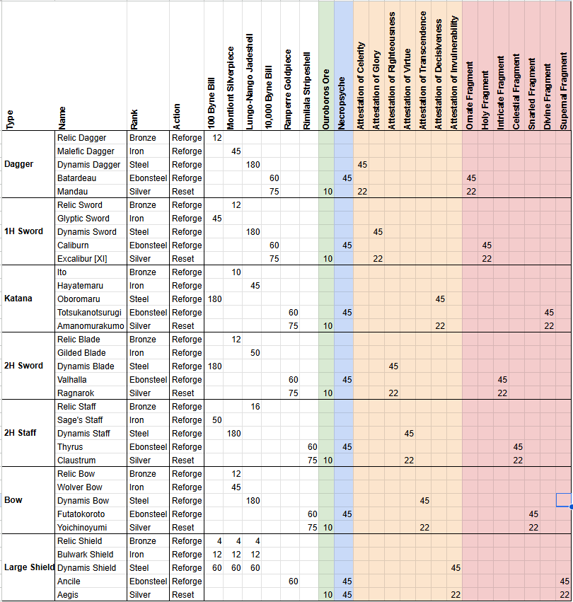

### Relic Equipment Information Tables

=== "Reforge Materials By Tier"

    | Type         | Stage      | Weapon           | Rank      | Materials                                                                                                  |
    |--------------|------------|------------------|-----------|------------------------------------------------------------------------------------------------------------|
    | Dagger       | T1         | Relic Dagger     | Bronze    | -                                                                                                          |
    | Dagger       | T2         | Malefic Dagger   | Iron      | 100 Byne Bill ×12                                                                                          |
    | Dagger       | T3         | Dynamis Dagger   | Steel     | Montiont Silverpiece ×45                                                                                   |
    | Dagger       | T4         | Batardeau        | Ebonsteel | Attestation of Celerity ×45; Lungo-Nango Jadeshell ×180                                                    |
    | Dagger       | T5 (Final) | Mandau           | Silver    | Ornate Fragment ×45; Necropsyche ×45; 10,000 Byne Bill ×60                                                 |
    | Dagger       | Remake     | Mandau           | Silver    | Ouroboros Ore ×10; Attestation of Celerity ×22; Ornate Fragment ×22; 10,000 Byne Bill ×75                  |
    | 1H Sword     | T1         | Relic Sword      | Bronze    | -                                                                                                          |
    | 1H Sword     | T2         | Glyptic Sword    | Iron      | Montiont Silverpiece ×12                                                                                   |
    | 1H Sword     | T3         | Dynamis Sword    | Steel     | 100 Byne Bill ×45                                                                                          |
    | 1H Sword     | T4         | Caliburn         | Ebonsteel | Attestation of Glory ×45; Lungo-Nango Jadeshell ×180                                                       |
    | 1H Sword     | T5 (Final) | Excalibur [XI]   | Silver    | Holy Fragment ×45; Necropsyche ×45; 10,000 Byne Bill ×60                                                   |
    | 1H Sword     | Remake     | Excalibur [XI]   | Silver    | Ouroboros Ore ×10; Attestation of Glory ×22; Holy Fragment ×22; 10,000 Byne Bill ×75                       |
    | Katana       | T1         | Ito              | Bronze    | -                                                                                                          |
    | Katana       | T2         | Hayatemaru       | Iron      | Montiont Silverpiece ×10                                                                                   |
    | Katana       | T3         | Oboromaru        | Steel     | Lungo-Nango Jadeshell ×45                                                                                  |
    | Katana       | T4         | Totsukanotsurugi | Ebonsteel | Attestation of Decisiveness ×45; 100 Byne Bill ×180                                                        |
    | Katana       | T5 (Final) | Amanomurakumo    | Silver    | Divine Fragment ×45; Necropsyche ×45; Ranperre Goldpiece ×60                                               |
    | Katana       | Remake     | Amanomurakumo    | Silver    | Ouroboros Ore ×10; Attestation of Decisiveness ×22; Divine Fragment ×22; Ranperre Goldpiece ×75            |
    | 2H Sword     | T1         | Relic Blade      | Bronze    | -                                                                                                          |
    | 2H Sword     | T2         | Gilded Blade     | Iron      | Montiont Silverpiece ×12                                                                                   |
    | 2H Sword     | T3         | Dynamis Blade    | Steel     | Lungo-Nango Jadeshell ×50                                                                                  |
    | 2H Sword     | T4         | Valhalla         | Ebonsteel | Attestation of Righteousness ×45; 100 Byne Bill ×180                                                       |
    | 2H Sword     | T5 (Final) | Ragnarok         | Silver    | Intricate Fragment ×45; Necropsyche ×45; Ranperre Goldpiece ×60                                            |
    | 2H Sword     | Remake     | Ragnarok         | Silver    | Ouroboros Ore ×10; Attestation of Righteousness ×22; Intricate Fragment ×22; Ranperre Goldpiece ×75        |
    | 2H Staff     | T1         | Relic Staff      | Bronze    | -                                                                                                          |
    | 2H Staff     | T2         | Sage's Staff     | Iron      | Lungo-Nango Jadeshell ×16                                                                                  |
    | 2H Staff     | T3         | Dynamis Staff    | Steel     | 100 Byne Bill ×50                                                                                          |
    | 2H Staff     | T4         | Thyrus           | Ebonsteel | Attestation of Virtue ×45; Montiont Silverpiece ×180                                                       |
    | 2H Staff     | T5 (Final) | Claustrum        | Silver    | Celestial Fragment ×45; Necropsyche ×45; Rimilala Stripeshell ×60                                          |
    | 2H Staff     | Remake     | Claustrum        | Silver    | Ouroboros Ore ×10; Attestation of Virtue ×22; Celestial Fragment ×22; Rimilala Stripeshell ×75             |
    | Bow          | T1         | Relic Bow        | Bronze    | -                                                                                                          |
    | Bow          | T2         | Wolver Bow       | Iron      | Montiont Silverpiece ×12                                                                                   |
    | Bow          | T3         | Dynamis Bow      | Steel     | Montiont Silverpiece ×45                                                                                   |
    | Bow          | T4         | Futatokoroto     | Ebonsteel | Attestation of Transcendence ×45; Lungo-Nango Jadeshell ×180                                               |
    | Bow          | T5 (Final) | Yoichinoyumi     | Silver    | Snarled Fragment ×45; Necropsyche ×45; Rimilala Stripeshell ×60                                            |
    | Bow          | Remake     | Yoichinoyumi     | Silver    | Ouroboros Ore ×10; Attestation of Transcendence ×22; Snarled Fragment ×22; Rimilala Stripeshell ×75        |
    | Heavy Shield | T1         | Relic Shield     | Bronze    | -                                                                                                          |
    | Heavy Shield | T2         | Bulwark Shield   | Iron      | 100 Byne Bill ×4; Montiont Silverpiece ×4; Lungo-Nango Jadeshell ×4                                        |
    | Heavy Shield | T3         | Dynamis Shield   | Steel     | 100 Byne Bill ×12; Montiont Silverpiece ×12; Lungo-Nango Jadeshell ×12                                     |
    | Heavy Shield | T4         | Ancile           | Ebonsteel | Attestation of Invulnerability ×45; 100 Byne Bill ×60; Montiont Silverpiece ×60; Lungo-Nango Jadeshell ×60 |
    | Heavy Shield | T5 (Final) | Aegis            | Silver    | Supernal Fragment ×45; Necropsyche ×45; Ranperre Goldpiece ×60                                             |
    | Heavy Shield | Remake     | Aegis            | Silver    | Ouroboros Ore ×10; Attestation of Invulnerability ×22; Supernal Fragment ×22; Necropsyche ×45              |

=== "+0 Base Stats By Tier"

    | Type         | Tier       | Weapon           | Rank      | ATK       | MAG       | DIV       | ACC     | EVA     | SUR     | DEF      | MDEF     |
    |--------------|------------|------------------|-----------|-----------|-----------|-----------|---------|---------|---------|----------|----------|
    | Dagger       | T1         | Relic Dagger     | Bronze    | 8         |           |           | 15      | -6      | -4      |          |          |
    | Dagger       | T2         | Malefic Dagger   | Iron      | 19 (+11)  |           |           | 15      | -4 (+2) | -3 (+1) |          |          |
    | Dagger       | T3         | Dynamis Dagger   | Steel     | 29 (+10)  |           |           | 15      | -2 (+2) | -2 (+1) |          |          |
    | Dagger       | T4         | Batardeau        | Ebonsteel | 43 (+14)  |           |           | 15      | 0 (+2)  | -1 (+1) |          |          |
    | Dagger       | T5 (Final) | Mandau           | Silver    | 53 (+10)  |           |           | 20 (+5) | 2 (+2)  | 0 (+1)  |          |          |
    | 1H Sword     | T1         | Relic Sword      | Bronze    | 12        |           |           | 2       | -6      |         |          |          |
    | 1H Sword     | T2         | Glyptic Sword    | Iron      | 24 (+12)  |           |           | 4 (+2)  | -4 (+2) |         |          |          |
    | 1H Sword     | T3         | Dynamis Sword    | Steel     | 36 (+12)  |           |           | 6 (+2)  | -2 (+2) |         |          |          |
    | 1H Sword     | T4         | Caliburn         | Ebonsteel | 51 (+15)  |           |           | 8 (+2)  | 0 (+2)  |         |          |          |
    | 1H Sword     | T5 (Final) | Excalibur [XI]   | Silver    | 64 (+13)  |           |           | 10 (+2) | 2 (+2)  |         |          |          |
    | Katana       | T1         | Ito              | Bronze    | 12        | 9         |           | 6       | -8      |         |          |          |
    | Katana       | T2         | Hayatemaru       | Iron      | 26 (+14)  | 20 (+11)  |           | 8 (+2)  | -6 (+2) |         |          |          |
    | Katana       | T3         | Oboromaru        | Steel     | 45 (+19)  | 41 (+21)  |           | 10 (+2) | -4 (+2) |         |          |          |
    | Katana       | T4         | Totsukanotsurugi | Ebonsteel | 68 (+23)  | 63 (+22)  |           | 10      | -2 (+2) |         |          |          |
    | Katana       | T5 (Final) | Amanomurakumo    | Silver    | 82 (+14)  | 76 (+13)  |           | 10      | 0 (+2)  |         |          |          |
    | 2H Sword     | T1         | Relic Blade      | Bronze    | 25        |           |           | 6       | -10     | -4      |          |          |
    | 2H Sword     | T2         | Gilded Blade     | Iron      | 48 (+23)  |           |           | 6       | -8 (+2) | -3 (+1) |          |          |
    | 2H Sword     | T3         | Dynamis Blade    | Steel     | 68 (+20)  |           |           | 6       | -6 (+2) | -2 (+1) |          |          |
    | 2H Sword     | T4         | Valhalla         | Ebonsteel | 108 (+40) |           |           | 6       | -4 (+2) | -1 (+1) |          |          |
    | 2H Sword     | T5 (Final) | Ragnarok         | Silver    | 132 (+24) |           |           | 15 (+9) | -2 (+2) | 0 (+1)  |          |          |
    | 2H Staff     | T1         | Relic Staff      | Bronze    | 14        | 8         | 8         |         | -4      |         |          |          |
    | 2H Staff     | T2         | Sage's Staff     | Iron      | 20 (+6)   | 32 (+24)  | 32 (+24)  |         | -4      |         |          |          |
    | 2H Staff     | T3         | Dynamis Staff    | Steel     | 25 (+5)   | 56 (+24)  | 56 (+24)  |         | -4      |         |          |          |
    | 2H Staff     | T4         | Thyrus           | Ebonsteel | 33 (+8)   | 88 (+32)  | 88 (+32)  |         | -4      |         |          |          |
    | 2H Staff     | T5 (Final) | Claustrum        | Silver    | 40 (+7)   | 108 (+20) | 108 (+20) |         | -4      |         |          |          |
    | Bow          | T1         | Relic Bow        | Bronze    | 24        |           |           | -4      |         |         |          |          |
    | Bow          | T2         | Wolver Bow       | Iron      | 46 (+22)  |           |           | -2 (+2) |         |         |          |          |
    | Bow          | T3         | Dynamis Bow      | Steel     | 64 (+18)  |           |           | 0 (+2)  |         |         |          |          |
    | Bow          | T4         | Futatokoroto     | Ebonsteel | 92 (+28)  |           |           | 2 (+2)  |         |         |          |          |
    | Bow          | T5 (Final) | Yoichinoyumi     | Silver    | 113 (+21) |           |           | 4 (+2)  |         |         |          |          |
    | Heavy Shield | T1         | Relic Shield     | Bronze    |           |           |           | -2      | -10     |         | 1        | -8       |
    | Heavy Shield | T2         | Bulwark Shield   | Iron      |           |           |           | -2      | -8 (+2) |         | 8 (+7)   | -6 (+2)  |
    | Heavy Shield | T3         | Dynamis Shield   | Steel     |           |           |           | -2      | -6 (+2) |         | 14 (+6)  | -4 (+2)  |
    | Heavy Shield | T4         | Ancile           | Ebonsteel |           |           |           | -2      | -4 (+2) |         | 24 (+10) | -2 (+2)  |
    | Heavy Shield | T5 (Final) | Aegis            | Silver    |           |           |           | -2      | -1 (+3) |         | 38 (+14) | 45 (+47) |

=== "T5 Enhancement Values"

    | Type         | Weapon         | Rank   | Level | ATK       | MAG       | DIV       | ACC | EVA | SUR | DEF     | MDEF    |
    |--------------|----------------|--------|-------|-----------|-----------|-----------|-----|-----|-----|---------|---------|
    | Dagger       | Mandau         | Silver | +0    | 53        |           |           | 20  | 2   |     |         |         |
    | Dagger       | Mandau         | Silver | +5    | 71 (+18)  |           |           | 20  | 2   |     |         |         |
    | Dagger       | Mandau         | Silver | +10   | 89 (+18)  |           |           | 20  | 2   |     |         |         |
    | Dagger       | Mandau         | Silver | +15   | 107 (+18) |           |           | 20  | 2   |     |         |         |
    | Dagger       | Mandau         | Silver | +20   | 125 (+18) |           |           | 20  | 2   |     |         |         |
    | 1H Sword     | Excalibur [XI] | Silver | +0    | 64        |           |           | 10  | 2   |     |         |         |
    | 1H Sword     | Excalibur [XI] | Silver | +5    | 82 (+18)  |           |           | 10  | 2   |     |         |         |
    | 1H Sword     | Excalibur [XI] | Silver | +10   | 100 (+18) |           |           | 10  | 2   |     |         |         |
    | 1H Sword     | Excalibur [XI] | Silver | +15   | 118 (+18) |           |           | 10  | 2   |     |         |         |
    | 1H Sword     | Excalibur [XI] | Silver | +20   | 136 (+18) |           |           | 10  | 2   |     |         |         |
    | Katana       | Amanomurakumo  | Silver | +0    | 82        | 76        |           | 10  |     |     |         |         |
    | Katana       | Amanomurakumo  | Silver | +5    | 100 (+18) | 96 (+20)  |           | 10  |     |     |         |         |
    | Katana       | Amanomurakumo  | Silver | +10   | 118 (+18) | 115 (+19) |           | 10  |     |     |         |         |
    | Katana       | Amanomurakumo  | Silver | +15   | 136 (+18) | 134 (+19) |           | 10  |     |     |         |         |
    | Katana       | Amanomurakumo  | Silver | +20   | 154 (+18) | 154 (+20) |           | 10  |     |     |         |         |
    | 2H Sword     | Ragnarok       | Silver | +0    | 132       |           |           | 15  | -2  |     |         |         |
    | 2H Sword     | Ragnarok       | Silver | +5    | 165 (+33) |           |           | 15  | -2  |     |         |         |
    | 2H Sword     | Ragnarok       | Silver | +10   | 191 (+26) |           |           | 15  | -2  |     |         |         |
    | 2H Sword     | Ragnarok       | Silver | +15   | 214 (+23) |           |           | 15  | -2  |     |         |         |
    | 2H Sword     | Ragnarok       | Silver | +20   | 231 (+17) |           |           | 15  | -2  |     |         |         |
    | 2H Staff     | Claustrum      | Silver | +0    | 40        | 108       | 108       |     | -4  |     |         |         |
    | 2H Staff     | Claustrum      | Silver | +5    | 73 (+33)  | 136 (+28) | 136 (+28) |     | -4  |     |         |         |
    | 2H Staff     | Claustrum      | Silver | +10   | 99 (+26)  | 162 (+26) | 162 (+26) |     | -4  |     |         |         |
    | 2H Staff     | Claustrum      | Silver | +15   | 122 (+23) | 190 (+28) | 190 (+28) |     | -4  |     |         |         |
    | 2H Staff     | Claustrum      | Silver | +20   | 139 (+17) | 216 (+26) | 216 (+26) |     | -4  |     |         |         |
    | Bow          | Yoichinoyumi   | Silver | +0    | 113       |           |           | 4   |     |     |         |         |
    | Bow          | Yoichinoyumi   | Silver | +5    | 146 (+33) |           |           | 4   |     |     |         |         |
    | Bow          | Yoichinoyumi   | Silver | +10   | 172 (+26) |           |           | 4   |     |     |         |         |
    | Bow          | Yoichinoyumi   | Silver | +15   | 195 (+23) |           |           | 4   |     |     |         |         |
    | Bow          | Yoichinoyumi   | Silver | +20   | 212 (+17) |           |           | 4   |     |     |         |         |
    | Heavy Shield | Aegis          | Silver | +0    |           |           |           | -2  | -1  |     | 38      | 45      |
    | Heavy Shield | Aegis          | Silver | +5    |           |           |           | -2  | -1  |     | 47 (+9) | 50 (+5) |
    | Heavy Shield | Aegis          | Silver | +10   |           |           |           | -2  | -1  |     | 53 (+6) | 55 (+5) |
    | Heavy Shield | Aegis          | Silver | +15   |           |           |           | -2  | -1  |     | 59 (+6) | 60 (+5) |
    | Heavy Shield | Aegis          | Silver | +20   |           |           |           | -2  | -1  |     | 65 (+6) | 65 (+5) |

=== "Weapon Fixed Blessings"

    | Type         | Weapon         | Slot 1 | Slot 2 | Slot 3 | Slot 4 |
    |--------------|----------------|:------:|:------:|:------:|:------:|
    | Dagger       | Mandau         | ATK    | SUR    | EVA    | ATK%   |
    | 1H Sword     | Excalibur [XI] | ATK    | ACC    | EVA    | ATK%   |
    | Katana       | Amanomurakumo  | ATK    | MAG    | EVA    | ATK%   |
    | 2H Sword     | Ragnarok       | ATK    | SUR    | EVA    | ATK%   |
    | 2H Staff     | Claustrum      | MAG    | DIV    | MAG%   | DIV%   |
    | Bow          | Yoichinoyumi   | ATK    | ACC    | ASPD   | ATK%   |
    | Heavy Shield | Aegis          | MDEF   | MDEF%  | EVA    | DEF    |

=== "Weapon Attack Skills"

    | Type     | Weapon         | Skill            | Cost  | Description                                                                                                                                              | Turns | Effect                            |
    |----------|----------------|------------------|:-----:|----------------------------------------------------------------------------------------------------------------------------------------------------------|:-----:|-----------------------------------|
    | Dagger   | Mandau         | Mercy Stroke     | 31 SP | Major physical attack with high Accuracy on 1 enemy. Increases own Surety for 3 turns.                                                                   | 3     | +13 SUR                           |
    | 1H Sword | Excalibur [XI] | Knights of Round | 31 SP | Major physical attack with high Accuracy on 1 enemy. Continuously restores minor HP to self for 3 turns.                                                 | 3     | HP regen                          |
    | Katana   | Amanomurakumo  | Tachi: Kaiten    | 34 SP | Major physical attack with high Accuracy on 1 enemy. Continuously restores minor SP to self for 3 turns.                                                 | 3     | +3 SP per turn                    |
    | 2H Sword | Ragnarok       | Scourge          | 31 SP | Major physical attack with high Accuracy on 1 enemy. Increases own Surety for 3 turns.                                                                   | 3     | +13 SUR                           |
    | 2H Staff | Claustrum      | Gate of Tartarus | 35 MP | Major untyped spell attack on 1 enemy. Chance to reduce the Attack Power of 1 enemy for 3 turns, and continuously restores minor MP to self for 3 turns. | 3     | -15% Attack Power; +3 MP per turn |
    | Bow      | Yoichinoyumi   | Namas Arrow      | 31 SP | Major physical attack with high Accuracy on 1 enemy. Increases own Accuracy for 3 turns.                                                                 | 3     | +13 ACC                           |

=== "Weapon Passive Skills"

    | Type         | Weapon         | Passive                | Effect                                                                                            | Values                     |
    |--------------|----------------|------------------------|---------------------------------------------------------------------------------------------------|----------------------------|
    | Dagger       | Mandau         | Power of Mandau        | Chance to inflict Poison on a direct hit with a normal attack or attack skill.                    |                            |
    | 1H Sword     | Excalibur [XI] | Power of Excalibur     | Low chance of dealing increased damage on direct hits; bonus scales with the user's remaining HP. | Up to +20% DMG             |
    | Katana       | Amanomurakumo  | Power of Amanomurakumo | Chance to reduce enemy Attack Power on a direct hit.                                              | -20% Attack Power, 4 turns |
    | 2H Sword     | Ragnarok       | Power of Ragnarok      | Continuously increases Surety.                                                                    | +12 SUR                    |
    | 2H Staff     | Claustrum      | Power of Claustrum     | Chance to dispel 1 buff off an enemy on a direct hit.                                             |                            |
    | Bow          | Yoichinoyumi   | Power of Yoichinoyumi  | Increases damage and Accuracy against flying enemies.                                             | +20% DMG, +20 ACC          |
    | Heavy Shield | Aegis          | Power of Aegis         | Continuously increases Magic Defense.                  

## Farming

    To be added
