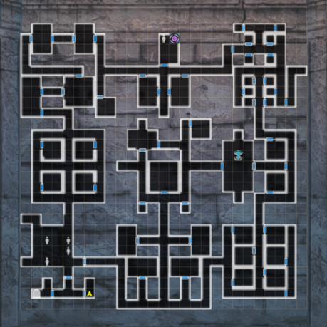
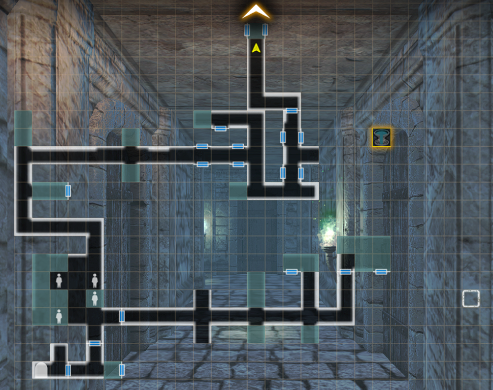
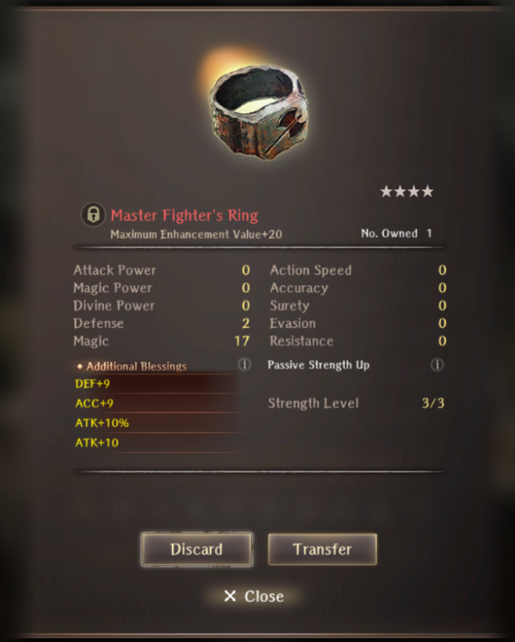

# Fighter Proving Grounds

## Guide:

There is no introduction to this event. Simply start the event by entering the event tab and selecting the Fighter Proving Grounds event. There are three difficulties. You can only enter with up to 3 fighters.

You can obtain up to 200 tokens from clearing the event itself. You will obtain 200 from advanced, 100 from intermediate, and 50 from beginner. After reaching 200 tokens, you are capped. You can gain an additional 400 tokens from missions.

There are several map variations, and are random upon entering. It is not necessary to explore the whole map, you simply need to make it to the end and defeat the floor boss. Keep in mind, it only counts as a clear upon talking to the old man with the mask beside the portal. There is a fountain that is guarded by a Benjamin-NPC on each side.

??? note "Map Variation 1"
    

??? note "Map Variation 2"
    

??? note "Map Variation 3"
    

??? note "Tips"
    - Remember to carry potions on all three characters.
    - Carry a healing staff switch so you can use healing spells from the MC and/or other characters who have access to dios/madios. Consider using Self-Healing as well with a divine staff.
    - The enemies on the advanced floor consist of Minotaurs, Lesser Demons, and Chimeras.
    
??? danger "Advanced Difficulty Fight Tips"
    - The final enemy is always a Vampire. He has around 9k HP.
    - He will generally just basic attack that can be consistently dodged with 150~ evasion. Alternatively he may cast Zelos
    - He is susceptible to openings, which will inflict around 1k damage
    - He will cast Kaltu on himself when he is about to die. Then he will do a 1 time Vampire Bats skill that inflicts very high damage. He will heal for about 10x of what the vampire bats hit on you.
    - It's recommended to try to chip him down to a point where you can finish him off in one turn with Full Power Strike from all 3 fighters.

??? note "Master Fighter Ring"
    
    - The Fighter ring is always 4* Red and has fixed stats. Full Alter Stones can reroll the values but not the actual stat lines.

