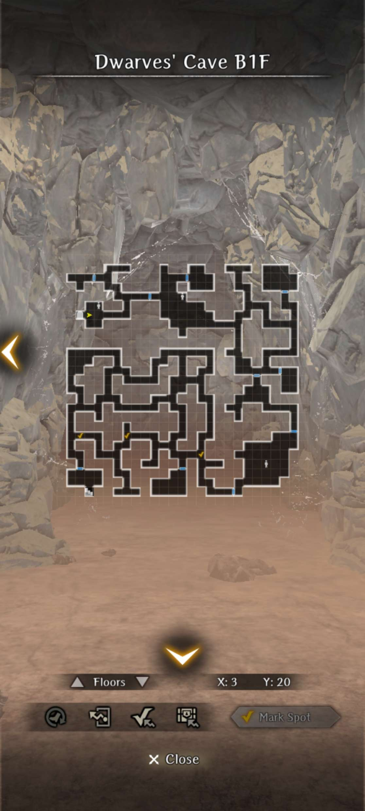
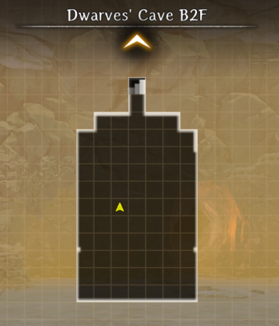
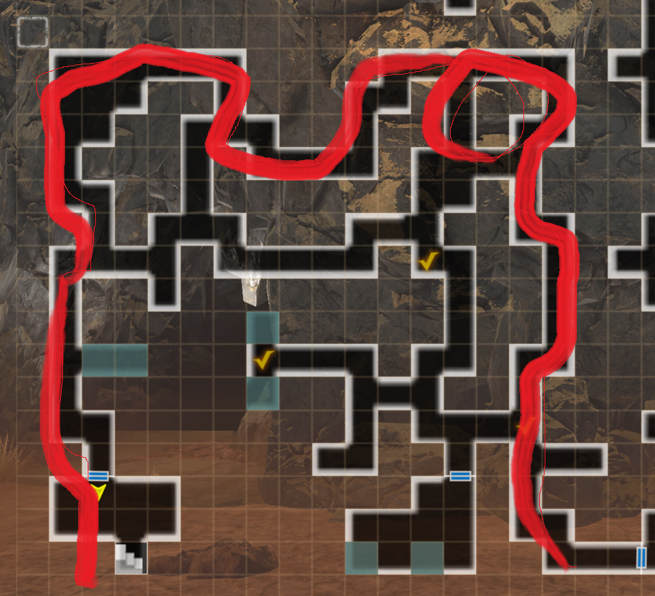
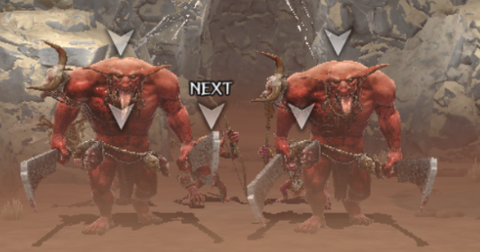
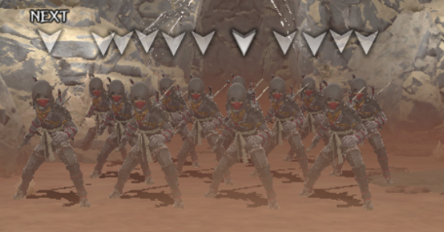
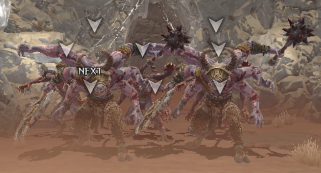
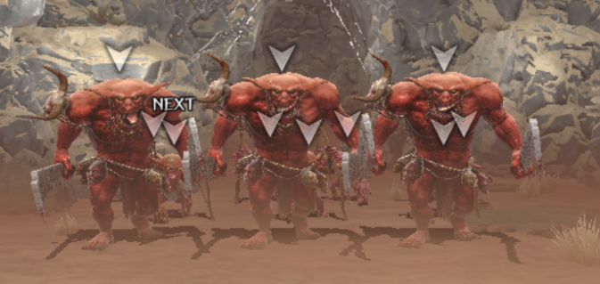
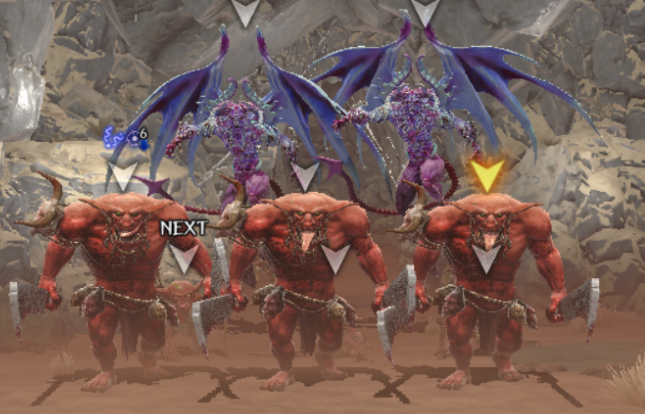
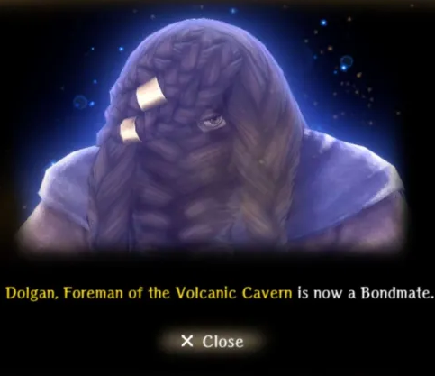
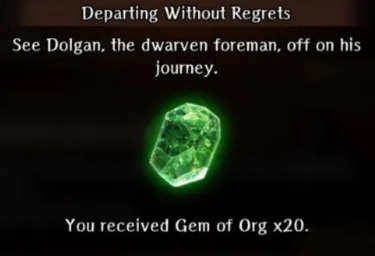

# Forbidden Area Exploration

## Requirements

!!! warning "Complete the True Ending for Abyss 4. You will also need to have successfully repelled all the monsters in the Dwarves' Cave during the main story line."

## Guide

##### Dwarves' Cave

??? map "Dwarves' Cave B1F"
    

??? map "Dwarves' Cave B2F"
    

### Steps

!!! danger "At the current level cap of 70, this request is extremely difficult as the enemies are level 80 and have extremely high stats. In addition, the boss is extremely brutal, much more than any other superboss introduced before it. It's highly recommended to bring a Hook of Harken, a full inventory of SP Pots and MP Pots, and have extremely invested units with Dragon Resist gear/Silver Tier water equipment"

1. Head back to the Dwarves' Cave after True Ending for Abyss 4 is completed in a timeline where the monsters are all repelled.
2. You should see only 1 Dwarf in the room before the locked door. He will ask you for help saving his dwarven friends from the monsters behind the door.
3. You will enter a region that has various paths to a staircase going downwards. There is a fight at the very start that is necessary to defeat in order to proceed among any of the paths (see first checkmark on B1F map). Certain paths have stationary enemies that must be defeated in order to proceed. However, if you follow the route listed in the map above, you can safely avoid most fights if you try to sneak around the wandering enemies. There are 3 enemies in the "outer ring" path that must be avoided. You can flee from them if needed.

    ??? map "Dwarves' Cave Safest Route"
        

    ??? danger "Dwarves' Cave Initial Fight"

        === "Fight Picture"
            

        === "Fight Details"
            - 2 Fire Hobbers in the frontline. ~15k HP each. Has typical moveset.
            - 1 Fire Goblin Archer, 1 Fire Goblin Mage, 1 Fire Goblin Shaman in the backline. ~3k HP each.
            - Fire Goblin Mage typically casts LAHALITO. Fire Goblin Shaman likely to cast KATINO.
            - Fire Goblin Archer has very high ASPD.

        === "Some Tips"
            - It's possible to abuse opening in this fight, as openings seem to do a lot more damage to the Hobbers in general (5k minimum).
            - The little goblins should be taken care of ASAP as they do a lot of damage.
            - The goblin casters are extremely vulnerable to MONTINO. Strangely they are very resistant to magic.
            - All of the hobbers and gobbers are very vulnerable to confuse. KANTIOS and Oni Island Yoto are very good options.
            - Hamstring with Odachis, especially with an Oni Island Yoto, as well as BATILGREF can buy a lot of time if cast on the Hobbers.

    ??? danger "Dwarves' Cave Random Encounter (Ninjas)"

        === "Fight Picture"
            

        === "Fight Details"
            - 3 rows of 4 Scarlet Ninjas in each row. ~4k HP each. Has typical moveset like those in the final fight in Sand Shadow Cave/Bounty.
            - Ninjas have very high ASPD.

        === "Some Tips"
            - It's recommended to simply defend with the front-line and kill with backline as the Ninjas typically just use armor pierce. 
            - They sometimes use Sever Jugular, but not regularly. However, it has a very high application chance.
            - All-Around Cover is very useful here if you have a Knight that has very high critical tolerance.

        === "Variations"
            - There is a variation that tends to spawn near the bottom hard path that only has 4 ninjas in one row.

    ??? danger "Dwarves' Cave Random Encounter (Lesser Demons)"
    
        === "Fight Picture"
            

        === "Fight Details"
            - 2 Minotaurs in the frontline. Has ~20k HP each. Has typical moveset.
            - 3 Lesser demons in the middle. Has ~5k HP each. Typically casts debuff spells.
            - 1 Fire Goblin Archer, 1 Fire Goblin Mage, 1 Fire Goblin Shaman in the backline. Has ~3k HP each.
            - The goblins are similar to those in the first fight.
            - The lesser demons tend to cast ZELOS or some magic debuffs.

        === "Some Tips"
            - See previous for tips on similar enemies.
            - Lesser demons are also very vulnerable to MONTINO. Try to cast it ASAP.
            - Minotaurs are vulnerable to confusion. You can apply the previous strategy on Hobbers with these minotaur.

        === "Variations"
            - The Minotaurs could be replaced with Fire Hobbers instead.
        
    ??? danger "Dwarves' Cave Random Encounter (Hobbers and Gobbers)"
    
        === "Fight Picture"
            

        === "Fight Details"
            - 3 Fire Hobbers in the frontline. Has ~15k HP each. Has typical moveset.
            - 3 Fire Goblin Archers in the middle. Has ~3k HP each.
            - 2 Fire Goblin Mages, 2 Fire Goblin Shamans in the backline. Has ~3K HP each. 
            - Functionally similar to the first mandatory fight, but there's a lot more of them now.

        === "Some Tips"
            - Same as previous posts. Generally just MONTINO the magic row and KANTIOS the archer rows.

    ??? danger "Dwarves' Cave Stationary Encounter (2x Greater Demons)"

        === "Fight Picture"
            

        === "Fight Details"
            - 3 Fire Hobbers in the frontline. Has ~15k HP each. Has typical moveset.
            - 1 Fire Goblin Archer, 1 Fire Goblin Mage, 1 Fire Goblin Shaman in the backline. Has ~3k HP each.
            - 2 Greater Demons in the backline. Has ~55-60k HP each.
            - The hobbers and goblins are similar to those before.
            - If in the variation with Vampires, they have around 6.5k HP each and typically move twice. They have a typical moveset.
            - The Greater Demons act similarly to normal greater demons. They have very high ASPD. They also seem to be immune or highly resistant to Chronostasis and Delay Attack, but not BATILGREF. In addition, they have Purgatory Strike, which is a fire-element physical damaging skill hitting 3 targets that can include the backline randomly. Furthermore, they can begin concentrating, which takes two turns before they begin casting extremely powerful row magic. This can be cancelled by doing enough damage. Finally, when they take enough damage, they will self-buff with 30 turns of EVA, MDEF, and MAG. They are dispelled in the order of MAG, DEF, and then EVA. The buffs all provide extremely high values to the greater demon.
            - This fight will always drop junk and a randomly generated Bracelet of Spellcraft Infused with Power.

        === "Some Tips"
            - It is recommended to BATILGREF the greater demons first and then take care of all the mobs in the front. The Greater Demons don't pose too much of a threat until they start coming closer in the rows.
            - After taking care of the front and/or middle rows, it's highly recommended to only focus on killing one Greater Demon at a time, as it requires a lot of resources to deal with them before they start getting very dangerous.

        === "Variations"
            - One variation has 3 Fire Hobbers in the frontline, 1 Fire Goblin Mage + Fire Goblin Shaman + 2 Greater Demons in the backline.
            - One variation has 3 Fire Hobbers in the frontline, 2 Vampires in the middle, and 2 Greater Demons in the backline.
            - One variation has 3 Lesser Demons in the frontline, and 2 Greater Demons in the backline.
    
5. Upon reaching the staircase, it's recommended to replenish your SP, MP, and HP to full. Walk down the staircase and you will see a fire dragon in the distance. Walk a few tiles forward into the room to engage in a fight with the dragon.
6. After defeating the dragon, you will have successfully saved the dwarves and completed the request. You can pick up the seven chests in the room for a total of 5 Forbidden Area Rare Six Energies Junk, several hundred thousand gold, and a randomly generated "Ring of Tactics Infused with Power" and a randomly generated "Bracelet of Spellcraft Infused with Power". You can walk back through the monster maze (not recommended) or just Hook of Harken out and re-enter the Dwarves' Cave. Talk to the same dwarf at the start and claim your rewards.

??? Danger "Forbidden Area Fire Dragon"

    === "Fight Details"

        - Has around 230k HP, 80 Surety Evasion, around 150-160 ASPD. Is fire element and all physical attacks + it's breath is fire element. It does not have extremely high defense however.
        - Typically takes 3 actions a turn, but sometimes only takes 2 actions.
        - Immune to Batilgref, Delay attack, and Chronostasis. It's also immune to Spellbind and most CC. It is not immune to debuffs, but it is a coinflip to land debuffs.
        - When taking around 25% of it's HP in damage, it will self buff with 10 turns of DEF and MDEF. It will typically begin using enhanced versions of its typical dragon moves that either have additional effects or does higher damage.
        - When taking around 75% of its HP in damage, it will self buff with a permanent ATK and MAG buff that are relatively minor.
        - The variant roar move will apply a weaken that reduces max HP by 30% and has a very high chance to stun.
        - The variant bite, claw, and tail swipe does much higher damage
        - The dragon can cast all elements of the LA-spells and MA-spells.
        - It can cast all mage debuffs such as Balafeos, Batilgref, Nofis, Morlis. Its Balafeos and Batilgref are extremely strong.
        - Occasionally and randomly it can cast an empowering roar that self buffs it with a surety buff and an extremely huge CT up buff.
        
    === "Some Recommendations"
        - It's mandatory to bring characters with equipment that reduce fire damage or reduce damage from dragons. It's preferable to not bring low HP classes such as mages and rangers as they are very prone to dying, especially after being inflicted with weaken.
        - It's mandatory to bring multiple characters with dissipation/malefic wind, as the defense buff the dragon applies to itself is extremely strong and can waste a few turns. In addition, you must dispel the CT buff immediately, otherwise the dragon will begin to lap your entire team and take multiple turns.
        - It's highly recommended to bring a knight with very high SP in order to Knights Defense various turns. Ainikki is also a good choice if you have very high reductions and elementally advantaged characters.
        - It's highly recommended to be high ASPD for this fight, to match or have higher ASPD than the dragon on most if not all of your characters as the fight is very long and it's very likely that the dragon will start to lap your team if you're too slow.
        - It's possible to apply opening on the dragon on any of its normal physical moves like bite, claw, and tail swipe. It will deal about 18k damage when hitting the opening.
        - It's recommended to bring Seafoam Armor, Firesmith's Gauntlets (Gerulf's Personal Request equipment), Augmented Dragonslayer (if applicable), and/or Alt Berkanan's Gacha Equipement (Large Bag + Challenger's Training Garb). 
        - It's highly recommended to have Way of the Knight, Sanctuary's Blessing, Wisdom of Truth, and/or Eyes that Know the Future inherited on most if not all characters attempting this dragon as the stacking reductions will give you much more breathing room on your resources. If you have stats to spare, it's possible to consider using Knight's Cloak as well.
        - It's highly recommended to have a Samurai with you that isn't Shiou, as being being Wind Element drastically increases the chance of getting killed. The best choice with be the MC as a Water Element Samurai. The reason being is that Waterbearer with Bamboo Splitter gives you the best damage per SP ratio for this fight as well as best damage per turn. You will still need to carry a knight and have a lot of focused gear in order to mitigate the extra damage from Cresting Wave Stance.

#### True Ending Route

You will need to complete this request by moving through the bottommost route in the Forbidden Area. There will be 2 guaranteed Greater Demon encounters that must be defeated in order to reach the dragon in time to rescue Dolgan. Obviously, this will drain a lot of resources in doing so, so it's recommended to take these fights slowly and abuse openings to conserve resources. After that, "simply" defeat the Fire Dragon and Dolgan will be rescued as you did not waste any time. You will receive Dolgan as a bondmate, who gives HP and MDEF, and an achievement.

??? note "True Ending Rewards"

    === "Dolgan Bondmate"
        

    === "Achievement"
        
