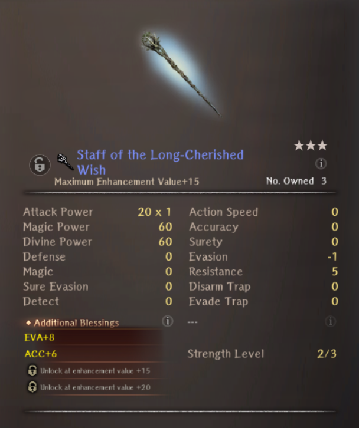
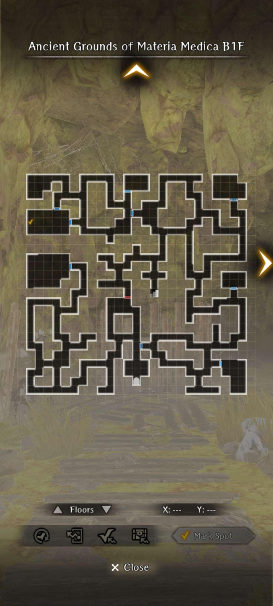
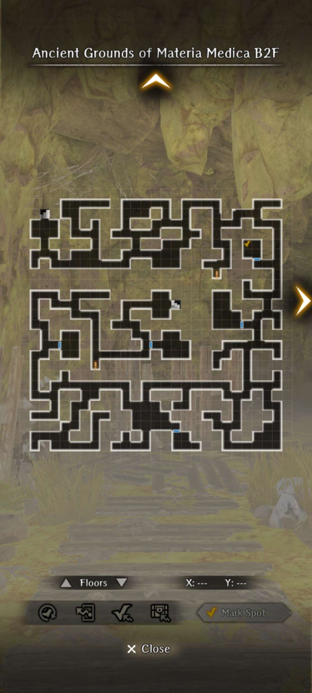
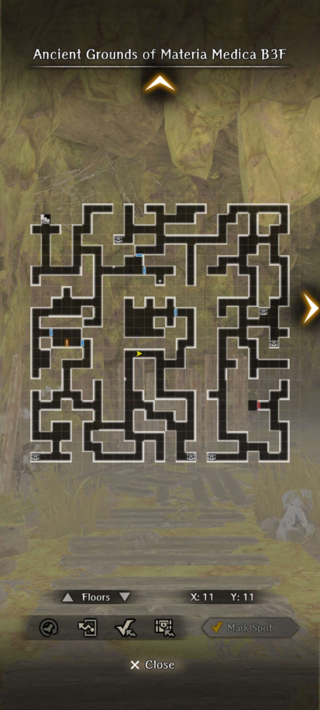
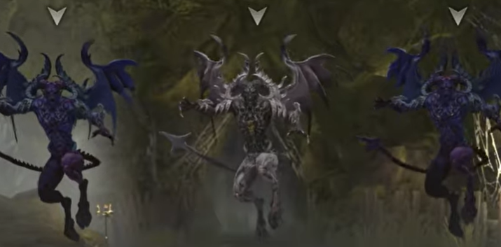
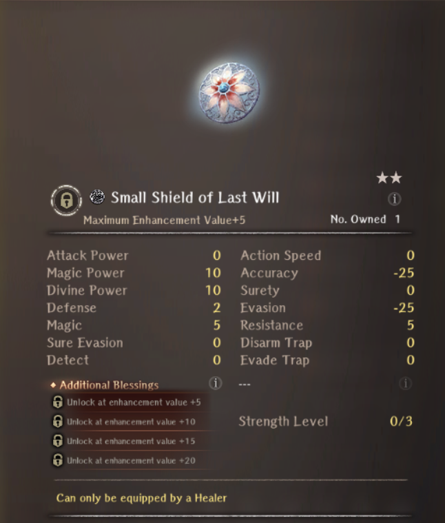

# Forgotten Craft of the Medicinal Arts

## Unlock Condition

- Reach the first Harken in Abyss 4, Deepsnow Hinterlands of Isberg.

## Overview

??? note "How to Accept the Request" 
    - Go to the Royal Capital Guild. Under Requests - Featured select "Search for Healer's Tools."
    - Accepting the request with a healer will provide different dialogue during the request.
    - The Healers' Settlement Remains is located south-west of Isberg on the World Map.

??? warning "Read Me"

    === "Basics"

        - Endings
            - There is technically only 1 ending, but there are variations in dialogue depending on if you bring a healer or not.
            - There is no bad ending, and redoing the request "correctly" does not seem to produce any difference in ending.
        - Healers
            - Units
                - [Anemone](../../adventurers/legendary-adventurers/details/Anemone.md) - Limited Legendary 
                - [Camille](../../adventurers/general-adventurers/details/Camille.md) - General Adventurer 
            - You can choose to do a 1st run with or without a healer. It makes no difference.
            - You will receive a Camille for free after completing the 1st run.
            - Having a healer will provide flavor text throughout the request.
        - Recommended Units
            - Healers can help with nullifying incoming status effects in certain mandatory fights. Otherwise this dungeon is quite easy.
            
    === "Farming"

        - Summary
            - This place doesn't really have much outstanding gear, and monster spawns are quite distant from each other.
            - Currency gain is quite slow at 20-60 per battle.
            - Request doesn't need to be completed in its entirety to farm, but you will need to partially complete it as floors are locked behind picking up the objectives.
        - Optimal Route
            - It's most recommended to Cursed Wheel in place to reset all the stationary chests and to pick them up. Repeat as needed.

    === "How to Reset" 

        - Go to the Ruins - Cursed Wheel. In the bottom right-hand corner click the Special Request button. 
        - Select Forgotten Craft of the Medicinal Arts from the list and Leap.
        
??? warning "Request Reward"

    

    
    

    - Fixed at 3* Blue.
    - Basically a Rod of Splendor with some Resistance.

## Forgotten Craft of the Medicinal Arts

??? map "B1F"
    

??? map "B2F"
    

??? map "B3F"
    

## Guide

??? warning "Super Condensed Version"

    === "1st Run"

        - Head into the cave and collect a singular item on the first two floors while heading down.
        - Head to the middle of the 3rd floor to start a boss fight and get the last item.
        - Revive the dead healer in the corner of the boss fight room to save yourself from dying.
        - Head back and turn in the request.

    === "2nd Run"

        - Same as the 1st Run, but this time bring a healer. There will be slightly more dialogue from the healer.
        - Head to the middle of the 3rd floor, but this time collect 3 objects marked on your map by the healer for an antidote
        - Return to boss room and fight the boss, healer will temporarily leave the party to make the antidote.
        - Head back and turn in the request.

## Optional Boss Fight

!!! warning "This fight is incredibly difficult without a Healer."

After completing the request, the little kid will give you a key for the locked door on the bottom right of B3F. Inside will be the boss fight. To reset this fight, you will need to cursed wheel the request specifically.

### Boss Details

??? danger "Fallen Demon"

    === "Fight Picture"

        

    === "Fight Details"

        - Fight starts with the Fallen Demon in the same row as 2 Greater Demons.
        - Fallen Demon has around 75k HP, and very high surety evasion (~180-190). It seems to be immune to CT down debuffs, but can be easily affected by most other status reduction effects. It gets two actions a turn.
        - Fallen Demon can apply poison on all of its physical attacks. Uses Powerful Arm and basic attacks. It can Powerful Arm the backrow. 
        - Fallen Demon can also cast damaging magic, which is MADALTO and MACONES. The MADALTO does not do very much damage, but MACONES can hit quite hard.
        - Fallen Demon can also cast various debuffing magic such as BATILGREF, BALAFEOS, KANTIOS, and KATINO. It can also cast Self-Healing (1000 per action).
        - Occasionally, the Fallen Demon can use curses, which are either full team Curse or full team Paralysis.
        - The Greater Demons on the side each have around 15k HP and will cast Self-Healing out of turn after taking around 2/3 of their HP in damage (1000 per action). They can cast support magic such as ABIT, MAHAITOS, MACALDIA, CORTU, and MAKALTU. They can also Powerful Arm.
        - The Greater Demons will be re-summoned after the Fallen Demon takes around 30k damage.

    === "Fight Tips"

        - It's recommended to have at least over 90 ASPD to outspeed the demons.
        - It's essentially mandatory to have a healer, as the Fallen Demon tends to inflict status effects quite often. It's recommended to put down a Curse incense first and then a Paralysis incense next. If you have some extra turns, you can also put down Confuse or Sleep Incense as well.
        - ABIT level 2 is also very helpful in general for clearing the debuffs, but the debuffs are not very strong.
        - It's recommended to bring a lot of demon resist gear, as the boss and accompanying greater demons can easily hit for over 800 damage with either physical or magic skills.
        - It's recommended to bring a Knight with Knight's Defense for smoother runs. The Fallen Demon can potentially use two attacks back to back. Adjust ASPD accordingly.

### Boss Rewards

??? danger "Small Shield of Last Will"

    

