# Labyrinth Of Fordraig Guide

!!! warning "Page has been updated. Ctrl + F5 to refresh."

## Unlock Conditions

- Defeat Melgina (Abyss 2) on any faction route. The event does not require killing Octoranus.
- If you are looking for the limited time-event "Adventurer Retrieval" it is located [here](../recurring-events/adv-retrieval.md). 

## Overview

??? note "How to Accept and Reset the Request" 

    - Request is located at the Royal Capital Luknalia in the Adventurer's Guild > Requests > Featured > "Stolen Armor Retrieval".
    - Once accepted go to the World Map and you will see a new location called the Labyrinth of Fordaig located north-northwest of the Royal Capital.
    - To reset, go to the Ruins and select the Cursed Wheel. In the bottom right-hand corner is a pink button called "Special Request." Click on "The Lost Treasure of Fordaig" to reset.

??? note "Endings" 

    - The event only requires 2 runs for full completion. 
        - The First Run ("trigger the traps") leads to the Bad ending.
        - The Second Run ("disarm the traps") leads to the True ending.
    - The Guide provides directions for both runs on a per map (floor) basis.

??? note "Important Notes"

    - The enemy level scales with MC's Grade.
    - There are a large number of Magical Beast enemies, so Abenius, Benjamin, and Yrsa are good to field along with anti-magical beast weapons or Well of the Mind (WoM) nodes for MC.
    - Total of 4 floors with Harkens on B1-3F, so you can clear each floor and return to the Inn before tackling the next one. Note that B4F is a large floor and you will want to conserve your resources for the boss fight. 

## Guide

### B1F

??? map "Map B1F" 

    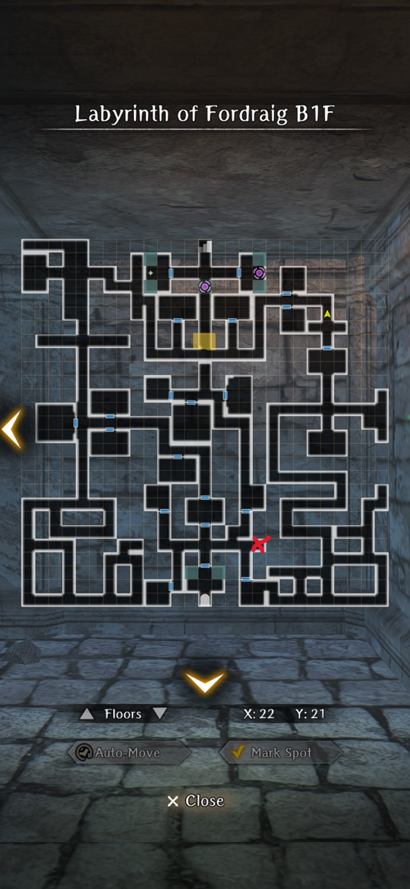

- First Run: You will be forced through a portal trap, which is located above the cell highlighted in yellow. It teleports you to a separate zone on B2F. 
- Second Run: The highlighted, yellow tile disarms the portal. Click on the East Wall for dialogue option.

### B2F

??? map "Map B2F" 

    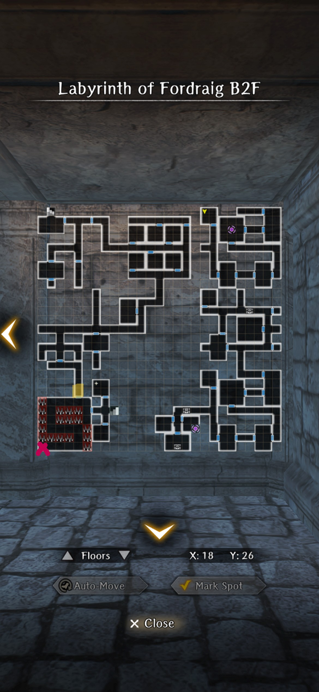

- First Run: You end up on the bottom left half of the map from the portal trap on the first floor. You have to navigate the spike trap to the red "X" to open the next door. 
- Second Run: The highlighted, yellow tile will disarm the spike trap. Click on the west wall for a dialogue option to turn it on or off .

### B3F

??? map "Map B3F"

    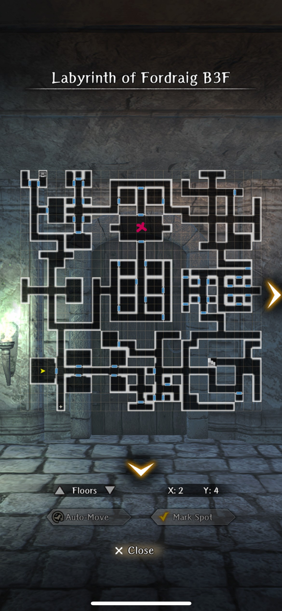

- First Run: The red "X" is a miniboss fight with a Minotaur. The adventurers you have met as you've been progressing will die. Interact with all three bodies to get the knowledge to disarm the traps as well the dagger.
- Second Run: The yellow arrow map icon (MC's location) is your next step. Note that on a first run you will encounter another fight. On your second run with the dagger in your inventory it will activate a portal that takes you to B4F.

### B4F

!!! warning "This floor is not accessible on a first run." 

??? map "Map B4F" 

    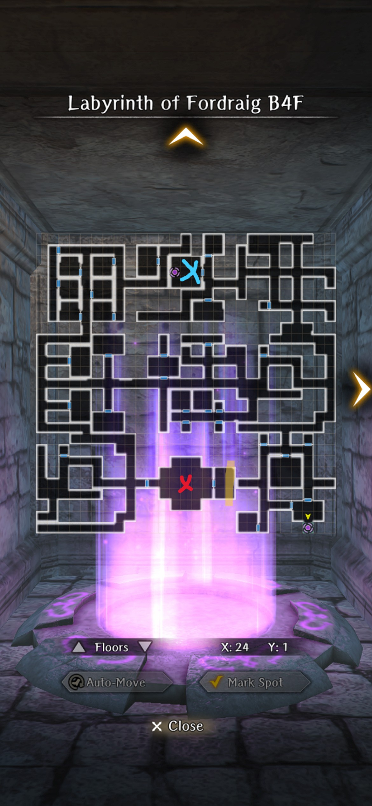

- The blue "X" is your starting point. There is no Harken on this floor and it can be a long trek to the boss's room located directly south of your starting location. 
- Head to the red "X" for the boss fight; he drops the Horned Eagle Sword that is always fixed at 3* blue and 2/3 strength-level (unification).
- After the boss fight collect all three chests (highlighted in yellow) in the area behind him, one of which has the event item needed to complete the request.
- The portal below MC's location (yellow arrow icon on map) leads to the upper-right area of B2F, which is self-contained. There are two fixed chests in this area.
- There is no Harken on this floor and have to go back to the Blue X Portal to Exit.

## Farming

### Cursed Wheel

Use the Cursed Wheel to reset the request after completion and then complete the second run (True Ending) of the request.

- You farm junk from the miniboss and boss chests.
- You get to farm up potentially perfect Horned Eagle Swords

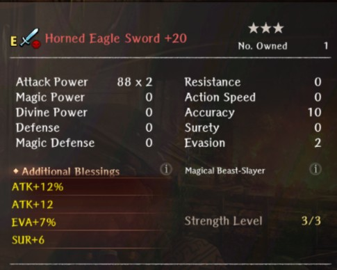

### Farm B4F Only 

- You get to farm junk.
- You get a lot more event currency than the Curse Wheel option.

## Rewards

### Exclusive Event Equipment

??? note "Horned Eagle Sword" 

    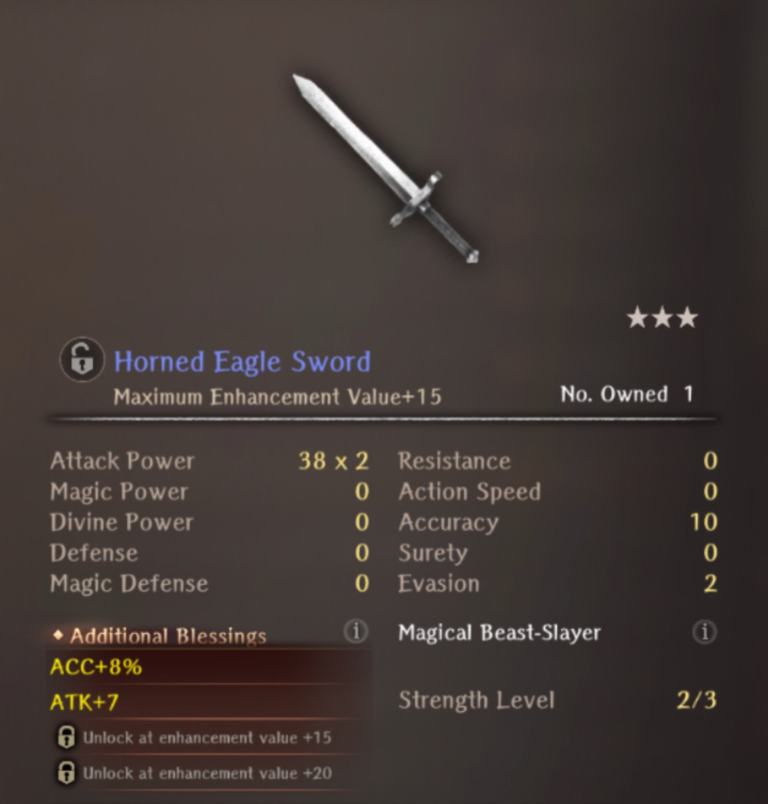
    
    - This sword is guaranteed to be a 3 Star Blue Rarity drop at 2/3 Strength Level
    - This sword has elemental weapon base damage. 
    - Magical Beasts are very common in the past Old Castle Event and the latter zones.

??? note "Featherbronze Gauntlet" 

    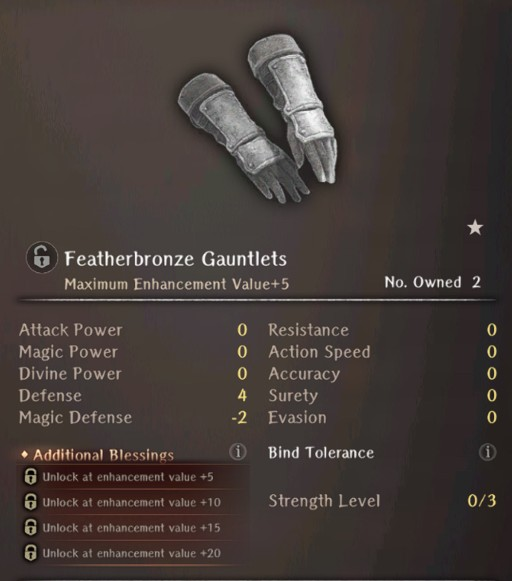

    - Light Gauntlets
    - Bind Tolerance Up
    - Comes from the Event Shop or from Junk Drops From the Event

### High Rarity Junk

#### Momentary Sliver of Junk
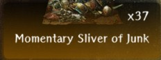

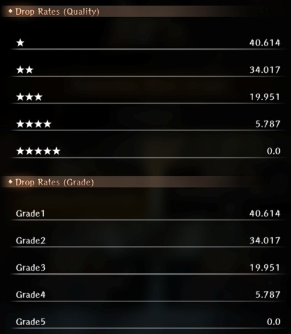

1. Low Chance for Steel Tier Equipment
2. High Chance for 4 Star Equipment
3. High Chance for Grade 4 Equipment aka Purple Gear AKA 3 substat start

#### Momentary Fey Sliver of Junk
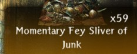

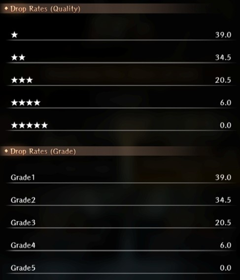

1. Only Steel Tier Equipment
2. High Chance for 4 Star Equipment
3. High Chance for Grade 4 Equipment aka Purple Gear AKA 3 substat start

#### Labyrinth of Fordraig Sliver of Junk
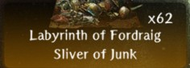

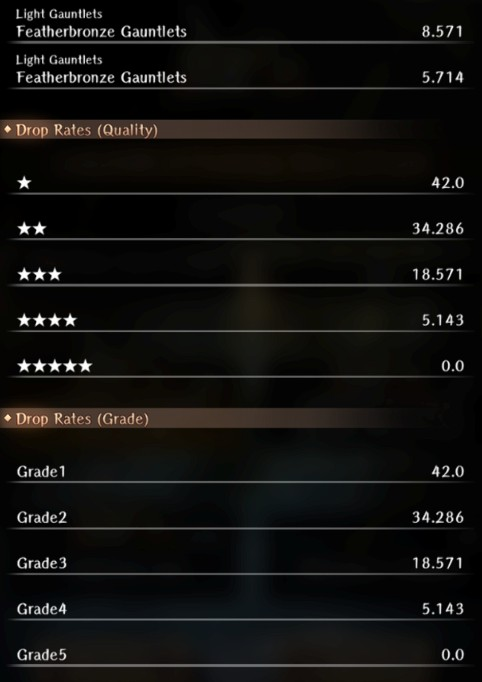

1. Medium Chance of Steel Tier Equipment
2. Low Chance for Featherbronze Gauntlets which are the Event Shop Gauntlets
3. High Chance for 4 Star Equipment
4. High Chance for Grade 4 Equipment aka Purple Gear AKA 3 substat start

#### Labyrinth of Fordraig Unusual Sliver of Junk
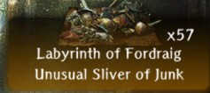

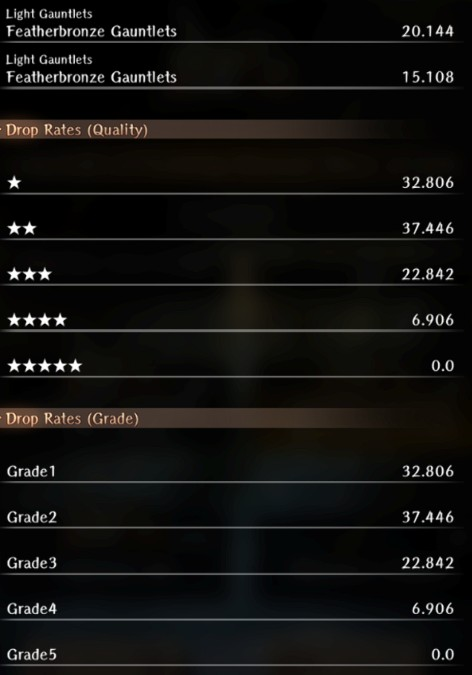

1. Only Steel Tier Equipment
2. High Chance for Featherbronze Gauntlets which are the Event Shop Gauntlets
3. High Chance for 4 Star Equipment
4. High Chance for Grade 4 Equipment aka Purple Gear AKA 3 substat start

### Event Shop
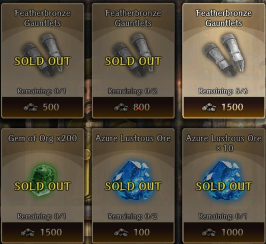

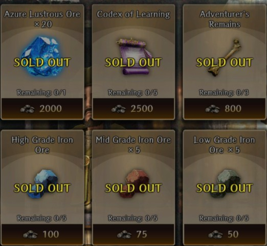

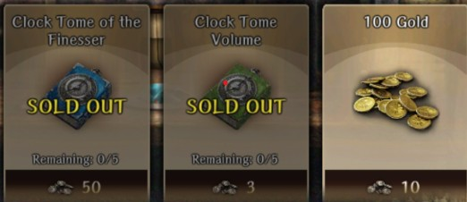

#### Note about Event Shop
1. You can only redeem the gold exchange 99 (9900 gold) at a time
2. The Featherbronze Gauntlet Exchange gives you a Random Grade And Star Level
3. Prioritize the Skill EXP books 25exp per book sounds very little but it adds up over time and the only way to get these as F2P is through events.

## Labyrinth of Fordraig Exploraion Follow-up Request

### Quick Guide

!!! warning "This guide will have a lot of coordinates as it's a tedious maze puzzle"

1. Head to the Adventurer's Guild in the Royal Capital and accept the request in the Featured tab.
2. Head to Fordraig via the World Map, and enter through the B1F Harken. Head to the room across and talk to the NPC (X:17, Y:23). Parts of the whole dungeon will change. You will have access to the Harken locations, but they will be blocked off.
3. Take the stairs from B1F to B2F. Take the portal on (X:4, Y:25). Lulunarde will comment before you step in. You will be teleported to the top right of B2F. Take the portal at (X:21, Y:24) and end up in a different part of B2F.
4. Take the (X:22, Y:5) portal, and then the (X:25, Y:18) portal. This will bring you to B1F. Take the (X:12, Y:13) portal which brings you to B2F. Take the (X:3, Y:14) portal which brings you to B1F. Head to (X:4, Y:7) and kill the enemy there. Flip the switch on the wall, which will remove some portals blocking the way in the whole map. Take the (X:6, Y:7) portal to teleport back to the starting room on B1F.
5. Head back down the stairs from B1F to B2F. The initial portal will be gone, and Lulunarde will tell you that you can move forwards. Take the portal at (X:4, Y:18) to be teleported to B3F.
6. Take the portal at (X:0, Y:26) to be on B2F. Take the portal at (X:22, Y:10) to be on B4F. Take the portal at (X:9, Y:22) to be on B2F. Take the portal at (X:19, Y:17) to be on B2F. Walk to (X:7, Y:5) and get a cutscene about a switch being on the door. Click on the door again to enable the door, and thus opening the B2F Harken path.
7. Take the stairs down from B2F to B3F and take the (X:26, Y:13) portal to be on B4F. Take the (X:16, Y:26 portal) to be on B3F. Defeat the enemy on (X:6, Y:6) and flip the switch afterwards. This will unlock the B3F Harken path.
8. Take the (X:5, Y:2 portal) on B3F near the harken to be on B4F. Take the (X:15, Y:12) portal to be on B2F. Head to (X:14, Y:14) and fight 2 Lizardman Champions. If you kill one, the other buffs itself with a very strong attack buff. They have relatively low hp, but its recommended to kill them together if possible. Afterwards, pick up the shiny object in the room and the request is complete. Take the portal to teleport back to the B1F starting room. Take the Harken out and return to the Royal Capital Adventurer's Guild to turn in the request.

### Follow-up Request Reward

??? note "Sword of the Forsaken Eagle" 

    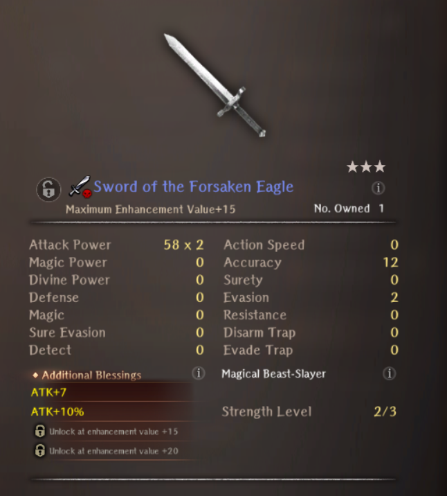

    - This silver tier 1H sword with the Magical Beast-Slayer trait is guaranteed to be a 3 Star Blue Rarity drop at 2/3 Strength Level with randomized blessings.
