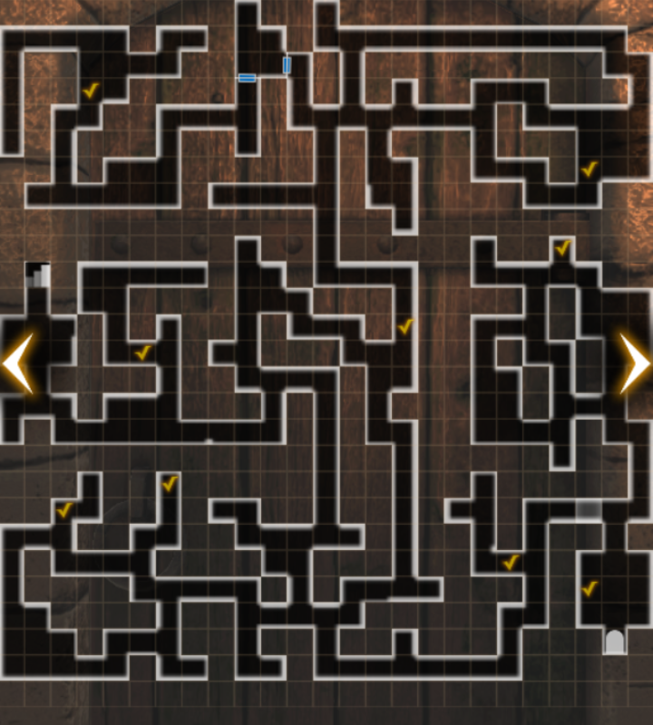
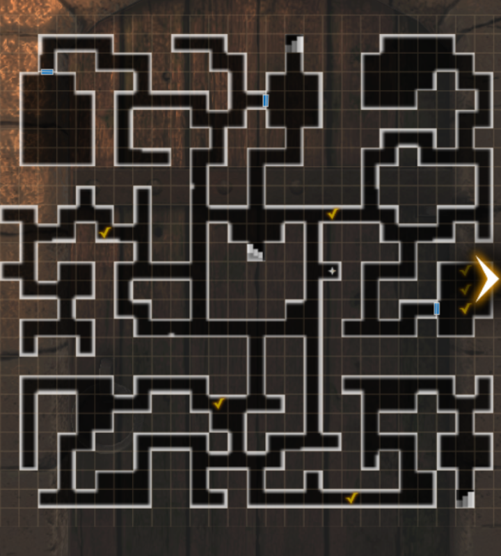
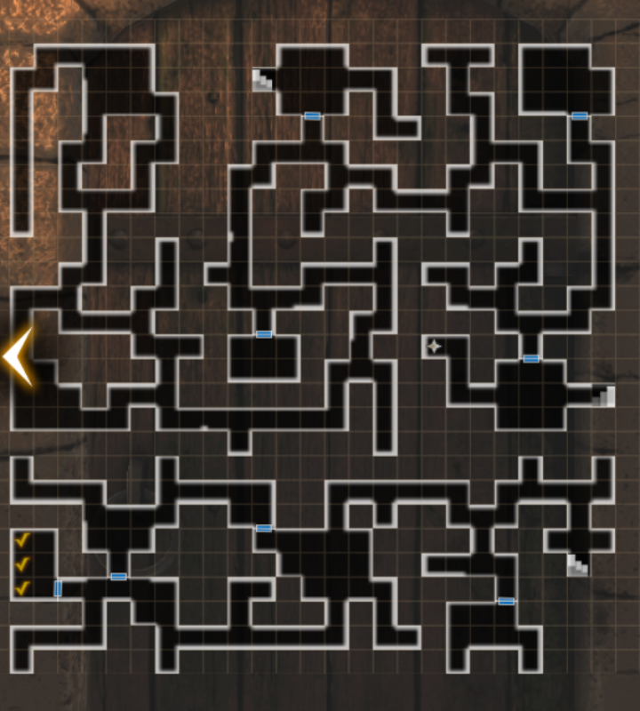
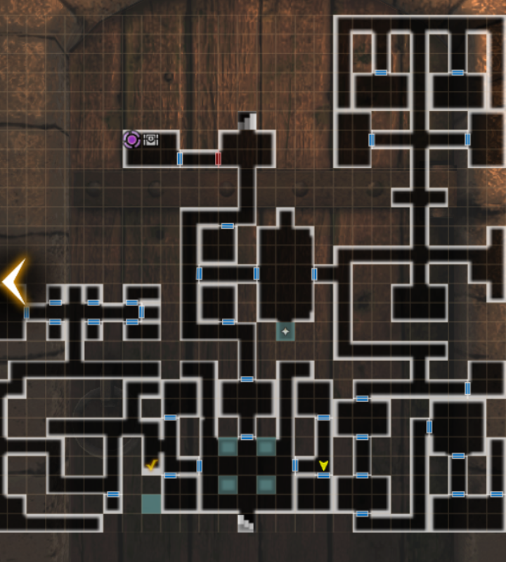
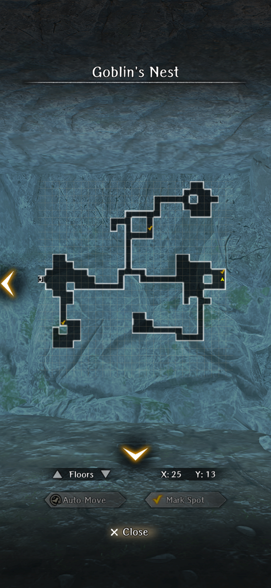
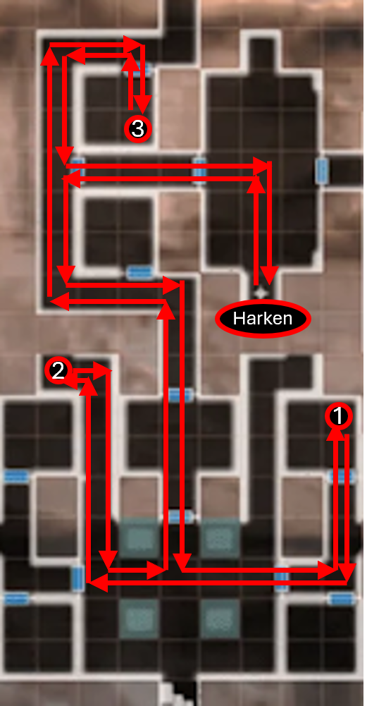

# Lamp of Malice
## How to participate:
You need to have progressed in the story until the unlocking of the Cursed Wheel and accept the quest on the Capital Adventurers Guild.
After accepting the quest, a new location will be accessible on the “Edge of town”.

## Guide:
1. On the entrance to the cave there’s an altar in which you can select 3 difficulty modes: Trial of Simplicity, Moderation and Impossible. Each difficulty increases the monster levels and rewards.

2. Like the main story, you will need to do more than one run to get the real ending to the event quest. You can quickly progress to the 4th floor by following the maps below:

### B1F:

### B2F:

### B3F:

### B4F:

3. After reaching the locked doors on B4F and interacting with the 4 altars, you’ll receive 4 quests to gather materials. Bat wings and Frog tongues can be obtained in B2F. Rat teeth and Lizard Tails can be obtained on B3F.

### B2F Materials:

### B3F Materials:

4. After gathering all materials, interact again with the altars on B4F. You’ll be able to progress to the fight with Isabella, the Seal. 

5. After defeating Isabella, progress to B5F to get some lore, then return by using harken after fighting newly spawned undead on the way. A cinematic will ensue and you’ll be prompted to return with the event's own cursed wheel.

6. Now you start the second run through the event. There’ll be two new dialogue options on the guide in the beginning of the cave and now you can interact with the crystals, which require a new pickaxe (not the same from the main story).

7. Speak with the blacksmith. You can choose to either do a quest to acquire ore from the goblin cave or pay 3000G for the hammer. The quest is very hard, so you’re advised to pay for the hammer.

??? map "Ore Locations from Goblin Cave"
    

8. Gather Crystals: you need 4 purification crystals, but some of the crystals you mine will only cause cave-ins and unlock new areas. After interacting with the 4 altars again, you’ll be prompted to gather 4 materials from the earth elementals. Rather than farming those, it’s easier to go to the top-mid of the B1F map and fight the elemental there, leave the map and fight him again, 4 times in total.

9. Interact with the 4 altars on B4F. Now, when the doors unlock, you can talk with Isabella and face the true boss.

### B1F Crystals:

### B2F Crystals:

### Suggested Farming Route on B3F:

### B3F Full map:

### B4F Full Map:

### Suggested No-Combat Chest Farming Route on B4F:
- Once the B4F Harken has been restored, a monster-free path exists that allows Crystal shard chests to be farmed.  During the 2024 event, using the Cursed Wheel in the Ruins to reset the main quest to "Fresh Start" would also restore all fixed chests in the Cave of Malice.  Thus, Crystal shard speed-run farming could be performed with the following procedure:

  1. Cursed Wheel reset to Fresh Start.
  2. Speed through the opening dialog.
  3. 'Do Nothing' to skip Princess dialog.
  4. Speed through Edge of Town dialog.
  5. Go to Cave of Malice B4F
  6. Auto move to three chests in order shown on the map below, and then back to Harken
  7. Return to town.
  8. Repeat.
  
- A single run should net 3 chests with 35-40 shards each, and the full loop could be completed in about 3 minutes.

### B5 Map:

Credits for maps: Gamerch
