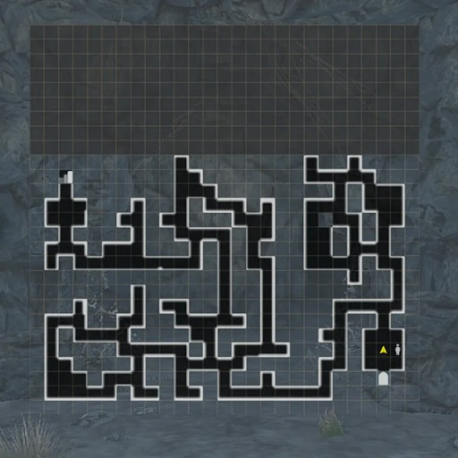
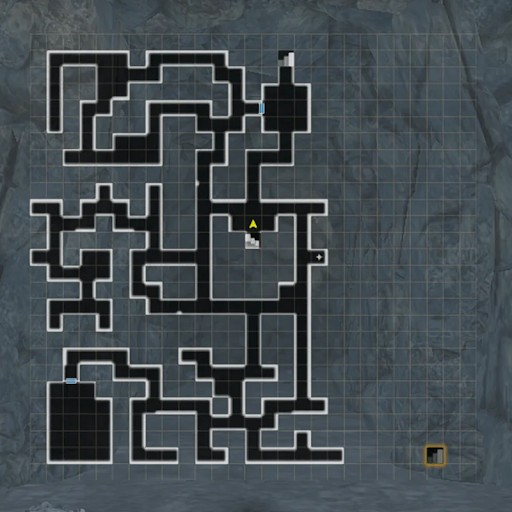
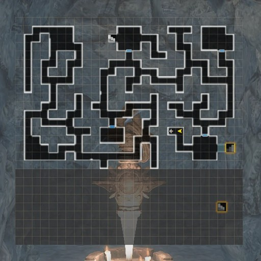
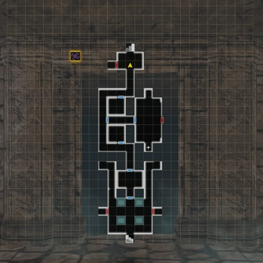
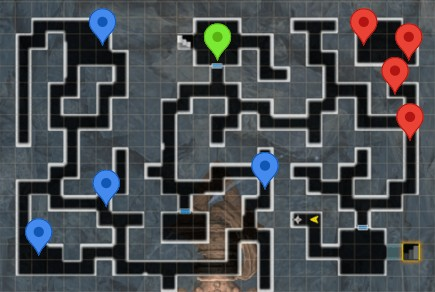
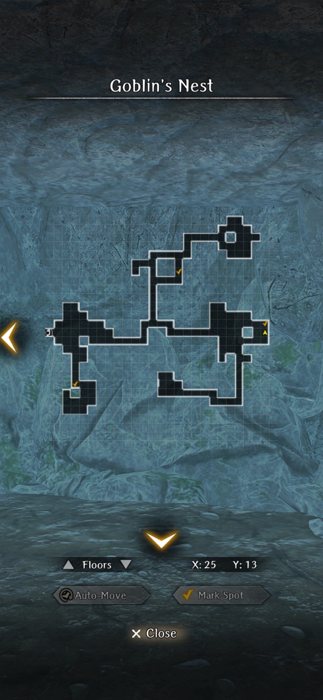

# Lamp of Malice

!!! item "This event is now permanent."

??? note "Video Tutorial"
    

        <iframe width="560" height="315" src="https://www.youtube.com/embed/4u6ZLLGSGf0?si=MH9-7KHUASNoN83h" title="YouTube video player" frameborder="0" allow="accelerometer; autoplay; clipboard-write; encrypted-media; gyroscope; picture-in-picture; web-share" referrerpolicy="strict-origin-when-cross-origin" allowfullscreen></iframe>
    

## How to participate:
You need to have progressed in the story until you have reached B7 in the Beginning Abyss on the second time around.

## Guide:
1. On the entrance to the cave there’s an altar in which you can select 3 difficulty modes: Trial of Simplicity, Moderation and Impossible. Each difficulty increases the monster levels and rewards.   
*The default difficulty without interacting with the altar is Moderation.*  

2. Like the main story, you will need to do more than one run to get the real ending to the event quest. You can quickly progress to the 4th floor by following the maps below:

???+ map "B1F Map"
    

        
    

???+ map "B2F Map"
    

        
    

???+ map "B3F Map"
    

        
    

???+ map "B4F Map"
    

        
    

3. After reaching the locked doors on B4F and interacting with the 4 altars, you’ll receive 4 quests to gather materials. Bat Wings and Frog Tongues can be obtained in B2F. Rat Teeth and Lizard Tails can be obtained on B3F.

???+ map "B2F Materials"
    

        
    

???+ map "B3F Materials"
    

        
    

4. After gathering all materials, interact again with the altars on B4F. You’ll be able to progress to the fight with Isabella, the Seal. 

5. After defeating Isabella, progress to B5F to get some lore, then return by using harken after fighting newly spawned undead on the way. A cinematic will ensue and you’ll be prompted to return with the event's own cursed wheel.

6. Now you start the second run through the event. There’ll be two new dialogue options on the guide in the beginning of the cave and now you can interact with the crystals, which require a new pickaxe (not the same from the main story).

7. Speak with the blacksmith. You can choose to either do a quest to acquire ore from the goblin cave or pay 3000G for the hammer. The quest is very hard, so you’re advised to pay for the hammer.

??? map "Ore Locations from Goblin Cave"
    

8. Gather Crystals: you need 4 Purification Crystals, but some of the crystals you mine will only cause cave-ins and unlock new areas. After interacting with the 4 altars again, you’ll be prompted to gather 4 Entity Shards from the Earth Elementals. 

!!! note 
    Rather than farming those, it’s easier to go to the east-mid of the B2F map (7:38 Video Guide) and fight the elemental there, win and grab the entity shard, leave the dungeon, reenter the dungeon, fight and repeat.

9. Interact with the 4 altars on B4F. Now, when the doors unlock, you can talk with Isabella and face the true boss.

???+ map "B1F Crystals"
    

        
    

???+ map "B2F Crystals"
    

        
    

???+ map "B3F Full Map"
    

        
    

???+ map "Suggested Farming Route on B3F"
    

        
    

    !!! note 
         This farming route in B3F is an EXP / Currency farming route with 4-6 guaranteed combats adjacent to harken for ~fastest combats or chests per minute farming rate.

???+ map "B4F Full Map"
    

        
    

???+ map "B5F Full Map"
    

        
    

???+ map "B5F Full Map"
    

        
    

Credits for maps: Gamerch
