# Lamp of Malice

!!! item "This event is now permanent."

??? note "Video Tutorial"
    <iframe width="560" height="315" src="https://www.youtube.com/embed/4u6ZLLGSGf0?si=MH9-7KHUASNoN83h" title="YouTube video player" frameborder="0" allow="accelerometer; autoplay; clipboard-write; encrypted-media; gyroscope; picture-in-picture; web-share" referrerpolicy="strict-origin-when-cross-origin" allowfullscreen></iframe>

## Overview

There are reports of monsters and undead in a nearby cave wherein an evil entity has was imprisoned long ago.  Go figure out what's going on.  

!!! note "Difficultly selector"  
    At the entrance to the cave there is an altar from which to select the difficulty mode: Trial of Simplicity, Moderation, and Impossible. Each difficulty increases the monster levels and even currency rewards (there is no change to story, enemy types, or equipment that can be found) . The default difficulty without interacting with the altar is *Moderation.*  

## How to enable

The event will be enabled when one has reached Level B7 of the Beginning Abyss on the second run through.

## Maps  
(one check: crystal or peculiarity; three checks: entities):  

??? map "B1F Map"
    (image missing entities located at x:12,y:26)  
    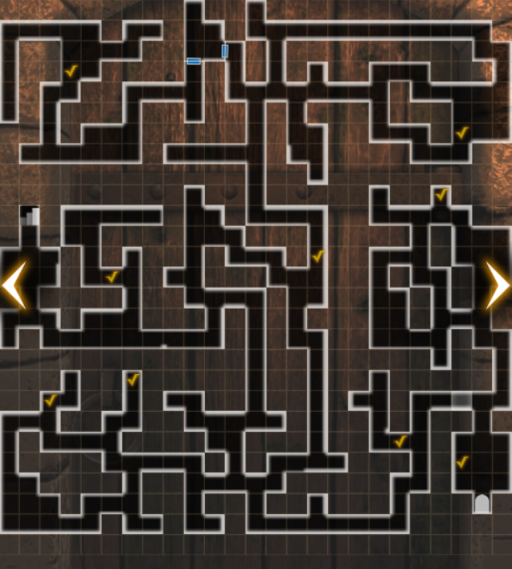

??? map "B2F Map"
    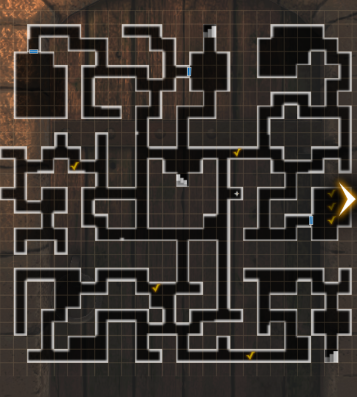

??? map "B3F Map"
    (the southern portion is inaccessible until the B2F stairs are revealed later.)
    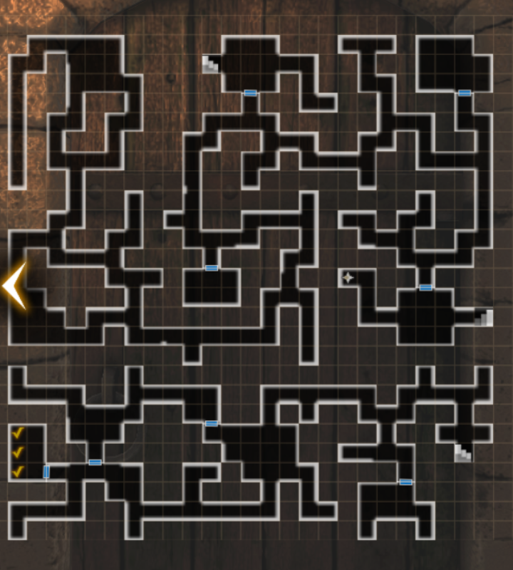

??? map "B4F Map"
    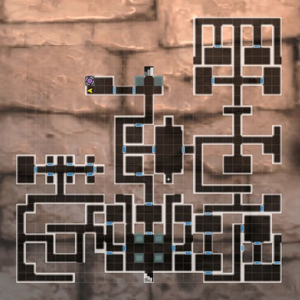

??? map "B5F Map"
    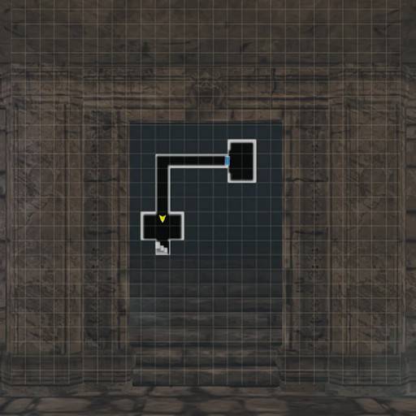

## Walkthrough

Note: Like the main story more than one run will be needed to get the complete ending for this event.

### 1st Run 

- Work your way down to the 4th floor. You'll encounter a few oddities along the way but there's nothing you can do yet.  Don't forget to restore the Harkens for easier returns.
- At the locked doors on B4F, interact with the 4 altars. You’ll receive 4 quests to go gather materials to feed to the altars.
- Bat Wings and Frog Tongues can be obtained in B2F. Rat Teeth and Lizard Tails can be obtained on B3F. See maps below.

??? map "B2F Materials - Bat Wings and Frog Tongues"
    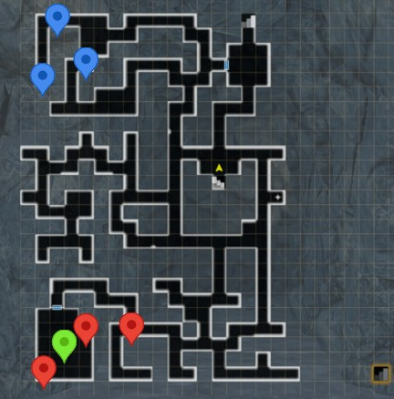
    
??? map "B3F Materials - Rat Teeth and Lizard Tails"
    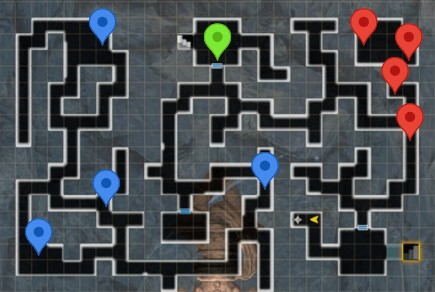

- Gathering all materials, interact again with each altar on B4F.  
- Progress through the unlocked door to the north. Find a 4th Harken, rest if needed, then go fight the spirit Isabella, the Seal. 
- After defeating Isabella, progress to B5F to get some lore. Return using the harken after fighting newly spawned undead on the way.  
- A cinematic will ensue and you’ll be prompted to reset the event to try again.  Note that the Event has it's own special cursed wheel page.

Now you start the second run through the event. There’ll be two new dialogue options on the guide in the beginning of the cave and now you can interact with the crystals, which require a new pickaxe (not the same from the main story).

### 2nd Run  
- You need to gather Purification Crystals. These can be mined from the Crystals you saw scattered around the Cave.  But you need a special hammer to get it.
- Speak with the Randolf blacksmith in the main capital. You can choose to either do a quest to acquire ore from the goblin cave or pay 3000G for the hammer.

!!! warning "If you're completing this quest when it first becomes available while you're still in the Beginning Abyss, the enemies in the Goblin Cave will be *VERY HARD*. You’re advised to pay for the hammer."

??? map "Ore Locations from Goblin Cave"
    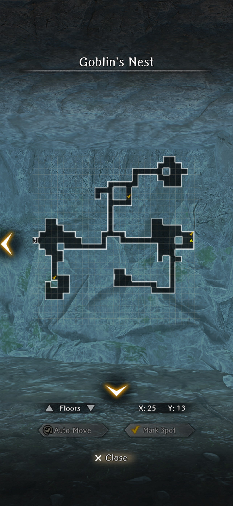

- With the hammer you need to gather 4 Purification Crystals:  
    - Return to the Cave and interact with white crystals in the floor at the various locations. Maps for 1st and 2nd floor crystals shown below.  
    - Some of the crystals will only cause cave-ins and unlock new areas.  Others will give you a Purification Crystal (check your Vaulables inventory).
    - You only need 4, but can collect as many as you want, which can save you time later if you rerun the event.
      
??? map "B1F Crystals"
    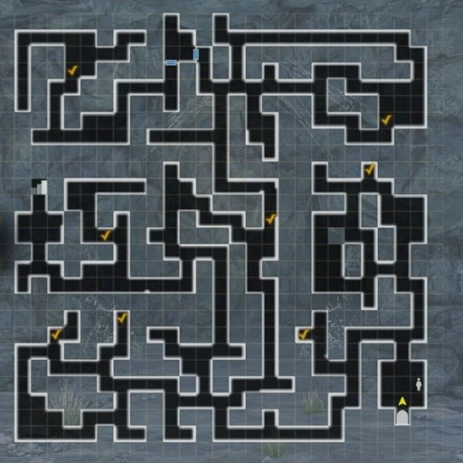

??? map "B2F Crystals"
    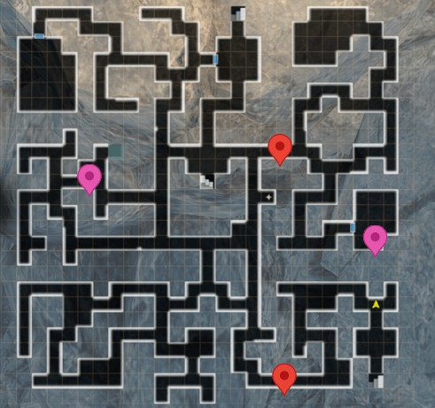

- Use a Purification Crystal in each of the 4 altars, then you’ll be prompted to gather 4 Entity Shards from the Earth Elementals in the dungeon.  
    - The earth elemental locations are noted in the main dungeon maps above.  
    - The elementals respawn every time you enter the Cave.  So rather than seeking out each entitiy, just harken in, fight the closest one, Harken Out, and repeat. This is likely fastest on floor B2F.  
    - This is also a good spot to farm Entities for 'kill X entities" missions.  
reenter the dungeon, fight and repeat.  
- Interact with the 4 altars on B4F to unlock the north door.  
- Go through the door and talk with Isabella, and then defeat the true boss to finish the event.  
    - The boss is a Necromancer, likely the first you will have faced before reaching the Third Abyss.  
    - Necromancers can summon undead, cast damage spells, and after a buildup use an Insta-Kill skill. They can be hard to land low level MONTINO spells on.  

!!! note "Insta-Kill (Necromancers, Mausoleum Undead, Nerocores...) and Critical (Rabbits, Ninja, etc.) are two different attacks. Think Spell vs Physical. Protection vs one does not necessarily protect against the other. Helms of Malice, Galina, and other later-game items can provide Insta-Kill tolerance."  

## Rewards 

- After you kill the necromancer, proceed to the treasure room for Isabella's Warhammer.  
    - Isabella's Warhammer: Steel 2H Blunt Weapon with 15-20% higher Attack, but -7 ASPD, than a base Steel 2H Mace, but always 1* white.  
    - A very good Priest or Gerulf weapon for 1st and 2nd abyss teams who haven't unlocked steel weapons and can't enhance to high levels yet.  
- Then return to the Capital to turn in the completed Request for a small cash reward.

## Farming

- The Malice event has a special Jeweler Exchange shop that can provide a number of malice helms, some junk, codexes, etc.  The Event currency are crystal shards that can be found in every chest. (and you get some by clearing the floor crystals that cause cave-ins).  
- The permanent event no longer respawns chests, so farming requires combat for chest drops. The shard count increases if you increase difficulty at the entrance shrine.
- Farming recommendations are to set the difficulty on the highest setting that you can run auto-combat, then take one of the near-Harken, quick in-out routes below.

??? map "Suggested Farming Route on B3F"
    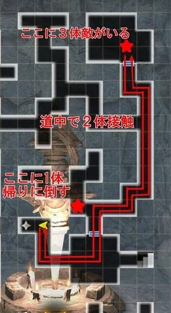
    !!! note 
         This farming route in B3F is an EXP / Currency farming route with 4-6 guaranteed combats close to the harken for ~fastest combats or chests per minute farming rate.  There is always one mob off to the left of the southern star, and 3 in the starred room to the north. 

??? map "B4F no combat chest grab route"
    *note: fixed chests no longer be respawn*  This is mainly left here just for nostalgia's sake.  
    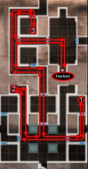

### Event reward farming:
Farming Isabella's hammer requires resetting the event and repeating the 2nd run. You can gather more than 4 Purification Crystals (as many as are in the cave), and an infinite number of Entity Shards each run to make later runs faster.  It will take 3 copies and access to Low- and Mid-Grade iron ore to take the hammer to +10. As a 1-star Steel item, that is likely as high as it is worth taking. By the time you can take it to +15 (9 total copies), you will likely have access to better weapon options.  

Credits for maps: Gamerch

## Investigation of the Cave of Malice - Sequel

### Quick Guide

1. Head to the Royal Capital and accept the request in the Adventurer's Guild under the Featured tab. You will see a cutscene.
2. Head to the Edge of Town and enter the Cave of Malice via B1F. Attempting to go to any other floor will have a cutscene with Lulunarde telling you that it isn't safe and bringing you back to town.
3. Start on B1F and make your way down to B4F. While the maps are the same, they now have various areas that are completely obfuscated by purple fog. There are key enemies in the fog that need to be defeated in order to clear the fog. However, this is optional.
4. Head straight to B4F and get a cutscene with Lulunarde telling you to probably deal with key enemies in the previous maps. They will be indicated by NPC icons. However, it is not necessary to and you can simply proceed down the top middle staircase on B4F to do the boss fight.
5. Upon getting to the end of the hallway, there will be a cutscene and a fight will start. If you did not clear all the mobs before the boss fight, you will have to fight 5 Necromancers and 1 Isabella. The Necromancers will summon large amounts of skeleton mobs to assist in the fight, but they have very low HP. Isabella herself has around 20k HP, and the Necromancers have around 10k HP each (rough estimate).
6. After defeating all the enemies, you will have completed the request and obtain Isabella as bondmate, who gives Freeze Tolerance.

### Rewards

After unlocking this request, the exchange shop will have more items in it, namely a purple codex and the ability to buy the updated Cave of Malice Junk + the new Cave of Malice items.

??? note "Silver Helm of Malice"
    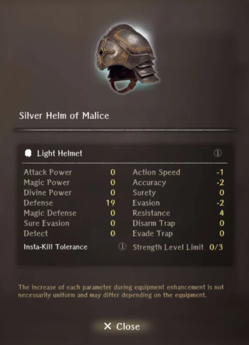

??? note "Two Handed Staff of Malice"
    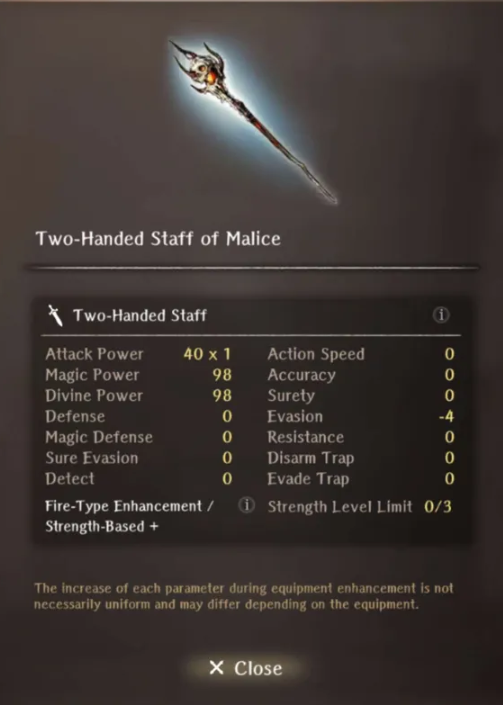

??? note "Isabella the Sealer"
    

