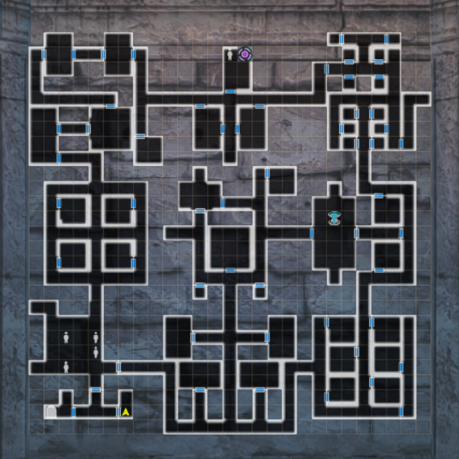
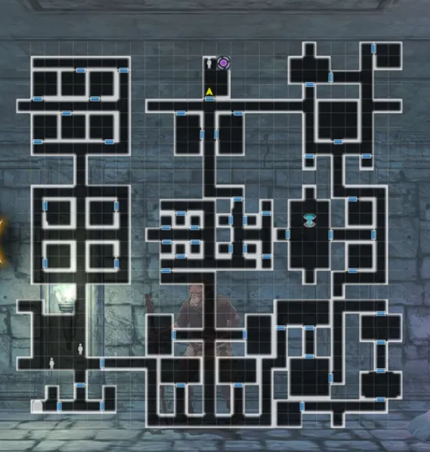
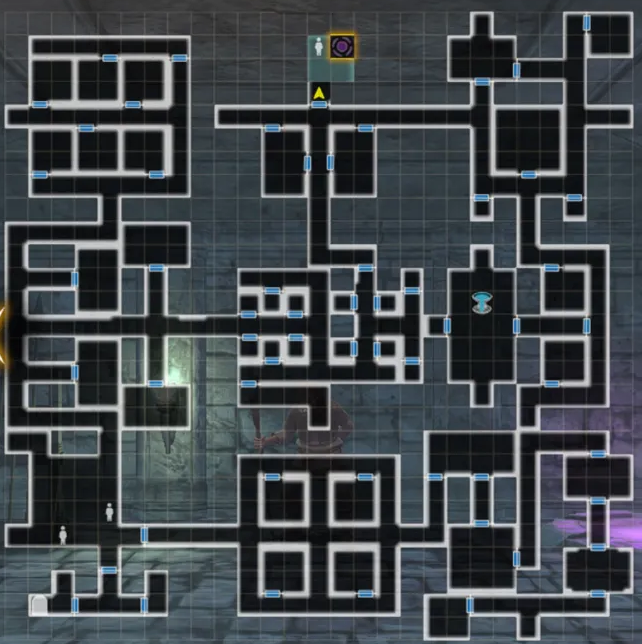
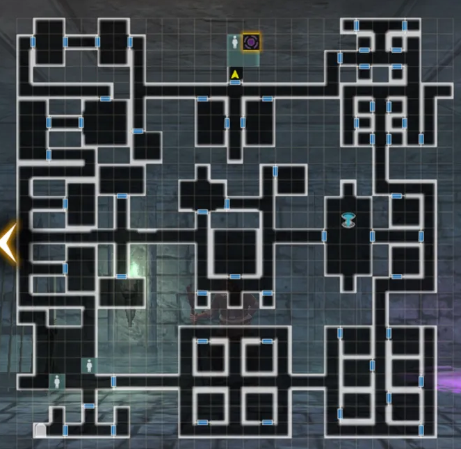
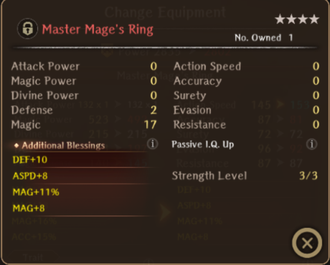

# Mage Proving Grounds

!!! item "This event is permanently available!"

## Guide:

There is no introduction to this event. Simply start the event by heading to the Royal Capital and accepting Beginner Mage Trial in the Featured tab. This will mark the location on your map.

You can obtain up to 600 Seals of the Mage by completing the trials up the Advanced. Specifically, 100 for Beginner, 150 for Intermediate, and 350 for Advanced. There are no missions for this event in particular.

There are several map variations, and are random upon entering. It is not necessary to explore the whole map, you simply need to make it to the end and defeat the floor boss. Keep in mind, it only counts as a clear upon talking to the masked mage at the end of the stage.

Keep in mind unique adventurer classes that are "mages" can enter such as Iarumas and Berkanan.

!!! note "All the maps here are the same as that of the Fighter Proving Grounds."

??? note "Map Variation 1"
    

??? note "Map Variation 2"
    

??? note "Map Variation 3"
    

??? note "Map Variation 4"
    

??? note "Tips"
    - Remember to carry potions on all three characters.
    - Carry a healing staff switch so you can use healing spells from the MC and/or other characters who have access to dios/madios. 
    - Normal enemies typically have less than 550 HP in all stages of the map. You can usually blow them up with one or two LA- spells. The hobgoblin tends to have quite a bit more hp, but nothing crazy.
    - All the enemies are very resistant to physical damage (they only take 1 damage).

??? danger "Beginner Boss Fight Tips"
    - This fight consists of two Fire element Hobgoblins with around 1.5k HP each.

??? danger "Intermediate Boss Fight Tips"
    - This fight consists of a Scorpion Lady with two Wind element Vorpal Bunnies in the front row, and two Fire Element Clouds in the back row.
    - Every enemy besides the Scorpion Lady has a little over 500 HP.
    - The Scorpion Lady herself has around 2-3k HP. When she reaches a certain HP Threshold, she will instantly cast her charge skill, which can be evaded.

??? danger "Advanced Boss Fight Tips"
    - This fight consists of a Pixie and a Chimera. The Pixie has 2-3k HP. The Chimera has 5-6k HP. When the Pixie dies, the Chimera gains a permanent ATK UP and ACC Up buff.
    - At a certain HP threshold, the Chimera will cast an attack that hits extremely hard (over 700) when it has the ATK UP buff.
    - At a certain HP threshold, the Chimera will buff again?

??? note "Master Mage's Ring"
    
    - The Mage ring is always 4* Red and has fixed stats when using a FAS. The values can be rerolled but not the type of stat lines.
