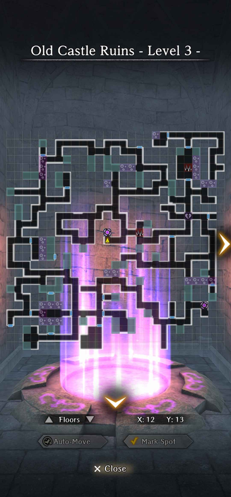
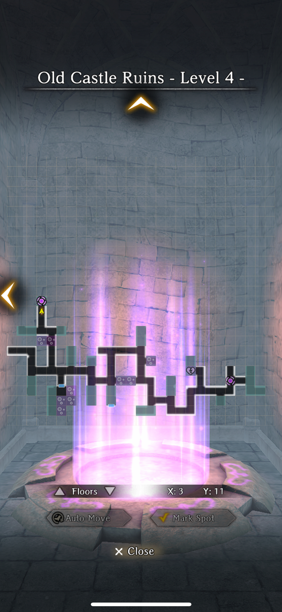
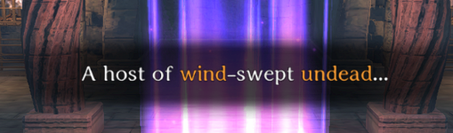
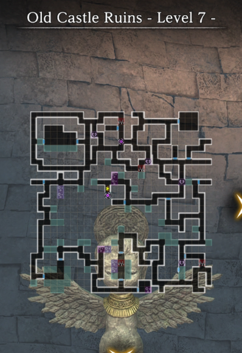
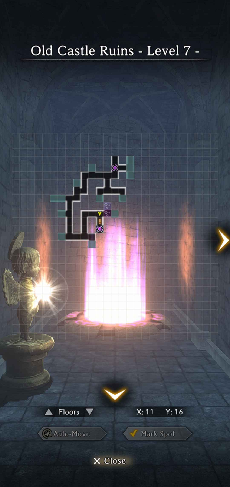
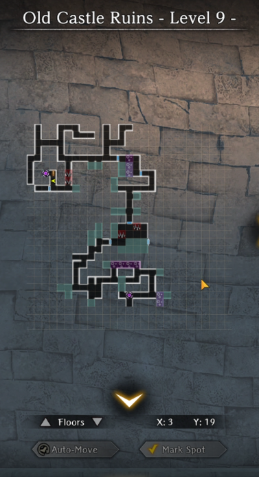
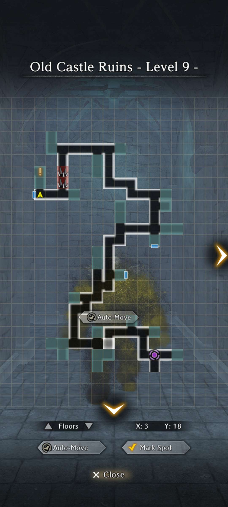
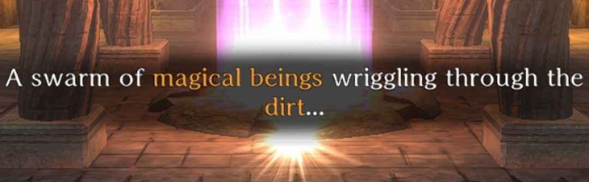

# Old Castle Ruins

## Notes about maps
1. The maps don't seem to reset.
2. Every 5th floor is a gauntlet map which contains 5 battles. Two normal enemy encounters and then every miniboss that you encounter before the portal of the previous floors. 
3. Every 6th floor is a checkpoint this means Harken. No enemies on this floor. 
4. There might be better routes, or you might have slightly different map. Just pay attention to the pattern of the layout around the portal if your map isn't similar. 

## Floor 1 ("Checkpoint")
The light just before the portal tells you the gimmick of the next couple of floors.

## Floor 2

## Floor 3

## Floor 4

Alternative you can go from the top and avoid some traps

## Floor 5 (Gauntlet)

All gauntlet maps look like this so I'm not going to post any more of these.

## Floor 6 (Checkpoint)
This is the checkpoint floor. The light just before the portal tells you the gimmick of the next couple of floors.

## Floor 7

Floor 7 Alternative path

## Floor 8

## Floor 9

Alternative path

## Floor 10 (Gauntlet)
All gauntlet maps looks the same. 5 Battles.

## Floor 11 (Checkpoint)
This is the checkpoint floor. The light just before the portal tells you the gimmick of the next couple of floors.

## Floor 12

## Floor 13

Route Through Bottom

## Floor 14

## Floor 15 (Gauntlet)
All gauntlet maps looks the same. 5 Battles.

## Floor 16 (Checkpoint)
This is the checkpoint floor. The light just before the portal tells you the gimmick of the next couple of floors.

There are going to be a lot of charm mechanics as well so bring scrolls of sedation. 

## Floor 17

Alternative Route Through Bootom

## Floor 18

## Floor 19

## Floor 20 (Final Gauntlet)
All gauntlet maps looks the same. 5 Battles. This one might make you cry.

## Floor 21 (Finish Line)
Congrats, surely you have a good ranking.
