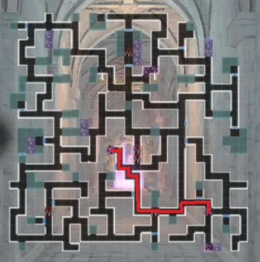

# Old Castle Ruins - Season 2

All floors are static. Efficiency is measured by how fast you complete the floor

Boss Rush floors always have the same order of bosses.

Optimal paths for Foray Speed are listed below.

## How to participate:
The main character needs to reach Bronze Grade. After advancing to Bronze Grade, visiting the Adventurers Guild will trigger a dialog for the quest after which a new location will be available on the World Map.

## Tips

- It is ideal for Foray Speed to walk through poison and not cleanse it if possible.
- It is ideal to fight through mobs and not flee from combat.
- Flutterdream Flash increases your Foray Speed, so it is recommended not to use characters with this skill if possible.

## Boss Rush Floors (5,10,15,20)

## Floor 2-4

## Floor 7-9

## Floor 12-14

## Floor 17-19

