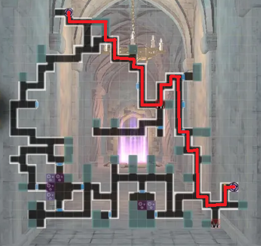
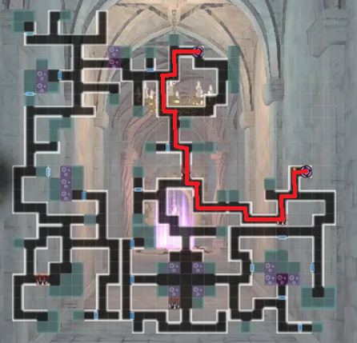

# Old Castle Ruins - Season 2

!!! warning "This event currently has a bug that certain players may intentionally or unintentionally abuse to lower their Foray Speed into unrealistic scores"

All floors are static. Efficiency is measured in number of actions taken and steps taken.

Boss Rush floors always have the same order of bosses.

Shortest, but not most optimal paths for Foray Speed and posted.

## Tips

- It is ideal for Foray Speed to not walk through poison if possible. It is much better to walk around if possible. Spike Traps also penalize your score but not as much.
- It is ideal to not engage in combat if possible and flee.
- It is ideal to use low cost/no cost moves in combat such as basic attacking and defending when possible.
- Flutterdream Flash increases your Foray Speed, so it is recommended not to use characters with this skill if possible.

## Boss Rush Floors (5,10,15,20)

## Floor 2-4

## Floor 7-9

## Floor 12-14

## Floor 17-19

