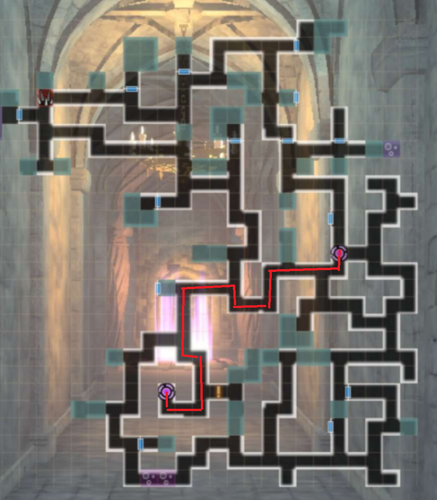
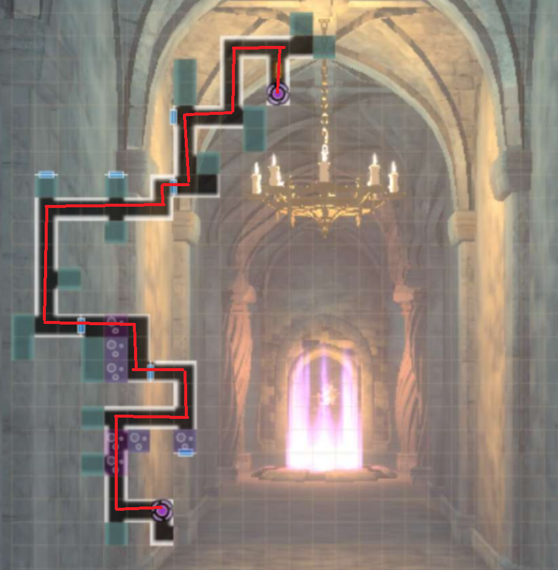
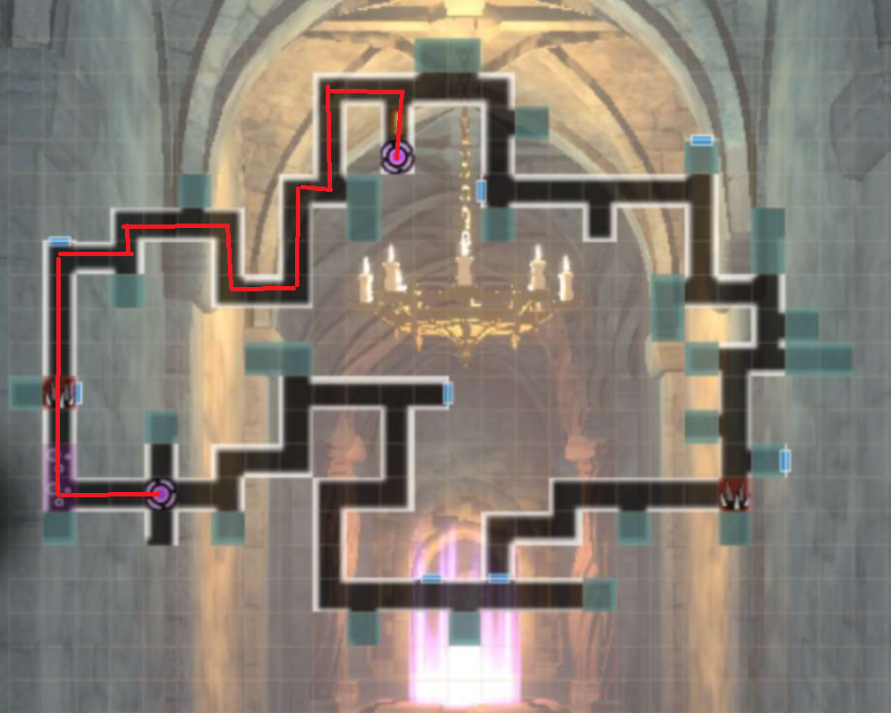
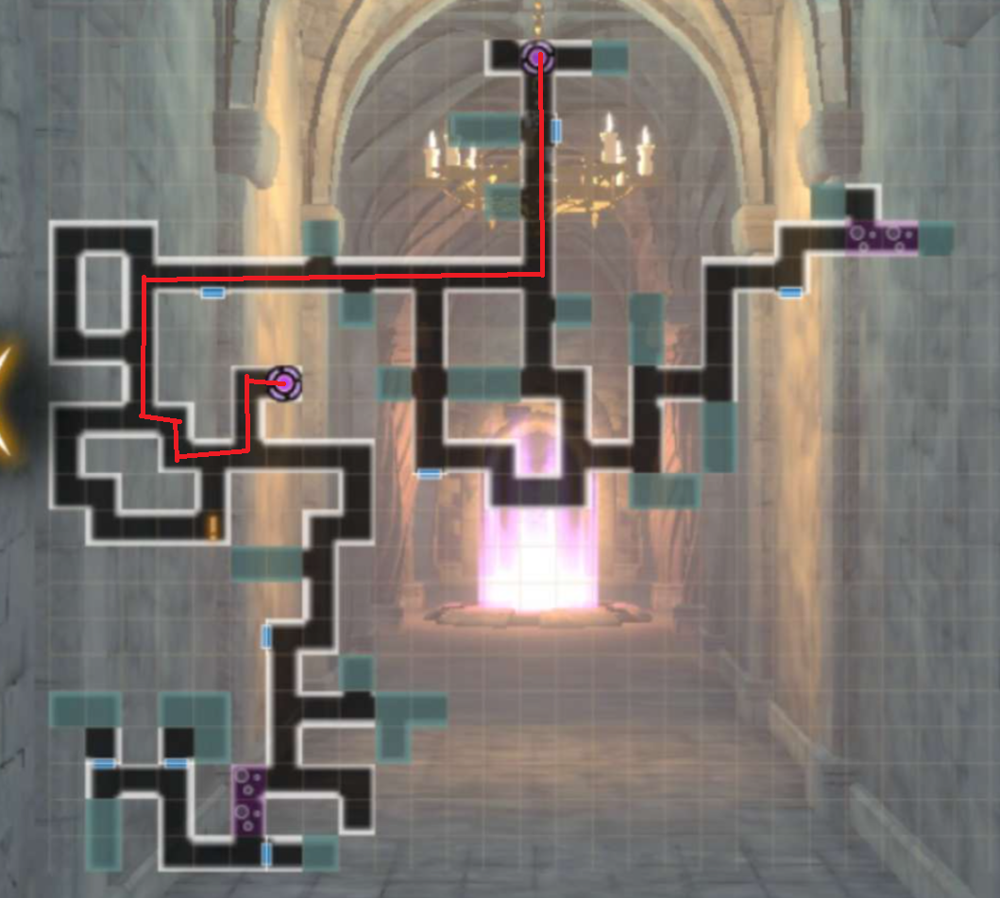
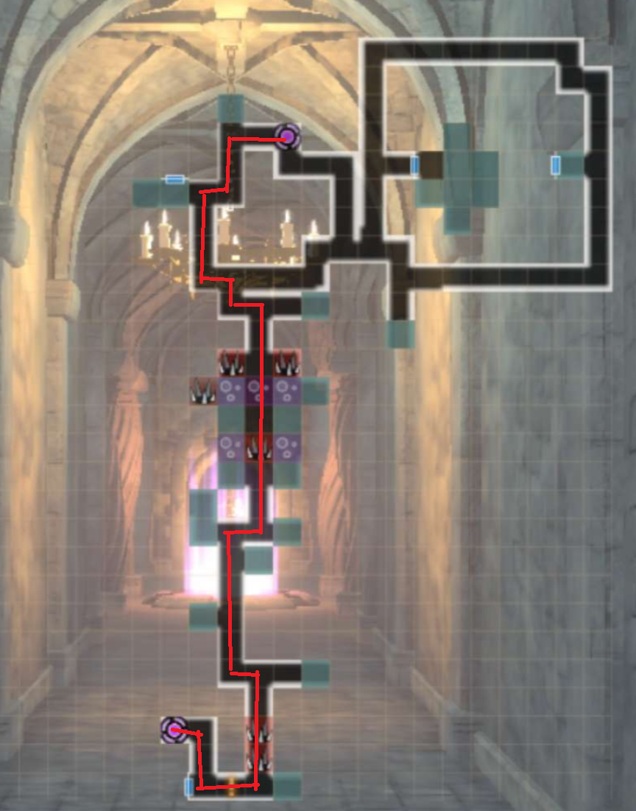

# Old Castle Ruins - Season 3

!!! bug "It is season 3 and there are still bugs with Foray Speed. Thank you Drecom"

All floors are static. Efficiency is measured by how fast you complete the floor.

Boss Rush floors always have the same order of bosses.

Optimal paths for Foray Speed are listed below.

## How to participate:
The main character needs to reach Bronze Grade. After advancing to Bronze Grade, visiting the Adventurers Guild will trigger a dialog for the quest after which a new location will be available on the World Map.

## PvP Floors:
Every safe floor (6, 11, 16, 21), has a PvP room where you can fight against other adventurer parties. There isn't anything for doing so, but they can be easily defeated with a strong mage with high ASPD.

## Tips

- It is ideal for Foray Speed to walk through poison and not cleanse it if possible. However, the penalty for doing so is very small.
- It is ideal to avoid mob battles, but not if it increases the number of steps needed on an optimal route. Fleeing to phase through mob battles is not recommended.
- It is ideal to finish battles as quickly as possible, as more actions taken per fight increases foray score.
- You are not penalized for taking time to think either in or out of combat. Only actions and steps are really taken into account for scoring.
- Flutterdream Flash increases your Foray Speed, so it is recommended not to use characters with this skill if possible on easier floors. The penalty is minimal however.

## Boss Rush Floors (5,10,15,20)

## Floor 2-4

## Floor 7-9

## Floor 12-14

## Floor 17-19

