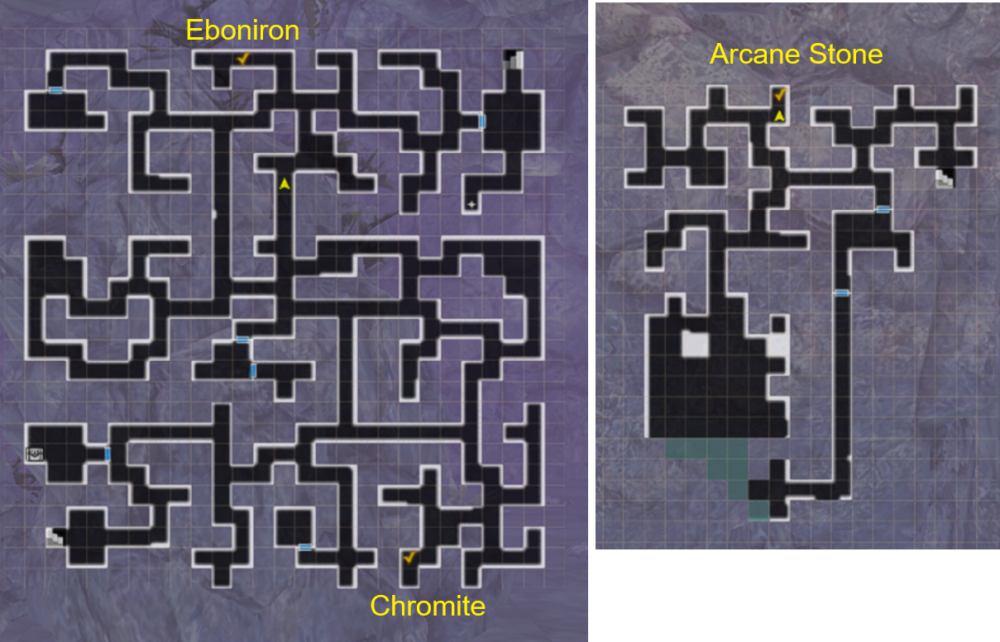
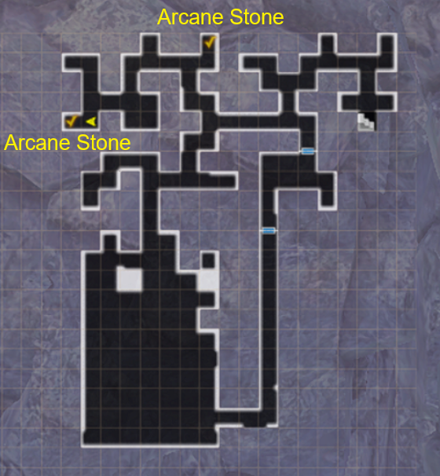

# Otherworld Adventurers

## Guide:
!!! note "There is no difficulty mode for this Event Dungeon. The mobs will scale automatically to your level."

There is only one ending for this event, and is relatively quick to complete (if you are strong). It takes a minimum of three cursed wheel resets to complete entirely however.

??? note "Map BF1"
    
    
??? note "Map BF2"
    
    
??? note "Map BF3"
    

??? note "1st Run"
    1. Watch Cutscene in Event Tab.
    2. Head to Adventurer's Guild in the Royal Capital.
    3. Head to the event location, Sahuagin's Cave, via Edge of Town in the Royal Capital.
    4. Find 3 people on B1F to save. Move to the next floor.
    5. Find 2 people on B2F to save. They are dead already.
    6. Find an extra burned body on the way to the next floor. It's Iarumas.
    7. Go to B3F, Fire Dragon will show up and start throwing fire everywhere (You may lag quite a bit at this part)
    8. Move to the non-red tiles on the minimap asap or get killed instantly (do this 3 times).
    9. Return to capital, watch cutscene, and then accept the Fire Dragon request at adventurer's guild, head to tavern to talk to Iarumas.
    10. Head back to dungeon B3F, try to fight the dragon again, but you are unable to (this part is important)
    11. Instead, now head to the sahuagin NPC on the minimap and kill them for a key.
    12. You can now open previously locked doors. Move ahead to the side of the Dragon.
    13. Have Iarumas distract the dragon and fight the dragon. However, it rages at the end and melts in the Magma.
    14. Turn in the request and get basically nothing. Rewind time with Cursed Wheel.

??? danger "Dragon Boss Fight Tips"
    - The boss fight scales with the MC's adventurer grade. At Steel Grade, the dragon has about 15k HP. On the other hand, Lead Grade is maybe around 3k HP. Bronze Grade is around 7k HP.
    - It's highly recommended for players Bronze Grade or lower to farm the Dragon Slayer weapon and upgrading it to +10 or so before attempting, as it's extremely strong for that level range.
    - The dragon is susceptible to Paralyze, not Stun. This is most likely to encourage people to use Iarumas's unique skill that paralyzes. Other sources are also more effective than usual but not guaranteed (Mimic Secretion, Thunder Strike, etc).
    - The dragon can be spellbound, but it does not stop its roar or breath. However, it will be more inclined to use basic attacks that can be exploited for openings.
    - Evasion helps mitigate a lot of physical moves the dragon does, but requires a large amount (possibly 200+ for Steel Grade).
    - Water elemental weapons and spells help deal more damage to the dragon. Water armor helps resist the fire breath.
    - Cortu can mitigate some damage from the breath and magic, as Iarumas suggests, but as the dragon can sometimes go twice in a turn with mixed damage, it may not be enough alone.
    - If your team has enough damage, consider using Knight's Defense to mitigate damage if your team's gear is not specced to deal with the dragon specifically
    - It's suggested to have two priests as the dragon can hit the entire team all at once, so having heals for both rows helps a lot.

??? note "2nd Run"
    1. Watch cutscene of Lulu looking for info. Select all the options.
    2. Use the key to go through door on b1f. You can now save all the people without them dying now.
    3. Find Berkanan at entrance to B3F, grab her body, and head down.
    4. Same Fire Dragon event again, just dodge the fire.
    5. Head back to town to resurrect Berkanan. She is quite tall.
    6. Head to adventurers guild, turn in quest, get dragon quest, head to tavern and talk to Berkana and Iarumas.
    7. Head to blacksmith, get request to pick up ore to make dragon slayer stuff.
    8. Head to the 3 locations on the map below to obtain the ores for the Dragon Slayer sword.
    9. Return to blacksmith to get sword, and then head back to the side tunnel to fight the dragon.
    10. Dragon is successfully killed this time, but Berkanan is burned to death again.
    11. Head back to town to turn in the request, and rewind time.

??? note "Ore Locations for 2nd Run"
    

??? note "3nd Run"
    1. Repeat everything from before up to the Blacksmith. This time you will ask for a shield as well.
    2. Head to the 3 locations on the map to pick up the ore, along with the one extra location for the shield.
    3. Return to blacksmith for the sword and shield to give to Berkanan.
    4. Defeat the Dragon again, who is a little bit harder this time, and successfully kill without Berkanan dying.
    5. Bid farewell to Berkanan and Iarumas as you can't seem to follow them into the strange dungeon.
    6. Return to town to turn in the request. Listen to Lulu yap about lore.

??? note "Ore Locations for 3nd Run"
    

??? note "Unique Event Rewards"
    
    
    
