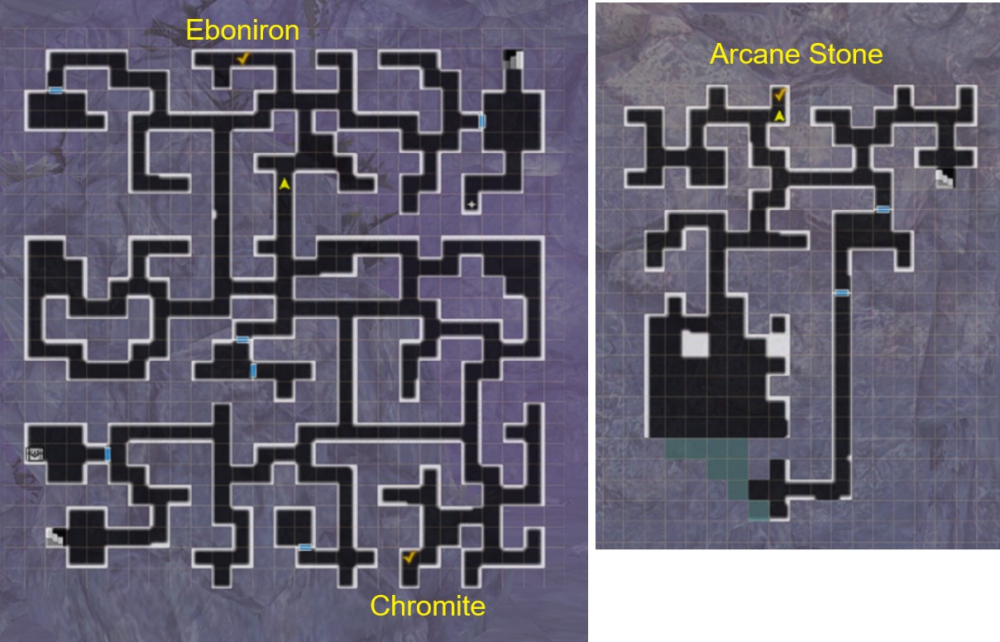
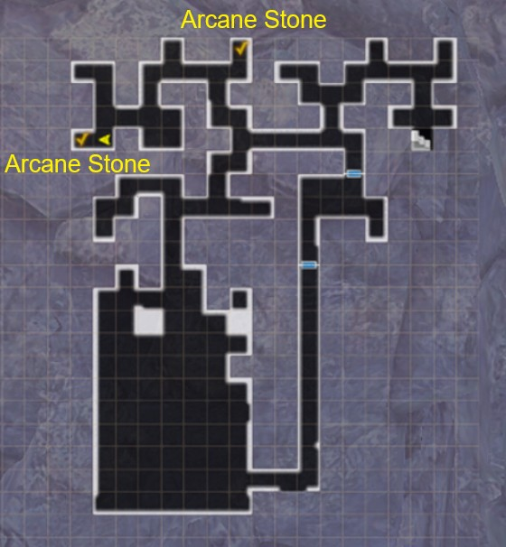
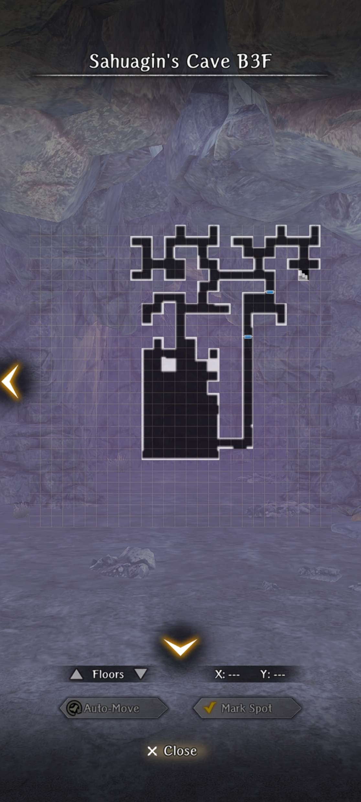

# Otherworld Adventurers

## Guide for Part 1:
!!! note "There is no difficulty mode for this Event Dungeon. The mobs will scale automatically to your level."

There is only one ending for this event, and is relatively quick to complete (if you are strong). It takes a minimum of three cursed wheel resets to complete entirely however.

??? note "1st Run"
    1. Watch Cutscene in Event Tab.
    2. Head to Adventurer's Guild in the Royal Capital.
    3. Head to the event location, Sahuagin's Cave, via Edge of Town in the Royal Capital.
    4. Find 3 people on B1F to save. Move to the next floor.
    5. Find 2 people on B2F to save. They are dead already.
    6. Find an extra burned body on the way to the next floor. It's Iarumas.
    7. Go to the large, southern section of B3F, Fire Dragon will show up and start throwing fire everywhere (You may lag quite a bit at this part)
    8. Move to the non-red tiles on the minimap asap or get killed instantly (do this 3 times).
    9. Return to capital, watch cutscene, and then accept the Fire Dragon request at adventurer's guild, head to tavern to talk to Iarumas.
    10. Head back to dungeon B3F, try to fight the dragon again, but you are unable to (this part is important)
    11. Instead, now head to the sahuagin NPC on the minimap and kill them for a key.
    12. You can now open previously locked doors. Move ahead to the side of the Dragon.
    13. Have Iarumas distract the dragon and fight the dragon. However, it rages at the end and melts in the Magma.
    14. Turn in the request and get basically nothing. Rewind time with Cursed Wheel.

??? danger "Dragon Boss Fight Tips"
    - The boss fight scales with the MC's adventurer grade. At Steel Grade, the dragon has about 15k HP. On the other hand, Lead Grade is maybe around 5.5k HP. Bronze Grade is around 7.5k HP.
    - It's highly recommended for players Bronze Grade or lower to farm the Dragon Slayer weapon and upgrading it to +10 or so before attempting, as it's extremely strong for that level range.
    - The dragon is susceptible to Paralyze, not Stun. This is most likely to encourage people to use Iarumas's unique skill that paralyzes. Other sources are also more effective than usual but not guaranteed (Mimic Secretion, Thunder Strike, etc).
    - The dragon can be spellbound, but it does not stop its roar or breath. However, it will be more inclined to use basic attacks that can be exploited for openings.
    - Evasion helps mitigate a lot of physical moves the dragon does, but requires a large amount (possibly 200+ for Steel Grade).
    - Water elemental weapons and spells help deal more damage to the dragon. Water armor helps resist the fire breath.
    - Cortu can mitigate some damage from the breath and magic, as Iarumas suggests, but as the dragon can sometimes go twice in a turn with mixed damage, it may not be enough alone.
    - If your team has enough damage, consider using Knight's Defense to mitigate damage if your team's gear is not specced to deal with the dragon specifically
    - It's suggested to have two priests as the dragon can hit the entire team all at once, so having heals for both rows helps a lot.
    - You need a minimum of 43 ASPD to outspeed the dragon at Steel Grade.

??? note "2nd Run"
    1. Watch cutscene of Lulu looking for info. Select all the options.
    2. Use the key to go through door on b1f. You can now save all the people without them dying now.
    3. Find Berkanan at entrance to B3F, grab her body, and head down.
    4. Same Fire Dragon event again, just dodge the fire.
    5. Head back to town to resurrect Berkanan. She is quite tall.
    6. Head to adventurers guild, turn in quest, get dragon quest, head to tavern and talk to Berkana and Iarumas.
    7. Head to blacksmith, get request to pick up ore to make dragon slayer stuff.
    8. Head to the 3 locations on the map below to obtain the ores for the Dragon Slayer sword.
    9. Return to blacksmith to get sword, and then head back to the side tunnel to fight the dragon.
    10. Dragon is successfully killed this time, but Berkanan is burned to death again.
    11. Head back to town to turn in the request, and rewind time.

??? note "Ore Locations for 2nd Run"
    

??? note "3nd Run"
    1. Repeat everything from before up to the Blacksmith. This time you will ask for a shield as well.
    2. Head to the 3 locations on the map to pick up the ore, along with the one extra location for the shield.
    3. Return to blacksmith for the sword and shield to give to Berkanan.
    4. Defeat the Dragon again and successfully kill without Berkanan dying.
    5. Bid farewell to Berkanan and Iarumas as you can't seem to follow them into the strange dungeon.
    6. Return to town to turn in the request. Listen to Lulu yap about lore.

??? note "Ore Locations for 3nd Run"
    

??? map "Map BF1"
    
    
??? map "Map BF2"
    
    
??? map "Map BF3"
    

??? note "Unique Event Rewards"
    
    
    

## Guide for Part 2:
!!! warning "You will need to have cleared the Good ending (3rd Run) in order to unlock this part"
!!! warning "As opposed to the 1st part of the event, the second part has Silver tier versions of the Unique Event Rewards that can be bought from the shop and dropped from special junk. The gear can generate as high as Purple 4*. In addition, you may purchase 99 copies of each, so it's recommended to focus on these instead of the previous versions"

??? note "1st Run"
    1. Head to B1F, take the shortcut door, and save the civilians as normal.
    2. Upon reaching the stairs to B2F, the screen will glitch and provide 2 door choices. Select the Right Door (Ainikki Door) and enter through.
    3. B2F will be a completely different map, and various portions of the walls will have the glitched textures. Halfway through the floor, you will encounter a Knight that needs help, and interacting with them will engage a fight the Fire Dragon from Part 1. Simply defeat it as normal. Remember to rescue the singular civilian on this floor.
    4. Head to the stairs to B3F, and find Ainikki's body. Defeat the Sahuagins and pick up her body. Continue to B3F.
    5. Head to the Dragon location, but this time find a Black Dragon instead of a Fire Dragon. It will fog up the entire room, causing you to retreat. Head back to the Royal Capital and resurrect Ainikki. She will be assisting at the temple after being resurrected.
    6. Head to the Tavern in the Adventurer's Guild to talk to Iarumas and ask for his help in killing the Black Dragon.
    7. Head back to B3F and find your way back to the Black Dragon's Chamber. You will need to navigate nearly blindly unless you have a Ranger to cast Milwa, but it should be somewhat clear to go through the darkness especially if you turn the game's brightness up.
    8. The next fight will be a FORCED LOSS. The Black Dragon is unkillable and can instantly kill your entire party with its breath (deals extremely high damage). It is recommended to come with only the MC if possible.
    9. You will have to cursed wheel and get Ainikki's help

??? note "2nd Run"
    1. Repeat the selection at B1F and save all civilians on B1F and B2F. Rescue Ainikki and resurrect her body at the temple.
    2. Head to the Tavern and ask Iarumas for help, as well as getting him to ask Ainikki to help as well.
    3. Ainikki agrees, but requires equipment to defeat the dragon. Head to the Blacksmith in the Royal Capital to help her craft a Morningstar. You will need several ore on B2F and B3F. Consult the maps listed for locations.
    4. Head back to Blacksmith after obtaining the Ore and craf the Morningstar. Head back to defeat the Black Dragon in B3F. After the fight is won, Ainikki will slice the head off of the dragon. Iarumas and Ainikki head into the Other World, but you are still unable to follow them. You bid each other farewell.
    5. Head back to the Adventurer's Guild to turn in the request. 

??? map "B2F Ore Locations for 2nd Run of Ainikki Variation"
    
    
??? map "B3F Ore Locations for 2nd Run of Ainikki Variation"
    

??? danger "Black Dragon Boss Fight Details"
    - The fight is similar to the Fire Dragon, but it has slightly more HP (20k) at Silver Grade.
    - The dark breath that it uses applies weaken on targets hits.

### Post-game Black Dragon Superboss Variation:

After completing the 2nd Run, you can head back to the chamber in B3F where the Black Dragon used to reside. The screen will glitch upon entering, indicating something has changed. Head to the very back of the chamber, and a path to the side will open into the Other World. Head inside and you'll be placed in an old-school pixelated dungeon where you can pick up two chests and also fight the true version of the Black Draogn.

??? danger "Black Dragon Superboss Fight Details"
    

    - Has around 105k-120k HP. Has three actions per turn. Does not have very high Surety Evasion.
    - Has the typical moveset of the Black Dragon such as Roar (stuns), Black Flame Breath (weakens), Claw, Tail Swipe, Morlis, etc.
    - The dragon is immune or highly resistant to Chronostasis, but can be Delay Attacked or Batilgrefed.
    - The dragon can be debuffed, but isn't consistent. It is also possible to apply status effects on this dragon, but isn't consistent.
    - It is extremely recommended for the player to run a Knight with Knight's Defense, as it will be difficult surviving three turns of damage that easily hits 200-300 damage per action as well as being weakened from the Black Flame Breath.
    - Defeating this dragon may drop a unique Ebonsteel tier 2H Mace called the Black Dragon Warhammer. It has -25 Surety, but has Defense Penetration. This can also drop from the weaker version.
    - To reset this boss, you will need to cursed wheel the event entirely.

## Farming The Event

There are three major ways to farm the event, each with their own pros and cons. Use your own judgement to determine which gives you the highest currency over time ratio.

* Map Reentry
    * Farming the event in this manner simply involves entering the map, moving to all the chests you see, then harkening out. This has the least amount of dialogue and loading screens but also the least amount of chests.
* Event Cursed Wheel
    * This has you using the event cursed wheel to reset the map. This resets both static chests on the first two floors as well as the stationary enemy encounters that have a high likelihood of dropping chests. This option has the most amount of dialogue and loading screens but also gives the highest number of chests.
* Main Cursed Wheel
    * This route involves you taking the cursed wheel back to either `The King's Rescue` or `Return to the Capital` and reentering the event dungeon. This is a bit of a middle ground between the above two options, as it respawns the static chests but not the stationary enemy encounters. It has fewer loading screens than the Event Cursed Wheel route, but more than the Map Reentry.
