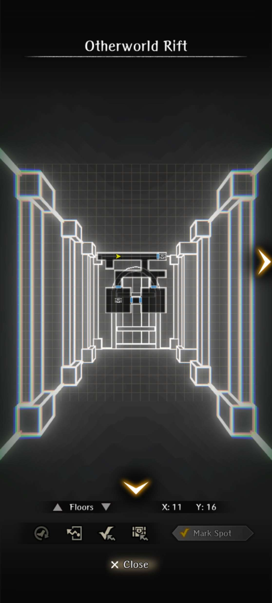

!!! warning "Work In Progress"
    - Ctrl + F5 to refresh for updates 

## Part 1 (Berkanan Route)

The best ending for Part 1 requires three complete runs. Each run is relatively fast if you are strong. Note that you cannot progress to Part 2 of the event without fully completing Part 1. The drop-downs have tabs, so all the information you need for each run is included in one place.

### Guides 

??? note "1st Run"

    === "Guide"
        1. Watch the cutscene in the Event tab (yellow shield in town menu).
        2. Head to the Adventurer's Guild in the Royal Capital and accept the request to save the missing people.
        3. Head to the event location, Sahuagin's Cave, via the Edge of Town in the Royal Capital.
        4. Find 3 people on B1F to save. Their locations are shown on the map.
        5. Find 2 people on B2F to save. They are dead already.
        6. Find an extra burned body on the way to the next floor. It's Iarumas.
        7. Go to the large, southern section of B3F. The Fire Dragon will show up and start throwing fire everywhere (you may lag quite a bit at this part).
        8. Move to the non-red tiles on the minimap ASAP or get killed instantly (do this 3 times).
        9. Return to the Royal Capital, watch the cutscene, accept the Fire Dragon request at the Adventurer's Guild, head to the Tavern, and talk to Iarumas.
        10. Return to B3F, try to fight the dragon again, but you are unable to (this part is important).
        11. Instead, now head to the sahuagin NPC on the minimap and kill them for the Sahuagin's Key.
        12. You can now open previously locked doors. Take the previously locked path on B3F to reach the side of the dragon.
        13. Select the option to have Iarumas serve as a distraction and complete the boss fight (see tab). However, it rages at the end and melts in the magma.
        14. Turn in the request and get basically nothing. Use the Event button, select Cursed Wheel, and rewind time to reset everything.

    === "Red Dragon Boss Fight"

        - The boss fight scales with the MC's adventurer grade. At Steel Grade, the dragon has about 15k HP. On the other hand, Lead Grade is maybe around 5.5k HP. Bronze Grade is around 7.5k HP.
        - It's highly recommended for players Bronze Grade or lower to farm the Dragon Slayer weapon and upgrading it to +10 or so before attempting, as it's extremely strong for that level range.
        - The dragon is susceptible to Paralyze, not Stun. This is most likely to encourage people to use Iarumas's unique skill that paralyzes. Other sources are also more effective than usual but not guaranteed (Mimic Secretion, Thunder Strike, etc).
        - The dragon can be spellbound, but it does not stop its roar or breath. However, it will be more inclined to use basic attacks that can be exploited for openings.
        - Evasion helps mitigate a lot of physical moves the dragon does, but requires a large amount (possibly 200+ for Steel Grade).
        - Water elemental weapons and spells help deal more damage to the dragon. Water armor helps resist the fire breath.
        - Cortu can mitigate some damage from the breath and magic, as Iarumas suggests, but as the dragon can sometimes go twice in a turn with mixed damage, it may not be enough alone.
        - If your team has enough damage, consider using Knight's Defense to mitigate damage if your team's gear is not specced to deal with the dragon specifically
        - It's suggested to have two priests as the dragon can hit the entire team all at once, so having heals for both rows helps a lot.
        - You need a minimum of 43 ASPD to outspeed the dragon at Steel Grade.

??? note "2nd Run"

    === "Guide" 
    
        1. Watch the cutscene of Lulu asking for information about the first run. Select all the options.
        2. For the 2nd run to trigger properly you need to immediately go through the previously locked door on B1F using the Sahuagin's Key. If you save anyone before going through the door, then you will end up on the first run.
        3. Save the 3 people on B1F again. 
        3. Save the 2 people on B2F again, however this run they will be alive since you got there early via the shortcut.
        4. Find Berkanan at the entrance to B3F, grab her body, and head down. If Berkanan's body is not appearing, then you missed saving one of the 5 people. 
        5. Same Fire Dragon event again, just dodge the fire.
        6. Head back to town to resurrect Berkanan. She is quite tall. If Berkanan does not get revived, then it means you exited prematurely and need to return and do the Fire Dragon event first on B3F.
        7. Head to the Adventurers Guild, turn in the request, accept the dragon request, go to the Tavern, and talk to Berkana and Iarumas.
        8. Head to the Blacksmith and accept the request to collect the ore to make a Dragon Slayer sword.
        8. Head to the 3 ore locations on the map (see tabs), which appear as shiny white stars.
        9. Return to the Blacksmith and he will make the Dragon Slayer. Now go back to the 3F side tunnel to fight the Red Dragon. 
        10. The Red Dragon is successfully killed this time, but Berkanan is still burned to death.
        11. Return to town, turn in the request, and use the Event button to rewind time to find a way to save Berkanan from dying.

    === "Ore Locations"
    
        

    === "Red Dragon Boss Fight"

        - The boss fight scales with the MC's adventurer grade. At Steel Grade, the dragon has about 15k HP. On the other hand, Lead Grade is maybe around 5.5k HP. Bronze Grade is around 7.5k HP.
        - It's highly recommended for players Bronze Grade or lower to farm the Dragon Slayer weapon and upgrading it to +10 or so before attempting, as it's extremely strong for that level range.
        - The dragon is susceptible to Paralyze, not Stun. This is most likely to encourage people to use Iarumas's unique skill that paralyzes. Other sources are also more effective than usual but not guaranteed (Mimic Secretion, Thunder Strike, etc).
        - The dragon can be spellbound, but it does not stop its roar or breath. However, it will be more inclined to use basic attacks that can be exploited for openings.
        - Evasion helps mitigate a lot of physical moves the dragon does, but requires a large amount (possibly 200+ for Steel Grade).
        - Water elemental weapons and spells help deal more damage to the dragon. Water armor helps resist the fire breath.
        - Cortu can mitigate some damage from the breath and magic, as Iarumas suggests, but as the dragon can sometimes go twice in a turn with mixed damage, it may not be enough alone.
        - If your team has enough damage, consider using Knight's Defense to mitigate damage if your team's gear is not specced to deal with the dragon specifically
        - It's suggested to have two priests as the dragon can hit the entire team all at once, so having heals for both rows helps a lot.
        - You need a minimum of 43 ASPD to outspeed the dragon at Steel Grade.
    
??? note "3nd Run"

    === "Guide" 
        1. Repeat everything listed in the 2nd run up to the Blacksmith. This time you will ask for a shield as well.
        2. Head to the 3 locations on the map to pick up the ore, along with the one extra location for the shield.
        3. Return to blacksmith for the sword and shield to give to Berkanan.
        4. Defeat the Dragon again and successfully kill without Berkanan dying.
        5. Bid farewell to Berkanan and Iarumas as you can't seem to follow them into the strange dungeon.
        6. Return to town to turn in the request. Listen to Lulu yap about lore.

    === "Ore Locations"
    
        

    === "Red Dragon Boss Fight"

        - The boss fight scales with the MC's adventurer grade. At Steel Grade, the dragon has about 15k HP. On the other hand, Lead Grade is maybe around 5.5k HP. Bronze Grade is around 7.5k HP.
        - It's highly recommended for players Bronze Grade or lower to farm the Dragon Slayer weapon and upgrading it to +10 or so before attempting, as it's extremely strong for that level range.
        - The dragon is susceptible to Paralyze, not Stun. This is most likely to encourage people to use Iarumas's unique skill that paralyzes. Other sources are also more effective than usual but not guaranteed (Mimic Secretion, Thunder Strike, etc).
        - The dragon can be spellbound, but it does not stop its roar or breath. However, it will be more inclined to use basic attacks that can be exploited for openings.
        - Evasion helps mitigate a lot of physical moves the dragon does, but requires a large amount (possibly 200+ for Steel Grade).
        - Water elemental weapons and spells help deal more damage to the dragon. Water armor helps resist the fire breath.
        - Cortu can mitigate some damage from the breath and magic, as Iarumas suggests, but as the dragon can sometimes go twice in a turn with mixed damage, it may not be enough alone.
        - If your team has enough damage, consider using Knight's Defense to mitigate damage if your team's gear is not specced to deal with the dragon specifically
        - It's suggested to have two priests as the dragon can hit the entire team all at once, so having heals for both rows helps a lot.
        - You need a minimum of 43 ASPD to outspeed the dragon at Steel Grade.

### Maps

??? map "Map B1F"
    
    
??? map "Map B2F"
    
    
??? map "Map B3F"
    

## Part 2 (Ainikki Route)

### Guides

!!! warning "To access Part 2 you will need to clear the best ending (3rd Run) of Part 1 (Ainikki Route)."

Part 2 only requires two runs to fully complete. Afterwards, you will gain access to the Blackdragon Superboss fight in the Otherworld side dungeon zone. 

??? note "1st Run"

    === "Guide" 
        1. Head to B1F, take the shortcut door, and save the 3 people like in Part 1.
        2. Upon reaching the stairs to B2F, the screen will glitch and provide 2 door choices. Select the right-hand door (Ainikki). If you select the left-hand door (Berkanan) you will be routed to Part 1. 
        3. B2F will be a completely different map, and various portions of the walls will have a glitched texture. Halfway through the floor, you will encounter a Knight that needs help. Interacting with them will lead to a fight with the Fire Dragon from Part 1. 
        4. Head to the stairs to B3F and find Ainikki's body. Defeat the Sahuagins and pick up her body. Continue to B3F. It is critical that you do not leave at this point or Ainikki will not be revived.
        5. Head to where you previously fought the Red Dragon, but this time there will be a Black Dragon. It will fog up the entire room forcing you to retreat. Head back to the Royal Capital and resurrect Ainikki who will offer to assist at the Temple.
        6. Turn in the original request and pick up the dragon slaying request. Head to the Tavern in the Adventurer's Guild to talk to Iarumas and ask for his help in killing the Black Dragon.
        7. Return to the Black Dragon's chamber on B3F. You will need to navigate nearly blindly unless you have a Ranger to cast Milwa, but it should be somewhat clear to go through the darkness especially if you turn the game's brightness up and possibly your device's screen brightness. If you are having trouble navigating the fog, then see the tabs for step-by-step directions.
        8. The next fight will be a FORCED LOSS. The Black Dragon is unkillable and can instantly kill your entire party with its breath attack (deals extremely high damage). It's recommended to bring as few unit as possible to cut down on revival costs. However, there are 2-3 enemies (unavoidable) in the corridor to the Black Dragon's room, so adjust accordingly based on your team's power level. A unit can survive if Sanctuary's Blessing or Sheli's passive procs, but he will continue to spam the breath attack until everyone is dead.   
        9. You will have to reset the event to get Ainikki's help on the second run.

    === "Black Fog Directions"
    
        - Start on tile (X:13, Y:17) facing the inner chamber.
        - 1 step forward, then turn right
        - 2 forward, then turn left
        - 3 forward, then turn left
        - 4 forward, then turn right
        - 3 forward, then turn right
        - 2 forward, then turn left
        - Walk forward until you encounter the Black Dragon

    === "B3F Map"
    
        
        
        - Use in conjunction with the Black Fog Directions tab.
        
??? note "2nd Run"

    === "Guide"
        1. Save all the civilians on B1F and B2F per usual. 
        2. When you encounter the Knight on B2F you now have the option to help or abandon him. Helping the Knight leads to an ambush fight with the Red Dragon, while abandoning will skip the fight entirely. However, the Red Dragon will now become a wandering mob on the map.
        3. Repeat the same steps as before. Collect Ainikki's body at the stairs to B3F, view the Black Dragon spewing fog scene on B3F, retreat, exit, and Ainikki will be revived at the Temple.
        4. Turn in the request and accept the dragon slaying request again. Head to the Tavern and ask Iarumas for help. Leave the Adventurer's Guild and ask Ainikki for help. This time, Iarumas will ask her to help as well.
        5. Ainikki agrees, but requires equipment to defeat the Black Dragon. Head to the Blacksmith in the Royal Capital to help her craft a Morningstar. You will need several ore on B2F and B3F. Consult the maps listed for locations.
        6. Return to the Blacksmith and he will craft the Morningstar. 
        7. Return to the Black Dragon on B3F. Ainikki will cast Milwa for you when she is in your party to clear the dark fog. See the tab for boss fight details. After the fight is won, Ainikki will slice the head off of the dragon. Iarumas and Ainikki head into the Other World, but you are still unable to follow them. You bid each other farewell.
        8. Head back to the Adventurer's Guild to turn in the request. 

    === "B2F Ore Locations"
        
        
    === "B3F Ore Locations"
        

    === "Black Dragon Boss Fight"
        - The fight is similar to the Fire Dragon, but it has slightly more HP (20k) at Copper Grade.
        - It is Dark element as its color suggests, and is weak to Light. Obviously, its breath is Dark-type damage.
        - The Dark Breath that it uses applies weaken on targets hits.

### Maps

Note that B2F and B3F are different for the Part 2 (Ainikki) route. 

??? map "Map B1F"
    
    
??? map "Map B2F"
    
    
??? map "Map B3F"
    

### Black Dragon Superboss 

!!! warning "Currently, there are many players that cannot access this fight even after clearing the second run. We suspect that there are other requirements, including being Copper Grade and/or A4 progression. It is possible that this fight was not level-scaled or is a bug that is yet to be fixed."

After completing the 2nd Run, you can head back to the chamber in B3F where the Black Dragon used to reside. The screen will glitch upon entering, indicating something has changed. Head to the very back of the chamber, and a path to the side will open into the Other World. Head inside and you'll be placed in an old-school pixelated dungeon where you can pick up two chests and also fight the true version of the Black Draogn.

??? map "Otherworld Rift"
    

??? danger "Black Dragon Superboss Fight"
    

    - Has around 105k-120k HP. Has three actions per turn. Does not have very high Surety Evasion.
    - Has the typical moveset of the Black Dragon such as Roar (stuns), Black Flame Breath (weakens), Claw, Tail Swipe, Morlis, etc.
    - The dragon itself is dark element, and all of its melee attacks are dark element as well. As a result, it's highly recommended to equip various pieces of light armor if possible, along with using Augmented Dragonslayer if suitable.
    - The Bite attack of the Black Dragon can potentially do 4 digit damage.
    - The dragon tends to alternate between using Roar + Breath in one set of 3 actions, and melee attacks + casting magic in another set of 3 actions.
    - The Black Dragon's Balafeos is extremely potent, as it'll drop your physical damage to around 10% of its original damage.
    - The dragon is immune or highly resistant to Chronostasis, but can be Delay Attacked (not always) or Batilgref'd (consistent). It is recommended to try and slow the Dragon down with Batilgref and Scroll of Cascading Slowing.
    - The dragon can be debuffed, but it isn't consistent. It is also possible to apply status effects on this dragon, but it isn't consistent.
    - It is extremely recommended for the player to run a Knight with Knight's Defense, as it will be difficult surviving three turns of damage that easily hits 200-300 damage per action as well as being weakened from the Black Flame Breath.
    - Defeating this dragon may drop a unique Ebonsteel tier 2H Mace called the Black Dragon Warhammer. It has -25 Surety, but has Defense Penetration. This can also drop from the weaker version. In addition, the boss may drop a rare consumable that when used reduces enemy's damage dealt. It's also entirely possible this boss drops nothing.
    - The dragon may also additionally drop a Otherworld Dragon Blood, which is a one-time use consumable that lowers a target's damage dealt by ~10% for 4 turns. This item is somewhat of a rare drop.
    - To reset this boss, you will need to cursed wheel the event entirely.

## Farming

??? note "Overview"

    === "Farming" 
        - The Sahuagin's Cave is a solid farming location no matter where you are in the game. 
        - A1-A3 Players
            - Excellent grinding location for Fey junk that gives a chance at 4* purple gear.
            - Luminaries junk can unlock while still in A3 for farming Silver-tier gear. See next section for specifics.  
        - A4 Players
            - The volume of Fey junk rivals that of Ship 2 farming. It's a solid place to stock up on extract fodder. 
            - If your account needs 4* purple bases for basic gear it is easier to get since A4 is stingy with access to Fey junk. 
            - If you have an OP account, then you are better off going back to farming Alabaster Wolf Den, Island of the Wailing Oni, and A4 Routes 10-11 for the current best-in-slot gear.  
            
    === "Currency"
        - As the event is limited the average currency per chest is higher than average, which makes it easier to clear the shop for everything but the unique gear.
        - Average currency per chest is 100-200 on B1F and B2f with an elevated rate of 200-250 on B3F.
        - There does not appear to be any differences in currency drop rates between Parts 1 (Berkanan Route) and 2 (Ainikki Route). 

    === "Junk" 
        - There are 8 tiers of junk that unlock based on a combination of MC Grade and Abyss progression. Other factors that might play a role are currently being tested. 
        - Each tier of junk comes in Basic, Common, and Fey versions. Fey junk is the only type with a chance at 4* purple gear. 
        - Junk Pool
            - Weapons: 1H and 2H swords, 1H rods, 2H staffs.
            - Armor: Cloth and light armor for the head, hand, and feet. No heavy armor. 
            - Accessories: Basic ring versions.
            - Unique gear: The Saber is included as a potential drop in all tiers of junk at an increasing rate. The Trollkin Ring and Dragon Slayer must be purchased from the shop.   
        - Luminaries junk (highest tier) is Silver-only and includes all 3 versions of the enhanced unique gear. 
        - Treasure is, unfortunately, only Azure.

??? note "Optimal Farming Routes" 

    === "Notes"
    
        - It is not recommended to reset the entire event or wheel-in-place to reset the fixed chests on each floor. The additional time required wheeling, random chest placement, and excessive walking reduces the overall efficiency for both currency and junk. 
        - B1F is the least efficient due to fewer respawning chests versus B2F and higher mob density. 
        - B3F is the most efficient, see tab for details. 
    
    === "B3F (Ainikki Route)"
    
        - Routing: Select B2F, grab nearby chests, go to B3F, kill all the enemies, exit, and repeat until you need to recover at the Inn.
        - Most efficient route for currency and Luminaries Fey junk (9.17% versus 5.3% for B1F and B2F). It is superior to farming B1F and/or B2F due to its small size, fixed mob density, easy enemies, and higher rates of both currency and Fey Luminaries junk. 
        - Minimum of 9 enemies per run, but up to 11.  
        - Enemy chest drop rate is ~50% or 4.5-5 chests, on average, per run. 
        - Roughly ~1,000 currency per run. 
        - Clear times will depend on your account's strength, but end game users have reported 4-6 minutes per run.
        - Requires no Cursed Wheeling or resets. 
        - See next tab for the auto-pathing map. 
    
    === "B3F (Ainikki Route) Auto-Path Map"
    
        
    
        - Routing path consistently gets all enemies 95% of the time unless one gets stuck in a corner. 
        - Easy to tweak as needed if you are encountering too many ambushes.  
        - Once you are at the final checkmark (far left) you will need to auto-exit to ensure you take the northern path back to the exit. 
    
    === "B3F (Berkanan Route)"
    
        - If you cannot defeat the Red Dragon (Berkanan Route) to progress to Part 2, then the best farming spot will still be B3F. 
        - The B3F Part 1 map is smaller and only includes 5 enemy encounters. Fewer enemies can be a positive if you are using all of your MP/SP to complete a single run since you may encounter a Scorpion Lady or Minotaur, which are tougher enemies.  
    
    === "Data Testing"
    
        - The majority of the data testing comes from our Discord members @slimwaldi, @liezeith, and @genosis who have collectively spent dozens of hours farming, tracking, and sharing their data. 
        - Data covers roughly 8,000 junk collected across all 3 floors with and without wheeling-in-place to reset the fixed chests on each floor. 
        - If you are interested in learning more about the methodology please see the #B&B Event Farming Data channel.
        - Any major corrections or new findings please contact @lightbearer or post in the Discord channel above. 

## Unlocking Junk Tiers

!!! warning "Will be posted in the next 24 hours as of 2/27." 

## Exchange Shop 

??? note "Overview"

    - Accessed via the Jeweler- Exchange under the Otherworld Adventurers II tab. The shop currency is called "Strange Angular Ore" and only available in the Sahuagin's Cave.
    - A limited number of items (denoted by a *) refresh every Thursday at 0:00 JST through 3/25. 
    - Refreshed items are missable with a 7-day countdown. They have been added as separate item entry in the shop. T

??? note "What Should I Buy?"

    === "Priority Items"
    
        - The most important items to purchase first are the two sets of codex books for a total cost of 32,500. The provide a total of 325 EXP that can be used to upgrade any passive, skill, or spell in the game. They are critical for long-term account progression. 
        - The Adventurer's Remains I and II and Gem of Org x200 should be picked up next. Note: An additional 3 Adventurer's Remains of each type are added as part of the weekly refresh. 
        - Cones and Macones can be helpful for your MC, Iaramus, or your primary spellcaster. The only way to upgrade Halito is via the Jewler (Limited Time Offer - Daily) with purple gems. Mahalito is only from Asha's alternative style banner. The total cost for all the spell books is 30,000. 
        - The total cost of all the basic items (Azure Ore, Enhancement Ores, EXP books) is 7,880. The Enhancement Ores and EXP books are refreshed on a weekly basis.  

    === "Unique Gear Considerations"

        - The major determining factor is where you are in the game. 
        - If you are still in Abyss 1-3, then the enhanced versions are worth picking up as a "bridging" weapon to A4. 
        - If you have cleared GWO 4-4 and plan to fight the Black Dragon superboss, then the Augmented Dragon Swords are recommended for both damage mitigation and higher DPS.  
        - The Saber is a Katana, so only relevant if you have a Samurai or plan to run one or more in the future.
        - The Trollkin Ring can be used with Shiou's Lingering Blossom to use the skill multiple times in a row as it cannot be used if she is at 1 HP. 

    === "Weekly Refresh Costs" 

        - For the Adventurer's Remains I and II the total cost is 4,800 for both sets of 3. 
        - For the Basic Items (Enhancement Ore, EXP books) the total cost is 2,265.
        - If you plan to clear the shop weekly, then the total cost is 7,065.

??? note "Shop List"

    === "Unique Gear" 
    
        | Item | Cost | # Copies | Total Cost |
        |:-----|----:|--------:|-------------------:|
        | Dragon Slayer           | 7,000   | 1   | 8,000  |  
        | Dragon Slayer           | 12,000  | 3   | 36,000 | 
        | Augmented Dragon Slayer | 24,000  | 99  | -      | 
        | Saber                   | 5,000   | 3   | 15,000 |  
        | Refined Saber           | 30,000  | 99  | -      | 
        | Trollkin Ring           | 10,000  | 3   | 30,000 |  
        | Exquisite Trollkin Ring | 20,000  | 99  | -      | 
        
        ??? warning "Unique Gear Base Stats"
            
            
            

    === "Priority Items"
    
        | Item | Cost | # Copies | Total Cost |
        |:-----|----:|--------:|-------------------:|
        | Codex of Learning               | 2,500   | 5 | 12,500 |  
        | Intermediate Codex of Learning  | 10,000  | 2 | 20,000 | 
        | Book of Halito Secrets          | 5,000   | 1 | 5,000  |  
        | Book of Mahalito Secrets        | 10,000  | 1 | 10,000 | 
        | Book of Cones Secrets           | 5,000   | 1 | 5,000  |  
        | Book of Macones Secrets         | 10,000  | 1 | 10,000 | 
        | Adventure's Remains I           | 800     | 3 | 2,400  |  
        | Adventure's Remains I*          | 800     | 3 | 2,400  |  
        | Adventure's Remains II          | 800     | 3 | 2,400  |  
        | Adventure's Remains II*         | 800     | 3 | 2,400  |  
        | Gem of Org x200                 | 1,500   | 1 | 1,500  |  
        | Total Cost of non-refreshing    |         |   | 68,800 |  
        | Total Cost of weekly refreshing |         |   | 4,800  |  
        
        * Refreshed weekly every Thursday at 0:00 JST, available for 7 days and missable

    === "Basic Items"
    
        | Item | Cost | # Copies | Total Cost |
        |:-----|----:|--------:|-------------------:|
        | Azure Lustrous Ore              | 100   | 1 | 100   |  
        | Azure Lustrous Ore x10          | 1,000 | 1 | 1,000 |  
        | Azure Lustrous Ore x20          | 2,000 | 1 | 2,000 |  
        | Fine Grade Ore                  | 200   | 5 | 1,000 |  
        | Fine Grade Ore*                 | 200   | 5 | 1,000 |  
        | High Grade Ore                  | 100   | 5 | 500   |  
        | High Grade Ore*                 | 100   | 5 | 500   |  
        | Mid Grade Ore                   | 75    | 5 | 375   |  
        | Mid Grade Ore*                  | 75    | 5 | 375   |  
        | Low Grade Ore                   | 50    | 5 | 125   |  
        | Low Grade Ore*                  | 50    | 5 | 125   |  
        | Clock Tome of the Finesser      | 50    | 5 | 250   |  
        | Clock Tome of the Finesser*     | 50    | 5 | 250   |  
        | Clock Tome Volume               | 3     | 5 | 15    |  
        | Clock Tome Volume*              | 3     | 5 | 15    |  
        | Total Cost of non-refreshing    |       |   | 5,365 |  
        | Total Cost of refreshing        |       |   | 2,265 |  
        
        * Refreshed weekly every Thursday at 0:00 JST, available for 7 days and missable
