!!! warning "Work In Progress"
    - Ctrl + F5 to refresh for updates 

!!! tip "Before You Begin" 

    === "Basics" 
    
        - Enemies level with MC's Grade. Avoid doing the dragon boss fights after a recent promotion due to the increase in HP and difficulty. 
        - The drop-downs have tabs. Each run includes a complete guide, maps, ore locations, and boss strategies.
        - There are dedicated sections for farming, junk tiers, and the Exchange Shop that covers buying priorities and recommendations. 
    
    === "Event Reset" 
    
        - There is a dedicated event reset button. It is a yellow shield icon that says "EVENT". This is the button to  use to access the next Run. 
        - The term "wheel-in-place" or "Cursed Wheel x2" refers to leaping to your current Cursed Wheel node again. This is for farming purposes to reset the floor chests.  
        - The Event button must be used if you are checking to see if a new junk tier has been unlocked. 
    
## Part 1 (Berkanan Route)

This is the same exact event than ran last year with no known changes to its requirements or structure.

- Part 1 requires 3 complete runs. Part 2 is not unlocked until Part 1 is fully completed.
- If you completed Part 1 last year you will have immediate access to Part 2. 

### Guides 

??? note "1st Run"

    === "Guide"
    
        1. Select the Event button (yellow shield in town menu) and Watch the introductory cutscene. 
        2. Head to the Royal Capital Guild > Featured tab and accept Retrieval of Abuducted People request. 
        3. Go to the Edge of Town in the Royal Capital to access the event dungeon, Sahuagin's Cave. 
        4. Find 3 people on B1F to save. Their locations are shown on the map.
        5. Find 2 people on B2F to save. They are both dead.
        6. At the end of B2F you will see a burned body. It is Iarumas. Head down to B3F. 
        7. Go to the large, southern area of B3F. The Fire Dragon will appear and start breathing fire everywhere. Tthe game may lag at this point depending on your device.
        8. You must quickly reach the non-red tiles on the mini-map otherwise you will be killed instantly (do this 3 times). You have a few seconds to reach each one. It is not as stressful as it sounds. 
        9. Return to the Royal Capital and watch the cutscene. Next, head to the Guild, turn in the abducted people request, and accept the new Slay the Fire Dragon request. 
        10. Go to the Tavern and talk to Iarumas.
        11. Return to B3F, try to fight the Red Dragon again, but you are unable to (viewing this scene is required to trigger the next step).
        12. Head to the sahuagin NPC on the minimap and kill them for the Sahuagin's Key.
        13. You can now open all the locked doors. Take the previously locked path on B3F to reach the side of the Red Dragon.
        13. Select the option to have Iarumas serve as a distraction and kill the Red Dragon. However, it rages at the end and melts into the magma.
        14. Return to the Guild and turn in the request. The 1st Run is now complete. To reset use the Event button (yellow shield icon), select Cursed Wheel, and rewind time to begin your 2nd Run.

    === "B1F" 
        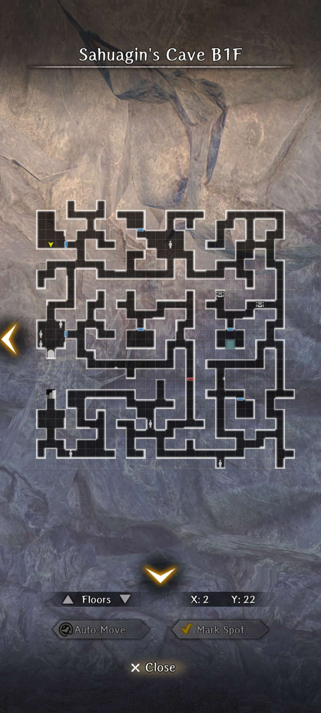

    === "B2F" 
        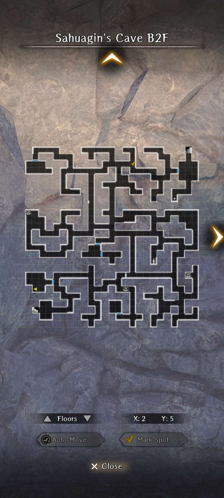

    === "B3F" 
        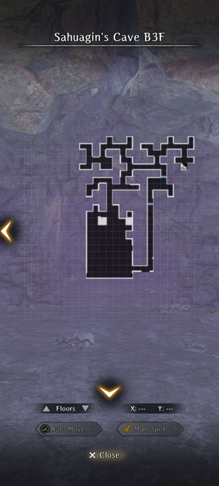

    === "Red Dragon Boss Fight"

        - The boss fight scales with the MC's Grade. 
            - Steel and Iron = 15K HP (Steel may be slightly higher, under verification)
            - Bronze = 7.5K HP
            - Lead = 5.5K HP
            - No Grade = ?
        - It's highly recommended for players Bronze Grade or lower to farm the Dragon Slayer weapon and upgrading it to +10 or so before attempting, as it's extremely strong for that level range.
        - The dragon is susceptible to Paralyze, not Stun. This is most likely to encourage people to use Iarumas's unique skill that paralyzes. Other sources are also more effective than usual but not guaranteed (Mimic Secretion, Thunder Strike, etc).
        - The dragon can be spellbound, but it does not stop its roar or breath. However, it will be more inclined to use basic attacks that can be exploited for openings.
        - Evasion helps mitigate a lot of physical moves the dragon does, but requires a large amount (possibly 200+ for Steel Grade).
        - Water elemental weapons and spells help deal more damage to the dragon. Water armor helps resist the fire breath.
        - Cortu can mitigate some damage from the breath and magic, as Iarumas suggests, but as the dragon can sometimes go twice in a turn with mixed damage, it may not be enough alone.
        - If your team has enough damage, consider using Knight's Defense to mitigate damage if your team's gear is not specced to deal with the dragon specifically
        - It's suggested to have two priests as the dragon can hit the entire team all at once, so having heals for both rows helps a lot.
        - You need a minimum of 43 ASPD to outspeed the dragon at Steel Grade.

??? note "2nd Run"

    === "Guide" 
    
        1. Watch the cutscene of Lulu asking for information about the first run. Select all the options.
        2. For the 2nd run to trigger properly you need to immediately go through the previously locked door on B1F using the Sahuagin's Key. If you save anyone before going through the door, then you will end up on the first run.
        3. Save the 3 people on B1F again. 
        3. Save the 2 people on B2F again, however this run they will be alive since you got there early via the shortcut.
        4. Find Berkanan at the entrance to B3F, grab her body, and head down. If Berkanan's body is not appearing, then you missed saving one of the 5 people. 
        5. Same Fire Dragon event again, just dodge the fire.
        6. Head back to town to resurrect Berkanan. She is quite tall. If Berkanan does not get revived, then it means you exited prematurely and need to return and do the Fire Dragon event first on B3F.
        7. Head to the Adventurers Guild, turn in the request, accept the dragon request, go to the Tavern, and talk to Berkana and Iarumas.
        8. Head to the Blacksmith and accept the request to collect the ore to make a Dragon Slayer sword.
        8. Head to the 3 ore locations on the map (see tabs), which appear as shiny white stars.
        9. Return to the Blacksmith and he will make the Dragon Slayer. Now go back to the 3F side tunnel to fight the Red Dragon. 
        10. The Red Dragon is successfully killed this time, but Berkanan is still burned to death.
        11. Return to town, turn in the request, and use the Event button to rewind time to find a way to save Berkanan from dying.

    === "B1F" 
        

    === "B2F" 
        

    === "B3F" 
        
        
    === "Ore Locations"
        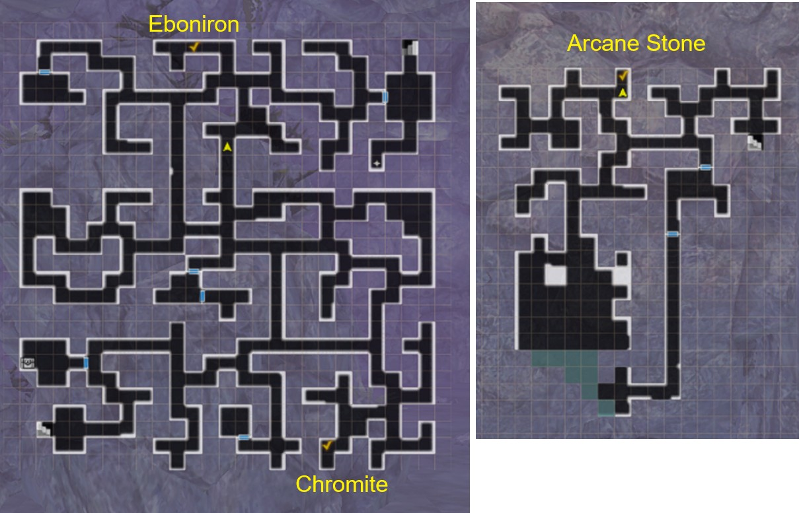

    === "Red Dragon Boss Fight"

        - The boss fight scales with the MC's Grade. 
            - Steel and Iron = 15K HP (Steel may be slightly higher, under verification)
            - Bronze = 7.5K HP
            - Lead = 5.5K HP
            - No Grade = ?
        - It's highly recommended for players Bronze Grade or lower to farm the Dragon Slayer weapon and upgrading it to +10 or so before attempting, as it's extremely strong for that level range.
        - The dragon is susceptible to Paralyze, not Stun. This is most likely to encourage people to use Iarumas's unique skill that paralyzes. Other sources are also more effective than usual but not guaranteed (Mimic Secretion, Thunder Strike, etc).
        - The dragon can be spellbound, but it does not stop its roar or breath. However, it will be more inclined to use basic attacks that can be exploited for openings.
        - Evasion helps mitigate a lot of physical moves the dragon does, but requires a large amount (possibly 200+ for Steel Grade).
        - Water elemental weapons and spells help deal more damage to the dragon. Water armor helps resist the fire breath.
        - Cortu can mitigate some damage from the breath and magic, as Iarumas suggests, but as the dragon can sometimes go twice in a turn with mixed damage, it may not be enough alone.
        - If your team has enough damage, consider using Knight's Defense to mitigate damage if your team's gear is not specced to deal with the dragon specifically
        - It's suggested to have two priests as the dragon can hit the entire team all at once, so having heals for both rows helps a lot.
        - You need a minimum of 43 ASPD to outspeed the dragon at Steel Grade.
    
??? note "3nd Run"

    === "Guide" 
        1. Repeat everything listed in the 2nd run up to the Blacksmith. This time you will ask for a shield as well.
        2. Head to the 3 locations on the map to pick up the ore, along with the one extra location for the shield.
        3. Return to blacksmith for the sword and shield to give to Berkanan.
        4. Defeat the Dragon again and successfully kill without Berkanan dying.
        5. Bid farewell to Berkanan and Iarumas as you can't seem to follow them into the strange dungeon.
        6. Return to town to turn in the request. Listen to Lulu yap about lore.

    === "B1F" 
        

    === "B2F" 
        

    === "B3F" 
        

    === "Ore Locations"
    
        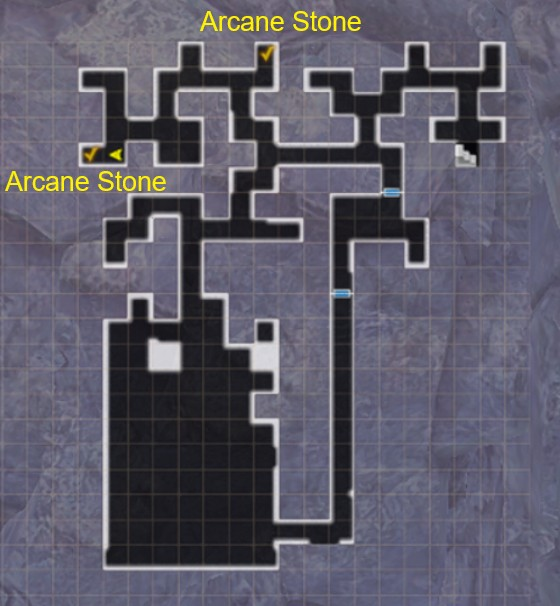

    === "Red Dragon Boss Fight"

        - The boss fight scales with the MC's Grade. 
            - Steel and Iron = 15K HP (Steel may be slightly higher, under verification)
            - Bronze = 7.5K HP
            - Lead = 5.5K HP
            - No Grade = ?
        - It's highly recommended for players Bronze Grade or lower to farm the Dragon Slayer weapon and upgrading it to +10 or so before attempting, as it's extremely strong for that level range.
        - The dragon is susceptible to Paralyze, not Stun. This is most likely to encourage people to use Iarumas's unique skill that paralyzes. Other sources are also more effective than usual but not guaranteed (Mimic Secretion, Thunder Strike, etc).
        - The dragon can be spellbound, but it does not stop its roar or breath. However, it will be more inclined to use basic attacks that can be exploited for openings.
        - Evasion helps mitigate a lot of physical moves the dragon does, but requires a large amount (possibly 200+ for Steel Grade).
        - Water elemental weapons and spells help deal more damage to the dragon. Water armor helps resist the fire breath.
        - Cortu can mitigate some damage from the breath and magic, as Iarumas suggests, but as the dragon can sometimes go twice in a turn with mixed damage, it may not be enough alone.
        - If your team has enough damage, consider using Knight's Defense to mitigate damage if your team's gear is not specced to deal with the dragon specifically
        - It's suggested to have two priests as the dragon can hit the entire team all at once, so having heals for both rows helps a lot.
        - You need a minimum of 43 ASPD to outspeed the dragon at Steel Grade.

## Part 2 (Ainikki Route)

### Guides

!!! warning "To access Part 2 you will need to clear the best ending (3rd Run) of Part 1 (Berkanan Route)."

Part 2 only requires two runs to fully complete. Afterwards, you will gain access to the Blackdragon Superboss fight in the Otherworld side dungeon zone. 

??? note "1st Run"

    === "Guide" 
    
        1. Head to B1F, take the shortcut door, and save the 3 people like in Part 1.
        2. Upon reaching the stairs to B2F, the screen will glitch and provide 2 door choices. Select the right-hand door (Ainikki). If you select the left-hand door (Berkanan) you will be routed to Part 1. 
        3. B2F will be a completely different map and portions of the walls will have a glitched texture. Halfway through the floor, you will encounter a Knight that needs help. Interacting with them will lead to a fight with the Fire Dragon from Part 1. 
        4. Head to the stairs to B3F and find Ainikki's body. Defeat the Sahuagins and pick up her body. Continue to B3F. It is critical that you do not leave at this point or Ainikki will not be revived.
        5. Head to where you previously fought the Red Dragon, but this time there will be a Black Dragon. It will fog up the entire room forcing you to retreat. Head back to the Royal Capital and resurrect Ainikki who will offer to assist at the Temple.
        6. Turn in the abducted people request and accept the Slay the Fire Dragon request. Head to the Tavern, talk to Iarumas, and ask for his help in killing the Black Dragon.
        7. [Warning! Forced Loss Ahead] Return to the Black Dragon's chamber on B3F. You will need to navigate the black fog to reach the boss fight. If you bump into the wall 3 times, then you will be instantly killed. 
            - You can bring a Ranger with Milwa to improve visibility. 
            - There are white glowing interactable on the floor that serve as guide points that signal when you you need to turn. 
            - If you are on PC you can increase the game's brightness settings.
            - Mobile players may not be able to see _anything_ even with device and in-game brightness settings set to max. There are step-by-step directions in the B3F map tab.
        8. The next fight will be a FORCED LOSS. The Black Dragon is unkillable and can instantly kill your entire party with its breath attack (deals extremely high damage). It's recommended to bring as few unit as possible to cut down on revival costs. However, there are 2-3 enemies (unavoidable) in the corridor to the Black Dragon's room, so adjust accordingly based on your team's power level. A unit can survive if Sanctuary's Blessing or Sheli's passive procs, but he will continue to spam the breath attack until everyone is dead.   
        9. You will have to reset using the Event button (yellow shield icon) to get Ainikki's help on the 2nd Run. 

    === "B1F"
        
        
    === "B2F"
        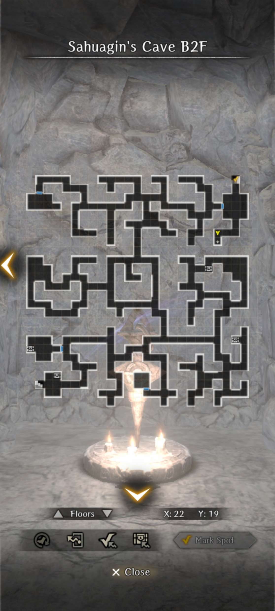

    === "B3F + Black Fog Directions"

        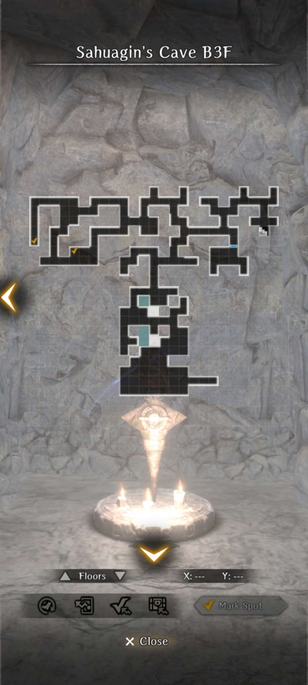
        
        - Start on tile (X:13, Y:17) facing the inner chamber.
        - 1 step forward, then turn right
        - 2 forward, then turn left
        - 3 forward, then turn left
        - 4 forward, then turn right
        - 3 forward, then turn right
        - 2 forward, then turn left
        - Walk forward until you encounter the Black Dragon

??? note "2nd Run"

    === "Guide"
        1. Go to the Guild, accept the abducted people request, and save all of them on B1F and B2F per usual. 
        2. When you encounter the Knight on B2F you will now have the option to help or abandon him. Helping the Knight leads to an ambush fight with the Red Dragon, while abandoning will skip the fight entirely. However, the Red Dragon will now become a wandering mob on the map. Note: Some users have reported the MC's alignment shifting toward Evil if you opt to abandom him, but this has not been verified.
        3. Collect Ainikki's body in front of the stairs to B3F, view the Black Dragon spewing fog scene on B3F, retreat, exit, and Ainikki will be automatically revived at the Temple.
        4. Turn in the request and accept the Slay the Fire Dragon request. Head to the Tavern and ask Iarumas for help. Leave the Guild and an automatic cutscene will start where you can ask Ainikki for help. This time, Iarumas will ask her to help as well.
        5. Ainikki agrees, but requires equipment to defeat the Black Dragon. Head to the Blacksmith to help her craft a Morningstar. You will need several ore on B2F and B3F. See map tabs for locations.
        6. Return to the Blacksmith and he will craft the Morningstar. 
        7. Return to the Black Dragon on B3F. Ainikki will cast Milwa for you when she is in your party to clear the dark fog. Kill the Black Dragon. It will attempt one final attack but Ainikki will cut off its head. Iarumas and Ainikki head into the Otherworld, but you are still unable to follow them. You bid each other farewell.
        8. Return to the Guild to turn in the request. 

    === "B1F"
        
        
    === "B2F + Ore Locations"
        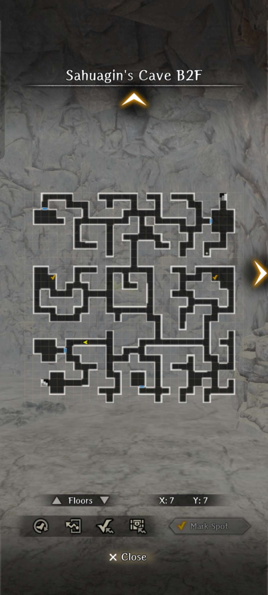
        
    === "B3F + Ore Locations"
        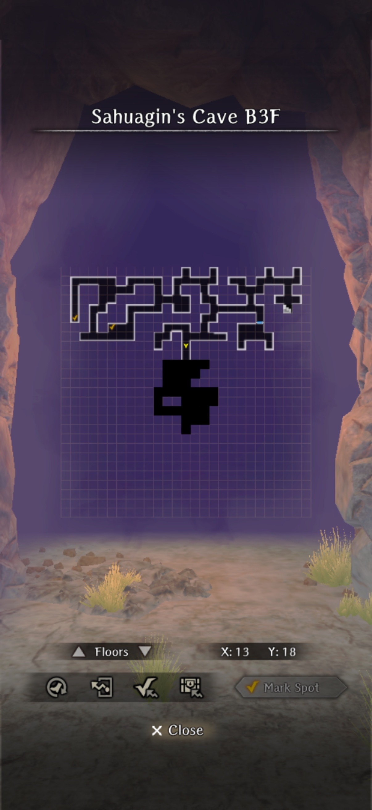

    === "Black Dragon Boss Fight"
        - The fight is similar to the Fire Dragon, but it has slightly more HP (20k) at Copper Grade.
        - It is Dark element as its color suggests, and is weak to Light. Obviously, its breath is Dark-type damage.
        - The Dark Breath that it uses applies weaken on targets hits.

### Black Dragon Superboss 

!!! warning "Potential Bug" 
    - There are many players that cannot access this fight even after clearing the second run. We have a confirmed Discord member at Bronze Grade (level 40) that has been able to enter the Otherworld Rift and encounter the superboss. 
    - It is unclear if this is a bug or there are additional requirements that have yet to be identified. 

??? note "How to Enter the Otherworld Rift"

    === "Guide" 

        - After completing Ainikki's 2nd Run return to the Black Dragon's chamber in B3F. The screen will glitch upon entering, indicating something has changed. Note that speaking with the dwarf in the Tavern is not a required step.
        - Head south to the very end of the chamber where you said goodbye to Ainikki and Iarumas. A path to the side in the far south-east corner is the entry point to the Otherworld Rift. 
        - Head inside and you will be placed in an old-school pixelated dungeon where you can pick up 2 chests. The Black Dragon Superboss is located in the SE room. You cannot miss him. His field map enemy icon takes up the entire room. 

    === "Map Otherworld Rift" 
    
        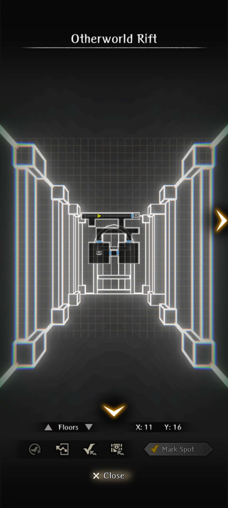

??? danger "Black Dragon Superboss Fight"

    === "Stats"

        - Type: Dark 
        - Race: Dragon 
        - HP: 105-120K 
        - 3 actions per turn. 
        - High ASPD 
            - Need 93 ASPD to act before it moves. Ideally, your entire team should be above 100+ ASPD.
            - At roughly 50% HP he will gain an ASPD boost that is not shown and has the potential to start lapping your units. 
            - Similar to the Sealed Greater Demon its HP and ASPD are RNG-based within a certain band. It is possible to get a "high" HP and/or ASPD version of the fight.
        - Low SUR EVA. Possible to get SUR attacks on a regular basis. 
        - Immune to Openings. 
        - Immune to Montino. Debuff and status effect applications do not consistently land aside from Batilgref. 
        - Immune to Delay Attack. 
        - Highly resistant to Chrono 1-2. 
            - It still works even if you do not see the pop-up message, but the effect is weaker. 
            - Stronger with a multi-hit weapon like Cuisinart (3x), Raven Dagger (3x), or Ice Axe (x4) since it seems it apply the effect per attack.    

    === "Moveset"

        - Unique 
            - Roar: Party-wide attack that can stun. 
            - Black Flame Breath (BFB): Causes Weaken, which reduces MAX HP by 10% and can stack up to 30%. It can only be removed by dying. 
        - Physical
            - All its physical attacks are Dark Type (element). 
            - Bite: Extremely high damage (up to 4-digits) ST attack. 
            - Tail: Medium damage row attack.
            - Claw: Low damage ST attack that can cause Bleed that causes damage each time a unit takes an action. 
            - Basic attack: Very low damage ST attack. 
        - Magical 
            - Can cast any elemental MA spell aside from Mabadios and Maforos. Mazelos is used the most frequently. 
            - Can cast any debuff in the game (Balafeos, Batilgref, Dilto, Morlis, and Nofis). Batilgref (ASPD down) is the most dangerous and Balafeos (ATK down) is the most annoying if it cannot be removed before your DPS acts. To remove debuffs use Abit 1-2. There is no shop item.  
        - One-time Speed Boost
            - Triggers at roughly 50% HP. 
            - It is not linked to a specific skill and there is no pop-up to indicate that its ASPD has changed. 

    === "Attack Pattern"

        - Follows a strict pattern until it is at low health (15-20% HP). The pattern is as follows (Unique > Physical > Magical > Unique):
            - Unique Phase
                - Roar
                - BFB
                - ST physical attack (Claw or basic attack)
            - Physical Phase
                - Bite
                - Tail
                - ST physical attack (Claw or basic attack) 
            - Magical Phase
                - 2x MA spell on either row (RNG-based). If it uses a Type advantage MA spell on your backrow it is likely one or more units will die if it targes the same row again. 
                - Debuff spell on a row. These need to be removed immediately. They are extremely powerful and reduce the stat by roughly 90%. 
            - Low HP Trigger
                - At low HP it will use Roar, BFB, or Bite for its third action during _any_ phase. 
                - At this point the fight becomes a DPS race. Multiple Roars or BFBs in a row with Weaken stacked can wipe out your entire team even with Knight's Defense and other buffs up. 

    === "Preparation"

        === "Gear"
        
            - Dark Resistance 
                - 2x Light Gear (Heady, Body, Accessory) is mandatory on everyone. Each piece of Light gear reduces damage from all sources by roughly ~15% and can be stacked up to ~45% with a full set. 
                - Light gear can be farmed from the Cave of Separation or Den of Light (dungeon or dispatch). 
                - Perfect gear is not required. We recommend that you enhance the gear to +5-10, if possible, and alter ASPD.
                - For end game players with +15-20 pieces your Morgus loadout will work well for this fight.  
                - Depending on your account and a unit's HP you can add or remove a piece of Light gear, but 2x for your first fight can give you a good baseline.  
            - Dragon Resistance 
                - Augmented Dragon Sword on the entire front line provides an additional 15% damage reduction. 
                - For spenders the Large Bag and Challenger's Training Garb from the "Those Who Came from Beyond" banner both provide Dragon Resistance. 
                - Note: The Trollkin Ring _increases_ damage done to Dragons, but does _not_ reduce damage from their attacks. 
            - ASPD
                - Having all units above 100+ ASPD is borderline mandatory for this fight. 
                - 3x ASPD Boots and Body pieces are the easiest to build. Note that if you use a 3X ASPD Body piece, then you are locked into use use a Light Head and/or Accessory. Boots have no conflicts with damage reduction gear. 
                - Mage/Priest can use a 1H Staff and Shield to maximize their ASPD. 
            - Other
                - Putting a 2H staff in the inventory of anyone that can cast Madios will be helpful for an emergency Madios.  
                - If using MC Chrono (highly recommended), then make sure you bring a multi-hit weapon. The A4 Item Shop sells the Ice Axe (4x hits) for 55,000 gold.  
        === "Items"
        
            - Amulet Shard
                - Purchased from the Exchange Shop for 1,000 currency. Makes the fight significantly easier for F2P as its 25-30% damage reduction from all sources and lasts the entire battle. 
                - May want to bring more than one in case the debuff gets knocked off.  
            - SP pots 
                - Maintain Knight's Defense, refresh MC if using Chrono 2, or top-off any unit that is running low.
                - There are 6 SP pots that you can farm faily from A1 and A3. See Respawning Tracker for details. 
            - MP pots (optional)
            - 1x Sacred Tree Sap (600 HP) for emergency healing on everyone.
            - 1x Batilgref scrolls on every unit and multiple (3-5x) copies on your Mage/Priests.
            - Other buff scrolls for Macaldia, Porto, Cortu, Makalatu, etc. depending on your personal play style.  
            - 1x Bell of Vigor on anyone that cannot cast Dialko to remove Stun. 
        
        === "Bondmates"
        
            - Level 4-5 SPD bondmates on everyone if possible. 
            - Story bondmate Ugo (A2) provides ASPD. 
            - Story bondmates Harry (A1) and Liam (A3) both provide Stun Tolerance. 
            - DIV bondmates (Ira, Melgina, Iris, and William) can help your Mage/Priest hit 300 DIV with a 1H Staff and Shield.  
    
    === "Strategy"

        - It is extremely recommended for the player to run a Knight with Knight's Defense, as it will be difficult surviving three turns of damage that easily hits 200-300 damage per action as well as being weakened from the Black Flame Breath.
        - The dragon is immune or highly resistant to Chronostasis, but can be Delay Attacked (not always) or Batilgref'd (consistent). It is recommended to try and slow the Dragon down with Batilgref and Scroll of Cascading Slowing.
        - Forthcoming. 

    === "Other"

        - Unique Drops 
            - Otherworld Dragon Blood, which is a one-time consumable that lower's a target's damage by ~10% for 4 turns. Drop rate seems to be about 20-25%. 
            - Ebonsteel tier 2H Mace (Black Dragon Warhammer). It has -25 Surety, but comes with Defense Penetration. Can also drop from the normal Black Dragon (~6-7% drop rate).  
        - How to Reset
            - To reset the fight you need to use the "Event" button (yellow shield icon) and re-do Ainkki's Second Run including the Ore Collection fetch quest. 
            - Cursed Wheeling from the Ruins does not work, but it will reset the 2 chests. 
        - Requires 5 fights for max Compendium pips and 3D viewer. 

    === "Handsome Boi"

        

        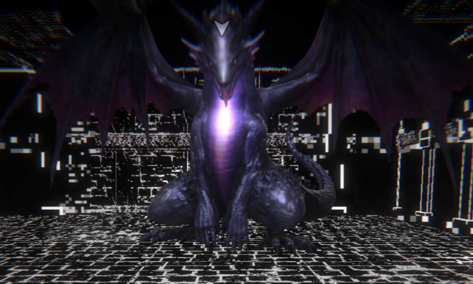
        

## Farming

??? note "Overview"

    === "Farming" 
        - The Sahuagin's Cave is a solid farming location no matter where you are in the game. 
        - A1-A3 Players
            - Excellent grinding location for Fey junk that gives a chance at 4* purple gear.
            - Seven Luminaries junk can unlock while still in A3 for farming Silver-tier gear. See next section for specifics.  
        - A4 Players
            - The volume of Fey junk rivals that of Ship 2 farming. It's a solid place to stock up on 3* and 4* extract fodder. 
            - If your account needs 4* Purple bases for basic Silver-tier Cloth or Light Armor, or 2H Staffs of Splendor it is easier to get since A4 is stingy with access to Fey junk. 
            - If you have an OP account, then you are better off going back to farming Alabaster Wolf Den, Island of the Wailing Oni, and A4 Routes 10-11 for the current best-in-slot gear. The return on your time is going to be low and you can pick up 4* extra  
            
    === "Currency"
        - As the event is limited the average currency per chest is higher than average, which makes it easier to clear the shop for everything but the unique gear.
        - Average currency per chest is 100-200 on B1F and B2f with an elevated rate of 200-250 on B3F.
        - There does not appear to be any differences in currency drop rates between Parts 1 (Berkanan Route) and 2 (Ainikki Route). 

    === "Junk" 
        - There are 9 tiers of junk that unlock based on a combination of MC Grade, Abyss progression, and reputation level (from Guild requests). Other factors that might play a role are currently being tested. 
        - Each tier of junk comes in Basic, Common, and Fey versions. Fey junk is the only type with a chance at 4* purple gear. 
        - Junk Pool
            - The total junk pool is very limited. 
            - Weapons: 1H and 2H swords, 1H rods, 2H staffs.
            - Armor: Cloth and light armor for the head, hand, and feet. No heavy armor. 
            - Accessories: Basic ring versions.
            - Unique gear: The Saber is included as a potential drop in all tiers of junk at an increasing rate. The Trollkin Ring and Dragon Slayer must be purchased from the shop.   
        - Seven Luminaries junk (highest tier) is Silver-only and includes all 3 versions of the enhanced unique gear. 
        - Treasure is, unfortunately, only Azure.

    === "Saber Drop %"
    
        | Tier | Junk Name | Saber Drop % | Notes | 
        |:--|:--------------|:-----|:--------|
        | 1 | Junk          | 0.1% | 1 in 1,000 chance |     
        | 2 | Teal          | -    |  |    
        | 3 | Sliver        | 0.5% | 1 in 200 chance |   
        | 4 | Seedling      | 0.5% | 1 in 200 chance |    
        | 5 | Three-Color   | 2.5% |  |    
        | 6 | Four Scales   | 5.0% |  |    
        | 7 | Five Blossoms | 5.5% |  |    
        | 8 | Six Energies  | 6.0% |  |    
        | 9 | Luminaries*   | 5.8% | Only drops the enhanced version |   
        
        - Luminaries has a 5.8480% chance to drop the Refined Saber, Augmented Dragon Slayer, or Exquisite Trollin King. The chance to get at least one of these items is 17.5439%. 
        - To see the detailed drop rate % chances for all items, please go to offical website [here](https://wizardry.info/daphne/gacha_rates/en/equipments.html) and use Ctrl + F to search for "Scorched [Junk Name]". 

??? note "Optimal Farming Routes" 

    === "Notes"
    
        - This section has been updated and the optimal farming routes are slightly different than last year. 
        - It is not recommended to reset using the Event button (yellow shield icon) or wheel-in-place to reset the fixed chests on each floor. The additional time required wheeling, random chest placement, and excessive walking reduces the overall efficiency for both currency and junk. The only exception is if you are still in an early Abyss and find farming B3F consistently too challenging or time-intensive.  
        - B1F is the least efficient due to fewer respawning chests versus B2F and higher mob density. 
        - B3F is the most efficient, see tab for details. 
    
    === "B3F (Ainikki Route)"
    
        - Routing: Select B2F, grab nearby chests, go to B3F, kill all the enemies, exit, and repeat until you need to recover at the Inn.
        - Most efficient route for currency and Seven Luminaries Fey junk (9.17% versus 5.3% for B1F and B2F). It is superior to farming B1F and/or B2F due to its small size, fixed mob density, easy enemies, and higher rates of both currency and Fey Seven Luminaries junk. 
        - Minimum of 9 enemies per run, but up to 11.  
        - Enemy chest drop rate is ~50% or 4.5-5 chests, on average, per run. 
        - Roughly ~1,000 currency per run. 
        - Clear times will depend on your account's strength, but end game users have reported 4-6 minutes per run.
        - Requires no Cursed Wheeling or resets. 
        - See next tab for the auto-pathing map. 
    
    === "B3F (Ainikki Route) Auto-Path Map"
    
        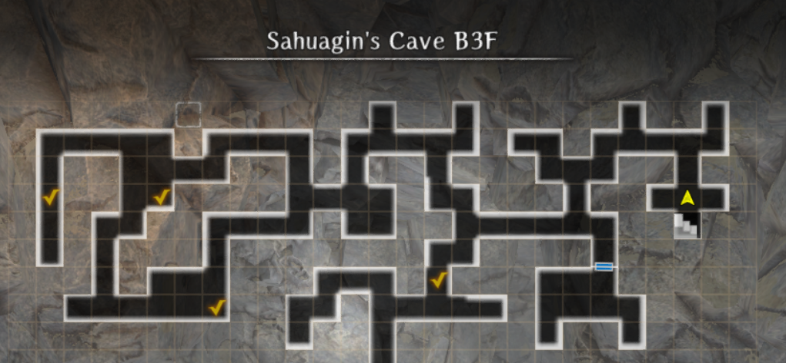
    
        - Routing path consistently gets all enemies 95% of the time unless one gets stuck in a corner. 
        - Easy to tweak as needed if you are encountering too many ambushes.  
        - Once you are at the final checkmark (far left) you will need to auto-exit to ensure you take the northern path back to the exit. 
    
    === "B3F (Berkanan Route)"
    
        - If you cannot defeat the Red Dragon (Berkanan Route) to progress to Part 2, then the best farming spot will still be B3F. 
        - The B3F Part 1 map is smaller and only includes 5 enemy encounters. Fewer enemies can be a positive if you are using all of your MP/SP to complete a single run since you may encounter a Scorpion Lady or Minotaur, which are tougher enemies.  
    === "Data Testing"
    
        - The majority of the data testing comes from our Discord members @slimwaldi, @liezeith, and @genosis who have collectively spent dozens of hours farming, tracking, and sharing their data. 
        - Data covers roughly 8,000 junk collected across all 3 floors with and without wheeling-in-place to reset the fixed chests on each floor. 
        - If you are interested in learning more about the methodology please see the #B&B Event Farming Data channel.
        - Any major corrections or new findings please contact @lightbearer or post in the Discord channel above. 

## Junk Tiers

!!! warning "This is a WIP and will be updated regularly."

### Unlocking System 

Since the event is available to all players at every stage of the game Drecom has implemented a matrix or 3D-array system for unlocking junk tiers. In basic terms, it means they are using a set of multiple variables that require a minimum amount of progress for each one. 

- We have limited insight into how this system works. 
    - Thanks to our Discord members we have been able to collect enough data to offer some basic guidlines and troubleshooting tips. 
    - Know in advance that these guidlines may not work for you.
- Primary Variables
    - MC's Grade, Abyss progression, and Reputation level are the primary factors in determining your junk tier. Each one appears to have equal weighting.

!!! tip "New and Returning Players - Read Me"

    - The unlocking system requires a minimum amount of progress across **all** 3 primary variables. For example, the lower your Reputation level the higher the requirements for Grade and Abyss progression.   
    - Newer players tend to get stuck at Four Scales (Steel) junk because they meet the requirements for Grade and Abyss progression, but have a low Reputation level if Guild requests or Special Requests have been deprioritized.
    - The Event button (yellow shield icon) is required to see if a new tier of junk has unlocked. The game is inconsistent with updating junk tiers automatically. **Wheeling-in-place does not work**. 

??? warning "Primary Variables" 

    ??? note "Grade"
    
        - The most straight forward variable to progress. It is based only on the MC's Grade and not the rest of your team. Passing the Grade Exam is not sufficient. You must spend the tags and promote your MC. 
        - New players will want to target Steel Grade, if possible. If you already at Copper Grade, then you will likely have Seven Luminaries junk unlocked. 
        - If Arna does not immediately offer you the Grade Exam at level 40 or 50 this is a helpful indicator that your Reputation level is lagging. You will likely have to do additional Reputation grinding after hitting Steel Grade and clearing A3 F3 Necrocore or A3 F7 Doll to unlock Seven Luminaries. 
    
    ??? note "Abyss Progression" 
    
        - Key Abyss milestones for Seven Luminaries junk:
            - Clear A3 F3 Necrocore - Step foot into F5 before exiting. 
            - Clear A3 F7 Doll - Step foot into F8 before exiting. 
            - Reach A3 F10 Fountain 
            - First clear of GWO 3 
        - True Endings
            - Getting the True endings for both A1 and A2 count as "points" towards unlocking higher tiers of junk. 
            - If you have a strong team these are both easy to do fairly quickly since you can auto-battle through all the enemies. 
            - For A2 we strongly recommend starting a new faction since the Mermaid statues are located on each of the lower floors. 
    
    ??? note "Reputation Level" 
    
        === "Basics" 
        
            - Reputation level is a hidden mechanic in the game. You receive Reputation points every time you complete a Guild Request or a Special Request.
            - Arna will not offer you the next Grade Exam until you have accumulated a certain amount of Reputation points.  
            - Special Requests, particularly the True endings, seem to give more "points" than standard Guild Requests. 
            - We do not know:
                - If you get more Reputation points from the later Abysses. 
                - If completing all Guild request in an Abyss gives you extra Reputation points as a one-time "bonus". 
        
        === "Priorities" 
        
            - If you are grinding Reputation points we recommend you start with getting the True endings for the Special Requests (Fordaig, Malice, etc.). Note that these are reset in the Ruins > Cursed Wheel > Special Request button located at the bottom-right of the page.  
            - The standard approach has been to pick fast A1 Guild requests and repeat them over and over again until the next Grade Exam or junk tier unlocks. 
            - If you are going to be putting in the time to grind Reputation points, then we recommend you at least pick up the Mel (+13-14 Trap Disarm) and Mudd (+10 Detect) bondmates and take them to level 5. They are both useful for your chest opener and long-term account development. 

??? note "Troubleshooting" 

    - Know upfront that this can be a frustrating and time-consuming process, especially if you are in A3 and want access to Seven Luminaries junk. 
    - If your junk is not updating, then here is a list of things to test in order of importance:
        - Increase MC's Grade to Steel or Copper, ideally. 
        - Make more progress in your current Abyss. 
            - The game is built around unlocking new Guild requests, side dungeons, etc. once you reach a Major Harken in an Abyss or defeat the GWO. We suspect the junk unlocking system also uses these event flags. 
            - The primary floors to progress toward would be F3-4, F6-7, and restoring the Major Harken on F10 after defeating a GWO. 
        - Complete the "True" endings for A1 and A2. 
        - Complete the "Best" endings for the Special Requests, which are listed under the Events section in the navigation list.
        - Grind Reputation using fast Guild requests in A1 or A2. It is also a good way to increase bondmate levels, particularly Mel who only takes a few minutes and gives +13-14 Disarm Trap at level 5.  
        - Complete all Guild requests you have access to at least once. 
    - Remember! The junk pool will not update unless you reset the entire event using the Event button (yellow shield icon). Some Discord members have it happen automatically, but many do not. 
    - As a last resort you can send an [Inquiry](https://support.wizardry.info/en/inquiry) to Drecom if you have tried everything listed above as it could be a bug. 

### Unlocking Requirements

??? note "Junk Tiers 1-8"

    === "Unlocking Table"
    
        | Tier | Junk Name | Equipment Rank | MC Grade | Abyss Progression | Notes | 
        |:--:|:--------------|:--------------|:---------|:-------------------:|:-------------------|
        | 1 | Junk          | Bronze | No Grade  | A1 F1 |    |  
        | 2 | Teal          | Steel  | No Grade  | A1 F1 |    | 
        | 3 | Sliver        | Iron   | Lead      | A2 F6 |    | 
        | 4 | Seedling      | Steel  | Lead      | A2 F6 |    | 
        | 5 | Three-Color   | Steel  | Bronze    | A3 F1 |    |  
        |   |               |        | Iron      | A2 F6 |    |  
        | 6 | Four Scales   | Steel  | Iron      | A3 F5 |    |  
        |   |               |        | Steel     | A3 F1 |    |  
        | 7 | Five Blossoms | Ebon   |           |       | See Seven Luminaries | 
        | 8 | Six Energies  | Ebon   |           |       | See Seven Luminaries | 
        
        - Multiple entries are due to different combinations of MC Grade's and Abyss progression.
        - We have yet to discover any way to unlock Five Blossoms or Six Energies without also unlocking Seven Luminaries at the same time so consult the next tab.
        - Remember! To see if you have unlocked a new tier of junk you need to reset everything using the Event button (yellow shield) and select Cursed Wheel.
        
    === "Notes" 
    
        - Both tiers of Ebon junk (Five Blossoms, Six Energies) unlock at the same time as the Silver-tier (Seven Luminaries). The exact requirements for unlocking Ebon junk separately are not known to-date although some Discord members have been able to do so. 
        - Variables we suspect might have an influence, but have not been tested include: 
            - MC being at the max level for each Grade 
            - Completing all the request in each Abyss as a seperate, but related trigger to Reputation level 

??? note "Junk Tier 9 (Seven Luminaries)" 

    | Tier | Junk Name | Equipment Rank | MC Grade | Abyss Progression | Notes | 
    |:-:|:-------------|:---------------|:---------|:------------------|:-------------------|
    | 9 | Seven Luminaries | Silver | Bronze | A4 F1?                         |    |  
    |   |                  |        | Iron   | A3 F10 - Defeat GWO 3          |    | 
    |   |                  |        | Steel  | A3 F7 - Defeat Doll boss       |    | 
    |   |                  |        | Copper | A3 F3 - Defeat Necrocore boss  |    | 
    
    - These are general guidelines that might not work for your account. 
    - See the Troubleshooting tab under Mechanics for options that _might_ unlock Seven Luminaries junk if you do not think you will be able to increase MC's Grade or make additional Abyss progress. 
    - Remember! To see if you have unlocked a new tier of junk you need to reset everything using the Event button (yellow shield icon) and select Cursed Wheel.
    
## Exchange Shop 

??? note "Overview"

    - Accessed via the Jeweler- Exchange under the Otherworld Adventurers II tab. The shop currency is called "Strange Angular Ore" and only available in the Sahuagin's Cave.
    - A limited number of items (denoted by a *) refresh every Thursday at 0:00 JST through 3/25. 
    - Refreshed items are _missable_ with a 7-day countdown. They have been added as separate entry in the shop.

??? note "Buying Recommendations"

    === "Priority Items"
    
        - Codexes
            - The two sets of Codex books are your top priority. The total cost is 32,500. 
            - They provide a total of 325 EXP that can be used to upgrade any passive, skill, or spell in the game. They are critical for long-term account progression. 
        - Adventurer's Remains I and II 
            - Total of 6 permanent bones (3 of each type). Total cost is 4,800.
            - Total of 6 bones refreshed on a weekly basis and are _missable_. Total cost is 4,800. 
        - Gem of Org x 200 
            - Total cost is 1,500. 
            - Has not refreshed to-date, but may in the future. 
        - Spell Books
            - Cones (5,000) and Macones (10,000) can be helpful for your MC, Iaramus, or primary spellcaster. 
            - Halito (5,000) can only be upgraded via the Jewler (Limited Time Offer - Daily) with 240 purple gems. Mahalito (10,000) is only from Asha's alternative style banner. 
            - Maerlik (10,000) is best-suited for Yekaterina or a multi-element Mage. 
            - Dialko (5,000) is helpful on any support unit or Knight that does not have access to the Priest class for clearing Sleep or Stun. 
            - Porto (10,000) is best-suited for a support Knight or to round out Ainikki's spell kit. It is one of the best spells in the game and can only be bought (rarely) on limited banners for 30 tokens.
            - Total cost for all spell books is 55,000.
        - Total cost for all permanent items is 93,800. 

    === "Weekly Refresh Costs" 

        - For the Adventurer's Remains I and II the total cost is 4,800 for both sets of 3. 
        - For the Basic Items (Enhancement Ore, EXP books) the total cost is 2,265.
        - If you plan to clear the shop weekly, then the total cost is 7,065.
        - Remember that these items are _missable_ and only available for 7 days. They have a countdown-timer (Days Remaining) at the top of their listing. Refresh is every Thursday at 0:00 JST.  

    === "Unique Gear Considerations"

        - The major determining factor is where you are in the game. 
        - If you are still in Abyss 1-3, then the Refined Saber or Augmented Dragon Slayer are worth picking up as a "bridging" weapon to A4. 
        - If you have cleared GWO 4-4 and plan to fight the Black Dragon superboss, then the Augmented Dragon Swords are highly recommended for both damage mitigation and higher DPS.  
        - The Saber is a Katana, so only relevant if you have a Samurai or plan to run one or more in the future.
        - The Trollkin Ring can be used with Shiou's Lingering Blossom to use the skill each turn as it cannot be used if she is at 1 HP. It is one of the few ways to consistently (70-80%) draw a boss's aggro as a defense strategy.  

??? note "Shop List"

    === "Unique Gear" 
    
        | Item | Cost | # Copies | Total Cost |
        |:-----|----:|--------:|-------------------:|
        | Dragon Slayer           | 7,000   | 1   | 8,000  |  
        | Dragon Slayer           | 12,000  | 3   | 36,000 | 
        | Augmented Dragon Slayer | 24,000  | 99  | -      | 
        | Saber                   | 5,000   | 3   | 15,000 |  
        | Refined Saber           | 30,000  | 99  | -      | 
        | Trollkin Ring           | 10,000  | 3   | 30,000 |  
        | Exquisite Trollkin Ring | 20,000  | 99  | -      | 
        
        ??? warning "Unique Gear Base Stats"
            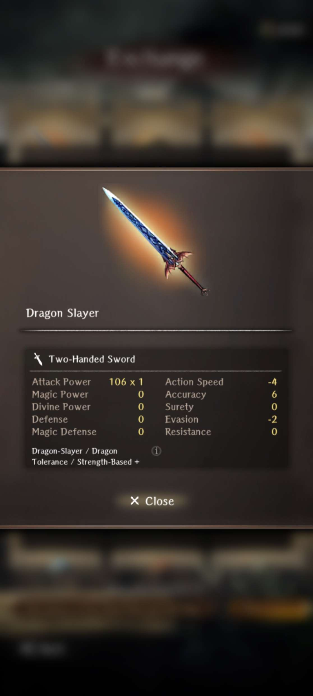
            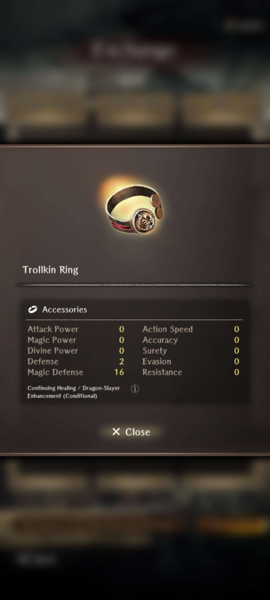
            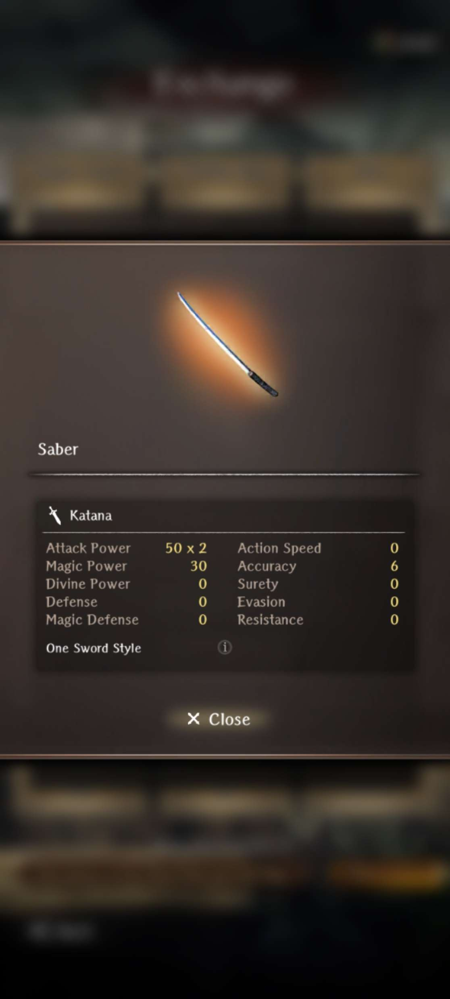

    === "Priority Items"
    
        | Item | Cost | # Copies | Total Cost |
        |:-----|----:|--------:|-------------------:|
        | Codex of Learning               | 2,500   | 5 | 12,500 |  
        | Intermediate Codex of Learning  | 10,000  | 2 | 20,000 | 
        | Book of Halito Secrets          | 5,000   | 1 | 5,000  |  
        | Book of Mahalito Secrets        | 10,000  | 1 | 10,000 | 
        | Book of Cones Secrets           | 5,000   | 1 | 5,000  |  
        | Book of Macones Secrets         | 10,000  | 1 | 10,000 | 
        | Book of Maerlik Secrets         | 10,000  | 1 | 10,000 |  
        | Book of Dialko Secrets          | 5,000   | 1 | 5,000  | 
        | Book of Porto Secrets           | 10,000  | 1 | 10,000 |  
        | Adventure's Remains I           | 800     | 3 | 2,400  |  
        | Adventure's Remains I*          | 800     | 3 | 2,400  |  
        | Adventure's Remains II          | 800     | 3 | 2,400  |  
        | Adventure's Remains II*         | 800     | 3 | 2,400  |  
        | Gem of Org x200                 | 1,500   | 1 | 1,500  |  
        | Total Cost of Permanent         |         |   | 93,800 |  
        | Total Cost of Refreshing        |         |   | 4,800  |  
        
        *Refreshed weekly every Thursday at 0:00 JST, available for 7 days and missable.

    === "Basic Items"
    
        | Item | Cost | # Copies | Total Cost |
        |:-----|----:|--------:|-------------------:|
        | Amulet Shard**                  | 1,000 | 99 | -   |  
        | Azure Lustrous Ore              | 100   | 1 | 100   |  
        | Azure Lustrous Ore x10          | 1,000 | 1 | 1,000 |  
        | Azure Lustrous Ore x20          | 2,000 | 1 | 2,000 |  
        | Fine Grade Ore                  | 200   | 5 | 1,000 |  
        | Fine Grade Ore*                 | 200   | 5 | 1,000 |  
        | High Grade Ore                  | 100   | 5 | 500   |  
        | High Grade Ore*                 | 100   | 5 | 500   |  
        | Mid Grade Ore                   | 75    | 5 | 375   |  
        | Mid Grade Ore*                  | 75    | 5 | 375   |  
        | Low Grade Ore                   | 50    | 5 | 125   |  
        | Low Grade Ore*                  | 50    | 5 | 125   |  
        | Clock Tome of the Finesser      | 50    | 5 | 250   |  
        | Clock Tome of the Finesser*     | 50    | 5 | 250   |  
        | Clock Tome Volume               | 3     | 5 | 15    |  
        | Clock Tome Volume*              | 3     | 5 | 15    |  
        | Total Cost of Permanent         |       |   | 5,365 |  
        | Total Cost of Refreshing        |       |   | 2,265 |  
        
        *Refreshed weekly every Thursday at 0:00 JST, available for 7 days and missable.    
        **Calculations do not include the Amulet Shard. 

## Maps

### Part I (Berkanan Route)

??? map "Map B1F"
    
    
??? map "Map B2F"
    
    
??? map "Map B3F"
    

### Part II (Ainikki Route)

Note that B2F and B3F are different for the Part 2 (Ainikki) route. 

??? map "Map B1F"
    
    
??? map "Map B2F"
    
    
??? map "Map B3F"
    
