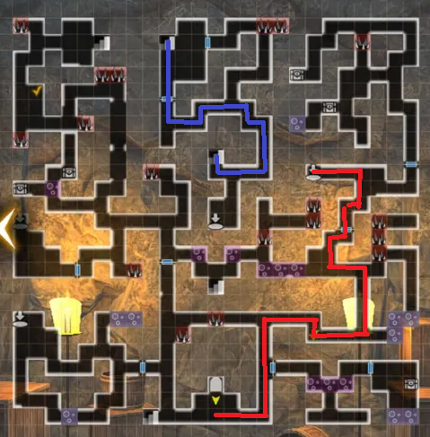
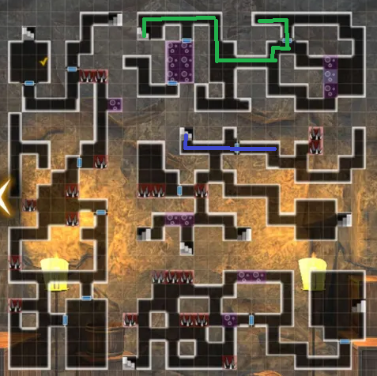
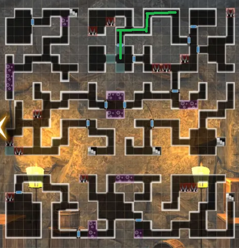

# Plot of the Sand Shadow

!!! item "This event is permanently available!"

## How to participate:

You need to reach a certain point in the Third Abyss, Impregnable Fortress and view the Prologue story of the quest.

## Guide for 1st Part:

1st Run:
1. Start in the Royal Capital and accept the quest "Paulownia Box Recovery"
2. Head to Sand Shadow Cave and begin exploring.
3. There will be a poison path that initiates dialogue with Lulunarde. You must cross over the poison path. Keep heading over a few poison tiles and fight the ninjas you see. The dialogue option here does not matter. Press forward to the staircase at the top left of the map.
4. Interact with the footprints near the wall in front of you after you walk down to B2F. This will give you knowledge about the hidden doors. To activate the hidden doors, you will need to tap on the wall and then it will become like a normal door.
5. You will need to walk over the spike tiles and head downwards to the bottom left of the map and trigger a pitfall. From here in B3F, you will need to walk to the bottom right of the map and get a conversation with Lulu. There will be footprints once again, but this time also a button on the floor. Interact with the footprints and then the button to trigger a ladder to the upper floor.
6. Head upwards and then continue along the path to a large room. There will be a button to open a ladder at the very bottom left of this room. This will bring you back to the entrance. Explore the entire map (or just reference the map posted here). Find the boss room on B3F and fight the ninja. Upon winning, the Heat Haze ninja will commit suicide and blow everyone up, including you.
7. You will need to commit to an optimal route in order to reach the boss room in time. See path listed.
8. You will obtain an item that will be used for the Ninja Trial after this request is turned in. After turning the request, leave the adventurer's guild and return. Arna will give you some mail that tells you to head the Ninja Trial.

## Map:

## Route for Correct Ending:

Red -> Blue -> Green

## Guide for 2nd Part:
