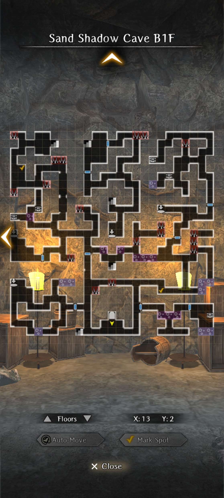
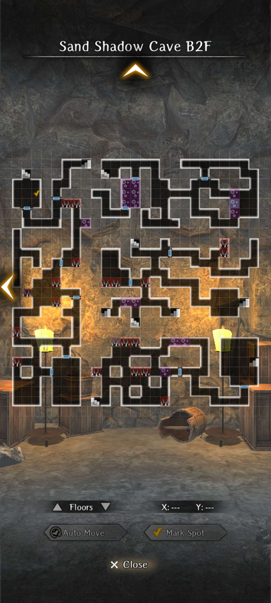
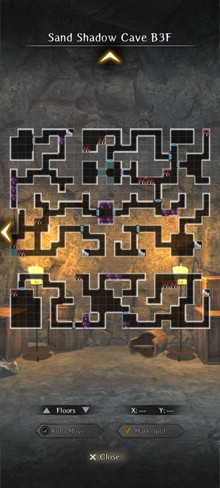
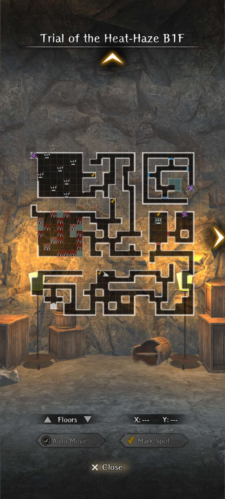
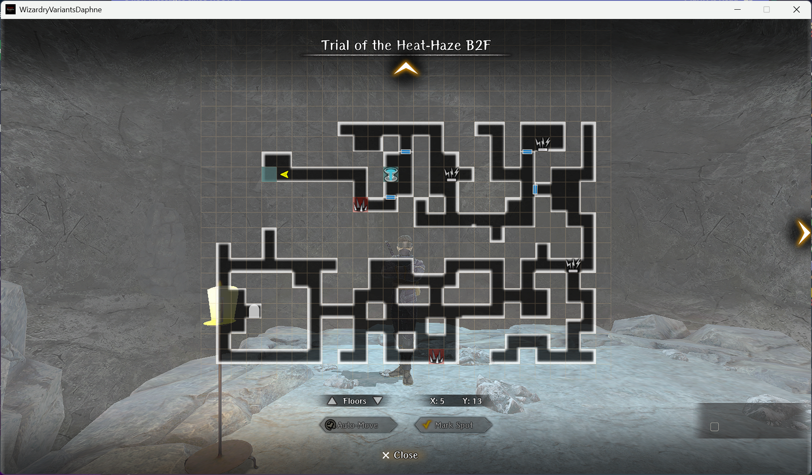
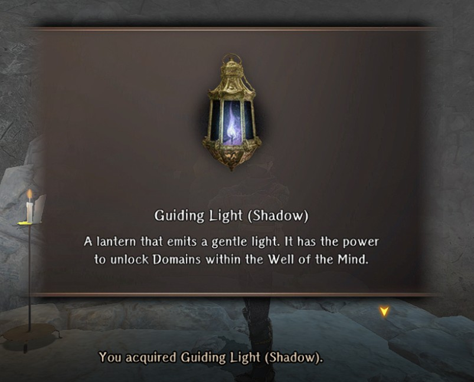
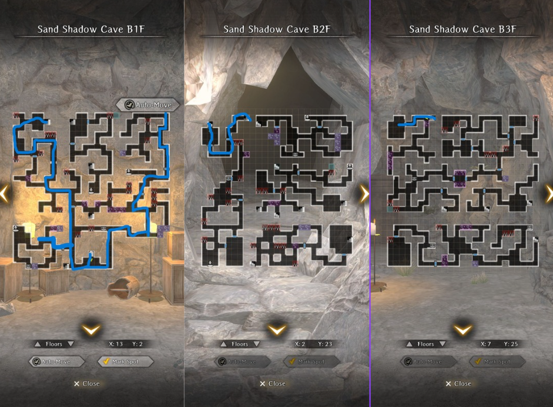

# Plot of the Sand Shadow

!!! item "This event is permanently available!"

## How to participate:

- Part 1: Complete Abyss 3 up to the Cursed Wheel Point "Hidden Passage"
- Part 2: Achieve any ending for Abyss 3

## Guide for 1st Part:

1. Start in the Royal Capital and accept the quest "Paulownia Box Recovery"
2. Head to Sand Shadow Cave and begin exploring.
3. There will be a poison path that initiates dialogue with Lulunarde. You must cross over the poison path. Keep heading over a few poison tiles and fight the ninjas you see. The dialogue option here does not matter. Press forward to the staircase at the top left of the map.
4. Interact with the footprints near the wall in front of you after you walk down to B2F. This will give you knowledge about the hidden doors. To activate the hidden doors, you will need to tap on the wall and then it will become like a normal door.
5. You will need to walk over the spike tiles and head downwards to the bottom left of the map and trigger a pitfall. From here in B3F, you will need to walk to the bottom right of the map and get a conversation with Lulu. There will be footprints once again, but this time also a button on the floor. Interact with the footprints and then the button to trigger a ladder to the upper floor.
6. Head upwards and then continue along the path to a large room. There will be a button to open a ladder at the very bottom left of this room. This will bring you back to the entrance. Explore the entire map (or just reference the map posted here). Find the boss room on B3F and fight the ninja. Upon winning, the Heat Haze ninja will commit suicide and blow everyone up, including you.
7. You will need to commit to an optimal route in order to reach the boss room in time. See path listed. You must ambush the ninja on the way to the boss room.
8. You will obtain an item that will be used for the Ninja Trial after this request is turned in. After turning the request, leave the adventurer's guild and return. Arna will give you some mail that tells you to head the Ninja Trial.

### Boss Fight Info:

- There are 5 ninja, 3 in the front, 2 in the back.
- The ninja in the middle will cast Kantios. The red ninjas on the sides generally armor pierce or attempt to crit (Sever Jugular). The blue ninjas in the back generally only attempt to instant-kill.
- All the ninjas are susceptible to confusion.
- The ninjas all have several thousand HP.
- The red ninjas in the front will cast concealment when reaching a certain amount of remaining HP, they can also cast wild throw immediately after being hit.
- It's advised to attempt this fight after restoring fortitude, as the ninjas are very accurate in critting.

### Maps:

??? note "Maps:"
    
    
    

### Route for Correct Ending:

Red -> Blue -> Green

## Guide for 2nd Part:

!!! Danger "There is a part in this where you will need to permanently delete an adventurer if your main character isn't EVIL alignment. Be sure to UNLOCK the adventurer beforehand. The adventurer that is sacrificed will return all their equipped gear/items."

There are two parts for the Trial of the Heat Haze. 

The 1st part is just a standard walk through a dungeon with some sentries. There are "whistle" sentries that if they spot you, will penalize you in the end by making you fight a few more trash mobs. It's not important to avoid them. The enemies in this dungeon are exclusively ninja mobs. If you are Evil Alignment, you will receive the guiding light at this point. However, if you are not, there will be a 2nd part to the trial.

!!! note "If you plan to bring a low level adventurer in here, keep in mind there is a mandatory spike trap at the end that will deal around 60-70 HP. It is recommended to accomodate for such."

The 2nd part requires you to select only 1 adventurer to bring with you and walk through another dungeon with significantly easier enemies (singlar ninja). Upon reaching the end you MUST sacrifice the adventurer you bring with you (You will have to fight them. Select stand your ground.) They will be PERMANENTLY deleted if you confirm to do so. You will be warned multiple times before fully committing, so feel free to back out of this and bring a more disposable adventurer if possible. 

### Maps:

??? note "Maps:"
    
    

### Reward:

### Farming Routes

!!! note "After Ver 1.12.0, you can now remove all the traps in the cave for easier farming by going to the boss room on B3F and flipping a switch on the wall left of the final chest"

    

!!! note "After the 1st Anniversary update, you can now exchange tokens for unlimited amounts of event specific junk!"

=== "Merc's Route"
    

=== "SocialX's Route"
    

=== "No Boss Farming Route Full Clear - Zellwëger"
    
    
    

    To do the farm, please follow the arrows from the entrance and the corresponding numbers
