# Plot of the Sand Shadow

!!! item "This event is permanently available."

## How to enable:

- Part 1: [Guarda Fortress](https://wizardry.fasterthoughts.io/abyss-guides/3-guarda-fortress/maps/) (Abyss 3) complete up to the Cursed Wheel Point: "Hidden Passage".
- Part 2: Guarda Fortress complete with any ending.

## Guide for 1st Part:

!!! warning "Leaving the cave at any time during the mission will result in the bad ending of not reaching the room in time"

1. Start in the Royal Capital and accept the quest "Paulownia Box Recovery"
2. Head to Sand Shadow Cave and begin exploring.
3. There will be a poison path that initiates dialogue with Lulunarde. You must cross over the poison path. Keep heading over a few poison tiles and fight the ninjas you see. The dialogue option here does not matter. Press forward to the staircase at the top left of the map.
4. Interact with the footprints near the wall in front of you after you walk down to B2F. This will give you knowledge about the hidden doors. To activate the hidden doors, you will need to tap on the wall and then it will become like a normal door.
5. You will need to walk over the spike tiles and head downwards to the bottom left of the map and trigger a pitfall. From here in B3F, you will need to walk to the bottom right of the map and get a conversation with Lulu. There will be footprints once again, but this time also a button on the floor. Interact with the footprints and then the button to trigger a ladder to the upper floor.
6. Head upwards and then continue along the path to a large room. There will be a button to open a ladder at the very bottom left of this room. This will bring you back to the entrance. Explore the entire map (or just reference the map posted here). Find the boss room on B3F and fight the ninja. Upon winning, the Heat Haze ninja will commit suicide and blow everyone up, including you.
7. You will need to commit to an optimal route in order to reach the boss room in time. See path listed. You must ambush the ninja on the way to the boss room.
8. You will obtain an item that will be used for the Ninja Trial after this request is turned in. After turning the request, leave the adventurer's guild and return. Arna will give you some mail that tells you to head the Ninja Trial.

### Boss Fight Info:

- There are 5 ninja, 3 in the front, 2 in the back.
- The ninja in the middle will cast Kantios. The red ninjas on the sides generally armor pierce or attempt to crit (Sever Jugular). The blue ninjas in the back generally only attempt to instant-kill.
- All the ninjas are susceptible to confusion.
- The ninjas all have several thousand HP.
- The red ninjas in the front will cast concealment when reaching a certain amount of remaining HP, they can also cast wild throw immediately after being hit.
- It's advised to attempt this fight after restoring fortitude, as the ninjas are very accurate in critting.

### Maps:

??? note "Maps:"
    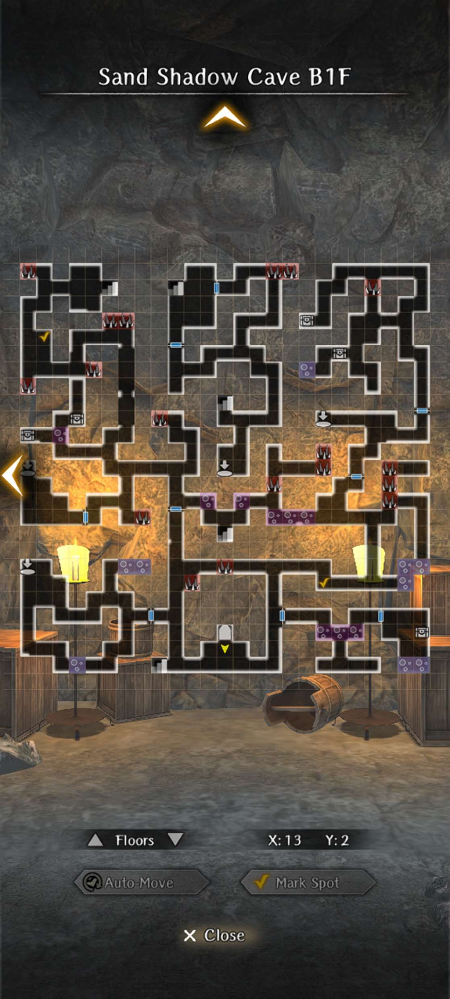
    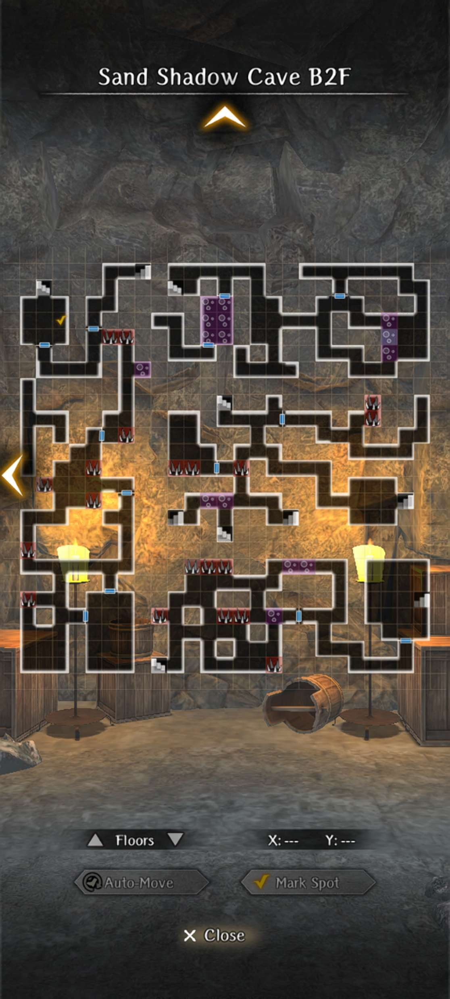
    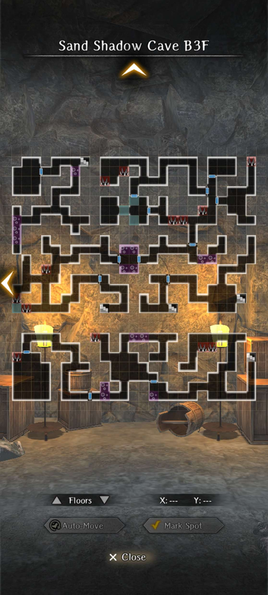

### Route for Correct Ending:

Red -> Blue -> Green

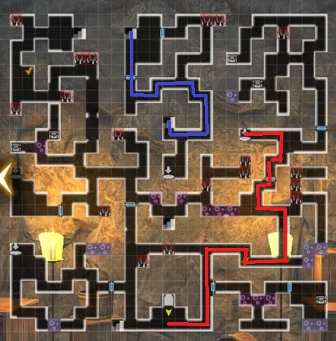
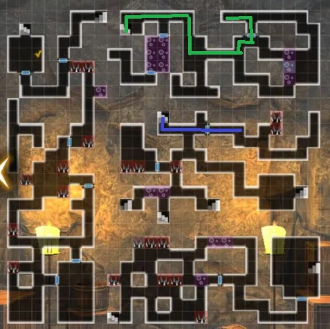
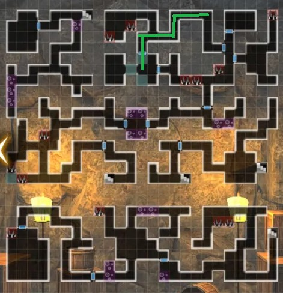

## Guide for 2nd Part:

!!! Danger "There is a part in this where you will need to permanently delete an adventurer if your main character isn't EVIL alignment. Be sure to UNLOCK the adventurer beforehand. The adventurer that is sacrificed will return all their equipped gear/items."

There are two parts for the Trial of the Heat Haze. 

The 1st part is just a standard walk through a dungeon with some sentries. There are "whistle" sentries that if they spot you, will penalize you in the end by making you fight a few more trash mobs. It's not important to avoid them. The enemies in this dungeon are exclusively ninja mobs. If you are Evil Alignment, you will receive the guiding light at this point. However, if you are not, there will be a 2nd part to the trial.

!!! note "If you plan to bring a low level adventurer in here, keep in mind there is a mandatory spike trap at the end that will deal around 60-70 HP. It is recommended to accomodate for such."

The 2nd part requires you to select only 1 adventurer to bring with you and walk through another dungeon with significantly easier enemies (singlar ninja). Upon reaching the end you MUST sacrifice the adventurer you bring with you (You will have to fight them. Select stand your ground.) They will be PERMANENTLY deleted if you confirm to do so. You will be warned multiple times before fully committing, so feel free to back out of this and bring a more disposable adventurer if possible. 

### Maps:

??? note "Maps:"
    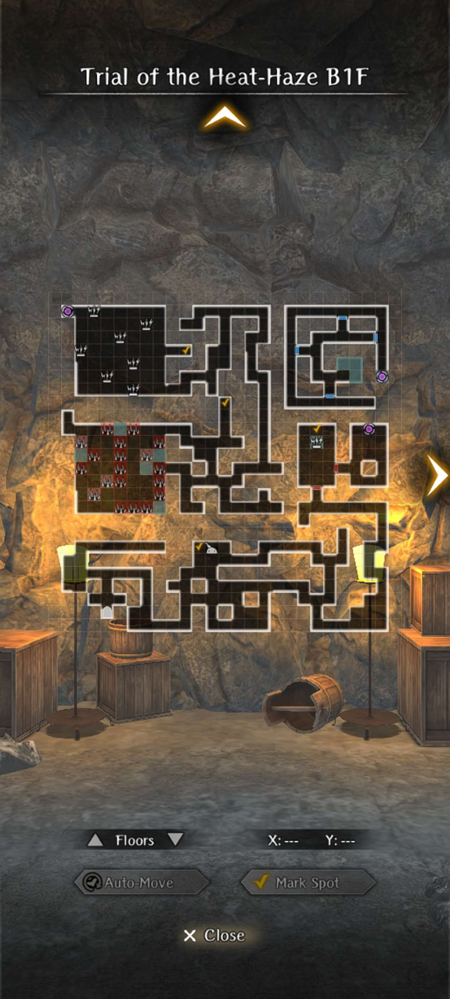
    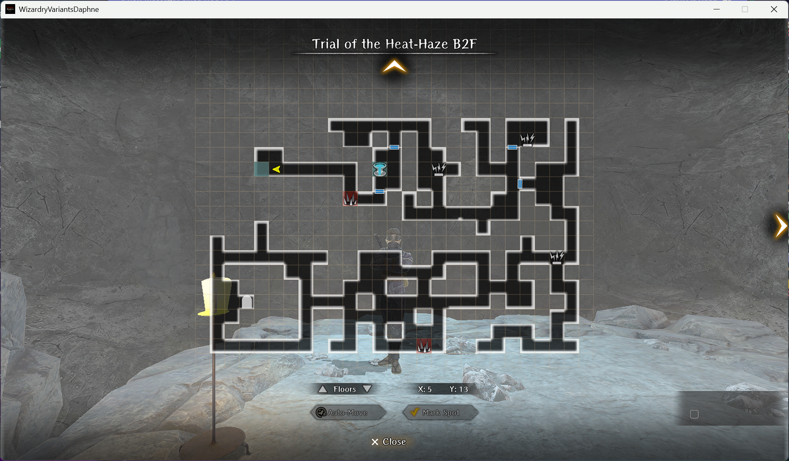

### Reward:

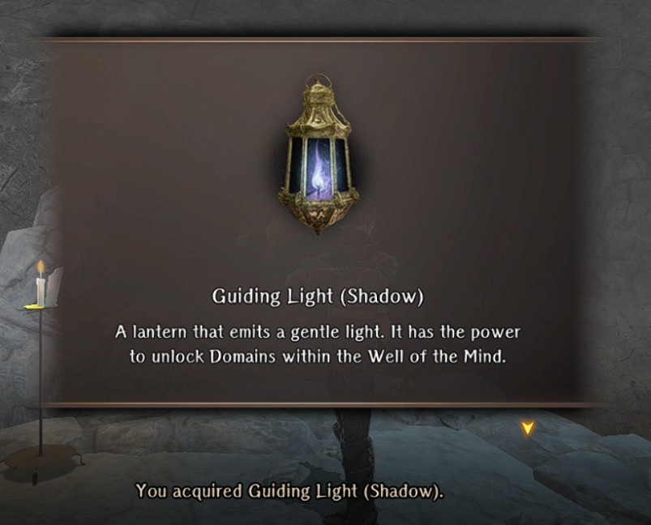

### Farming Routes

!!! note "After Ver 1.12.0, you can now remove all the traps in the cave for easier farming by going to the boss room on B3F and flipping a switch on the wall left of the final chest"

    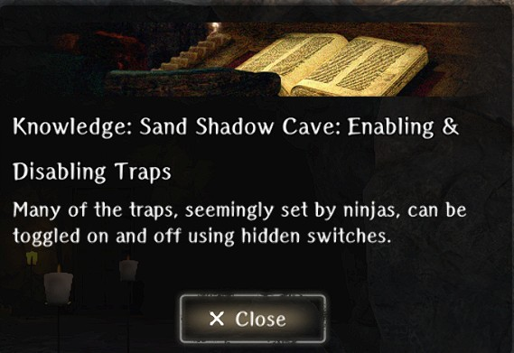

!!! note "After the 1st Anniversary update, you can now exchange tokens for unlimited amounts of event specific junk!"

=== "Merc's Route"
    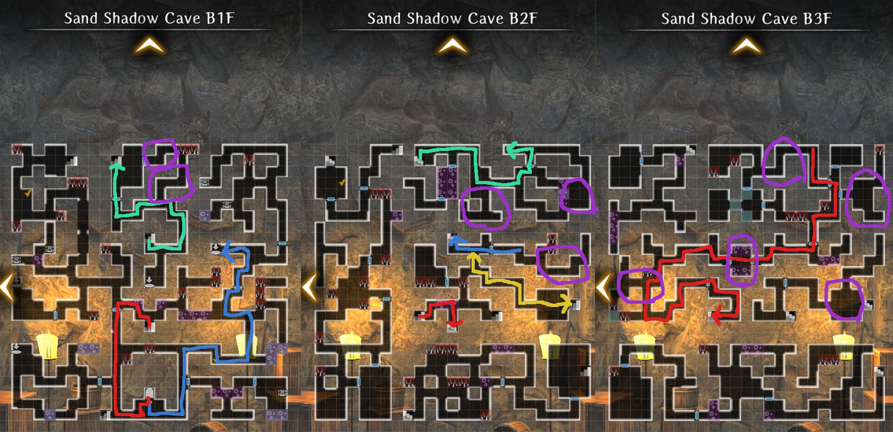

=== "SocialX's Route"
    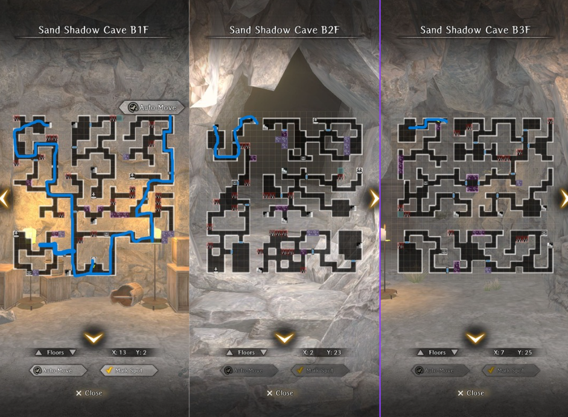

=== "No Boss Farming Route Full Clear - Zellwëger"
    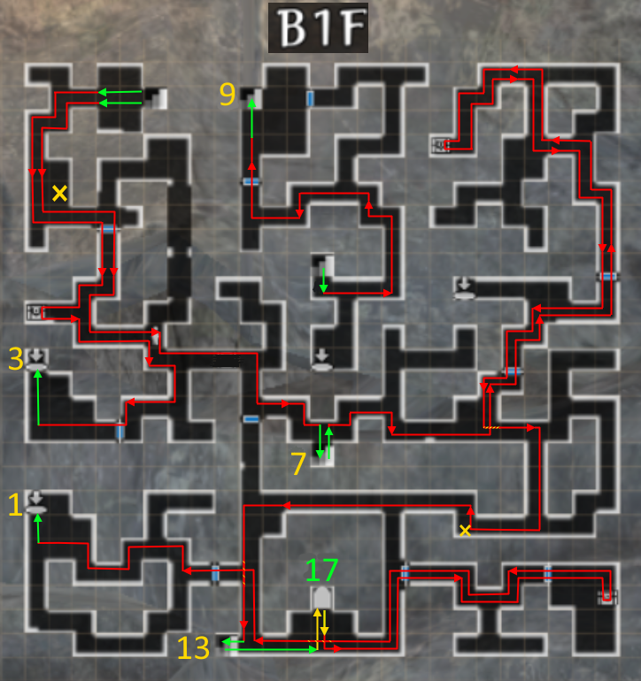
    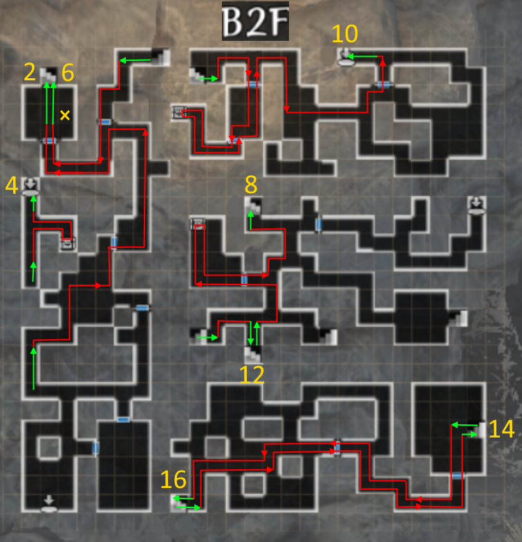
    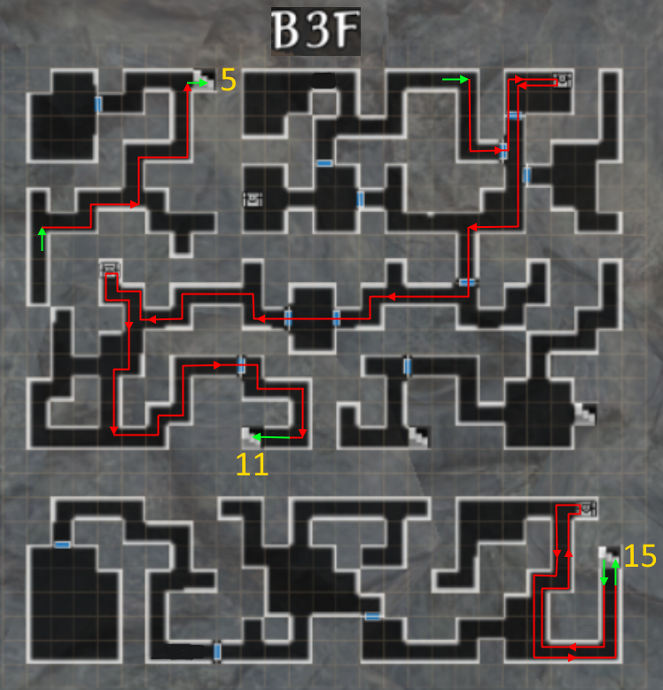

    To do the farm, please follow the arrows from the entrance and the corresponding numbers

## Guide for Follow Up Request of the Same Name

!!! warning "This request must be completed all in one go. Any boxes collected during the request will be removed upon entering the cave."

!!! note "Bringing a Ninja will make this request a lot easier on the first time around, as they will indicate ninjas in certain areas."

1. Start in the Royal Capital and accept the quest "Paulownia Box Recovery". It will have the same name but will be a different request.
2. Head to Sand Shadow Cave and begin exploring.
3. Basically you will need to collect minimum 5 boxes from hiding ninjas around the cave. There are 7 possible locations however. Collecting more than 5 will make the final boss fight easier. There are two typical encounters, either finding a ninja within a certain location or dealing with a ninja hiding behind a door waiting to ambush you. Typically, failing to find the ninja will result in being instantly killed, while failing to deal with the ninja behind the door will result in being ambushed with a ninja fight.
4. After collecting a minimum of 5 boxes, head to the final room of the cave to talk to the Heat Haze Ninja and turn in the boxes. This will result in a boss fight similar to that of the 1st request. Collecting more boxes will reduce the number of ninjas that need to be fought. 5 Boxes will result in the final boss fight having to fight 7 ninjas (3 rows), and every box after that reduces the ninjas by 2 per box.

### Box Locations

!!! note "Ninjas that are hiding as objects will instant kill you. Otherwise it's a 2 ninja fight. Ninjas waiting in ambush behind doors will be a 4 ninja fight.

- B1F. (X:10, Y:12). Past the fake wall will be a dead body on floor. Don't walk over it, as it will result in an instant death. Click on the body instead.
- B1F. (X:7, Y:18). There will be a ninja on the bridge. However it's an illusion and will be a forced ambush fight.
- B3F. (X:23, Y:4). There will be a training dummy in this area. Attempting to leave this area will result in an instant death. Click on the training dummy.
- B2F. (X:24, Y:4). Past the door in bottom right room. The ninja in your party will indicate a ninja behind the door when attempting to go through. You have to go all the way around and not through the staircase from the 1st Floor. Instead, take the pitfall on B1F in the bottom left room. Then take the pitfall again, then walk all the way from the left to the right.
- B3F. (X:5, Y:13). There will be a sandbag in this area. Attempting to leave this area will result in an instant death. Click on the sandbag.
- B2F. (X:1, Y:16). There will be a barrel in this area. Attempting to leave this area will result in an instant death. Click on the barrel.
- B1F. (X:11, Y:24). You will get notification from your ninja if attempting to come through right door. Instead, go through bottom door.

### Reward

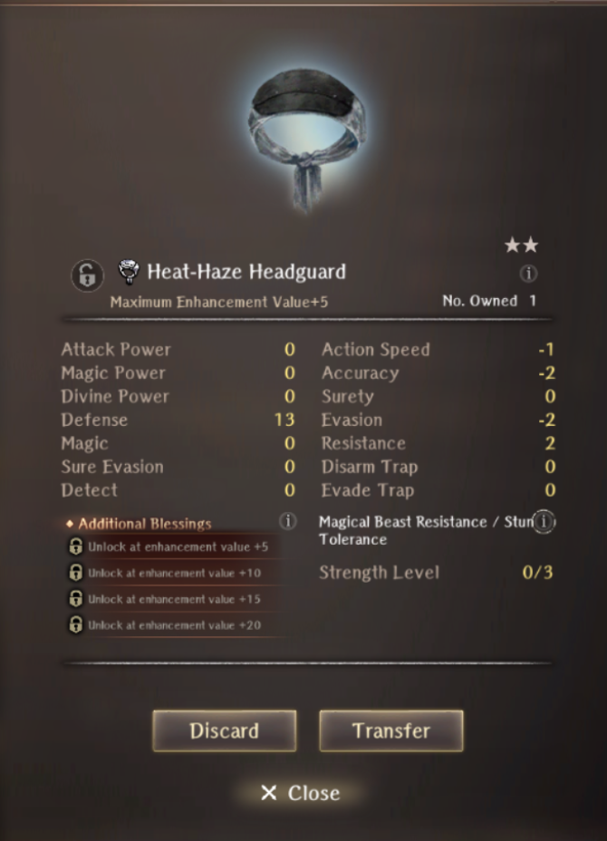
