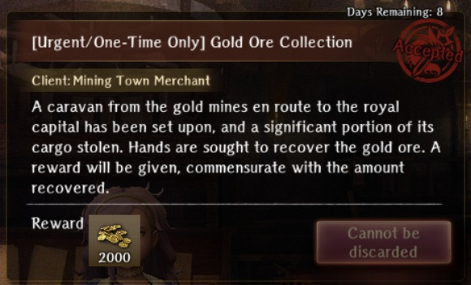
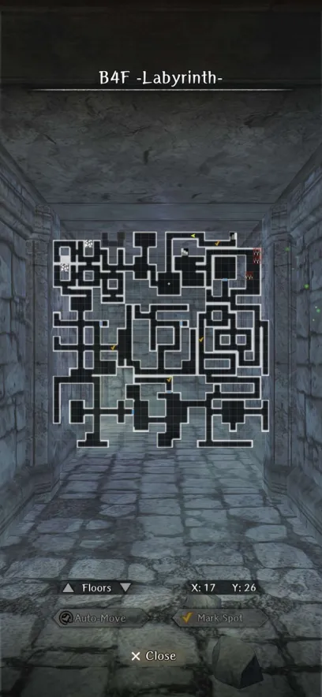
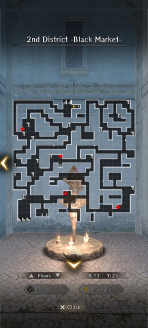
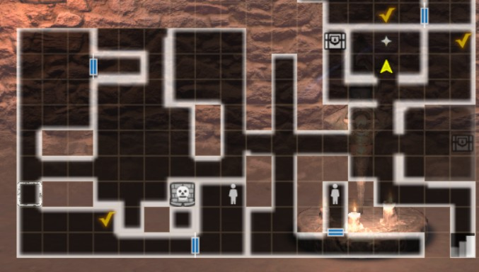
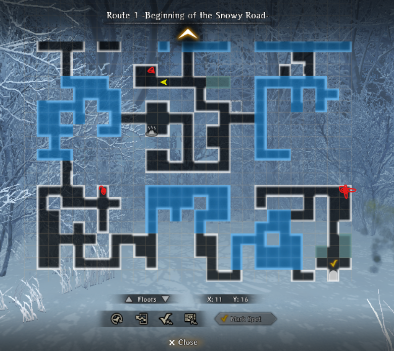
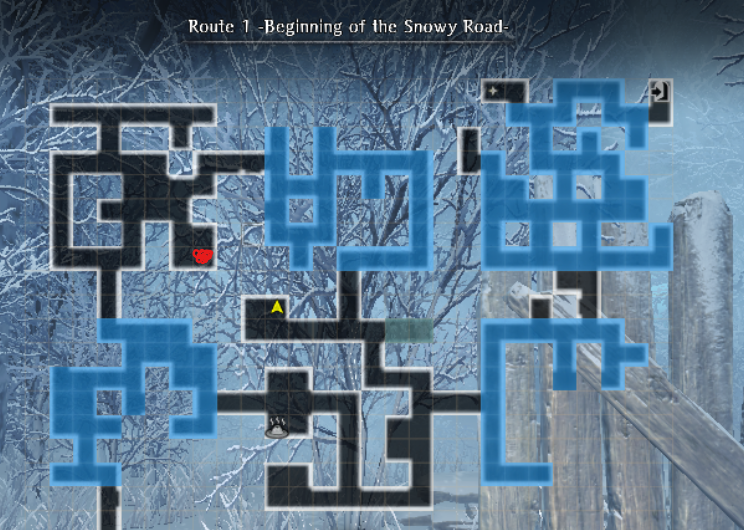
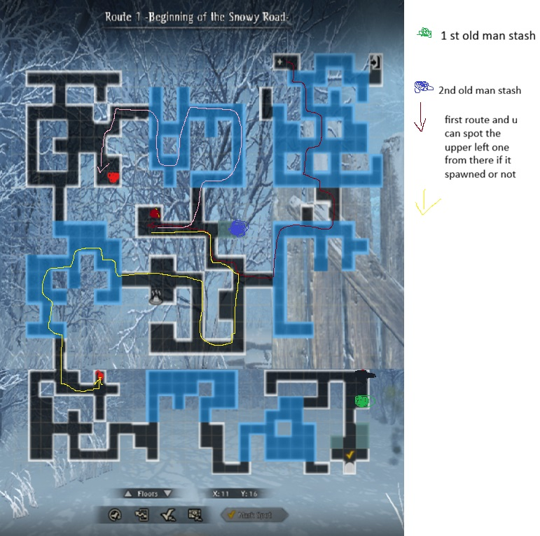

!!! warning "Warning - Read Me"
    - Do not submit the request until you have collected the maximum amount of Gold Ore. Do not listen to Lulu.  
    - The additional gold reward is substantial and can be missed if the request is submitted prematurely.
    - This is a WIP and being updated for Abyss 4. Ctrl + F5 to refresh. 

### Overview

??? note "How to Accept the Request" 

    - Accept at the Royal Capital under the Featured Requests tab. 
    - Available for a limited time through 3/18 (23:59) and cannot be discarded after accepting. 
    - This is not a Daily request. You have the entire 2-week period to complete. 

??? note "Important Notes" 

    === "Summary" 
    
        - Objective
            - The goal is to reclaim the Gold Ore that a group of thieves has stolen. They are now hiding in the Abyss and it is your job to track them down and recover as much of it as possible.
            - After accepting the request Arna will direct you to the correct Abyss to search, which will be the highest Abyss you have reached to-date. There are no changes to the enemies or their levels in the Abyss while the requests is active. 

        - Task
            - Go to Abyss floor listed under the Guides section. You will know you are on the correct floor because Lulu will comment that she senses the presence of thieves in the area.
            - Search the floor until you find a group of thieves. After defeating them you will recover a small amount of Gold Ore. After defeating your first group the request will be completed. This is "technically" true, but misleading. Do not submit at this point! See Additional Reward tab for details.

    === "Additional Reward"
    
        - Each Abyss has a maximum amount of Gold Ore that can be recovered. The size of your additional reward is roughly proportional to the % of the maximum Gold Ore you collected. 
        - Abyss 3 Example:
            - The maximum Gold Ore you can collect is 24,000. 
            - If you submitted 12,000 Gold Ore (50% of the maximum) you would receive 500,000 Gold versus 1,000,000 Gold as an additional reward.  
        - It takes 60 encounters to collect the maximum amount. Fortunately, there are ways to bring this number down to 20 using Marianne and speaking with the Old Man in the Tavern (see tabs). 
        - You can check how much total Gold Ore you have collected under your Valuables inventory. 
        - If you submit the request accidentally or prematurely you will be locked out for the rest of the event. It cannot be reactivated. 

    === "Marianne (Optional)" 

        - If Marianne is in your party it will increase the amount of Gold Ore collected after each fight by 50% of the base amount. She is not required to get the maximum amount of Gold Ore.  
        - A low-level Marianne might be at risk of dying, especially in Abyss 3 or 4. Give her EXP books and/or strong gear to make sure can survive all of the encounters.

    === "Old Man's Stash (Optional)"
        
        - After accepting the request head to the Tavern and speak with the Old Man. For a small fee he will mark your map with a "!" to denote the location of a Gold Ore stash. There are 5 locations in each Abyss.
            - Abyss 1: 500 Gold 
             - Abyss 2: 1,000 Gold
             - Abyss 3: 2,000 Gold
             - Abyss 4: 4,000 Gold 
        - Once you reach the marked "!" location you will see a glowing, white object (a "shiny") on the ground. The stash contains 4x the amount of Gold Ore that you recieve from a single fight.
        - After 6 fights (4 with Marianne in the party) Lulu will prompt you to visit the Old Man. You must return to the Royal Capital. He will re-mark your map with the location of the next stash. 
        - We strongly recommend that you have him re-mark your map every 4 fights. Returning to the Royal Capital can be an inconvenience but, on net, it is faster than having to do 4 fights for an equivalent amount of Gold Ore.

    === "Total Required Fights"

        | Marianne | Old Man | Total Fights | 
        |:--------:|:-------:|:------------:|
        | No  | No  | 60 |  
        | Yes | No  | 40 |  
        | No  | Yes | 30 |  
        | Yes | Yes | 20 |  

        - The table above refers to the number of total fights required to collect the maximum amount of Gold Ore using Marianne and/or the Old Man. 
        - The "Yes" refers to:
            - Using Marianne in your party for every fight.
            - Speaking with the Old Man after every 4 fights and having him re-mark your map 5 times. 
        - Using both of them reduces the total number of fights from 60 to 20, which is a significant IRL time-savings. 
        - The number of total required fights holds true across every Abyss. 

    === "Request Picture"
          
        

        
        

??? warning "Maximum Gold Ore and Rewards"

    | Abyss | Location | Max Gold Ore | Max Gold Reward | 
    |:----|:----|:----:|:-----:| 
    | Abyss 1 | B4F | 6,000 | 400,000 | 
    | Abyss 2 | District 2 | 12,000 | 600,000 | 
    | Abyss 3 | Zone 1 | 24,000 | 1,000,000 | 
    | Abyss 4 | Route 1 | 48,000 | 2,000,000 | 

    - There is a 2,000 Gold reward for completing the request. 
    
### Guides

??? note "Thieves Search Process" 
    
    === "Respawn Mechanic"         
        
        - There are a fixed number of locations (tile sets) that can potentially spawn a group of thieves. These tiles sets can move or rotate if you get a different map variation than what is shown in the Guides. 
        - It is RNG-based whether a group spawns at these fixed locations and re-rolls every time you enter the Abyss. A single run might spawn multiple groups or none at all. The latter is normal and can happen several times in a row although it is rare. 
        - The thieves _only_ appear as a small goblin enemy on the field map. They will never move or aggro even if you are standing directly in front of them. Once detected they will appear as a green arrow on your mini-map.

    === "Run Steps"
    
        - Enter the Abyss and check all the fixed locations to see if any groups spawned. Use the map markers (yellow check-marks) to denote their locations so you can auto-move to them.   
        - If they spawn, then defeat them and collect the Gold Ore.
        - When done exit the Abyss to the floor selection screen. Rinse and repeat until you have reached your desired amount of Gold Ore. 
        - Some players prefer to check only the locations closest to the entrance or Harken and repeatedly re-enter (re-roll) until a group appears. See Guides for efficient routing tips. 
        
    === "Thieves Battle"
    
        - The fight will be against a group of Bandits or Adventurers. The number of enemies can range from 3 to 5. The enemy level and difficulty is scaled to your MC's Grade and Abyss progression. 
        - There is nothing notable about the fights. They do not have higher HP or unique move sets. If they are moving before your party, then you may want to speed-tune your team's ASPD for more efficient fights.   
        - After killing them you will receive a small amount of Gold Ore. If you have Marianne in the party, then the amount will be increased by 50% of the base amount. 

    === "Lulu Text Triggers" 

        - After collecting Gold Ore for the first time: 
            - She will inform you that the request is completed and that you can return to the Royal Capital or continue to search. 
            - A "Request Complete" pop-up will appear and your Request List will be updated. 
            - Do not immediately submit the request. This is a trap.
        - After every fight she will give the same text that you can submit or continue to search. 
        - At 50% of the maximum Gold Ore collected she will tell you that you will get a "decent reward", but not the full amount.
        - At 100% she will let you know that you have collected the maximum amount of Gold Ore and the thieves will stop spawning. At this point it is safe to return to the Royal Capital and submit the request. 
        - Be careful as it is very easy to accidentally submit the request if you are not paying attention. 

    === "Bugs"

        - You can encounter a group of thieves, but the battle will not start even if you are standing directly on top of them. They are "stuck in the wall", which is something that is also common with wandering bounties. 
        - In Abyss 4 it occurs most frequently in the blizzard zones. 
        - Exit the game, restart, and that should correct their location and allow you to fight them. 

??? map "Abyss 1 - B4F - Labyrinth "

    === "Guide"
    
        - The fastest method (1 enemy encounter) is to Harken to B4F, go north, and check the spawning location in the hallway to B5F. Rinse and repeat. The other locations are concentrated in the center of the floor and require a lot of walking and enemy encounters.    
        - Each group gives 100 Gold Ore with another 200 if Marianne is present in your party. 
        - You need to collect 6,000 Gold Ore for the maximum additional reward of 400,000 Gold. 
        - The Old Man's stash has 5 locations ("!" on your map) and gives 400 Gold Ore. They are located throughout the floor. 
    
    === "Spawning Locations"

        

          
        

??? map "Abyss 2 - District 2 - Black Market" 

    === "Guide"

        - The fastest method (low combat) is to Harken to District 2, auto-path to the 2 closest locations, see if any groups spawned, and then auto-exit back to the Harken. Rinse and repeat.   
        - Each group gives 200 Gold Ore with another 100 if Marianne is present in your party. 
        - You need to collect 12,000 Gold Ore for the maximum additional reward of 600,000 Gold. 
        - The Old Man's stash has 5 locations ("!" on your map) and gives 800 Gold Ore. They are located throughout the floor. 

    === "Spawning Locations"

        

          
        

??? map "Abyss 3 - Zone 1 - Old Secret Passage" 

    === "Guide" 

        - The fastest method is to Harken to Zone 1, check the spawn location directly east of the Harken, exit, and repeat. You can also check the southwest corner as there are no enemies along that pathway.   
        - Each group gives 400 Gold Ore with another 200 if Marianne is present in your party. 
        - You need to collect 24,000 Gold Ore for the maximum additional reward of 1,000,000 Gold.
        - The Old Man's stash has 5 locations ("!" on your map) and gives 1,600 Gold Ore. They are located throughout the floor. 

    === "Spawning Locations"

        

        
        

??? map "Abyss 4 - Route 1 - Deepsnow Hinterlands Entrance" 

    === "Guide" 

        - This is a WIP. Complete maps and routing paths will be updated soon.  
        - A potentially fast re-spawning method is to check the first group by the entrance, exit, re-enter, and repeat. However, CMRIDQ has reported that their spawn rate is extremely low. See the "Routing" tab for an alternative approach that starts at the Route 1 Harken. 
        - The fights are against a random mix of 3-5 Skilled Adventurers (level 69 at Copper Grade). These are the same exact mobs you have been fighting throughout all of Abyss 4.   
        - Some groups are located in the blizzard zones. If you are Frozen, then it is possible for them to move before you even with 100+ ASPD so be careful if you have a low-level Marianne or a low HP front row. 
        - Each group gives 800 Gold Ore with another 400 if Marianne is present in your party. 
        - You need to collect 48,000 Gold Ore for the maximum additional reward of 2,000,000 Gold.
        - The Old Man's stash has 5 locations ("!" on your map) and gives 4,800 Gold Ore. The first 2 locations are included on the Routing map.

    === "Spawning Locations"
    
        === "Spawn Points" 
        
            
            
            

        === "Routing" 
        
            

        === "Credits" 
        
            - Thank you to Discord member @windsoothe (Wrio) for putting together the interim location and routing maps. 

