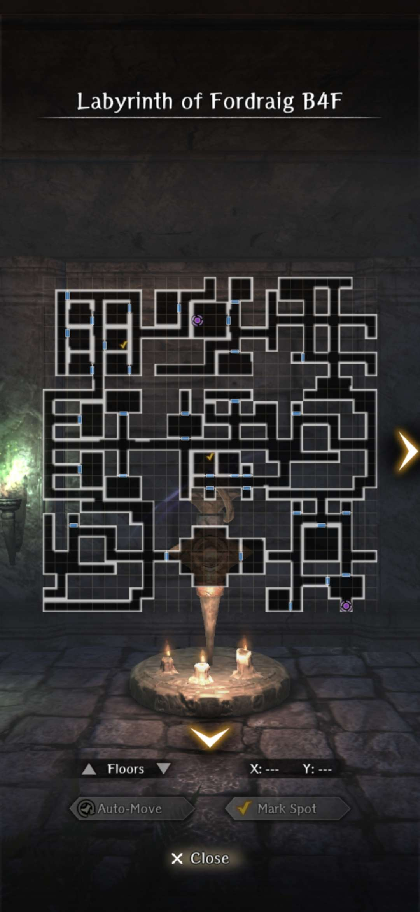
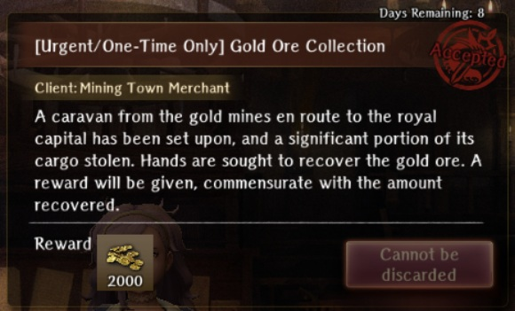
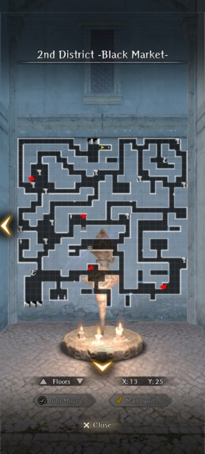
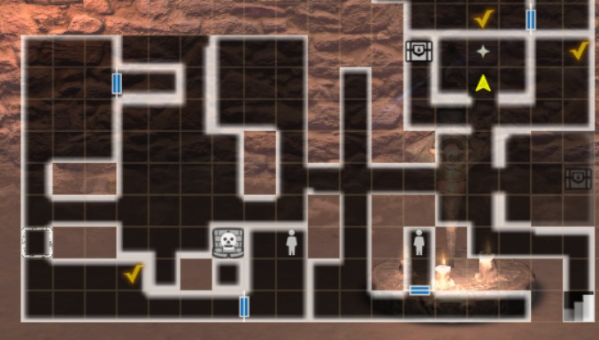

# Recurring Events 
This page is intended to capture smaller, recurring events that usually pop up as Adventurers Guild or similar requests and take place in one of the main Abysses. 

## Adventurer Retrieval (Labyrinth of Fordaig)

### Unlock Condition

- Clear the second run ("True" ending) of the [Stolen Armor Retrieval](../labyrinth-of-fordraig/labyrinth-of-fordraig-guide.md) special request. 

### Overview

??? note "How to Accept the Request" 

    - Available in the Royal Capital under the Featured Requests tab. It is available for a limited time until 3/11 23:59 JST.
    - The request cannot be discarded after accepting. 

??? note "Objectives"

    - The goal is to revisit the Labyrinth of Fordaig and collect the bodies of 12 adventurers scattered across all 4 floors.
    - When collecting the bodies you will be forced into a fight against undead enemies. The battles become increasingly more challenging as you progress. The final set of fights on B4F includes Necromancers that are roughly on par with their sentry versions in Abyss 3.  
    - You can exit and return at any point. It will not reset your progress. 
    - The request is very straightforward. Use the maps for each floor and path to the yellow check-marks. 

??? note "Preparation"

    === "Recommended Loadout" 
    
        - Expulsion weapons from Abyss 3 otherwise you will do ~50% less physical damage.
        - Yekaterina (increased damage to undead enemies; standard style).
        - The number of mobs per fight increases per floor, so bringing multiple Mages with MA- or LA- spells can be helpful.
        - Undead Slayer nodes for the MC in the Well of the Mind.

    === "Enemy Levels (Fixed)"
   
           - B1F = Level 30
           - B2F = Level 40 
           - B3F = Level 49
           - B4F = Level 61 

### Rewards

!!! warning "Do NOT turn in the request until all 12 bodies have been collected otherwise you will miss out on getting all 48 No Name tags!"

- The base reward is 4 No Name tags and 5,000 gold for collecting 1 body. You receive 4 No Name tags and 5,000 gold per additional body collected. 
- A grand total of 48 No Name tags and 60,000 Gold for collecting all 12 bodies. 

### Maps 

- The yellow check-marks are the locations of each body. Note that 2 of the bodies are accessed via the purple teleporters located on B1F (by the Harken) and B4F (SE corner), which will take you to the small sides are on B2F.
- There is no way to check the number of bodies you have collected. They are not shown in your Valuables or Requests List. It is important that you keep track to avoid losing out on the No Name tags. 

??? map "Map B1F - 3 Bodies "
    

??? map "Map B2F - 4 Bodies"
    
   
??? map "Map B3F - 3 Bodies"
    

??? map "Map B4F - 2 Bodies"
    

## Gold Ore Collection 

### How to participate: 
- Accept the Gold Ore Collection request from Arna in the Royal Capital Luknalia 
- The request will be available for a limited time, and cannot be discarded after acceptance. 
- The quest involves finding buried gold ore and thieves guarding ore in certain Abyss locations.  Upon accepting the request, Arna will direct you to the correct town of the abyss to search.  This should coincide with the most advanced Abyss you have accessed. 
- Having Marianne in your adventuring party will increase the amount of gold you find at each locatation, making the request completion faster, but her presence is not required to get the full reward.
- After accepting the request, you can meet an Old Man in the guild tavern who you can pay to mark your map with a location of buried gold ore.  This is not required but will get you ore faster.  Every few days he will provide you with an additional locations for another payment.
- The request is completed the first time you turn it in and cannot be continued/repeated during the event period.  *Do not turn it in early.*

### Rewards 
- There is a small fixed gold coin reward for completing the request. 
- There is a bonus gold coin reward for the amount of gold ore retrieved.  This reward scales with the Abyss you were assigned to search.  

| Abyss | Location | Max Ore | Max GP Reward | 
|:----:|:----:|:----:|:-----:| 
| Abyss 1 | ?? | 6,000 | 400,000 | 
| Abyss 2 | District 2 | 12,000 | 600,000 | 
| Abyss 3 | Zone 1 | 24,000 | 1,000,000 | 

### Completion Process
- After accepting the request, go to the indicated Abyss and start searching the different levels.  Lulunarde will inform you of the presence of the thieves when you arrive on the correct level. 
- On the level there will be a fixed number of locations that can randomly spawn an non-mobile monster, which will be a group of thieves. After killing the thieves you find a small amount of gold ore.  
- Leaving the Abyss and returning to the level, the thieves will randomly respawn at the same set of locations.  
- If you paid the Old Man for a buried ore location, it should be marked on your map, and a glowing white object indicator should be found at that location. This will provide you with an amount of gold ore several times larger than a group of thieves.  
- After collecting any amount of ore, Lulunarde will let you know it's up to you if you want to search for more, and you wil receive a Request Complete message.  At any point after this you can turn in your ore at the guild for some additional reward.  
- After collecting the maximum amount of ore corresponding to the Abyss list above, you will be informed that you have it all, and thieves will stop appearing at the spawn locations. Turning in the request will give you the maximum reward.
   
### Ore Locations
#### Abyss 1
<!--  -->

#### Abyss 2
District 2 - Black Market  
In Abyss 2, each group of thieves should get you 200 ore, with another 100 if Marianne is present.  
The fastest (almost always no-combat) method is Harkening into District 2, auto-walk to the two closest locations, then auto-exit the level, auto-exit to the Harken, Return, and repeat.  
  

#### Abyss 3
Zone 1  
In Abyss 3, each group of thieves should get you 400 ore, with another 200 if Marianne is present.  
The fastest farming route is to Harken into Zone 1, check the closest spot, exit, and return.  

