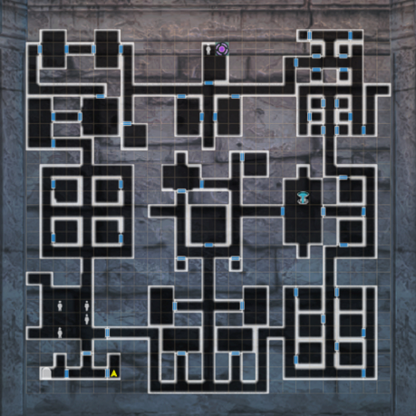
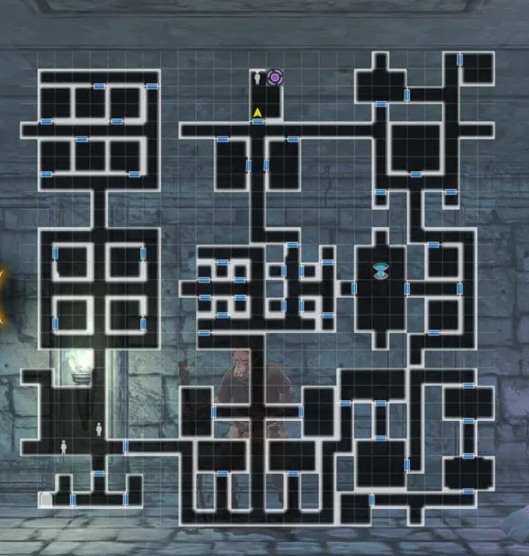
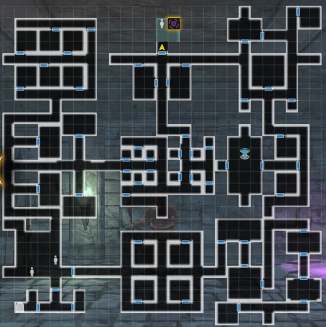
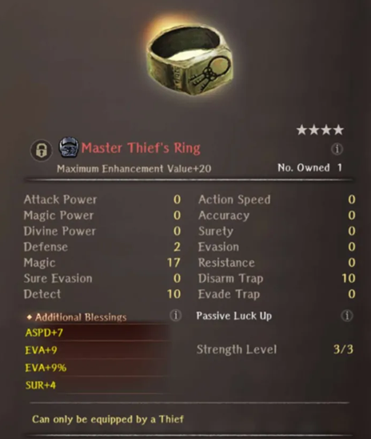

# Thief Trials

## Guide:

There is no introduction to this event. Simply start the event by heading to the Royal Capital and accepting Beginner Thief Trial in the Featured tab. This will mark the location on your map.

You can obtain up to 600 Seals of the Thief by completing the trials up the Advanced. There are no missions for this event in particular.

There are several map variations, and are random upon entering. It is not necessary to explore the whole map. You only need to open the number of chests indicated and defeat the boss (mimic) by the final room.

Specifically for this trial, there are no wandering enemies. Upon failing any chest opening, you will fight a mimic. 

Chests are typically static throughout the map variations and difficulties (They are in the same spots at every same map chunk)

If you fail rhe boss fight and Rise Again yiu will respawn on the chest and must step off snd on again to retry the fight.  You can step north through the door into the final room and talk to the Master Thief/use rhe teleporter, but without having killed the mimic yiu will fail the Trial.

??? note "Map Variation 1"
    

??? note "Map Variation 2"
    

??? note "Map Variation 3"
    

??? note "Map Variation 4"
    

??? note "Tips"
    - Remember to carry potions on all three characters.
    - Carry a healing staff switch so you can use healing spells from the MC and/or other characters who have access to dios/madios. Consider using Self-Healing as well with a divine staff.
    - Trap difficulty is similar to harder chests in the 1st, 2nd, and 3rd Abyss, respectively. Disarm around 60 is manageable on Beginner Traps, around 130 on Advanced.  
    - The boss fights are all mimics and cannot be avoided.  
    
??? danger "Beginner Difficulty Fight Tips"
    - It's a normal mimic. It will always go first with "Sudden Attack" dealing a small amount of damage (~150-200HP).  
    - It almost always targets the least evasive front row character.  
    - It has very little HP but cannot be suretied.  
    - It is highly susceptible to Poison type attacks and Poison Damage.  
    - High enough evasion (>100) can avoid almost all attacks after the initial attack.  
    - Evasion boosting gear, hiding, evasion boost spells, and defending can ride out the fight while Poison does all thr work. 

??? danger "Intermediate Difficulty Fight Tips"
    - It's a normal mimic. It will always go first with "Sudden Attack" dealing a decent amount of damage (300-400HP)  
    - It almost always targets the least evasive front row character.  
    - It has very little HP but cannot be suretied.  
    - It is highly susceptible to Poison type attacks and Poison Damage.  
    - High enough evasion (>150) can avoid almost all attacks after the initial attack.  
    - Evasion boosting gear, hiding, evasion boost spells, and defending can ride out the fight while Poison does all thr work. 

??? danger "Advanced Difficulty Fight Tips"
    - It's a gold mimic. It will always go first with "Sudden Attack" dealing a decent amount of damage (500+ HP).
    - It almost always targets the least evasive front row character.  
    - It does not take any damage from any sources besides Poisoning it. In fact, it will take extremely large amounts of damage when poisoned. It's recommended to use Poison Berry after poisoning it normally.  
    - It can also be bled with Blood Edge.  
    - It is immune to all other debuffs/CC.  
    - High enough evasion (>200) can avoid almost all attacks after the initial attack.  
    - Evasion boosting gear, hiding, evasion boost spells, and defending can ride out the fight while Poison does all thr work. 

??? tip "Sacrificial Lamb Strategy"  

    Under-leveled parties are more than capable of completing all Thief Trials as long as you can disarm the traps and stack enough EVA on one character.  You do however, have to survive the first mimic attack. 
    One approach is to bring two thiefs with the MC. On thief has all your best EVA gear stacked on them in the front row.  The MC goes behind that thief.  The third thief goes at the front in a different column.  
    The mimic will very likely attack that low EVA thief.  If they die, dont revive them. Not worth hurting/paralyzing the MC. The high EVA front thief hides.  The MC casts MASOLOTU on the front row if he has it, or hides as well.   Assuming the mimic misses the EVA thief, the front thief just defends and keeps hide up. The MC does poison attacks/poison berry and renews any buffs.  If a stray attack gets through, defending hopefully keeps it survivable. and you can heal/rehide. Continue until poison kills the mimic.
    
??? note "Master Thief Ring"
    
    - The Thief ring is always 4* Red and has fixed stats. Full Alter Stones can reroll the values but not the actual stat lines.

