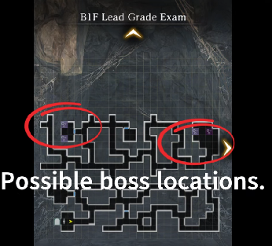

# Grade Exams

## Lead Exam

*Images courtesy of [https://www.youtube.com/@Grafarya89](https://www.youtube.com/@Grafarya89)*

**Special Notes:**

- Boss summons adds every few rounds. Save AoE clears for them. If have legendary units with Secret Arts, place them in back middle position to use them here.  
- Boss is undead. Bring undead slayer weapons if possible, or a lot of magic scrolls.  
- Boss sometimes skips turn.  
- Boss only has 2 moves, both attack 1 unit on the front row. 1 is a multihit, 1 is a normal hit. Not really threatening, just heal up after.
- Running away from the fight will reset the adds he spawns with. You can use this to your advantage and keep running away until he spawns with only Vorpal Bunnies, as they can be killed very quickly and easily.

## Bronze Exam

*Images courtesy of [https://www.youtube.com/@Grafarya89](https://www.youtube.com/@Grafarya89)*

**Special Notes**:

- Boss doesn’t summon any adds  
- Boss is weak to wind  
- Mobs on the way to boss can mostly be dealt with Scroll of Rockfall, except Air Entities. Those need Fire.  
- Boss hits like a truck.  
  - Tail Swipe AoE hits all front row with chance to stun.  
  - Jump attack hits 1 front row, swaps that column’s front and back.  
  - Buildup leads to Stinger next hit, hits 1 column with chance to fear. Block or take big damage.  
- Doesn’t seem to show Opening after being blocked (Need verification?)  
- As usual, stock inventory full of healing potions to save on MP on the way to boss.

## Iron Exam

**Special Notes**:

- Boss is a Hydraplant and is weak to wind and can cause critical poison