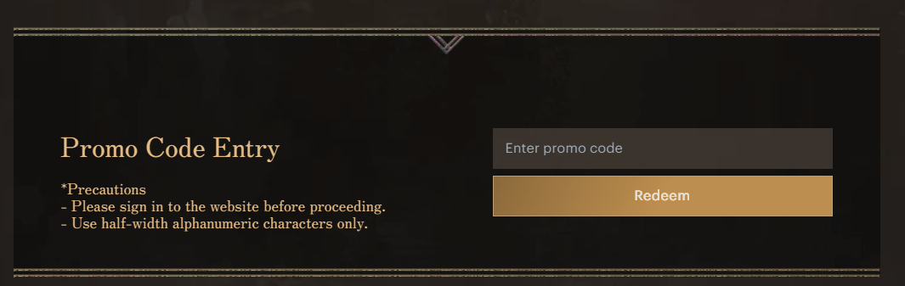

# Wizardry Variants: Daphne Community Guide

!!! warning "**Warning: This guide contains spoilers.**"

-   __New to Wizardry Variants: Daphne?__

    ---

    **Abyss Guides**

    - [Introduction](./abyss-guides/0-introduction/index.md)
    - [Beginning Abyss](./abyss-guides/1-beginning-abyss/important-request-gwo.md)
    - [Port Town Legion](./abyss-guides/2-port-town-grand-legion/important-request-gwo.md)
    - [Guarda Fortress](./abyss-guides/3-guarda-fortress/important-request-gwo.md)

-   __How Do I Get Stronger?__

    ---

    **Adventurer and Party Customization**

    - [Building Your Party](./strategies/party-construction.md)
    - [Blacksmithing](./adventurer-customization/blacksmithing/index.md)
    - [Bondmates](./adventurer-customization/bondmates/bondmates-quicklist.md)
    - [Well of the Mind](./adventurer-customization/well-of-the-mind.md)
    - [Relicbrew](./adventurer-customization/relicbrew.md)
    - [Class Change](./adventurer-customization/class-changes.md)
-   __Raising Trust__

    ---

    - [Trust Guide](./mechanics/trust/trust.md)
    - [Trust Dialogue](./mechanics/trust/table.md)

-   __Tools__

    ---

    - [Respawn Tracker](./tools/tracker.md)
    - [Blacksmithing Simulator (preview)](./tools/blacksmith-simulator.md)

-   __Game Download__

    ---

    - [Steam](https://store.steampowered.com/app/2379740/Wizardry_Variants_Daphne/)
    - [Google Play Store](https://play.google.com/store/apps/details?id=jp.co.drecom.wizardry.daphne&hl=en_AU&pli=1)
    - [Apple App Store](https://apps.apple.com/au/app/wizardry-variants-daphne/id1663423521)

-   __More Questions?__

    ---

    - [Frequently Asked Questions](frequently-asked-questions.md)

## Promotional Codes

Promotional codes can be entered via the [Official Wizardry Store](https://store.wizardry.info/)

### Active Codes
| Code       | Contents       | Source             |
|------------|----------------|--------------------|
| `834ZG0vew8` | 200 Gem of Org | Social Media Event |
| `FhjW4rRMy1` | 200 Gem of Org | Social Media Event |
| `mfQ3tBS7lb` | 200 Gem of Org | Social Media Event |

## About the Guide

Welcome to the Community Guide maintained by members of the [Wizardry Variants: Daphne Discord Server](https://discord.gg/YjYmUCkBXK)!

Find out more about:

- The Abyss and its fearsome Greater Warped Ones
- Requests, Adventurers, Bondmates
- Gameplay Mechanics and more!

Good Luck, and **Savor the Risk!**

!!! tip "Can't find what you need? Try **Search** at the **top** of the page!"

!!! warning "We do not tolerate any abuse of maintainers, contributors or community members."

## Contributing

- [Feedback and Suggestions (Discord: #guide-contributions)](https://discord.com/channels/1296602475918524507/1310256313720377364)
- [GitHub Contributions](./CONTRIBUTING.md)

## Maintainers

- Baldcat
- Gagging
- Lynd
- TheAxolotl
- SocialX
- nrjank

## Resources

[Official Wizardry Portal](https://wizardry.info/en)  
[Wizardry Subreddit](https://www.reddit.com/r/wizardry/)  
[Wizardry Daphne Subreddit](https://www.reddit.com/r/WizardryDaphne/)  
[Wizardry Wiki](https://wizardry.wiki.gg/wiki/Wizardry_Wiki)  
[Wizardry Subreddit and Wiki Discord](https://discord.gg/cknNfGG7YC)
