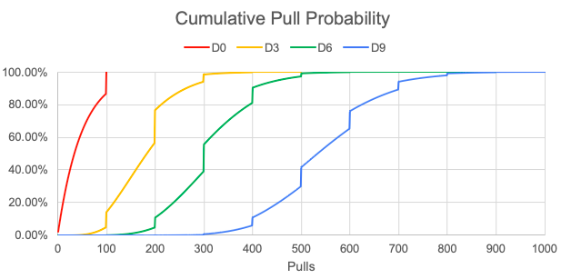

# Discipline and Inheritance

## Discipline
Discipline boosts all of your stats by a set amount per duplicate (not per skill level) and can go up to a maximum skill level of 9 at 1500 Mastery. The amount each stat gets boosted is static, but it's not completely uniform. The below tables highlight the increase in stats at a particular Discipline level. The key thing to note is that most stats follow the same scaling, with `HP`, `Surety`, and `ASPD` being different. Also at most, a featured non-HP stat will only increase the total value by `36`, while a non-featured non-HP stat will only increase the value by `28`. The lower level you are, the more impactful it is, but since these are static increases, they will significantly lose their value as our overall stats increase due to higher levels and grades in the future.

### Discipline Stat Gains

=== "Legendary Adventurer Stats"

    |      Stat      |  D1 |  D2 |  D3 |  D4 |  D5 |  D6 |  D7 |  D8 |  D9 |
    |:---------------|:---:|:---:|:---:|:---:|:---:|:---:|:---:|:---:|:---:|
    |  HP            |  10 |  18 |  30 |  43 |  56 |  75 |  88 | 101 | 120 |
    |  MP            |   2 |   4 |   8 |  10 |  12 |  16 |  19 |  22 |  28 |
    |  SP            |   2 |   4 |   8 |  10 |  12 |  16 |  19 |  22 |  28 |
    |  Attack Power  |   2 |   4 |   8 |  10 |  12 |  16 |  19 |  22 |  28 |
    |  Magic Power   |   2 |   4 |   8 |  10 |  12 |  16 |  19 |  22 |  28 |
    |  Divine Power  |   2 |   4 |   8 |  10 |  12 |  16 |  19 |  22 |  28 |
    |  Defense       |   2 |   4 |   8 |  10 |  12 |  16 |  19 |  22 |  28 |
    |  Magic Defense |   2 |   4 |   8 |  10 |  12 |  16 |  19 |  22 |  28 |
    |  Surety        |   0 |   0 |   0 |   0 |   0 |   0 |   0 |   0 |   0 |
    |  Sure Evasion  |   0 |   0 |   0 |   0 |   0 |   0 |   0 |   0 |   0 |
    |  Detect        |   2 |   4 |   8 |  10 |  12 |  16 |  19 |  22 |  28 |
    |  Disarm Trap   |   2 |   4 |   8 |  10 |  12 |  16 |  19 |  22 |  28 |
    |  Evade Trap    |   2 |   4 |   8 |  10 |  12 |  16 |  19 |  22 |  28 |
    |  Action Speed  |   2 |   3 |   6 |   7 |   8 |  11 |  13 |  15 |  18 |
    |  Accuracy      |   2 |   4 |   8 |  10 |  12 |  16 |  19 |  22 |  28 |
    |  Evasion       |   2 |   4 |   8 |  10 |  12 |  16 |  19 |  22 |  28 |
    |  Resistance    |   2 |   4 |   8 |  10 |  12 |  16 |  19 |  22 |  28 |

=== "Legendary Adventurer Featured Stats"

    |      Stat     |  D1 |  D2 |  D3 |  D4 |  D5 |  D6 |  D7 |  D8 |  D9 |
    |:--------------|:---:|:---:|:---:|:---:|:---:|:---:|:---:|:---:|:---:|
    |       HP      |  12 |  22 |  36 |  52 |  68 |  90 | 106 | 122 | 144 |
    |       MP      |  4  |  6  |  10 |  12 |  14 |  20 |  24 |  28 |  36 |
    |       SP      |  4  |  6  |  10 |  12 |  14 |  20 |  24 |  28 |  36 |
    |  Attack Power |  4  |  6  |  10 |  12 |  14 |  20 |  24 |  28 |  36 |
    |  Magic Power  |  4  |  6  |  10 |  12 |  14 |  20 |  24 |  28 |  36 |
    |  Divine Power |  4  |  6  |  10 |  12 |  14 |  20 |  24 |  28 |  36 |
    |    Defense    |  4  |  6  |  10 |  12 |  14 |  20 |  24 |  28 |  36 |
    | Magic Defense |  4  |  6  |  10 |  12 |  14 |  20 |  24 |  28 |  36 |
    |     Surety    |  2  |  3  |   6 |   8 |  10 |  13 |  15 |  17 |  20 |
    |  Sure Evasion |  0  |  0  |   0 |   0 |   0 |   0 |   0 |   0 |   0 |
    |     Detect    |  4  |  6  |  10 |  12 |  14 |  20 |  24 |  28 |  36 |
    |  Disarm Trap  |  4  |  6  |  10 |  12 |  14 |  20 |  24 |  28 |  36 |
    |   Evade Trap  |  4  |  6  |  10 |  12 |  14 |  20 |  24 |  28 |  36 |
    |  Action Speed |  4  |  5  |  8  |  9  |  10 |  13 |  15 |  17 |  20 |
    |    Accuracy   |  4  |  6  |  10 |  12 |  14 |  20 |  24 |  28 |  36 |
    |    Evasion    |  4  |  6  |  10 |  12 |  14 |  20 |  24 |  28 |  36 |
    |   Resistance  |  4  |  6  |  10 |  12 |  14 |  20 |  24 |  28 |  36 |

=== "General Adventurer Stats"

    |      Stat     |  D1 |  D2 |  D3 |  D4 |  D5 |  D6 |  D7 |  D8 |  D9 |
    |:-------------:|:---:|:---:|:---:|:---:|:---:|:---:|:---:|:---:|:---:|
    |       HP      |   6 |  12 |  20 |  28 |  36 |  50 |  64 |  78 | 100 |
    |       MP      |   1 |   2 |   6 |   7 |   8 |  12 |  14 |  16 |  20 |
    |       SP      |   1 |   2 |   6 |   7 |   8 |  12 |  14 |  16 |  20 |
    |  Attack Power |   1 |   2 |   6 |   7 |   8 |  12 |  14 |  16 |  20 |
    |  Magic Power  |   1 |   2 |   6 |   7 |   8 |  12 |  14 |  16 |  20 |
    |  Divine Power |   1 |   2 |   6 |   7 |   8 |  12 |  14 |  16 |  20 |
    |    Defense    |   1 |   2 |   6 |   7 |   8 |  12 |  14 |  16 |  20 |
    | Magic Defense |   1 |   2 |   6 |   7 |   8 |  12 |  14 |  16 |  20 |
    |     Surety    |   0 |   0 |   0 |   0 |   0 |   0 |   0 |   0 |   0 |
    |  Sure Evasion |   0 |   0 |   0 |   0 |   0 |   0 |   0 |   0 |   0 |
    |     Detect    |   1 |   2 |   6 |   7 |   8 |  12 |  14 |  16 |  20 |
    |  Disarm Trap  |   1 |   2 |   6 |   7 |   8 |  12 |  14 |  16 |  20 |
    |   Evade Trap  |   1 |   2 |   6 |   7 |   8 |  12 |  14 |  16 |  20 |
    |  Action Speed |   1 |   2 |   4 |   5 |   6 |   9 |  10 |  11 |  15 |
    |    Accuracy   |   1 |   2 |   6 |   7 |   8 |  12 |  14 |  16 |  20 |
    |    Evasion    |   1 |   2 |   6 |   7 |   8 |  12 |  14 |  16 |  20 |
    |   Resistance  |   1 |   2 |   6 |   7 |   8 |  12 |  14 |  16 |  20 |

=== "General Adventurer Featured Stats"

    |      Stat     |  D1 |  D2 |  D3 |  D4 |  D5 |  D6 |  D7 |  D8 |  D9 |
    |:-------------:|:---:|:---:|:---:|:---:|:---:|:---:|:---:|:---:|:---:|
    |       HP      |  10 |  18 |  30 |  43 |  56 |  75 |  88 | 101 | 120 |
    |       MP      |   2 |   4 |   8 |  10 |  12 |  16 |  19 |  22 |  28 |
    |       SP      |   2 |   4 |   8 |  10 |  12 |  16 |  19 |  22 |  28 |
    |  Attack Power |   2 |   4 |   8 |  10 |  12 |  16 |  19 |  22 |  28 |
    |  Magic Power  |   2 |   4 |   8 |  10 |  12 |  16 |  19 |  22 |  28 |
    |  Divine Power |   2 |   4 |   8 |  10 |  12 |  16 |  19 |  22 |  28 |
    |    Defense    |   2 |   4 |   8 |  10 |  12 |  16 |  19 |  22 |  28 |
    | Magic Defense |   2 |   4 |   8 |  10 |  12 |  16 |  19 |  22 |  28 |
    |     Surety    |   1 |   2 |   4 |   5 |   6 |   9 |  10 |  11 |     |
    |  Sure Evasion |   0 |   0 |   0 |   0 |   0 |   0 |   0 |   0 |  0  |
    |     Detect    |   2 |   4 |   8 |  10 |  12 |  16 |  19 |  22 |  28 |
    |  Disarm Trap  |   2 |   4 |   8 |  10 |  12 |  16 |  19 |  22 |  28 |
    |   Evade Trap  |   2 |   4 |   8 |  10 |  12 |  16 |  19 |  22 |  28 |
    |  Action Speed |   2 |   3 |   6 |   7 |   8 |  11 |  13 |  15 |  18 |
    |    Accuracy   |   2 |   4 |   8 |  10 |  12 |  16 |  19 |  22 |  28 |
    |    Evasion    |   2 |   4 |   8 |  10 |  12 |  16 |  19 |  22 |  28 |
    |   Resistance  |   2 |   4 |   8 |  10 |  12 |  16 |  19 |  22 |  28 |
    
### Copies Per Discipline Level

=== "Legendary"

    | Discipline Level | Number of Copies | Number of Cumulative Copies |
    | ---------------- | ---------------- | --------------------------- |
    | 0                | 1                | 1                           |
    | 1                | 1                | 2                           |
    | 2                | 1                | 3                           |
    | 3                | 2                | 5                           |
    | 4                | 1                | 6                           |
    | 5                | 1                | 7                           |
    | 6                | 2                | 9                           |
    | 7                | 2                | 11                          |
    | 8                | 2                | 13                          |
    | 9                | 3                | 16                          |

=== "General"

    | Discipline Level | Number of Copies | Number of Cumulative Copies |
    | ---------------- | ---------------- | --------------------------- |
    | 0                | 1                | 1                           |
    | 1                | 1                | 2                           |
    | 2                | 1                | 3                           |
    | 3                | 3                | 6                           |
    | 4                | 3                | 9                           |
    | 5                | 3                | 12                          |
    | 6                | 6                | 18                          |
    | 7                | 5                | 23                          |
    | 8                | 5                | 28                          |
    | 9                | 8                | 36                          |

## Inheritance
Inheritance allows you to give skills from one adventurer to another or increase the level of inherited skills on an adventurer. Skills have different maximum levels. For example, Legendary and General Adventurer skills have a maximum inheritance count of 6, so depending on if an adventurer comes with that skill by default, they can get it to either level 6 or level 7. Anonymous adventurer skills have a maximum inheritance count of 14, which leads to a maximum level of either 14 or 15, again depending on if an adventurer comes with that skill by default.

Inheritance can increase through either using duplicates of that particular adventurer or using codexes, which are much more general purpose and can be applied to any skill.

### Copies Per Inheritance Count

=== "Legendary"

    | Inheritance Count | Number of Copies | Number of Cumulative Copies |
    | ----------------- | ---------------- | --------------------------- |
    | 1                 | 1                | 1                           |
    | 2                 | 1                | 2                           |
    | 3                 | 2                | 4                           |
    | 4                 | 2                | 6                           |
    | 5                 | 3                | 9                           |
    | 6                 | 3                | 12                          |

=== "General"

    | Inheritance Count | Number of Copies | Number of Cumulative Copies |
    | ----------------- | ---------------- | --------------------------- |
    | 1                 | 1                | 1                           |
    | 2                 | 3                | 4                           |
    | 3                 | 5                | 9                           |
    | 4                 | 5                | 14                          |
    | 5                 | 9                | 23                          |
    | 6                 | 9                | 32                          |

=== "Anonymous"

    | Inheritance Count | Number of Copies | Number of Cumulative Copies |
    | ----------------- | ---------------- | --------------------------- |
    | 1                 | 1                | 1                           |
    | 2                 | 2                | 3                           |
    | 3                 | 3                | 6                           |
    | 4                 | 4                | 10                          |
    | 5                 | 6                | 16                          |
    | 6                 | 8                | 24                          |
    | 7                 | 10               | 34                          |
    | 8                 | 12               | 46                          |
    | 9                 | 14               | 60                          |
    | 10                | 18               | 78                          |
    | 11                | 20               | 98                          |
    | 12                | 22               | 120                         |
    | 13                | 24               | 144                         |
    | 14                | 26               | 170                         |

## Should I use my duplicates for Discipline or Inheritance?
This is an extremely frequently asked and hotly debated question, and there is no general, community-wide consensus. Both are potentially solid options, and here are some pros and cons of each.

!!! note "Some of these pros and cons are only applicable to Legendary duplicate usage"

### Discipline Pros and Cons
* Pro: Stat gains are never a bad thing
* Pro: Stat gains will always be relevant no matter what active skills you use
* Pro: HP gains are pretty standout, as are stats to things like Disarm Trap where a small number of static points go a long way
* Con: Attack and Magic power gains in particular are small. At max Discipline, you're generally looking at 28-40ish points more (the higher end if it's a featured stat), which ultimately amounts to less than that in more damage per basic attack
* Con: Discipline is a very low impact per duplicate
* Con: It takes a very high Discipline level to have a very noticeable stat gain, with low Discipline levels resulting in largely negligible changes
* Con: Discipline is a static value and will become less impactful as base stats increase due to level increases

### Inheritance Pros and Cons
* Pro: Skill inheritance to the source adventurer can make a very noticeable immediate impact
* Pro: Inheriting a skill to another adventurer can provide more overall team versatility and utility than increasing one adventurer's Discipline
* Pro: The logarithmic nature of damage skills means inheritance is necessary for them to stay relevant as attack power grows
* Pro: The overall duplicate cost of maximum skill inheritance is lower than the duplicate cost of maximum Discipline
* Con: Primarily with active skills, inheriting can greatly increase the SP/MP costs, making it less likely that you'll be able to use a skill frequently
* Con: Primarily with active skills, inheriting to a skill could result in "wasted" dupes long-term if new active skills get released that are notably stronger than an adventurer's signature skill
* Con: Some inheritable skills have very little value after an initial inherit, while it's hard to measure the value of other skill inherits

### TheAxolotl's Opinion

The following is TheAxolotl's opinion - feel free to consider it, but I encourage you to form your own opinion, as well.

To be blunt, I am not a big fan of Discipline in general. It's fine - more stats are always good, and if you go as far as getting up to Discipline 9, you can get a hefty ~28 added to most stats (and potentially more to the featured stats). The problem I have is that the value per dupe spent on Discipline is relatively low.

I consider there being three main breakpoints for Discipline:

1. Discipline 1: This unlocks the passive skill, and while it doesn't make a massive tangible impact on performance, I personally hate having locked skills on adventurers I use
2. Discipline 6: This maximizes the +2 stats per level rate and gives us roughly +16 stats for 8 dupes (9 copies total)
3. Discipline 9: Might as well go all out

An honorable mention goes to Disciplines 2 and 5, which are the last of the Disc levels where 1 Dupe = 1 Disc (albeit to get to 5, you do have to use 2 dupes for Disc 3).

Alternatively, Skill Inheritance can have equivalent or better impact on overall party performance for a similar or lesser dupe cost, particularly when you consider that skills generally see a jump in effectiveness on odd levels. Discipline 3 takes 4 dupes to achieve. With those 4 dupes, you could increase a Legendary Adventurer's skill level to level 3 (costing you 3 dupes) and still have a single dupe left over to either get to Disc 1 or inherit that skill on another adventurer, like your MC.

Is Discipline bad? Not at all - stat increases are always good. Is Discipline better than Skill Inherit? This is very debatable, but my opinion is very rarely.

What do I do with my dupes? I have a general process of:

1. First dupe - Discipline 1, strictly for my OCD. I don't like locked skills.
2. Additional duplicates - inherit to the MC or other adventurers OR get the featured Legendary's skill to an odd level (3 is a great target, 5 or 7 are good if you have a lot of dupes) for a noticeable damage boost
3. Once I hit the skill levels I want on whatever adventurers I want to give it to, only then will I consider going for more Discipline levels

## Should I pull for duplicates?

This is a much harder question to answer, as it will depend on what you plan to use those duplicates for and what your budget is. To help you make this decision, let's look at some probabilities, courtesy of Memento in the Wizardry Variants Discord.

The rate up for the featured legendary adventurer is 2% with no pity system or 50/50 system. The probabilities below rely on the assumption that at 100 pulls, you spend your tokens on a duplicate. If you spend them on equipment instead, you can assume you will have different numbers here. Below is a look at how many pulls you need for a specific percentage chance of getting the number of copies you want.

For those that like to see this information graphed, here's the cumulative pull probability distributions that correspond with the data above.

Regarding Discipline in particular, many people consider the HP you get with Discipline as one of the main reasons to increase the Discipline levels. Here's a look at the average HP gained per pull at different Discipline levels. We're also including MP per pull for funzies and because Memento did this analysis when Sheli was released. It's...not great. That's not to say that the HP at those Discipline levels isn't great, rather the gain per pull is extremely small.

So what does this all mean in summary? Well, chasing duplicates is very expensive and chasing Discipline for HP is only really advisable for whales as the value you get for the cost you incur is extremely small.
