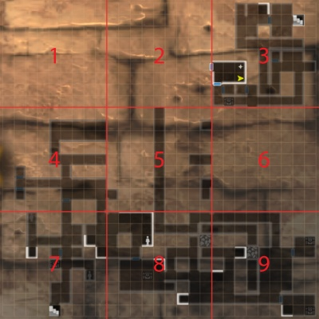
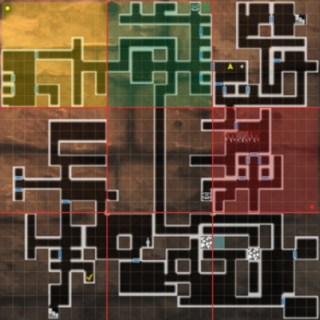
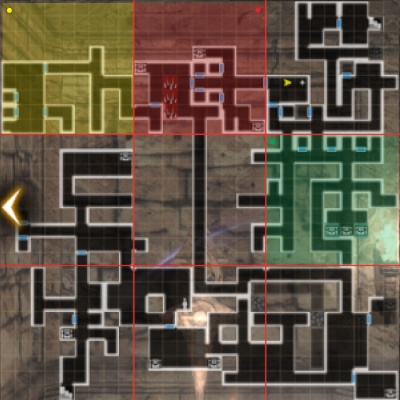
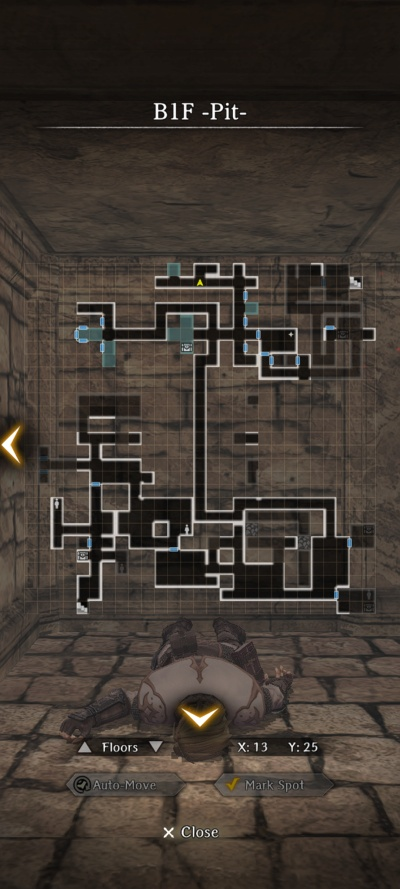
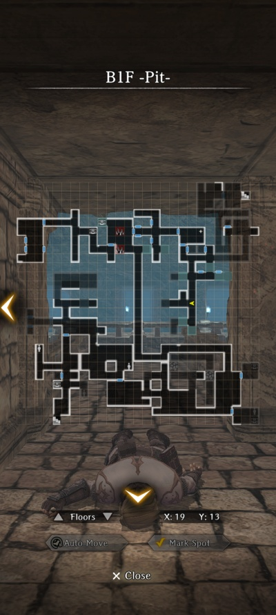
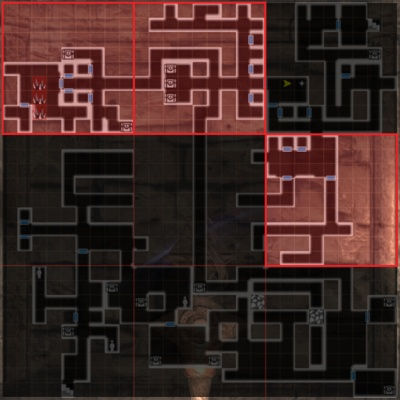

# Dungeon Map Variations  
Players often report confusion about maps, event locations, items, etc., not matching what we show on our guide pages. It turns out many dungeon maps do not have a completely fixed layout.  Thankfully they arent completelg random, they're tiled, and we explain them below.

??? note "HELP I CAN'T FIND XYZ!"
    If you can't find something because your map is different from what you see in the guide: Look for features based on the tile moves described below.  We have tried to have location references either include a map or coordinates that refer to the main map shown on any of the dungeon map pages. Rooms are always the same shape, chests are always in the same spots in those rooms, they were shifted, <em>but they very probably are there.</em>

!!! note "The discussion below focuses on the Beginning Abyss but (so far) also applies to all other maps with tile variations."

## Map Resetting  
Certain events and player actions can 'reset' dungeon maps which may change previously explored map layouts. For example, Cursed Wheel leaping back to "Awakening" resets the Beginning Abyss dungeon and layout. Below you see the Beginning Abyss map B1F as it might appear after having fully explored the map but then 'resetting' it and then entering at the Harken.  

Notice how all explored areas get a 'fog of war' effect until it re-enters your field of view (like the Harken Room shown), but also there are several 'blanked out' areas that need to be reexplored anew, with each square 'unexplored' until you step on that spot. The blanked areas are variable map areas that <em>might</em> change layout on a reset, and where you <em>may</em> see differences between our maps and your game.

Take note in particular that most maps can be neatly sliced into a set of tiles that divide the map and clearly show boundaries around tiles that can change. (All maps may not be 3x3.)

  

## Map tiling behavior and movement  
Below, the tiles highlighted in blue are fixed tiles. They will not change.  Most main story material occurs in these areas.  Any complicted dungeon effects often occur there as well (e.g., 2nd Abyss waterways), as one would imagine the increased design complexity of having those effects follow changing layouts.  The remaining tiles are the variable tiles.

  

These tiles can move, rotate, and possibly flip in the different positions.  Below see the same tileset in three different configurations, with each tile colored so you can follow how they moved.

=== "B1F Variation A"  
      
    
=== "B1F Variation B"  
      
    
=== "B1F Variation C"  
      

## Effects on events, items, and NPC location  
Items, NPCs, and quest objectives located within these variable tiles <em>will always appear at the same place within the tile</em> regardless of its placement and rotation within the full map.

Example: With the B1F Chris the Considerate bondmate request the objective locationis always located in the green highlighted tile above. In the new location, the same objective is located in the same relative location but the tile is now on the left and rotated counterclockwise. These two positions are shown in the variations below, with the same relative location indicated by the player's yellow position arrow:

=== "Event - Map Variation A"  
      
    
=== "Event - Map Variation B"  
      

## Beginning Abyss Variable Tiles
Below are maps of the five floors in the Beginning Abyss that have tile variations, highlighting the variable tiles. 

=== "Abyss 1 B1F"  
      
    
=== "Abyss 1 B3F"  
      
    
=== "Abyss 1 B4F"  
      

=== "Abyss 1 B6F"  
      

=== "Abyss 1 B7F"  
      

Take note of a couple things:  

1. Floor 6 breaks the rules. It only has a single 'movable' tile, and as the [Beginning Abyss maps page](../abyss-guides/1-beginning-abyss
/maps.md) shows, that one tile just flips horizontally to introduce variability to the teleporter maze. And it's only a partial tile, which is unique and hasn't been seen on any other maps, all of which follow the full tile behavior described above.  
2. For B1F, 3 tiles with 4 rotations and 2 mirror inversions each would be 2^3 4^3 x 3! = 3,072 combinations! There cannot, however, be a full set of combinations for all floors in all possible positions.  They must still make a valid map, hallways must connect, rooms must be accessible, etc.  Still, there could be a significant number of maps for some floors, and this guide makes no attempt to identify and map all actual combinations.  The guide developers want time to play the game, too, and showing a copy of every map is not needed to <em>guide</em> players through the game.  
3. If any notable concerns about or deviations to the above appear in your game, feel free to comment below or join the discussion over on the [Wizardry Variants Daphne Community Discord](https://discord.com/channels/1296602475918524507/1296602897995403325).

## Credits
Many thanks to @Chartreuse on the [Community Discord](https://discord.com/channels/1296602475918524507/1311222683144556554) for laying this all out only a month after launch.  Apologies it took so long to get this up here for wider visibility!
