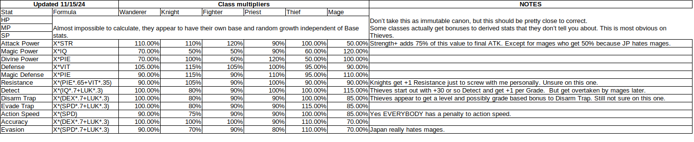

# Character Stats and Discipline

!!! warning "This is an interpretation of what we know about Stats and Discipline as of now and is subject to change as we get more information."

## Character Stats

### How Primary Stats, Substats, and Classes Interact

Looking at the above chart, we can see that while primary stats (STR, IQ, etc) have a direct impact on the substats (Attack Power, Magic Power, etc), it's not completely linear due to the class multiplier. As a base example, if you have a Fighter with 70 STR and no other Attack Power bonuses, that Fighter's Attack Power will be `70*1.2=84`, while a Fighter with 60 STR and no other Attack Power bonuses would have an Attack Power of `60*1.2=72`, or a difference of `12`. This ultimately means that for a Fighter, a 10 point difference in STR results in only a 12 point difference in Attack Power.

### Stat Variance
Stats can vary across two copies of the same Adventurer, and this is due to a combination of level growth, which have an element of randomness, and bonus points. For example, one level 50 Adam could end up with 59 IQ, while another could end up with 73 IQ. We don't have a full understanding of the degree of variance, but when looking at those two Adams, using the chart above, you can see that there's only a difference in Magic Power of `(73-59)*1.2=16.8`. That is not a large difference, especially as our Magic Power increases through equipment.

What does that mean? Ultimately, the impact of primary stats on substats is significantly smaller than the impact of equipment on substats.

### What Does That Mean For Bonus Points?
We've often found ourselves saying bonus points don't matter. This is both true and not true. In one sense, it's not true because there can be a large visible difference between primary stats across Adventurers, however in another sense, it is true because the overall in-battle impact of bonus points is small.

#### How Should You Assign Bonus Points?
There aren't really any bad options here, but the community tends to recommend either the Adventurer's main stat (for example, a Fighter's main stat would be STR), Luck, Speed, or some combination of the three. You cannot break a character with your bonus point allocation. TheAxolotl's personal opinion is STR/IQ/Luck > Speed > Others, but this is subject to change as the game evolves.

## Discipline
Discipline boosts all of your secondary stats by a set amount per duplicate (not per skill level) and can go up to a maximum skill level of 9 at 1500 Mastery. The amount each stat gets boosted is static, but it's not completely uniform. It also seems to be a bigger boost for Legendary Adventurers than General or Anonymous Adventurers. The numbers below reflect the Discipline gains for Legendary Adventurers.

Substats seem to be broken up into four main categories:

* General Stats (most stats)
    * General stats see a boost of +2 per dupe (increased at each Discipline skill level) for Discipline levels 1-6 and an average of +1.5 per dupe for Discipline levels 7-9.
* Featured Stat (Adam's is Magic Power, for example)
    * The Featured stat sees a higher than +2 per dupe increase, but it's less uniform. The increases are always the same across Adventurers at a given Discipline level, but the individual amounts vary between +1 and +3 per dupe on top of the General stat boost.
* HP
    * HP is similar to the Featured stat, however its individual amounts vary between +8 and +19 per dupe (or between +10 and +22 per dupe if HP is the Featured stat), ignoring the General stat boost
* ASPD
    * ASPD sees a smaller than +2 per dupe increase, varying between +1 and +3 per dupe, ignoring the General stat boost

As you can see, this means that while Discipline can add up at higher skill levels, ultimately results in a relatively low boost to performance.

### How Should You Use Your Dupes?
This is going to vary a lot by the Adventurer, but in general, if the Adventurer is a damage dealer with their inheritance skill being an attack (such as Gerard and Gerulf), you will see significantly more damage coming from skill inheritance than from Discipline. However, if your Adventurer is someone like Yekaterina who doesn't have an inheritance skill that deals damage, it's less clear as to where you'll see the bigger gains with dupes.
