# The Beginning Abyss

## Awakening

## Fresh Start

### Requests

#### Sweet Walnut Delivery

??? info "Request"
    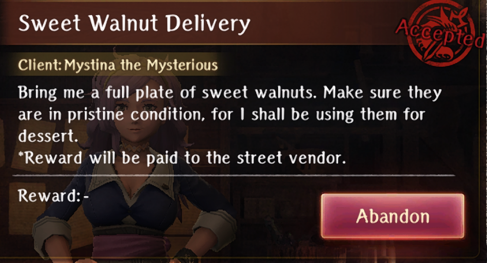

- Talk to the Smirking Adventurer in the tavern  
- Go to Beginning Abyss -Entrance- and gather the Walnuts

??? map "Location"
    

#### Light Shield Material Collection

??? info "Request"
    

- Go to B1 of Beginning Abyss

??? map "Location"
    

#### Fragrant Plant Seed Delivery

??? info "Request"
    

- Go to Inn  
- Go to B1 and find the herbs

??? map "Location"
    
    
    !!! note
        It's possible this is randomly in any small room

#### Scrap Sabaton Collection

??? info "Request"
    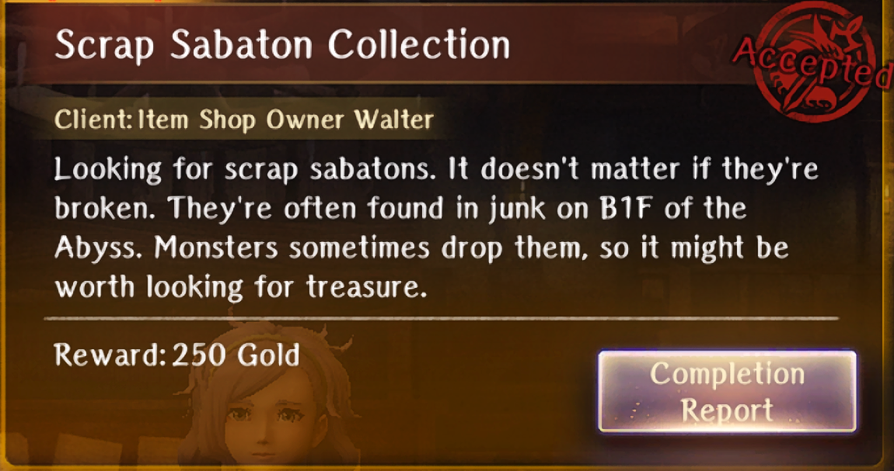

- Go to the Item shop to activate the request  
- Go to the guild and accept the quest  
- In B1 gather junk and turn in the request  
- Go back to the item shop to receive item

#### Rhodium Delivery

??? info "Request"
    

- Go to the blacksmith to activate this quest  
- Go to the guild and accept the request   
- Continue on until B6 then collect the 2 Rhodium  
- Turn in the request  
- Go back to the blacksmith

??? map "Locations"
    

    ??? info
        Follow Green for one and Blue for the other

### Bondmates

#### Chris the Considerate

??? info "Chris the Considerate"
    

??? info "Skill"
    

**B1**:

- Find his corpse in order to gain the  **Adventurers' Demise** knowledge.
- Talk to him at the location below  
- Fetch his friends guild tags  
- Battle the scavengers
- If Chris doesn't show up automatically, walk back to where you picked up the request to complete it
  
??? map "Guild tag locations"
    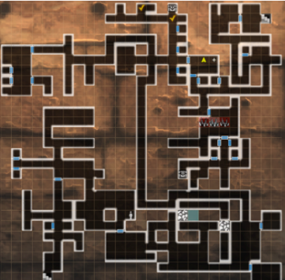

#### Mudd, the Eternal Novice

??? info "Mudd, the Eternal Novice"
    

??? info "Skill"
    

- Meet Mudd on B1 and tell him to leave the dungeon  

??? map "B1F location"
    

- Rescue him on B3  

??? map "B3F location"
    
- Rescue him on B4

??? map "B4F location"
    

## Minor Harken Unlocked

### Requests

#### Death Stench Investigation

??? info "Request"
    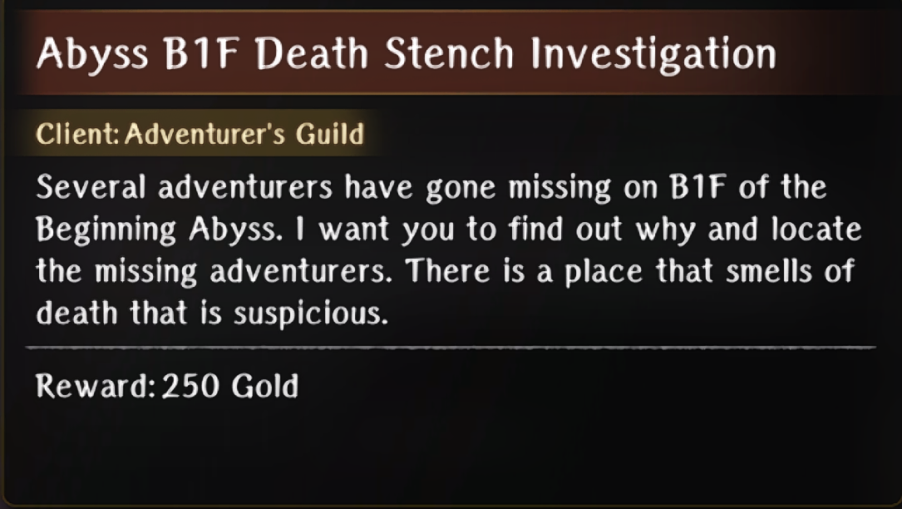

- Go to B1 and defeat the Ambush

??? map "Location"
    

### Bondmates

#### Sir Maurice, the Live Bait

??? info "Sir Maurice, the Live Bait"
    

??? info "Skill"
    

## Warped One Vanquished

### Bondmates

#### Royal Knight Albano

??? info "Royal Knight Albano"
    

??? info "Skill"
    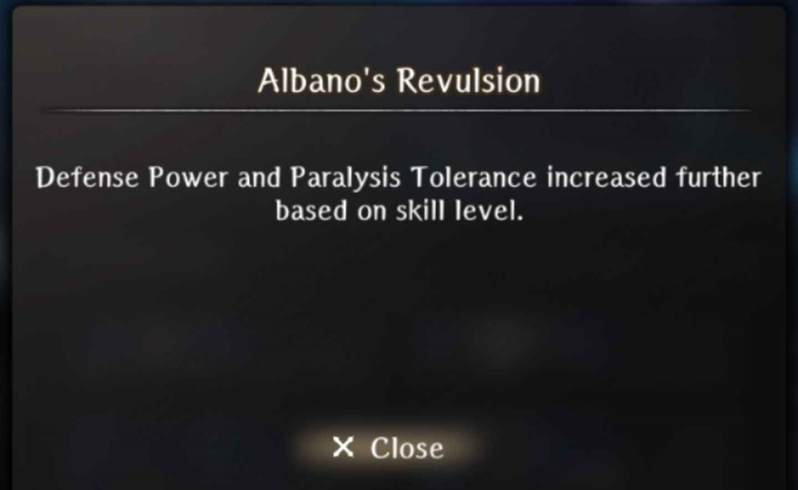

- Do the Fragrant Plant Seed quest to get Dana’s Custom Sachet  
- After defeating the boss before the first Major Harken, choose the dialogue  
    - Negotiate (when he picks up the orb)  
- Do the Abyssal Steel Delivery Request  
    - Tell Marquis that Albano is in the King’s party and get the letter  
- Go back to the dungeon and choose “Keep trying to talk to Albano” when trying to get him to leave the dungeon  
- Leave the dungeon and go back to town for a scene with the Marquis, telling him how much Albano hates him and unlock a new request  
- Do the Fluorescent Flower Delivery quest  
- Reconcile Albano and the Marquis back in town  
- Head back to the Edge of Town after saving the King

## Major Harken Unlocked

### Requests

#### Donato’s Redemption

??? info "Request"
    

- Defeat the 6 goblin packs in B1

??? map "Location"
    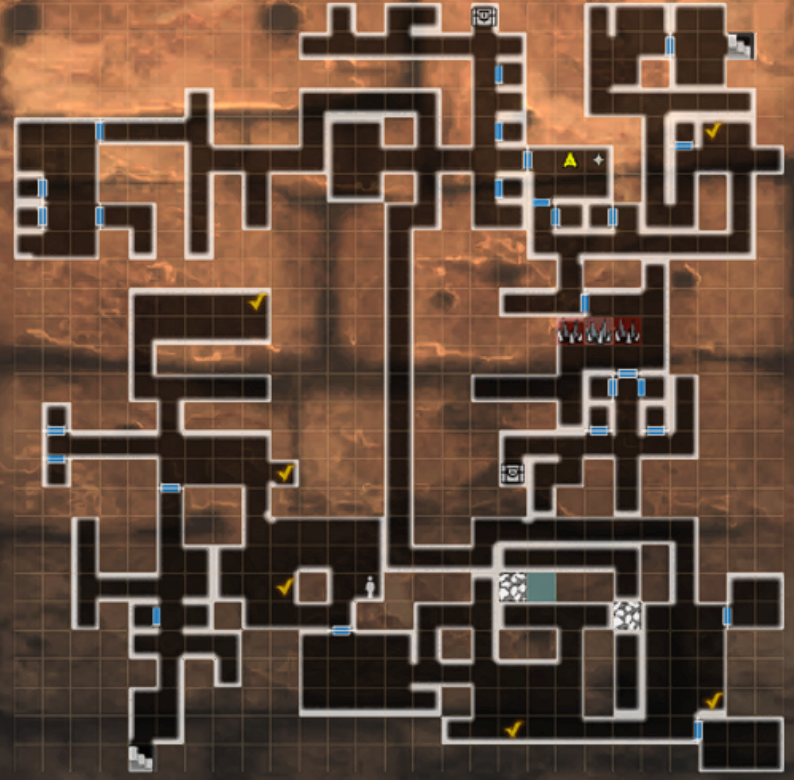

### Bondmates

#### Donato, the King of Debt

??? info "Donato, the King of Debt"
    

??? info "Skill"
    

- Find Donato’s letter on B4  
- Complete the quest Donato’s Redemption  

??? map "Location"
    

## Cave-In Crisis Escape

## Despicable Trap

### Requests

#### Abyssal Steel Delivery

??? info "Request"
    

- Fight the enemies blocking the Ebonsteel on B4  
- Pick up the Ebonsteel from the sparkle on the ground

??? map "Location"
    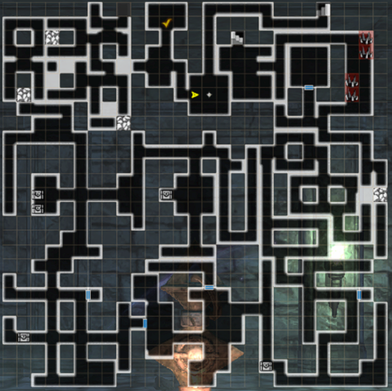

#### Knight-Butcher Ent Proliferation

??? info "Request"
    

- Defeat the 3 enemies on B3

??? map "Location"
    

#### Fluorescent Flower Delivery

??? info "Request"
    

- You will activate this request as part of the Albano Bondmate line  
- Go to the inn upon accepting the request  
- Go to B5 and kill the mimic to get the glowstone  

??? map "B5F Mimic Location"
    

    !!! note
        The chest does not appear on the map

- Go to B3 and find the 2 flowers

??? map "B3F Flower Locations"
    

??? map "Alternate Locations"
    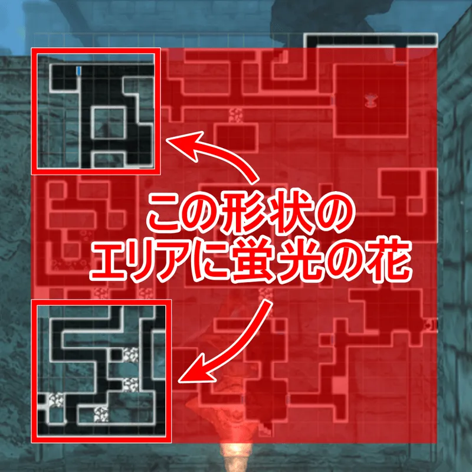

    !!! note
        It is possible that there are other locations than the above two specified, so if neither of those maps work for you, you can check the bottom-right side or just explore everywhere!

## Survivors Found

### Bondmates

#### Ira of the Vanished Village

??? info "Ira of the Vanished Village"
    

??? info "Skill"
    

- Revive her on B5  
- Take her back to the church  
- Visit the church and Donate when prompted (I donated 500 twice)  
- Visit again to prompt her farewell scene

??? map "Location"
    

#### Harry the Wandering Adventurer

??? info "Harry the Wandering Adventurer"
    

??? info "Skill"
    

- Revive him on B5

??? map "B5F Location"
    

- Find him again on B6 and give him a potion  

??? map "B6F Location"
    

- Witness his final moments on B7

??? map "B7F Location"
    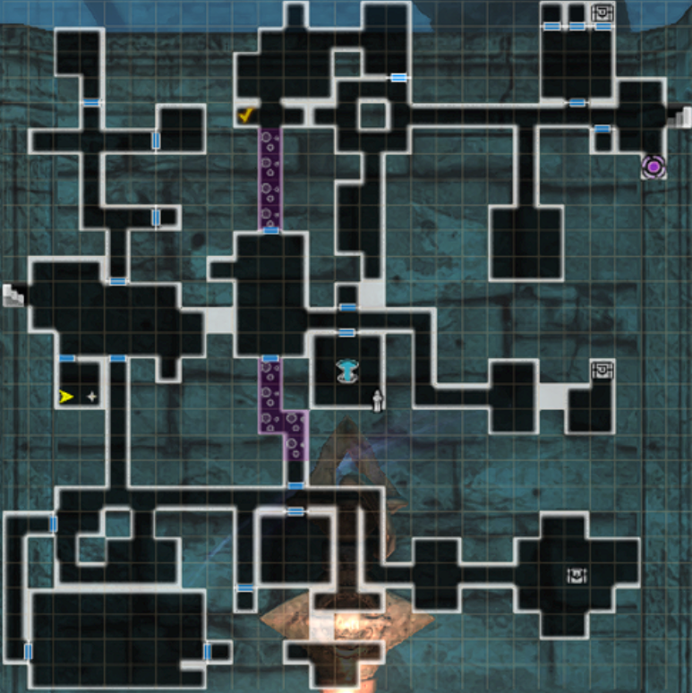

## Treacherous Floor Traversal

### Requests

#### Relentless Massacre Rabbit

??? info "Request"
    

- Go to B4 and fight the vorpal bunny 4 times

??? map "Locations"
    

??? Map "Alternate Locations"
    

#### Grandchild Party Rescue

??? info "Request"
    

- Save Mel and her party on B5

??? map "Location"
    

### Bondmates

#### Beheading Bunny

??? info "Beheading Bunny"
    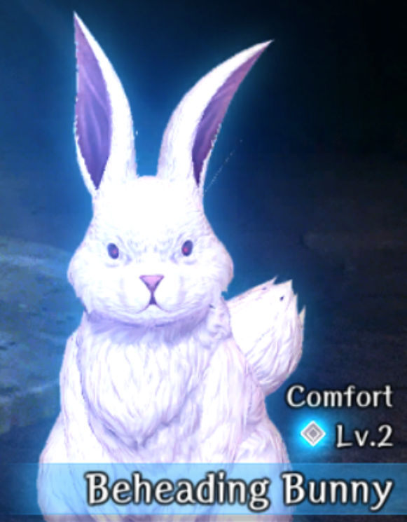

??? info "Skill"
    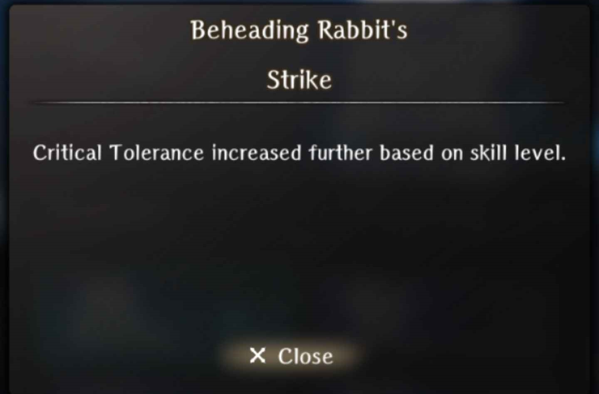

- Complete the Relentless Massacre Rabbit quest doing all 4 fights

#### Mel the Sniveling Thief

??? info "Mel the Sniveling Thief"
    

??? info "Skill"
    

- Complete the quest Grandchild Party Rescue  
    - There is a turn limit for the battle, attempt to clear it in under 2 to be safe

## Second Major Harken

### Requests

#### Search for Lambert

??? info "Request"
    

- Talk to Sophia in the tavern  
- Find Lambert on B7 and watch as he dies  

??? map "Location"
    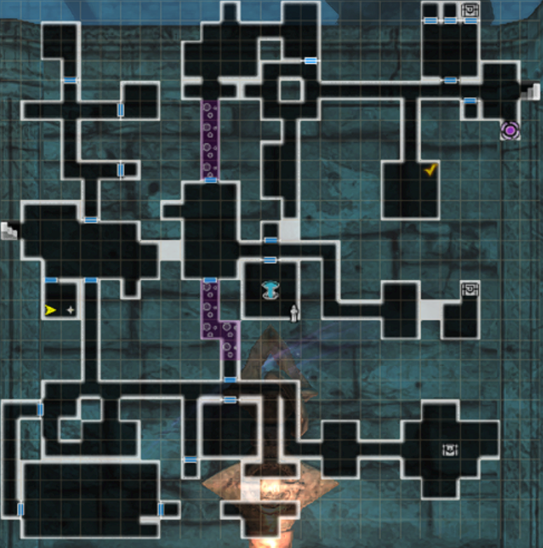

- Wheel back to Treacherous Floor Traversal and find Lambert on B5F.

??? map "Final Location"
    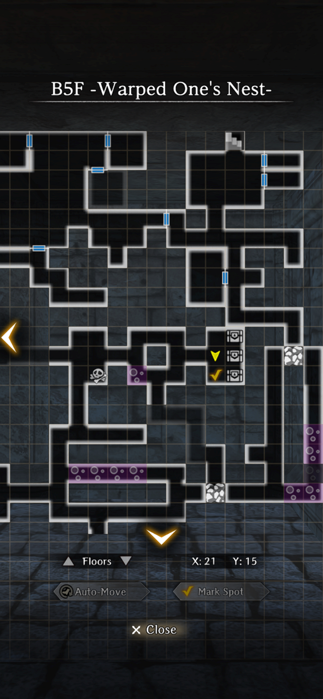

#### Abyss Heretics

??? info "Request"
    

- Defeat the 3 groups of zealots

??? map "Locations"
    

#### March of the Undead

??? info "Request"
    

- Take the Harken to B7  
- Step out and defeat the enemies

??? map "Location"
    

### Bondmates

#### Gary the Brave

??? info "Gary tthe Brave"
    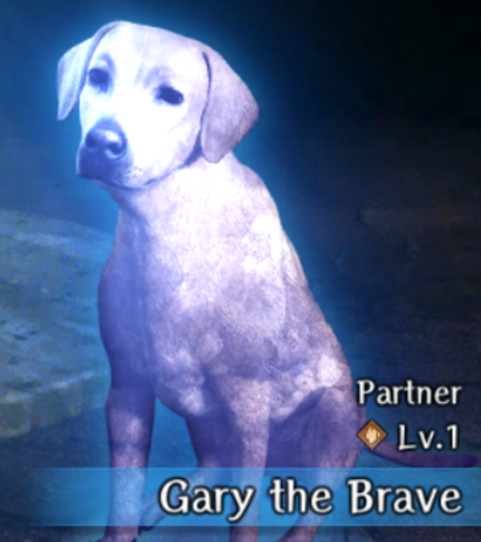

??? info "Skill"
    

- Choose the dialogue choice to Save the Dog  
- Fight the battle against the Warped Ones  
- After the battle when walking into the dog   
    - Do NOT choose to Brace yourself  
    - CHOOSE Approach the dog  
- We let the dog die for our bondmate :c

??? map "Location"
    

#### Sir Jack, Undead Smiter

??? info "Sir Jack, Undead Smiter"
    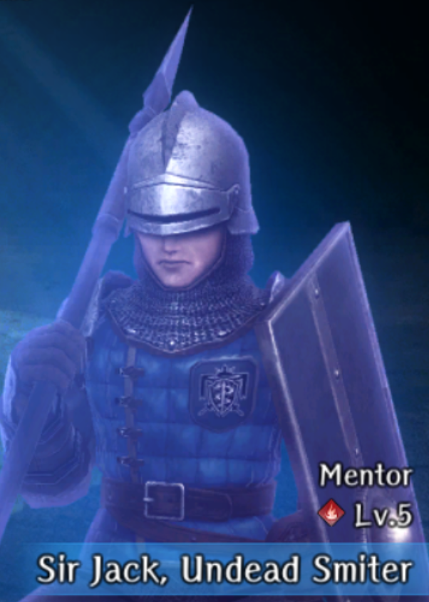

??? info "Skill"
    

- Complete the March of the Undead quest doing all 4 waves

#### Sophie the Caring

??? info "Sophie the Caring"
    

??? info "Skill"
    

- Complete the Search for Lambert request

## Labyrinth Cleared

### Requests

#### Cazula Root Delivery

??? info "Request"
    

- Go to the tavern and talk to the Gloomy Adventurer  
- Go to B7 and get the Bladeless Dagger  
- Return to the tavern and give it to him

??? map "Location"
    

## Warped Scene

## The King’s Rescue

### Requests

#### The Lingering Scent of the Greater Warped One

??? info "Request"
    

- Take the Harken to B8  
- Fight the waves of enemies

??? map "Location"
    

### Bondmates

#### The Pleading Boss Goblin

??? info "The Pleading Boss Goblin"
    

??? info "Skill"
    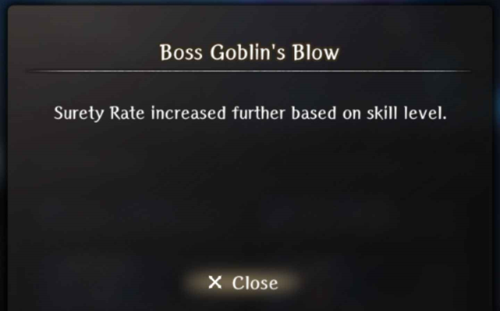

1. Defeat the goblin boss on the top right of the map.
2. Return in time to the 2nd floor harken.
3. Meet him again and select “Slash” and then “Let it go”
4. Go back to town and talk to the elf at the tavern.
5. Go back to the goblin's den and be sure to collect the translucent stones on the south side until you find the goblin boss or else the goblin boss won't appear.

!!! warning
    Be careful as this fight will be an "AMBUSH"

6. After the fight, the goblin boss will plead again, choose "Let it go" again.
7. Go out of the goblin's den. Then, go back in.
8. Then, go to the next room or the room just outside where you fought the goblin boss, you'll find the boss standing in the middle of the room. After the dialogue, choose "Let it go" again, then you'll get the bondmate.

??? map "Location"
    

## Miscellaneous

### Wandering Bondmate

#### Green Jelly

??? info "Ghreen Jelly"
    

??? info "Skill"
    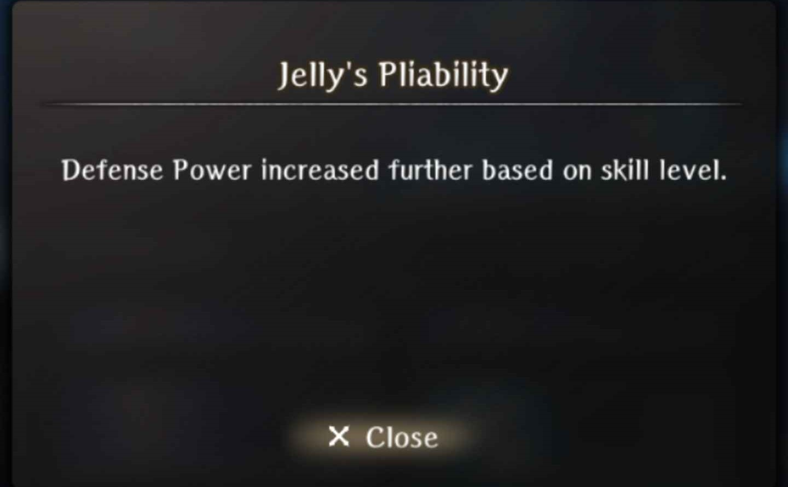

- Can be randomly found in the Beginning Abyss (does not show on the map)  
- Feed it

??? info "Appearance"
    