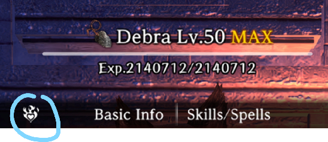

# Bondmates

## Chapter 1 Bondmates

| Bondmate                        | Location         | Details                                                                                                                                                                      | Effect                          | Element | Max Level |
|:------------------------------- |:---------------- |:---------------------------------------------------------------------------------------------------------------------------------------------------------------------------- |:------------------------------- |:------- |:--------- |
| Beheading Bunny                 | Side quest       | Must fully complete the "Relentless massacre Rabbit" Request, defeat all 4 waves on B4F                                                                                                         | Critical Tolerance up           | Void    | 5         |
| Chris the Considerate           | Hidden quest     | 2nd loop only. Loop to Fresh start. After entering the first floor, speak to him to left of entrance. Do his quest to retrieve his friend's guild tags, and he'll join.      | Mp up                           | Light   | 5         |
| Green Jelly                     | Random encounter | On floors B4F - B7F, you might encounter a random green slime npc. Feed it enough and it'll join.                                                                            | Defense up                      | Void    | 1         |
| Donato, the King of Debt        | Side quest       | Must fully complete the "Donato the king of debts" quest on B1F after reading his friend's letter (found on B4F).                                                                                       | Accuracy up                     | Dark    | 5         |
| Gary best dogo                  | B7F              | When you get to B7F, SAVE THE DOG. But, on 2nd loop and onwards fully saving him doesn't increase bond so.........                                                           | Evasion up                      | Earth   | 1         |
| Harry, the Wandering Adventurer | B6F              | Revive him as a dead corpse on B5F, find him again on B6F and heal him, and find him again on B7F. He ded. He'll joined as ghost                                                 | Stun tolerance                  | Dark    | 5         |
| Ira of the Vanished Village     | B5F              | 2nd loop only. On BF5, the bottom section, there's a fork where you can rewind a rock with a corpse of a child. Raise her, take her to church, then keep paying child support. (500x2) Visit her after reaching B6F and again after reaching B7F. | Divine power up                 | Water   | 5         |
| Sir Jack, Undead Smiter         | Side quest       | Fully complete the quest "March of the Undead", defeat all 4 waves on B7F.                                                                                                               | Hp up                           | Fire    | 5         |
| Mel, The Sniveling thief        | Side quest       | Fully complete the quest "Grand child Party Rescue" on B5F. No one can die.  Use delayed turns helps.                                                                                  | Disarm trap up                  | Water   | 5         |
| Mudd, the Eternal Novice        | B3F / B4F        | Mudd is an adventurer. Meet him on B1F, just to the right of the entry hallway. Then rescue him on B3F (6,7 or 24,16) and again on B4F (11,8). (X,Y) coordinates.                                                                               | Detect up                       | Air     | 5         |
| Sir Maurice                     | Dialog option    | See chapter 1 true ending. Once rescued on B4F he will show up later in the tavern and you'll get his bond.                                                                              | Resistance up                   | Earth   | 1         |
| Albano the unlikable            | Hidden quest     | See Side quest and Perfect Ending to save Albano                                                                                          | Defense up and Paralysis resist | Fire    | 5         |
| The Pleading Boss Goblin        | B3F Goblin Den   | After saving the king, find him and fight him several times in the den. [Details here](../requests-bondmates/beginning-abyss/requests-bondmates.md#the-pleading-boss-goblin) | Surety Rate up                  | Void    | 5         |
| Sophie the Caring               | B5F              | Save Lambert. [Details here](../requests-bondmates/beginning-abyss/requests-bondmates.md#sophie-the-caring)                                                                  | Magic Power up                  | Light   | 1         |

### Farming strategy:
Using the Cursed Wheel, Leaping back to Fresh Start will reset most bondmate locations, and then immediately Leaping forward to Warped Scene will make most bondmate Requests available.  To hit most of the bondmates, after leaping to Warped Scene:  

1. Step right back up stairs to B7F, step into teleporter, return to Harken
2. Leap to B5F - revive Harry and Ira.
3. Return to town.  Visit Temple for Ira, pay 500G.
4. Go to Guild and accept Beheading Bunny, Save the Grandchildren, and Donato Requests.
5. Enter Abyss Entrance, take stairs to B1F.  Speak to Chris and Mudd. Complete Chris and Donato requests.
6. Harken to B3F. Rescue Mudd.
7. Harken to B4F. Complete all four rounds of Bunny request, get bond.  Rescue Mudd again, get bond.
8. Stairs down to B5F. Complete Grandchildren request. (Automatically return to town.)
9. Go to guild, turn in three requests. Get Donato and Mel bonds.  Optional - accept Abyss Heretics request. 
10. Enter Abyss, B5F, step down to B6F. Go through full level reviving Harry when you see him.
11. Return to town. Visit Ira at Temple, pay 500G.
12. Enter Abyss, B7F, go find Harry one more time. Get bond.
13. Return to town. Visit Ira at Temple, get bond.
14. Guild - accept Undead March quest.
15. Enter Abyss to B7F, win all 4 undead waves. Get bond. (Automatically return to town.)
16. Repeat Cursed Wheel Leaps.

Optional - Add Goblin Den to B3F part of cycle if you can avoid most fights and survive the Ambushes. (Recommend saving for levels 30 or 40.) Adding that or Albano to this gets very complicated.  Probably best to focus leveling each on their own.

!!! note "Albano"
    It's potentially possible to wheel ahead to The King's Rescue after step 15 then go to the edge of town to get Albano. This was possible, then it was not possible, then it was possible again, so we're not completely sure which is the intended behavior.

## Chapter 2 Bondmates

| Bondmate                   | Location                   | Details                                                                                                                                                                                       | Effect                        | Element | Max Level |
|:-------------------------- |:-------------------------- |:--------------------------------------------------------------------------------------------------------------------------------------------------------------------------------------------- |:----------------------------- |:------- |:--------- |
| Donald                     | Side quest                 | A quest you get early in the chapter to retrieve a merchant's goods. Needs to defeat 3 or 4 waves of monsters.                                                                                | SP up                         | Fire    | 5         |
| Caterwaul Crew             | Side quest                 | Repel the Enemy Forces Quest, late in the chapter. Needs to defeat 3 waves of monsters in the pier.                                                                                           | Fear tolerance                | Water   | 5         |
| Doris, the Frightened Maid | Side quest                 | Retrieve the merchants cargo quest on 6th District - Warehouse. Needs to kill one wave of monsters on the northeast side of the map quickly and pretend the slaves died.                      | Sleep tolerance               | Air     | 5         |
| Birgier the Fisherman      | Side quest                 | Rescue the fisherman quest. They're at the 4th district- Boulevard, south from the harken. Needs to defeat one wave of monsters quickly                                                       | Magic defense                 | Earth   | 5         |
| Melgina                    | Main quest                 | Defeat Octonarus and restore him with right hand                                                                                                                                              | Divine power, sleep tolerance | Water   | 5         |
| Reprobus                   | Side quest                 | Defeat all three arena opponents after beating melgina or octonarus                                                                                                                           | Attack power                  | Dark    | 5         |
| Songstress Marin           | Side Quest                 | After defeating monster Marin there’s a chance to get her hairpin. After you do you get a new option when getting her quest from Rickert. Follow Rickert to the Lower Deck and see the dialog | Poison Tolerance              | Air     | 1         |
| Gigi                       | Arena Deck                 | After defeating Octo or Melgina once, speak to Gigi before going in for the 5th arena fight and tell it to run. After defeating the boss, speak to Gigi again to get bond.                    | Confusion Tolerance           | Void    | 1         |
| Pirate Captain Valo        | Side quest                 | Retake Stolen Belongings from Robbers side quest. Need to choose “Pirates?” option, that probably only comes up after you did the first run or read something, not sure.                      | Evade Trap                    | Water   | 5         |
| Gessi                      | Arena Deck                 | Defeat him without strategizing (Water and Garlic) and probably needs to give him the Ore as well. Hard fight, recommend taking Scroll of gravel and a tough frontline.                       | Accuracy and Bind Tolerance   | Water   | 5         |
| Head Cook                  | Ship Lounge                | Complete all the four ingredient quests and deliver them directly to the head cook. After beating the boss, talk to the head cook before going back to town                                   | Paralysis Resistence          | Fire    | 1         |
| Water God's Ritual Regia   | Trade Waterways District 2 | Found after completing Water God Statue Resetoration Materials. [Details here](./port-town-grand-legion/requests-bondmates.md#water-god-priestess-regia)                                      | MP                            | Water   | 1         |
| Ugo                        | Ship deck                  | Complete the Oar Collector Extermination request. [Details here](./port-town-grand-legion/requests-bondmates.md/#ugo-in-the-ships-hold)                                                       | ASPD                          | Wind    | 1         |

## Adventurer Bondmates

- All adventurers can be bondmates if you dismiss them once they reach max [trust](../mechanics/trust/trust.md)

!!! note "Adventurer Trust Icon"
    

!!! note "Adventurer Bondmate Example"
    