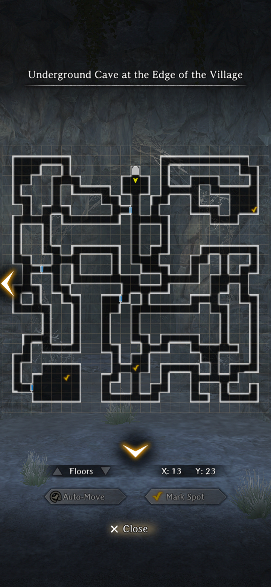

# Unnamed Request

## Request Requirements

* Adam must be on the party
* The maximum Trust Level (white heart on the stats page) must be achieved with Adam

Once the requirements are met, meet Adam in the tavern and he will start the request.

## Request Mission

Request is a dive into Adam's backstory, consisting of a single explorable map with no items to find.

* Visit Adam's Hometown, where you have to pick up a stone that protects you from curse poison
    * Regardless of what Adam says, you can only get one. The other locations will have Gleaming Crystals
    * Enemies are abyssal insects, goblins, and hobgoblins that give decent XP
* Visit the Millenial Lands
    * Follow the one-way map to find the bosses
    * The boss consists of who phases. First, you fight Adam while he's posessed. Second, you fight the Millenial Lord (an earth entity) and a Hydraplant.
    * The criteria for the Adam fight to end are currently unclear, it might be based on a number of turns (3-6) or a certain amount of damage done to him.

### Map

??? map "The World Map Locations"
    

??? map "Adam's Hometown"
    

## Rewards

Adam gets a new skin. There are no item rewards.