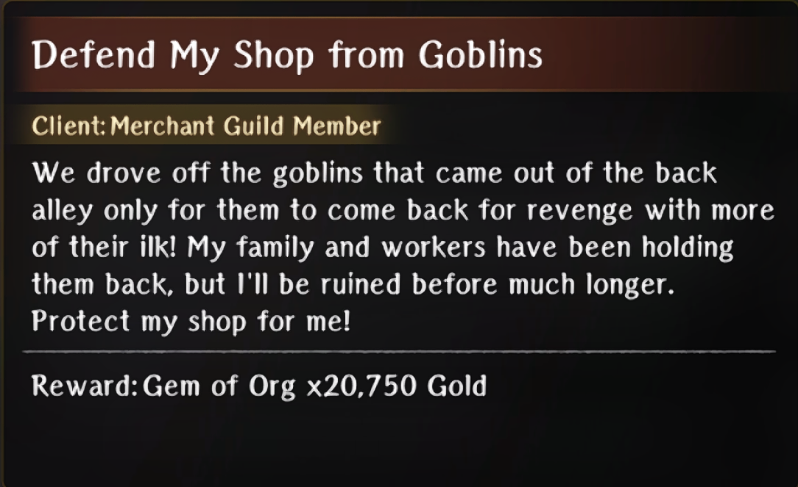
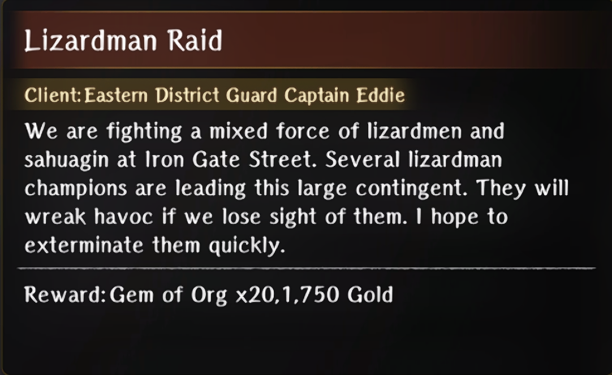
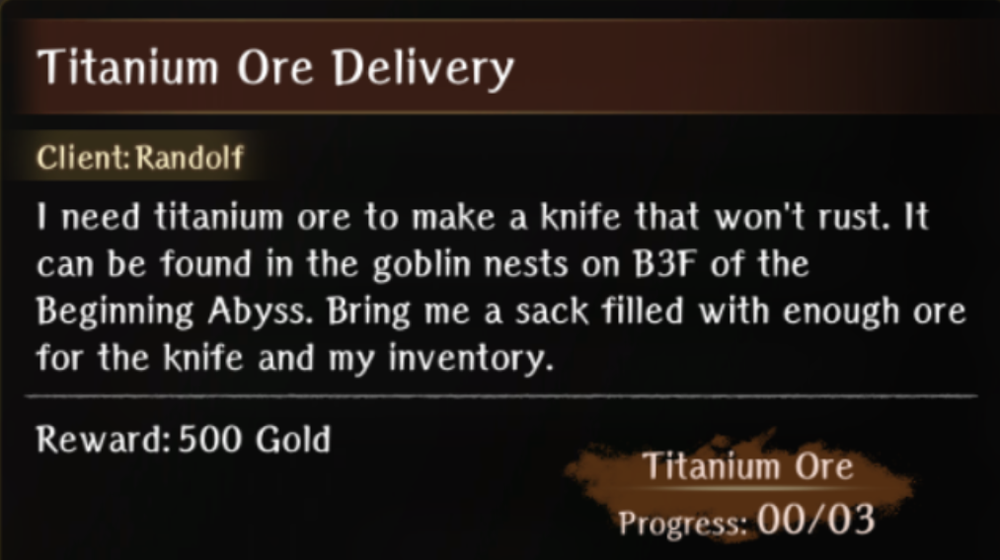
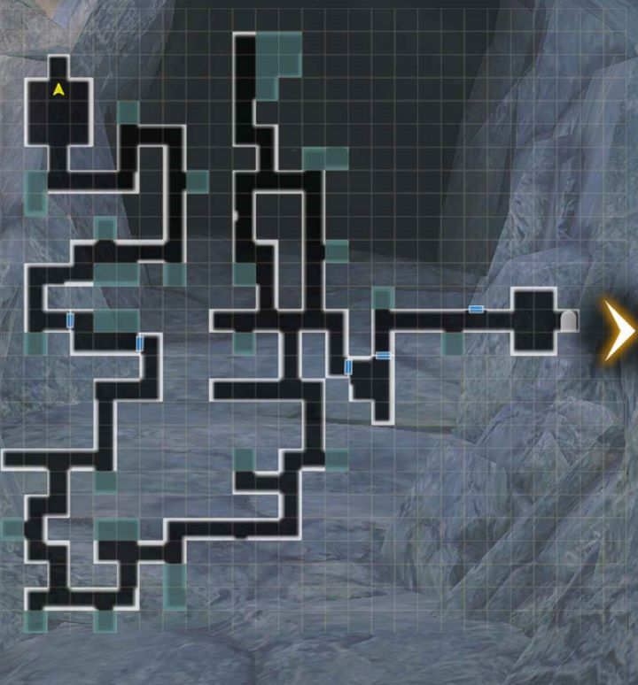
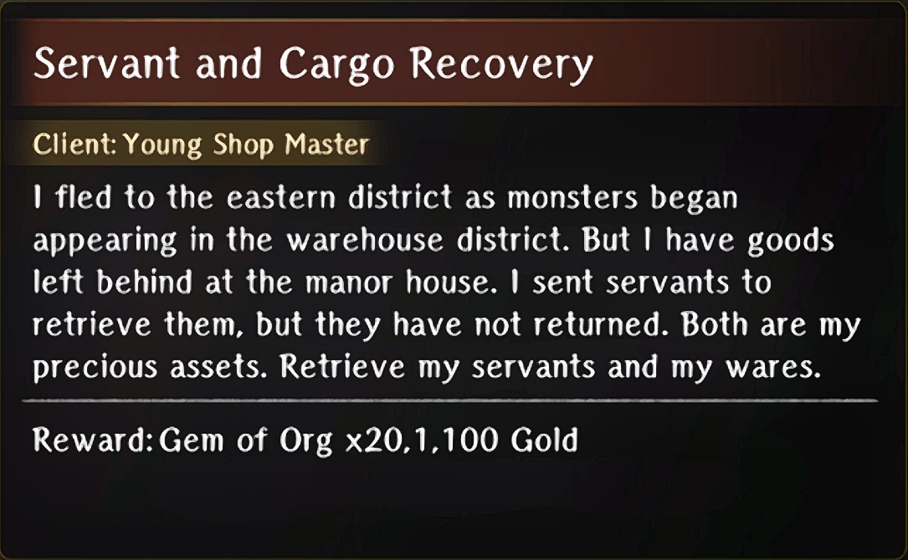
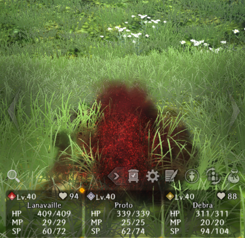
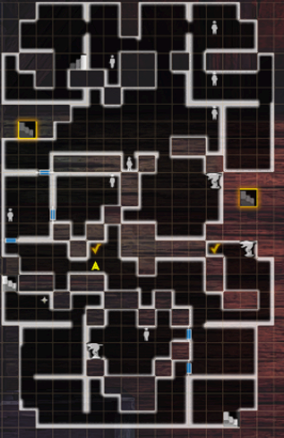
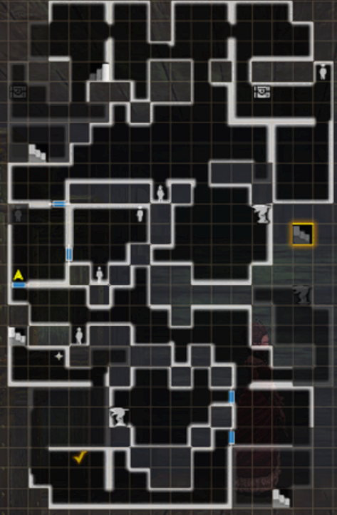
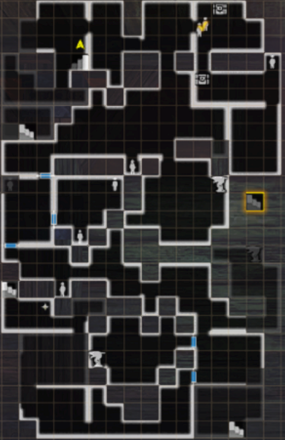

# Port Town Grand Legion

## Search Request

## Trade Waterway Arrival

## Merfolk Myth 

## Watery Obstacle

### Requests

#### Defend My Shop from Goblins

??? info "Request"
    

- Exterminate the goblins attacking the shop in Trading Waterway \-Entrance-

??? map "Location"
    

#### Water God Statue Restoration Materials

??? info "Request"
    

- Head to 2nd District \-Black Market- and defeat the 6 bands of fragment thieves  

!!! note
    If you want to be able to defeat all 6 bands you have to unlock the       power to turn off the statues by progressing the story into the drowning section of Flooded Town wheel warp.

??? map "Locations"
    

### Bondmates

#### Donald

??? info "Donald"
    

??? info "Skill"
    

- Complete all waves of the Defend My Shop from Goblins quest 

#### Water God Priestess Regia

??? info "Water God Priestess Regia"
    

??? info "Skill"
    

!!! note
    It's easiest to wait to get her bondmate until after you have reached `7th District -Pier-`

- Complete the Water God Statue Restoration Materials request
- Find Regia 5 times throughout Districts 2-7 in the Trade Waterways
  - The easiest way to do this is to teleport into the pier, search for her, return back to the Port Town, and repeat until you find her 5 times. On the 5th time, she will mention that this was the final time she will heal you.
- Go to the marked spot in the 2nd District to receive the bondmate

??? map "Final Location"
    

## Flooded Town

### Requests

#### Lizardman Raid

??? info "Request"
    

- Head to 3rd District \-Iron Gate Street- and defeat the Sahagin/Lizardmen assault

??? map "Location"
    

#### Mackerel Sandwich Delivery

??? info "Request"
    

- Go back to the Port Town and speak with Tessa the Baker  
??? info "Tessa the Baker"
    
- Head back into x for a scene with the harassers and teach them a lesson  
- Head back to the 4th District \-Boulevard- and give Melgina the sandwich

#### Rustproof Knife Delivery

??? info "Request"
    

- Go to Randolf (blacksmith) in the Royal Capital Luknalia   
- Complete Titanium Ore Delivery Request

#### Titanium Ore Delivery

??? info "Request"
    

- Go to the goblin nest on B3 of Beginning Abyss and collect 3 Titanium ore  
- Turn the ore into Randolf

??? map "Goblin Nest Location"
    

??? map "Titanium Ore Locations"
    

## Warding Against Water

## Sunken City Arrival

### Requests

#### Fisherman Rescue

??? info "Request"
    

- Go to 4th District \-Boulevard- and meet the fisherman at the location marked by green  
- Go to the other marked location and begin a turn limited battle against enemies to save his friends 

??? map "Location"
    

### Bondmates

#### Bergier the Fisherman

??? info "Bergier the Fisherman"
    

??? info "Skill"
    

- Complete the Fisherman Rescue quest battle within the limited turn count to avoid any of them dying. 

## One-Eyed Sahuagin

### Requests

#### Retake Stolen Belongings from Robbers

??? info "Request"
    

- Go to 5th District \-Sunken City- and defeat the waves of ruffians

??? map "Location"
    

#### Obtaining Titanium Ore

??? info "Request"
    

- Go to B3 of Beginning Abyss and head to the Goblin Nest (Refer to Titanium Ore Delivery Request under Flooded Town Requests for location)  
- Not sure if needed but after checking all the locations for the ore that were marked in Titanium Delivery Request it started a dialogue to look for the Ore guy that was seen blocking the way earlier  
- After finding his body, fight the ambushing goblins off  
- Return that ore to Gessi

??? map "Location"
    

### Bondmates

#### Pirate Captain Valo

??? info "Pirate Captain Valo"
    

??? info "Skill"
    

- Complete Retake Stolen Belongings from Robbers selecting the “Pirates?” dialogue choice when prompted at quest start

## Colossal Galleon

### Requests

#### Unnamed Request

!!! note
    We do not know if this request has any relevance at this time.

- This didn’t have a formal request show up in the request list.   
- An npc will mention that she lost her coral bracelet and if you go underneath the dock into the bridge.  
- There will be a sahagin cheering about a coral bracelet.   
- Defeat him and return it to her.

??? map "NPC location"
    

??? map "Sahuagin General Location"
    

#### Pirate’s Cutlass Delivery

??? info "Request"
    

- Go to the item shop in Royal Capital Luknalia and talk to Walter to buy the Cutlass  
- Turn it in to Clyde

## All Aboard

### Requests

#### Delivering Chamomile for the Dead

??? info "Request"
    

- Once you speak to Bonnie and Clyde after getting each one killed (lol), you’ll active this request in the Royal Capital Luknalia on your 3rd time interacting with them  
- After accepting the request go speak to Dana, the innkeeper  
- Go to Port Town Grand Legion and speak with Hille  

??? info "Hille"
    

- Go to the world map and head to Rain Shelter Cave  
- Beat the boss and take the exit in front of you

??? map "Location"
    

??? map "Alternate Map"
    

#### Two-Headed Serpents

??? info "Request"
    

- Go to x and speak to the thief

??? map "Thief Location"
    

- Find his two friends  
- Find the Mermaid’s Secret 

??? map "Mermaid Secret Location: 2nd District \-Black Market-"
    

??? map "Friend Locations: 1st District \-Back Alley-"
    

    !!! note
        The NPC icon was in the circle but the body was bugged where the arrow points

    !!! warnING
        The friends may be in different locations. Look for person silhouettes on the maps and check them.

#### Servant and Cargo Recovery

??? info "Request"
    

- Go to 6th District \-Warehouse District- and speak to the maid.(She’s green marked)  
- Defeat the enemies attacking the maids. (Turn limited)  
  - You end up having to choose between saying the maids died or turning them into the merchant.

??? map "Location"
    

#### Repel Enemy Forces

??? info "Request"
    

- Go to 7th District \-Pier-  
- Defeat waves of Warped Ones

??? map "Location"
    

### Bondmates

#### Doris, the Frightened Maid

??? info "Doris, the Frightened Maid"
    

??? info "Skill"
    

- Complete the Servant and Cargo Recovery Request and choose to let the maids go.

#### Caterwaul Crew

??? info "Caterwaul Crew"
    

??? info "Skill"
    

- Complete the Repel Enemy Forces Request and defeat all waves.

## Rickert’s Shop

### Requests

#### Oar Collector Extermination

??? info "Request"
    

- Go to Lower Deck 1 \-Ship’s Hold-   
- Defeat the Oar Collectors

??? map "Locations"
    

#### Scorpion Woman Legs and Herb Procurement

??? info "Request"
    

- Go to Beginning Abyss B3

??? map "Scorpion Woman Locations"
    

??? map "Herb Locations"
    

??? map "Alternate Herb Locations"
    

    !!! note
        It is possible that there are other locations than the above two specified, so if neither of those maps work for you, you can check the bottom-right side or just explore everywhere!

#### Giant Insect Procurement

??? info "Request"
    

- Head to Den of Earth and fight some Desert Flies

??? map "Location"
    

#### Minotaur Spare Rib Procurement

??? info "Request"
    

- Go to Lower Deck 2 \-Lounge-  
- Slay some minotaurs and collect 1 Minotaur Head and 4 Minotaur Spare Leg

??? map "Locations"
    

    !!! note
        Not sure if this will be the case for everyone but the south mark gave me Minotaur head every battle and the north mark gave me Spare Leg every battle, I reset encounters by going back to town and went back in to respawn them and such was the case until I turned in the quest. The mobs move as well so marks an approximation and not exact location.

#### Hydra Plant Procurement

??? info "Request"
    

- Head to Valeon Grasslands on the world map  

??? map "Valeon Grasslands"
    

- Defeat 4 Hydra Plants around the area  

    !!! warning
        There is no map in this area so be careful walking around  

    ??? info "Tip"
        To avoid as many battles as possible, the icon on the overworld for the plants is a slime. Credit to Proto.
        

#### Obtaining KnightQuil

??? info "Request"
    

!!! note
    The easiest time to complete this is after Arena Round 1 and before Arena Round 2

- Speak to Butch on Upper Deck \-Arena- to see he wants Knightquil then talk to Rickert  

??? map "Butch Location"
    

- Go to the tavern in the Royal Capital Luknalia to collect the KnightQuil  
- Head to Edge of Town to see that monsters are attacking and blocking the harken so take the Back Alley  
- The nearest Harken is broken so repair that and travel back to Rickert  
- Give Knightquil to Butch  
- Fight Bonney/Clyde  
- Talk to goblin to find out about your next opponent. A scene should trigger where your missing person wins  
- Talk to your missing person after the fight and he'll mention he's withdrawing from arena

### Bondmates

#### Head Cook

??? info "Head Cook"
    

??? info "Skill"
    

- Complete the four Procurement requests and turn each in to the Head Cook directly. Do not turn them into the guild.
- Wheel ahead (if you're not already there) to Arena 5 and beat either Melgina or Octonarus.
- After the battle, do not return to town. Instead, take the harken at the pier over to the Lower Deck 2 \-Lounge- and Head Cook.

#### Ugo in the Ship's Hold

??? info "Ugo"
    

??? info "Skill"
    

Complete the Oar Collector Extermination request.

- After defeating the final Oar Collector, you must suggest Ugo becomes an apprentice to Rickard.
- Ugo will then randomly appear in the ship offering a variety of items for sale (It’s currently bugged and will crash the game if you choose to buy nothing).
- You must buy something before he leaves. If you decide to buy everything, he gives you one extra Health Potion as a bonus.
- After you defeat either of the Greater Warped Ones, return to Rickard shop and Ugo will be there.
  - It is possible to wheel forward to after defeating the Greater Warped Ones. You do not need to manually fight them. 

!!! note
    Due to the bugs relating to this quest, it’s currently unclear if Ugo is the same child who appears looking for his mother in the earlier maps (B1F and Ship’s Hold) and if interacting with him is needed for acquiring the bondmate. There's also no confirmation that buying anything from him is necessary.

## Arena Round 1

### Requests

#### Eradicate Warped Ones Belowdecks

??? info "Request"
    

- Defeat 5 warped one enemies in the ship.   
  Note: There is no specific area on the map, just defeat overworld enemies.

#### Purple Garlic Delivery

??? info "Request"
    

- Go to the Tavern and speak with Migrant Man to learn location of Purple Garlic  
- Head to the Valeon Grasslands on the world map  
- Speak with the Peddler, he isn’t too far from the entrance  
- Get his goods back from the thieves that escaped to the north  
  
??? info "Thief Appearance"
    There is no map in the grasslands but this is what the thieves look like on the overworld.

    

    ??? info
        For the last 2 thieves you’ll need to go between 2 trees and click the rubble. If it won’t let you interact with it then try circling around till you can. Then head west for the peddler’s goods.

        

#### Exterminate Farm Monsters

??? info "Request"
    

- Defeat the warped ones

## Arena Round 2

## Arena Round 3

### Requests

#### Pickerel’s Report

??? info "Request"
    

- Go to Adventurer’s guild in the Royal City Capital.  
- Complete Temple Food Assistance Request.  
- Speak to Pickerel at Upper Deck \-Arena-.

#### Temple Food Assistance

??? info "Request"
    

- Go to Beginning Abyss B4 and gather 5 Vorpal Bunny Meat from Vorpal Bunny enemies  

??? info "Tip"
    If you still have an incomplete Relentless Massacre Rabbit quest, you can repeatedly interact with the same body and fight the rabbit until you collect all the mats without needing to look for them.  

- Go to Valeon Grasslands and gather 1 Wild Carrot, they grow near white flowers.  

??? info "White Flowers"
    

    !!! warning
        You need to walk around this patch until you get 3 dialog prompts. If get frozen in dialog, toggling the "Auto" switch will unlock you.

- Turn in quest at the Temple in Royal Capital Luknalia.

#### Monster Bird Soup

??? info "Request"
    

!!! info
    This request is exclusive to the Pontiff route

!!! danger
    This request leads to a boss that is arguably harder than the true greater warped one of this abyss. In addition, there seem to be a fair number of bugs when starting this request, particularly around Pickerel spawning.

    It is highly recommended to wait to do this request until after all three routes have been cleared.

    ??? info "Read if you have trouble with Pickerel spawning"
        The easiest way to get him to spawn seems to be to do the following:
        - Wheel to the Admiral route and make sure you have killed Melgina or Octo
        - Wheel to Arena 3 of the Pontiff route
        - Find Pickerel at the marked location

- Once you get to Round 3 and see that Pickerel is your next opponent, don’t head out to fight him.  
- Go to x and find him at the location in the image to overhear him talking to the head chef  
- Speak with the head chef and he’ll tell you where to pick up the ingredients to make the soup  
- Head to Valeon Grasslands and you’ll see a slave that runs away, just run a bit forward and you’ll see him on a hill then talk to him  
- Follow the slaves instructions to get to the poison swamps  
- Fight the bird and kill it  
- Use your right hand to restore the bird nest then head to the eggs left of the nest to restore them and head out by using the cart  
    
??? map "Pickerel's Location" 
    

#### Prevent Vernant from Entering the Arena

??? info "Request"
    

- Face Vernant twice, once where he has his herbs and once where you've swapped them out
- Complete the Monster Bird Soup request
- Wheel back and complete [Pickerel's Report](requests-bondmates.md#pickerels-report) again
- Once you report back to Pickerel, you will have a new dialog option to trick Vernant and lock him away
- (Optional) Find the first merchant in the 2nd District (room immediately north of the mermaid statue you see when you enter). You will have to disable the current to get there
- Find the second merchant at the Pier
- Find the pale elf at the Pier
- Pay him for the Ipiamarum or kill him for it. It makes no difference
- Take the Ipiamarum back to Pickerel
- Go to the mysterious door that seemed to have absolutely no purpose prior to now
- Wait and see has no negative implications here, but you need to lock the door to proceed
- I wonder if Pickerel is a ninja...

## Arena Round 4

### Bondmates

#### Gessi

??? info "Gessi"
    

??? info "Skill"
    

- Make sure you do not give him Garlic
- Make sure you flip the lever to the Right
- Make sure you give him Titanium Ore
- Fight him under water and win!

??? info "Tips"
    - If you have very high (150+) evasion, go solo as a Thief
        - Equip Mask of the Water God
        - Hiding + Sneak Attack your way to victory
    - If you take your party, bring scrolls and potions for your casters to deal damage and heal as needed

## Arena Round 5

### Requests

#### Murder Investigation

??? info "Request"
    

- Go speak to Head Cook at Lower Deck 2 \-Lounge-  
- Collect the Holly  

??? info "Holly Location"
    

- Expose Marin as the warped one and defeat her   
- Marin can at any location with a persion silhouette. If you talk to people, they will point you to where she went.

#### Gathering Sahuagin Scales

??? info "Request"
    

- Defeat Sahuagin in Port Town Grand Legion Abyss to collect scales.

### Bondmates

#### Gigi

??? info "Gigi"
    

??? info "Skill"
    

- After witnessing his death to Melgina on the 1st run, warn him of his impending demise the second time so that he lives.  
- Find him in the same spot he was in on the boat and speak to him after defeating Melgina and successfully completing your objective.

#### Melgina

??? info "Melgina"
    

??? info "Skill"
    

- Defeat Melgina once to learn that she was not the true greater warped one  
- Complete your request to find the missing person alive to get the Merfolk Lexicon  
- Read all mermaid statues and choose the secret text for each   
- Go back to one-eyed Sahuagin wheel time and speak to the red sahuagin destroying the statue, tell him “Don’t you want to save Melgina” for the dialogue choice  
- Go back to Flooded Town wheel time and speak with Melgina using the “Do you want to be free from Octonarus” dialogue choice  
- Complete the Rustproof Knife Delivery request that Melgina gives you instead of getting her the mackerel sandwich  
- Complete the Obtaining Titanium Ore delivery request to have the blacksmith make it and give it to Melgina  
- Wheel time back to One-eyed sahuagin and respond with “Dont you want to save Melgina” then “I understand, Gessi”  
- Complete “Obtaining Titanium Ore request”  
- Wheel time back to Arena Round 5 and after defeating Geuzan, choose “Melgina's liberation” as the dialogue  
- Defeat the boss and examine what’s in his hands after getting the relic when prompted

#### Songstress Marin

??? info "Songstress Marin"
    

??? info "Skill"
    

- Complete the Murder Investigation request from Rickett
- Marin has 4 different locations she can spawn during this quest  
- The location you WANT her to spawn is in is the one listed and I had to keep redoing the quest until she finally spawned here so that she drops the hairband  

??? map "Marin's Location"
    

- After getting the hairband, you’ll need to redo the quest again but this time when speaking to Rickert to get the Murder Investigation request you’ll need to show her the hairband  
- Once you show Rickert the hairband she’ll leave, if you head to Lower Deck 2 \-Lounge-, you’ll find her speaking with Marin  

??? map "Final Location"
    

## Return to the Capital

### Requests

#### Arena Tourney Hosted by Avare\!

??? info "Request"
    

- Go to Upper Deck \-Arena- where the goblin that started the arena fights was and there should be a new NPC there now.  
- Complete the fights

### Bondmates

#### Reprobus

??? info "Reprobus"
    

??? info "Skill"
    

- Complete the Arena Tourney Hosted by Avere request to completion