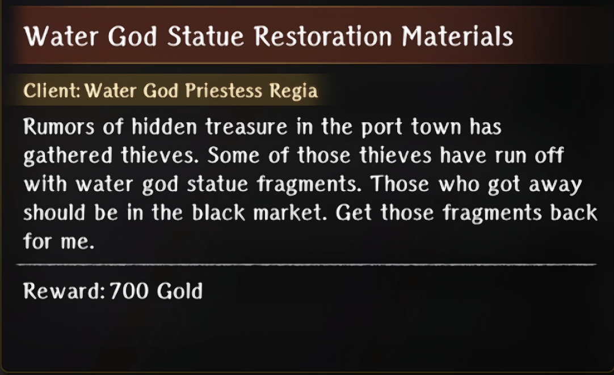
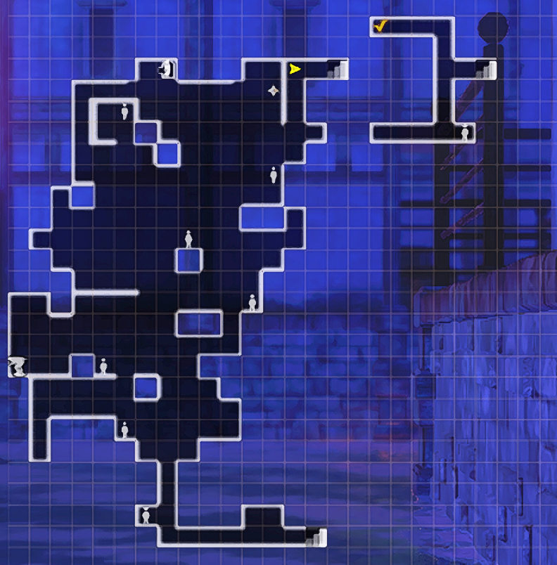
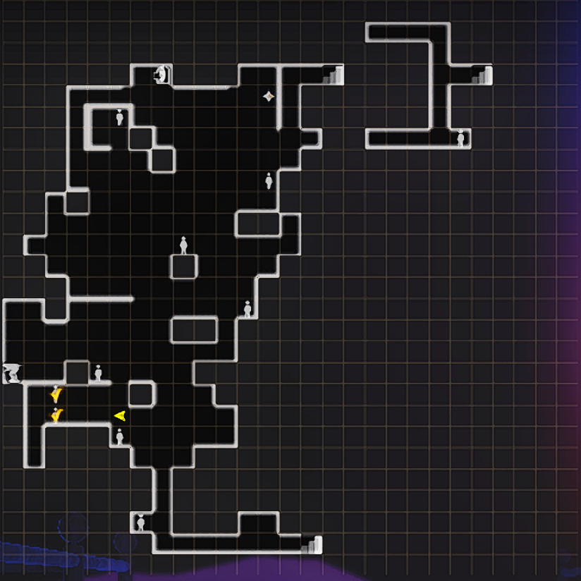
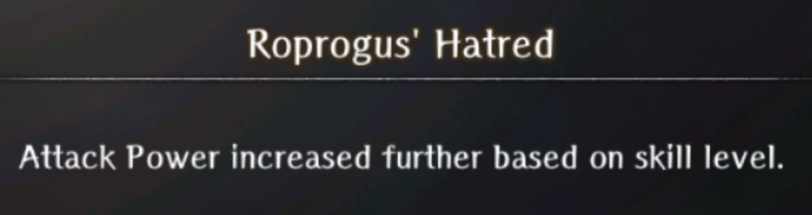

# Port Town Grand Legion

## Search Request

## Trade Waterway Arrival

### Client

* Princess Pulgritte  
* Pontiff Leaufonde  
* Admiral Avare

## Merfolk Myth 

## Watery Obstacle

### Requests

#### Defend My Shop from Goblins

- Exterminate the goblins attacking the shop in Trading Waterway \-Entrance-

Location:

#### Water God Statue Restoration Materials

- Head to 2nd District \-Black Market- and defeat the 6 bands of fragment thieves  
  - ***Note: If you want to be able to defeat all 6 bands you have to unlock the       power to turn off the statues by progressing the story into the drowning section of Flooded Town wheel warp.***

Locations: 

### Bondmates

#### Donald

- Complete all waves of the Defend My Shop from Goblins quest 

## Flooded Town

### Requests

#### Lizardman Raid

- Head to 3rd District \-Iron Gate Street- and defeat the Sahagin/Lizardmen assault

Location:

### Mackerel Sandwich Delivery

- Go back to the Port Town and speak with Tessa the Baker  
- Head back into x for a scene with the harassers and teach them a lesson  
- Head back to the 4th District \-Boulevard- and give Melgina the sandwich

#### Rustproof Knife Delivery

- Go to Randolf (blacksmith) in the Royal Capital Luknalia   
- Complete Titanium Ore Delivery Request

#### Titanium Ore Delivery

- Go to the goblin nest on B3 of Beginning Abyss and collect 3 Titanium ore  
- Turn the ore into Randolf

Goblin Nest Location: (In case you forgot)

  Titanium Ore Locations:
  

## Warding Against Water

### Melgina the Bitter

* Gave Fate-Resisting Knife  
* Gave Mackerel Sandwich

## Sunken City Arrival

### Requests

#### Fisherman Rescue

- Go to 4th District \-Boulevard- and meet the fisherman at the location marked by green  
- Go to the other marked location and begin a turn limited battle against enemies to save his friends 

Location:

### Bondmates

#### Bergier the Fisherman

\- Complete the Fisherman Rescue quest battle within the limited turn count to avoid any of them dying. 

## One-Eyed Sahuagin

### Requests

#### Retake Stolen Belongings from Robbers

- Go to 5th District \-Sunken City- and defeat the waves of ruffians

Location:

#### Obtaining Titanium Ore

- Go to B3 of Beginning Abyss and head to the Goblin Nest (Refer to Titanium Ore Delivery Request under Flooded Town Requests for location)  
- Not sure if needed but after checking all the locations for the ore that were marked in Titanium Delivery Request it started a dialogue to look for the Ore guy that was seen blocking the way earlier  
- After finding his body, fight the ambushing goblins off  
- Return that ore to Gessi

Location:

### Bondmates

#### Pirate Captain Valo

- Complete Retake Stolen Belongings from Robbers selecting the “Pirates?” dialogue choice when prompted at quest start

## Colossal Galleon

### Requests

#### Unnamed Request

**WIP** *(Not sure what relevance completing or not completing this has as of yet)*

- This didn’t have a formal request show up in the request list.   
- An npc will mention that she lost her coral bracelet and if you go underneath the dock into the bridge.  
- There will be a sahagin cheering about a coral bracelet.   
- Defeat him and return it to her.

Npc’s location:

Sahagins General Location:

#### Pirate’s Cutlass Delivery

- Go to the item shop in Royal Capital Luknalia and talk to Walter to buy the Cutlass  
- Turn it in to Clyde

## All Aboard

### Requests

#### Delivering Chamomile for the Dead

- Once you speak to Bonnie and Clyde after getting each one killed (lol), you’ll active this request in the Royal Capital Luknalia on your 3rd time interacting with them  
- After accepting the request go speak to Dana, the innkeeper  
- Go to Port Town Grand Legion and speak with Hille  

- Go to the world map and head to Rain Shelter Cave  
- Beat the boss and take the exit in front of you

Location:

#### Two-Headed Serpents

Note: This request can be a bit funky as your locations for the bodies and the mermaid’s secret can be different on repeat attempts. Some folks have also reported being unable to find the secret on subsequent attempts of the request even after checking every locked door multiple times.

- Go to x and speak to the thief

- Find his two friends  
- Find the Mermaid’s Secret  
  Quest Npc Location:  
    
  Lower Deck 1   

2nd District \-Black Market- M.Secret Location:

1st District \-Back Alley- Friend Locations: 

(The npc icon was in the circle but the body was bugged where the arrow points)

#### Servant and Cargo Recovery

- Go to 6th District \-Warehouse District- and speak to the maid.(She’s green marked)  
- Defeat the enemies attacking the maids. (Turn limited)  
  - You end up having to choose between saying the maids died or turning them into the merchant.

Location:

#### Repel Enemy Forces

- Go to 7th District \-Pier-  
- Defeat waves of Warped Ones

Location:

### Bondmates

#### Doris, the Frightened Maid

- Complete the Servant and Cargo Recovery Request and choose to let the maids go.

#### Caterwaul Crew

- Complete the Repel Enemy Forces Request and defeat all waves.

## Rickert’s Shop

### Requests

#### Oar Collector Extermination

Note: This request appears to be bugged and does not spawn oar collectors on subsequent repeats after completing it once

- Go to Lower Deck 1 \-Ship’s Hold-   
- Defeat the Oar Collectors

Locations:

#### Scorpion Woman Legs and Herb Procurement

- Go to Beginning Abyss B3

Scorpion Woman Locations:  

Herb Locations:

#### Giant Insect Procurement

- Head to Den of Earth and fight some Desert Flies

Location:

#### Minotaur Spare Rib Procurement

- Go to Lower Deck 2 \-Lounge-  
- Slay some minotaurs and collect 1 Minotaur Head and 4 Minotaur Spare Leg

Locations: (Not sure if this will be the case for everyone but the south mark gave me Minotaur head every battle and the north mark gave me Spare Leg every battle, I reset encounters by going back to town and went back in to respawn them and such was the case until I turned in the quest. The mobs move as well so marks an approximation and not exact location.)

#### Hydra Plant Procurement

- Head to Valeon Grasslands on the world map  
- Defeat 4 Hydra Plants around the area  
  Note: There is no map in this area so be careful walking around  
  Note2: To avoid as many battles as possible, the icon on the overworld for the plants is a slime. Credit to Proto.

#### Obtaining KnightQuil

Note: The easiest time to complete this is after Arena Round 1 and before Arena Round 2

- Speak to Butch on Upper Deck \-Arena- to see he wants Knightquil then talk to Rickert  
- Go to the tavern in the Royal Capital Luknalia to collect the KnightQuil  
- Head to Edge of Town to see that monsters are attacking and blocking the harken so take the Back Alley  
- The nearest Harken is broken so repair that and travel back to Rickert  
- Give Knightquil to Butch  
- Fight Bonney/Clyde  
- Talk to goblin to find out about your next opponent. A scene should trigger where your missing person wins  
- Talk to your missing person after the fight and he'll mention he's withdrawing from arena

Activation Location: (Talk to Butch)

### Bondmates

#### Head Cook

Complete the four Procurement requests but turn them in directly to the head cook and not to the guild.

Note: Missing pictures

## Arena Round 1

### Dealing with Cursed Weapon

* Strategized  
* Didn’t strategize

### Dealing with Bad Breath

* Strategized  
* Didn’t strategize

### Requests

#### Eradicate Warped Ones Belowdecks

- Defeat 5 warped one enemies in the ship.   
  Note: There is no specific area on the map, just defeat overworld enemies.

#### Purple Garlic Delivery

- Go to the Tavern and speak with Migrant Man to learn location of Purple Garlic  
- Head to the Valeon Grasslands on the world map  
- Speak with the Peddler, he isn’t too far from the entrance  
- Get his goods back from the thieves that escaped to the north  
  Note: There is no map in the grasslands but this is what the thieves look like on the overworld.
  

Note: For the last 2 thieves you’ll need to go between 2 trees and click the rubble. If it won’t let you interact with it then try circling around till you can. Then head west for the peddler’s goods.

#### Exterminate Farm Monsters

- Defeat the warped ones

## Arena Round 2

### Pair Met at the Pier

* Gave chamomile bouquet
* Encouraged Bonnie  
* Gave weapon to Clyde
* Gave Battle Item Set to the pair
* Never met them 

## Arena Round 3

### Missing Person Appearing in the Arena

* Defeated Butch  
* Caught in Butch’s explosion

### Dealing with Shagtis

* Prepared the forged mandate  
* Didn’t strategize

### Dealing with Vernant
* Switched the herbs
* Didn't strategize

### Requests

#### Pickerel’s Report

- Go to Adventurer’s guild in the Royal City Capital.  
- Complete Temple Food Assistance Request.  
- Speak to Pickerel at Upper Deck \-Arena-.

#### Temple Food Assistance

- Go to Beginning Abyss B4 and gather 5 Vorpal Bunny Meat from Vorpal Bunny enemies  
  Note: If you still have an incomplete Relentless Massacre Rabbit quest, you can repeatedly interact with the same body and fight the rabbit until you collect all the mats without needing to look for them.  
- Go to Valeon Grasslands and gather 1 Wild Carrot, they grow near white flowers.  
- Turn in quest at the Temple in Royal Capital Luknalia.

Location: (Walk around this large patch of white flowers) 

#### Monster Bird Soup

Church Route Exclusive  
**Note: So I found a bug while doing this quest where if you start with the Princess Route, Pickerel will not appear in the location he should. If so, you’ll have to do the Admiral Route and then switch from the Admiral Route to the Church Route to get him to appear.**

- Once you get to Round 3 and see that Pickerel is your next opponent, don’t head out to fight him.  
- Go to x and find him at the location in the image to overhear him talking to the head chef  
- Speak with the head chef and he’ll tell you where to pick up the ingredients to make the soup  
- Head to Valeon Grasslands and you’ll see a slave that runs away, just run a bit forward and you’ll see him on a hill then talk to him  
- Follow the slaves instructions to get to the poison swamps  
- Fight the bird and kill it  
- Use your right hand to restore the bird nest then head to the eggs left of the nest to restore them and head out by using the cart  
    
Pickerel Location: 

## Arena Round 4

### Purple Garlic

* Gave to Head Cook  
* Didn’t give

### Requested Titanium Ore

* Gave  
* Didn’t give

## Arena Round 5

### Dealing with the Mermaid’s Song

* Strategized  
* Didn’t strategize

### Dealing with Infinite Magic Beasts

* Strategized  
* Didn’t strategize

### Requests

#### Murder Investigation

- Go speak to Head Cook at Lower Deck 2 \-Lounge-  
- Collect the Holly  
- Expose Marin as the warped one and defeat her   
- If you’re on run 2 and did the KnightQuil quest to cure Marin’s voice, she will be in a different location and you’ll need to drain the water with a statue to spawn her.

Holly Location:

Warped Marin Location:

2nd Marin Location if voice healed:

#### Gathering Sahuagin Scales

- Defeat Sahuagin in Port Town Grand Legion Abyss to collect scales.

### Bondmates

#### Gigi

- After witnessing his death to Melgina on the 1st run, warn him of his impending demise the second time so that he lives.  
- Find him in the same spot he was in on the boat and speak to him after defeating Melgina and successfully completing your objective.

#### Melgina

(This one is a bit messy because there was quite a lot of back and forward but this hits the main points)

- Defeat Melgina once to learn that she was not the true greater warped one  
- Complete your request to find the missing person alive to get the Merfolk Lexicon  
- Read all mermaid statues and choose the secret text for each   
- Go back to one-eyed Sahuagin wheel time and speak to the red sahuagin destroying the statue, tell him “Don’t you want to save Melgina” for the dialogue choice  
- Go back to Flooded Town wheel time and speak with Melgina using the “Do you want to be free from Octonarus” dialogue choice  
- Complete the Rustproof Knife Delivery request that Melgina gives you instead of getting her the mackerel sandwich  
- Complete the Obtaining Titanium Ore delivery request to have the blacksmith make it and give it to Melgina  
- Wheel time back to One-eyed sahuagin and respond with “Dont you want to save Melgina” then “I understand, Gessi”  
- Complete “Obtaining Titanium Ore request”  
- Wheel time back to Arena Round 5 and after defeating Geuzan, choose “Melgina's liberation” as the dialogue  
- Defeat the boss and examine what’s in his hands after getting the relic when prompted

#### Marin

- Honestly not too sure what the requirements are but she has 4 different locations she can spawn during this quest  
- The location you WANT her to spawn is in is the one listed and I had to keep redoing the quest until she finally spawned here so that she drops the hairband  
- After getting the hairband, you’ll need to redo the quest again but this time when speaking to Rickert to get the quest (Murder Investigation) you’ll need to show her the hairband  
- Once you show Rickert the hairband she’ll leave, if you head to Lower Deck 2 \-Lounge-, you’ll find her speaking with Marin  

Marin Location:

Marin and Rickert Location:

## Return to the Capital

### Requests

#### Arena Tourney Hosted by Avare\!

- Go to Upper Deck \-Arena- where the goblin that started the arena fights was and there should be a new NPC there now.  
- Complete the fights

### Bondmates

#### Reprobus

- Complete the Arena Tourney Hosted by Avere request to completion