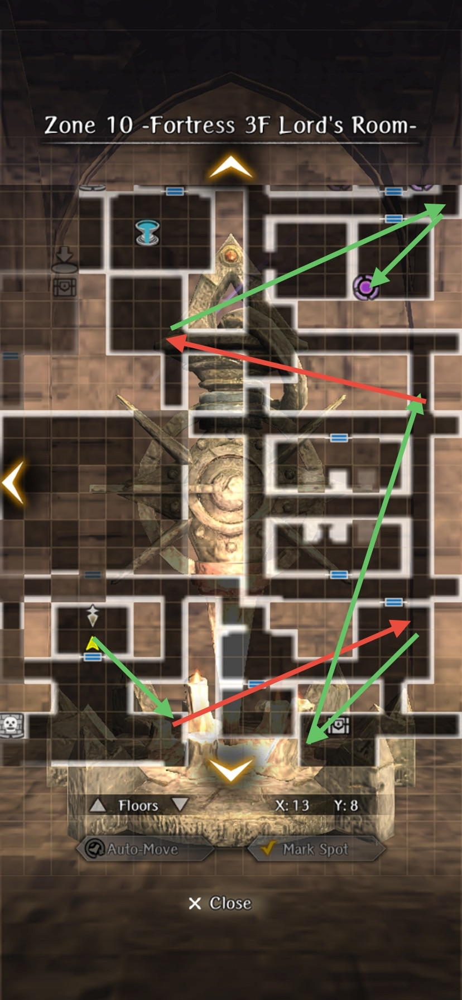
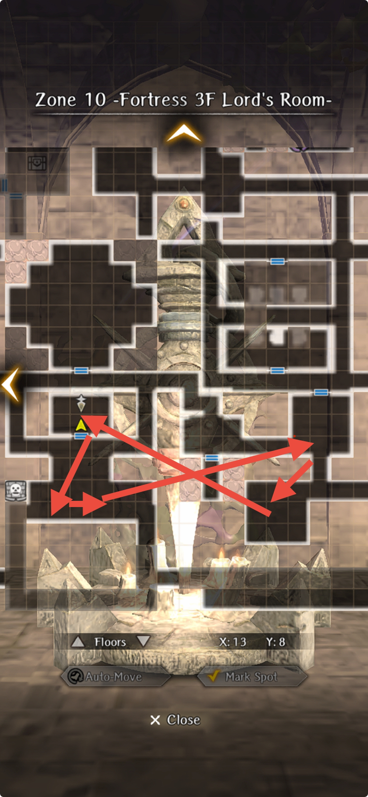
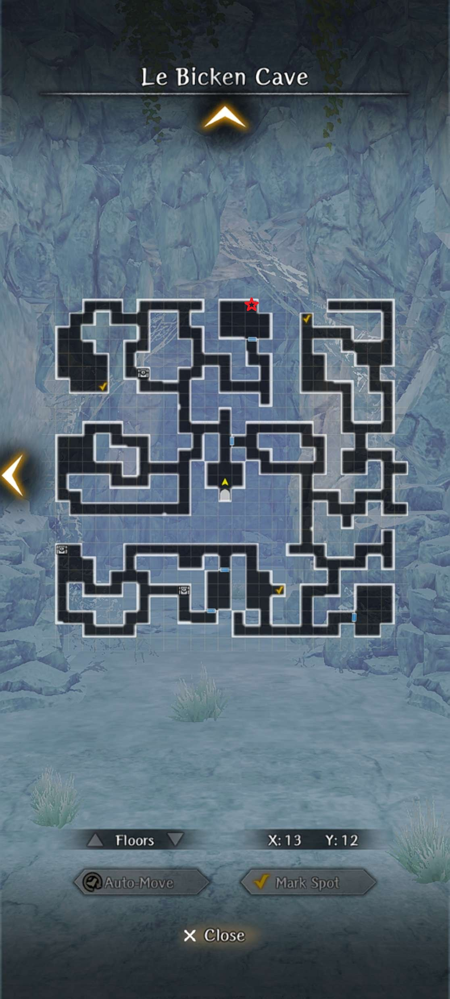

# Farming

??? note "A note about powerleveling"

    Powereleveling refers to leveling up a low-level character quickly by defeating
    high-level enemies with the assistance of a high-level party. In this text, the
    term is applied liberally to refer to any kind of experience farming
    optimization.

    A nuke refers to an all-rows AoE spell. All mages gain some element nuke at
    Lv.40, and legendary Mages + Alice have additional "Secret of" versions. These
    are typically required for efficient farming.

    When leveling up a character from Lv.1 onwards, it is imperative to keep the
    target character's level below the threshold for the area, where gained
    experience starts dropping. There are a few ways to achieve this:

    * Remove the target character from party before Inn visit to avoid level up
    * In case of MC, change class before Inn visit to avoid level up
    * Use in-dungeon fountains for camping[^1] to replenish HP/MP/SP, but without
      gaining levels. Teleporting out of a dungeon and back in again allows
      re-using fountains.

    [^1]: A good opportunity for also building trust with party members.

    !!! warning
        Doing a grade up will *slow down* your leveling. Don't do it unless
        you really need to!

??? note "Experience farming tips"

    If you're planning on farming a lot of EXP, it is worthwhile to optimize your
    approach beforehand. Focus on consistency and efficiency, so you can do it
    paying as little attention as possible. Timing the process can also be helpful,
    for example if you need a second or third nuke for every wave, the time it
    takes to perform can add a lot to the grand total.

    The Adventurer's Passport and Elite Passport from Jeweler contain EXP gain
    boosts. These are normally paid upgrades, but have been made available also for
    free a few times already. These can be very useful to shave off time from a
    longer haul.

## The Beginning Abyss

### Experience Farming - Undead March

After reaching B8F, a request "Undead March" becomes available, consisting of
four waves of almost exclusively undead enemies. This request gives 13,058 EXP
per completion. Once you're strong enough to dispatch the waves with
Mage/Priest nukes, this farm is quite fast, doable in under four minutes. This
results in roughly 200,000 EXP per hour.

If you have Alice, a single nuke is enough to clear a whole wave. Other
characters untested, but should also be serviceable at least as a pair, casting
two consecutive nukes per wave.

Experience gains per character level:

* Lv.20: Full
* Lv.30: 66%
* Lv.39: 33%
* Lv.40: 16%

This means, the farm is only really good for ungraded characters, capped at
Lv.20.

#### Strategy

Place MC in front row, rest don't matter as long as you can cast nuke(s).
Ensure your spellcaster(s) always go before MC, to deal with the rare occasion
when a nuke misses an enemy. Also make sure your MC is sufficiently equipped to
dispatch any still-standing enemy in a single strike.

Steps:

* Cursed Wheel to "Warped Scene". This lands you at the entrance of B8F.
* Leave the dungeon by taking stairs to B7F, teleport to the entrance and use
  Harken.
* Visit Guild to accept request "Undead March".
* Return to B7F to complete the request.
* Return to town, visit Inn before next round.

Turning the mission in after completion yields some gold, but also takes ~30s
and is entirely optional.

## Port Town Grand Legion

### Experience Farming - Repel Enemy Forces

This request becomes available after reaching the Ship in Port Town, from 7th
District. Benefits are higher threshold (Lv.30) for maximum gains, higher
overall gains and involves much less traveling. Request is immediately
repeatable; optimal farming strategy is bailing out after two waves.

For a party with two to three mages able to cast four nukes each, two waves can
be defeated twice for a total maximum gain of 20,646 EXP.

Experience gains per character level:

* Lv.30: Full
* Lv.40: 66%

For a Lv.40 party, the gains are similar to Lv.20 doing Undead March, in the
ballpark of 200,000 EXP per hour. The time is a rough estimate, and also
depends on if you need a third mage nuke or not.

#### Strategy

Grab the request from Guild after visiting Ship 1. This only needs to be done
once, and the request should *not* be turned in. If you're taking the Cursed
Wheel, go to "All Aboard" (or later) for the request.

Main enemies in both waves are Plague Crewmen, with over 900 HP. They are
vulnerable to earth element, so having an earth nuke will help. It is possible
to dispatch both waves with only two Lv.40 mages (Yekaterina and Adam tested),
but this requires stacking Magic Power up to around 200 for each.

!!! note
    This farm can be dangerous, if not paying attention to which wave you're on.
    The third enemy wave contains an Ore Collector, which is difficult and time
    consuming to kill. If you accidentally challenge the third wave instead of
    bailing out, quickest way out is intentionally getting your MC killed and using
    a flame to revive the party. There is no way to tell at the dialog screen,
    which wave is next, and the fight cannot be flee'd from.

### Junk Farming

!!! map
    

## Guarda Fortress

### Zone 6 Experience and Junk Farming

!!! map "Main Fighting Routes"
    

    ??? note "Strategy"

        1. Visit the circled routes for guaranteed enemies. The Alarm trap room also has many enemy spawns.
        2. Pick up any chests you see
        3. Heal at the fountain as needed

    ??? note "Battle tips"
        
        1. Bring bonus magic beast damage (weapons, Abenius, etc)
        2. Nuke undead with MA/LA spells
        3. Run away from the horse. He's tedious and gives low experience
        4. Sentries in this floor minus the Cyclops have very low accuracy. You can evade most attacks just by having around 110-120 evasion. Having much more may guarantee not being hit at all entirely.

!!! map "Alternate Farming Method - Zero to Minimum Fighting"
    
        - Blue Circles indicate chest spawn areas. Red Areas indicate possible enemy spawns

    ??? note "Strategy"

        1. Harken to Zone 6 and check if there are any chests nearby to grab.
        2. If you see any chests near the Zone 5 to Zone 6 Staircase, Harken to Zone 5 to pick them up
        3. If not grabbage chests, leave and return.

    ??? note "Tips"

        1. Keep in mind you cannot auto-path over the alarm trap on (X:4, Y:15). You need to first step on it manually, and then you can continue auto-pathing.
        2. See above Zone 6 Farming Battle Tips in case you enter into a fight.

### Zone 1 + Zone 8 Junk Farm (Needs specific map variants)

!!! map
    

    ??? note "Some Notes"

        - For Zone 1: There will be no patrolling sentries with this configuration so it will be easy to grab the chests that spawn in that room formation. 
        - For Zone 8: Some normal enemies include Vampires, Lesser Demons, Chimeras, and possibly even Cyclops. Be prepared to fight these.

### Zone 10 Shinobi Junk + General Junk Farming

!!! map
    

    ??? note "Strategy"

        1. Obtain the Triumphant Return wheel step for Abyss 3 and unlock the Greater Harken on Zone 10
        2. Follow the green and red arrows
            a. Green arrows can be be traversed with autopathing. Due to how the sentries reset positions after each encounter, the autopathing avoids the sentries as long as you move immediately after claiming a chest (or finishing an encounter if no chest drops)
            b. Red arrows, wait for the sentry to pass then autopath
        3. Return via the Harken on Zone 9

    ??? note "Alternative Start"
        This same path can roughly be followed prior to obtaining the Triumphant Return step, however it is a bit more manual as it involves wheeling to the Zone 10 arrival, manually moving down past the sentries, then autopathing back up after clearing the bottom three encounters. It takes longer this way, but can be useful for folks that want to start this farm prior to saving the Duke.

!!! map
    

    ??? note "Strategy"

        1. Obtain the Triumphant Return wheel step for Abyss 3 and unlock the Greater Harken on Floor 10
        2. Wait at the door for the Sentry to pass by, exit and head to the three adjacent rooms to kill the enemies + collect chests
        3. Return to Harken avoiding the Sentry by the door

    ??? note "Battle Tips"

        1. The possible sentry fights are: 
            - 1 Cyclops + 1 Frontline Succubus + 1 Backline Vampire + 1 Backline Succubus
            - 1 Minotaur + 1 Greater Demon
            - 1 Backline Vampire + Succubus + 1 frontline Vapire + Succubus
        2. You cannot run away from these, so make sure you can deal with these types of battles.
        3. The normal enemies on this floor also include vampires/succubi/minotaurs so be prepared to deal with them (Resistance, ASPD, Light Damage for vampires)

    ??? note "About this floor"

        - If you can reasonably kill the sentries, it is recommended to kill them in order to get more chances at Shinobi Junk, as they have a higher chance of dropping it compared to the normal monsters.

### Catacomb Candle Farm

!!! map
    

    ??? note "Strategy"

        1. Obtain the Triumphant Return wheel step for Abyss 3 and Unlock the Catacombs by completing the Expose the Intruder Request
        2. Clear out the Catacombs and interact with the door puzzle on the top left of the map. Click on the light to activate the ability to interact with the candles.
        3. Interact with any candle besides the one near the entrance.
        4. Repeatedly light the candle and farm the chest drop.

        !!! note "Lulu will berate you for failing the puzzle, and has unique dialogue up to 3 times. On the 3rd time onwards she will just sigh at you"

        !!! caution "As of 1.8.0, this fight no longer guarantees chest drop (drops at normal rate). Also, the candles spawn random enemies from a set batch."

        

### Elmon Farm (Le Bicken Cave Farm)

!!! map
    

    ??? note "Strategy"

        1. Complete Symbol of Alliance request from an ally to familiarize yourself with the map.
        2. Cursed Wheel to reset the request. To expedite farming, set the Inventory Refill (next to settings button) to automatically fill your team's inventory with the quest items you can afford when resting at an Inn. You can manually refill with this setting if don't need to rest between resets.
        3. Complete the request again while grabbing all the chests (The Gorgons only respawn on request reset and are guaranteed chest drops).

        !!! note "If you're not strong enough to fight the Gorgons easily, feel free to just go in and out of the map to collect chests with minimal battles, as chests respawn when you leave the map"
