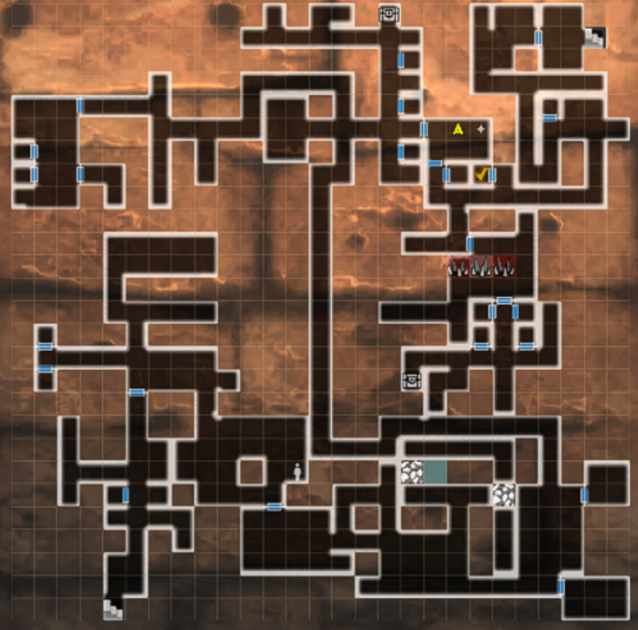
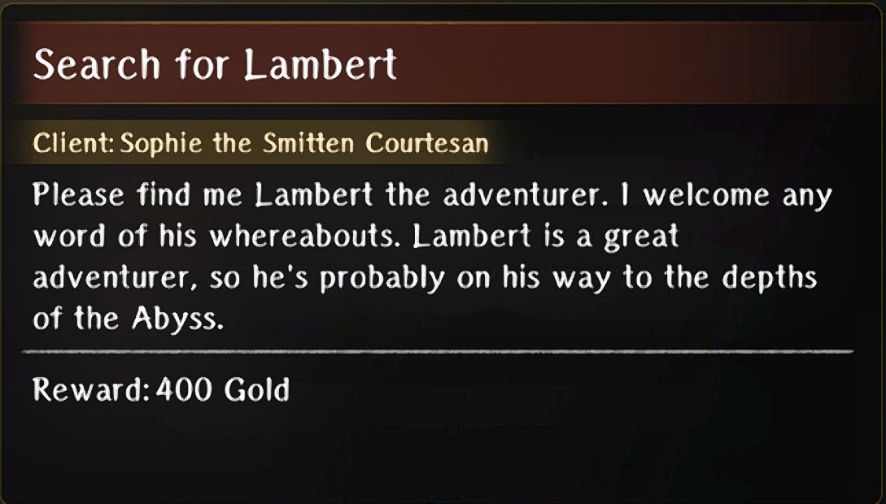

# The Beginning Abyss - Requests

## Fresh Start

### Sweet Walnut Delivery

??? info "Request"
    

- Talk to the Smirking Adventurer in the tavern  
- Go to Beginning Abyss -Entrance- and gather the Walnuts

??? map "Location"
    

### Light Shield Material Collection

??? info "Request"
    

- Go to B1 of Beginning Abyss

??? map "Location"
    

### Fragrant Plant Seed Delivery

??? info "Request"
    

- Go to Inn  
- Go to B1 and find the herbs

??? map "Location"
    
    
    !!! note
        It's possible this is randomly in any small room

### Scrap Sabaton Collection

??? info "Request"
    

- Go to the Item shop to activate the request  
- Go to the guild and accept the quest  
- In B1 gather junk and turn in the request  
- Go back to the item shop to receive item

### Rhodium Delivery

??? info "Request"
    

- Go to the blacksmith to activate this quest  
- Go to the guild and accept the request   
- Continue on until B6 then collect the 2 Rhodium  
- Turn in the request  
- Go back to the blacksmith

??? map "Locations"
    

    ??? info
        Follow Green for one and Blue for the other

## Minor Harken Unlocked

### Death Stench Investigation

??? info "Request"
    

- Go to B1 and defeat the Ambush

??? map "Location"
    

## Major Harken Unlocked

### Donato’s Redemption

??? info "Request"
    

- Defeat the 6 goblin packs in B1

??? map "Location"
    

## Despicable Trap

### Abyssal Steel Delivery

??? info "Request"
    

- Fight the enemies blocking the Ebonsteel on B4  
- Pick up the Ebonsteel from the sparkle on the ground

??? map "Location"
    

### Knight-Butcher Ent Proliferation

??? info "Request"
    

- Defeat the 3 enemies on B3

??? map "Location"
    

### Fluorescent Flower Delivery

??? info "Request"
    

- You will activate this request as part of the Albano Bondmate line  
- Go to the inn upon accepting the request  
- Go to B5 and kill the mimic to get the glowstone  

??? map "B5F Mimic Location"
    

    !!! note
        The chest does not appear on the map

- Go to B3 and find the 2 flowers

??? map "B3F Flower Locations"
    

??? map "Alternate Locations"
    

    !!! note
        It is possible that there are other locations than the above two specified, so if neither of those maps work for you, you can check the bottom-right side or just explore everywhere!

## Treacherous Floor Traversal

### Relentless Massacre Rabbit

??? info "Request"
    

- Go to B4 and fight the vorpal bunny 4 times

??? map "Locations"
    

??? Map "Alternate Locations"
    

### Grandchild Party Rescue

??? info "Request"
    

- Save Mel and her party on B5

??? map "Location"
    

## Second Major Harken

### Search for Lambert

??? info "Request"
    

- Talk to Sophia in the tavern  
- Find Lambert on B7 and watch as he dies  

??? map "Location"
    

- Wheel back to Treacherous Floor Traversal and find Lambert on B5F.

??? map "Final Location"
    

### Abyss Heretics

??? info "Request"
    

- Defeat the 3 groups of zealots

??? map "Locations"
    

### March of the Undead

??? info "Request"
    

- Take the Harken to B7  
- Step out and defeat the enemies

??? map "Location"
    

## Labyrinth Cleared

### Cazula Root Delivery

??? info "Request"
    

- Go to the tavern and talk to the Gloomy Adventurer  
- Go to B7 and get the Bladeless Dagger  
- Return to the tavern and give it to him

??? map "Location"
    

## The King’s Rescue

### The Lingering Scent of the Greater Warped One

??? info "Request"
    

- Take the Harken to B8  
- Fight the waves of enemies

??? map "Location"
    