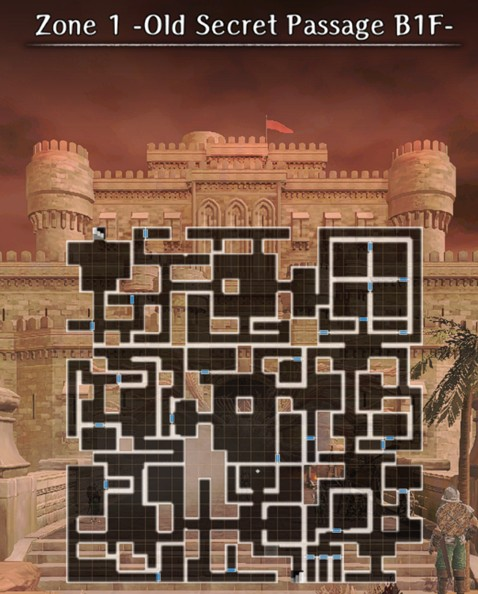
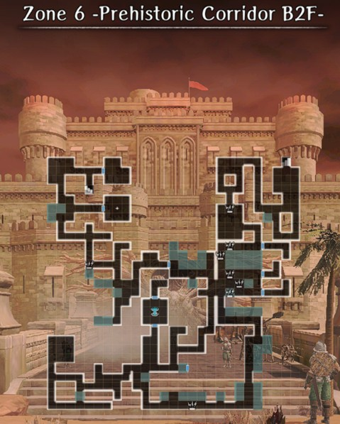
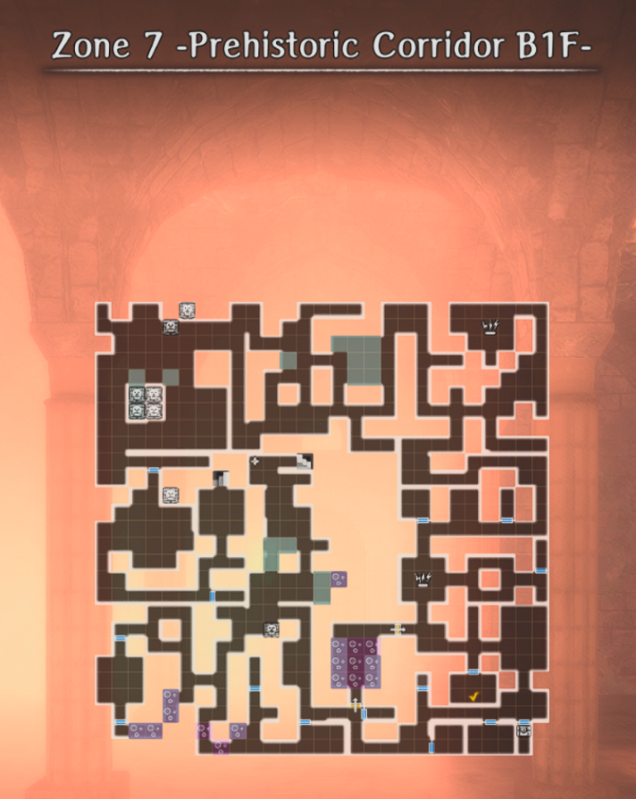
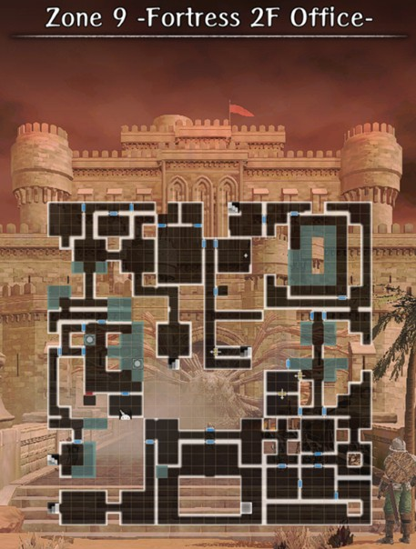

# Garuda Fortress

!!! warning "Under Construction - thank you for your patience"

??? map "Zone 1 -Old Secret Passage B1F-"
    

??? map "Zone 2 -Old Secret Passage B2F-"
    

??? map "Zone 3 -Old Secret Passage B3F-"
    
   
??? note "Navigating Zones 2 and 3"
    Zones 2 and 3 form an interconnected maze where you drop down holes and climb up ladders. In order to navigate to the exit, follow the paths marked on these maps:

    1. Red
    2. Orange
    3. Drop down the north-west most pitfall trap and follow the Light Blue line to a lever. Hit the Lever to open the Red door that blocks the Light Orange path.
    4. Light Orange
    5. Green

    ??? map "Zone 2 -Old Secret Passage B2F-"
        

    ??? map "Zone 3 -Old Secret Passage B3F-"
        

??? map "Zone 4 -Tunnel-"
    

??? map "Zone 5 -Prehistoric Corridor B3F-"
    

??? map "Zone 6 -Prehistoric Corridor B2F-"
    

??? map "Zone 7 -Prehistoric Corridor B1F-"

    ??? map "Variation 1"
        

    ??? map "Variation 2 (Princess Route)"
        

    ??? map "Variation 3 (Princess Route)"
        

??? map "Zone 8 -Fortress 1F Entrance-"
    

??? map "Zone 9 -Fortress 2F Entrance-"
    

??? map "Zone 10 -Fortress 3F Lord's Room-"
    