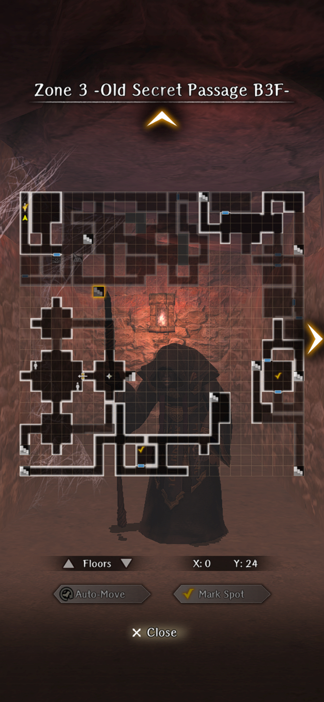

# Impregnable Fortress

!!! warning "Under Construction - thank you for your patience"

## Request to Rescue the Duke

## Infiltrating the Fortress

## Hidden Passage

## Secret Passage Minor Harken

### Putting Evil Spirits to Rest

- Go to Zone 1 and kill the 6 Poltergeist encounters.
    - Encounters have 2 to 5 poltergeists
    - After the 3rd and 4th encounters, your entire party will be paralyzed
    - After the 5th encounter, your entire party will be critical poisoned
    - After defeating the 6th encounter you receive a Lily of Eternity (sells for 92,000 gold)

??? note "Tips"

    - Bring Scrolls of Purification. All poltergeist encounters are in a single line and can be instakilled with MAREIN.
    - Use CORTU to survive the MA- spells they throw out.

??? map "Locations"
    

??? note "Reward"
    

## Enshadowed Well of Life

### Bodyguard for Ruins Exploration

!!! warning "This request cannot be fully completed until the second run of Abyss 3, after the main character learns the right hand technique for this abyss."

##### Walkthrough

- Pick up the brick connoisseur at the tavern upon taking the request.
- Go to **Zone 2 -Old Secret Passage B2F-** to begin.
- There will be 4 locations where you need to fight varying amounts of Sand Apparitions. The brick you need to interact with will be right next to the fights.
- Return to tavern and watch him get arrested for trespassing if you have discovered all 4 brick types.

??? map "Locations"

##### Rewards
- If obtaining all 4 brick types, obtain "Enthusiastic Carpenter Hans" as a bondmate, who is an earth element bondmate that gives Resistance.

## Secret Path Keeper Vanquished

## Fortress Basement Arrival

### Forbidden Area Search Escort

You have to find an old mage three times, answer a trivia question and fight a battle each time. When you return to the guild (which happens automatically after the third encounter) Endy asks you a final question. The answer determines whether you get the bond or not. 

??? map "Locations"
    

??? note "Answers to the Old Man's questions"

    - MAERLIK
    - Guarda
    - Luknalia
    - Confusion
    - Bugs
    - MORLIS
    - Level drain
    - Opening the gate

    !!! note
        If you answer one of the old mage’s trivia questions wrong, the summoned opponents are much tougher than if you answer correctly. You can still get the bond with a wrong answer.
        You can also restart the quest without wheeling around by returning to the adventurer’s guild, abandoning the request and then taking it again. 

The correct answer to Endy's final question is "Nothing is more precious than life".

##### Rewards
- If Endy's final question is answered correctly, obtain "Endy the Mage" as a bondmate, who is a fire element bondmate that gives Evasion.

## Fortress Lower Floors Cleared

## Portrait Gallery Minor Harken

### Search for Missing Person

!!! warning "As of version 1.4.0, this quest is bugged sometimes. The trigger for the quest does not activate properly, and is instead in a different room"

##### Walkthrough
- Go to **Zone 4 -Underground Tunnel-** to talk to the Singing Skeleton right next to the Harken to accept the request.
- Go to **Zone 5 -Prehistoric Corridor B3F-** via stairs from Zone 4, as this is usually closer to quest location.
- Look for the specific dead end corridor that has the encounter.
- You will enter a fight similar to the necromancer sentry battles in Zone 1 to Zone 3. However, the Mage Skeleton in this fight can cast CC outside of its turn.
- Win the fight within a certain number of turns.
- Return to Zone 4 and talk to the Singing Skeleton for the reward.

??? map "Locations"
    

##### Note
- The map location shown is what the hallway looks like. It can be in different locations depending on the map variation. If the quest does not trigger at that spot, it will trigger in topmost room across from the hallway.

##### Rewards
- Returning the skeleton's friend will grant 2 random Abyss 3 junks and the bondmate "Singing Skeleton in the Tunnel", who is a dark element bondmate that gives defense power.

## Ghosts of Yore Vanquished

## Fortress 2F Minor Harken

## Fortress 3rd Floor Arrival

## Triumphant Return

### Expedition to Clear the Fortress Lower Levels

##### Requirements

- Attained [Guarda Fortress Abyss Good](./greater-warped-one.md#good-ending)

##### Walkthrough

- Go to **Zone 6 -Prehistoric Corridor B2F-** and walk a few steps out of the Harken room
- Engage in 3 back-to-back fights and win.
- Return to Tavern for reward.

##### Enemies

- 1st Battle: 1 Necrocore + 1 Poltergeist in the front row. 1 Giant Skeleton + 1 Poltergeist in the back row.
- 2nd Battle: 1 Minotaur + 1 Gorgon in the front row. 1 Chimera in the back row.
- 3rd Battle: 2 Greater Demons in the front row. When one dies, the other enters a rage mode.

##### Rewards

- "Duke Ixion" as a bondmate, who is a light element bondmate that gives Magic Power + MP
- Handkerchief Embroidered with Gold Thread (can sell for 100k)
- Knight's Cloak (White 1* trinket with "Way of the Knight")

### Missing Companion

##### Requirements

- Attained [Guarda Fortress Abyss Good/True Ending](./greater-warped-one.md#good-ending) (needs confirmation).
- Liam (Alan and Lily's daughter) survives the ending.
- Hound companion survives.

!!! warning "This request leads to a boss fight that is possibly very time-consuming and arguably more difficult than that of the average fight with the GWO of this abyss."

##### Walkthrough

1. After accepting the quest, head to Edge of Town to receive more information.
2. Head to **Zone 5 -Prehistoric Corridor B3F-** and seek out the dog and adventurers.

##### Enemies

!!! danger "Enemies"
    

**Boss: Offensive Golem**

Will buff itself with an attack + accuracy buff for 4 turns, and it will have the capacity to one shot even tanks that are defending. It will generally spam an AOE frontline attack, but can sometimes do a column attack. Very rarely, it will decide to basic attack. Every 4 turns, it will rebuff itself for another 4 turns. When it's about to die, it will buff itself with an accuracy buff and damage buff for 4 turns that isn't as strong as its usual buff. However, the attack buff does not stack with the other attack buff, but the accuracy buffs stack.

**Boss: Defensive Golem**

It will buff itself on turn 1 with invulnerability (it will take 0 damage permanently). It also has the same moveset as the Offensive Golem in which it spams an AOE frontline attack or a column attack. It occasionally uses basic attacks. Every 4 turns, it will rebuff itself with the invulnerability (despite it having no duration). When it's about to die, it will buff itself with an accuracy buff and damage buff that are very mild for 4 turns.

##### Saving the Dog and Adventurers

If you choose to save both the dog and adventurers at the same time, you will need to fight BOTH, and the invulnerability buff of the defensive golem applies to the offensive golem (but not the other way around for the offensive buff). If you choose to save only either one, you will still need to fight both golems, but one at a time instead.

##### Strategy

^^Frontline:^^
Frontline preferably 3 Knights/Fighters/Priest (any combination) with 300+ DEF. Ideally they should have the skill Self-healing preferably at lvl 3, but no higher. It's also preferable to have entire inventories of Ultra Healing.

^^Backline:^^
Backline preferably 1 Priest, 1 opening-hitter DPS, 1 Ninja. Ninja and Priest are required, all 3 backline should have self-healing as well at lvl 1, any higher isnt necessary but lvl 3 is the highest you need. Bring as many SP and MP pots as possible. This can be a long battle.

^^Strategy:^^
If your team is fast enough, you have 1 turn to burn the defense golem for as much HP as possible in 1 turn. You need to use defense penetration skills or extremely high level skills, otherwise you will do nothing substantial. 

Once the golems buff, ==you must have the ninja use dissipation on the offensive golem==. All units should defend at this point and wait for one of the golems to cause an opening. On average, the offensive golem hits for 200-250 to defending frontline without his damage buff.

Once an opening is created, have your backline opening-hitter do their strongest move against the golem. Every 4 turns, the golems will rebuff. You can tell when they are about to rebuff when the offensive golem has 1 turn of accuracy buff left. At this time it is safe to not defend with frontline and use Self-healing or Potions. This will keep MP costs down, but if you don't have a lot of MP, then it's okay to run another priest/mage with heals. 

Repeat until both are dead. Use heals as often as possible. Makaltu might be worth using at low levels to reduce ur overall mp cost in the fight by a bit but it's not necessary, and you will die regardless if the offensive golem moves to the frontline and attacks with the damage buff up. 

The defensive golem will likely die first, and the offensive golem will actually remove its invulnerability buff once it reache's near death. Dissipation still removes the damage buff first. It will still have quite a bit of HP so continue the strategy and only attack when it has 1 turn of accuracy left.

##### Notes

- If you only save the dog, you get nothing but the stated gold in the request.
- The quest is not repeatable once the bondmate has been obtained (Unsure if this is intended or not)

##### Rewards

- If you save both the dog and the adventurers, you will receive the bondmate "Eugen and Bibi" which is a void element bondmate with confusion tolerance.

### Emergency Occurrence

##### Requirements

- Attained [Guarda Fortress Abyss True Ending](./greater-warped-one.md#true-ending)

!!! warning "This request leads to a boss fight that is arguably more difficult than that of the average fight with the GWO of this abyss."

##### Walkthrough

1. After accepting the quest, head to Edge of Town to receive more information.
2. Head to **Zone 3 -Old Secret Passage B3F-** and walk slightly north of the Harken.

##### Enemies

!!! danger "Enemies"
    

**Boss: Necrocore**

This boss will always act three times at the start of the fight. It will cast "Summon Undead", which summons a Sand Apparition + Skeleton Giant to the same row and a Skeleton Mage, Gluttonous Maw, and Red Spinner Woman to the back row. It will then cast "March of the Undead" which will grant a 10 turn Attack, Accuracy and Defense buff to all enemies. Finally, it will randomly use a skill from a standard Necrocore. Most of the time afterwards, it will act like a typical Necrocore, but randomly can recast "Summon Undead" and/or "March of the Undead".

##### Strategy

^^Frontline:^^
Preferably very tanky damage dealers Fighters are preferred (as they have Full Power Strike), but Knights can be used too for DPS purposes if they have high level damage skills. Try not to use Light element adventurers, as all the damage done by the enemies are Dark. It's almost MANDATORY to have Assault guard level 1 on all the frontline (Not necessary if you have Undead Resistance and/or Dark Element).

^^Backline:^^
Two priests are preferred, especially if at least one of them can cast mage skills (Kantios). They ideally should both have Madios LvL 3+ and Makaltu Lvl 3+. If you do not have a Knight in the frontline OR are using the Knight for DPS purposes only, you ==WILL need a knight SPECIFICALLY to cast Knight's Defense.== Assault Guard is preferred on all the backline as well.

==The Knight casting Knight's Defense needs to be slower than all other party members==, but still be around ~70 ASPD give or take a few to not be outsped later in the fight by the Necrocore.

^^Strategy:^^
Essentially, this fight is a DPS race to see whether your team can kill the Necrocore before it wipes your team. The fight will ALWAYS start out as an Ambush, and as such, the Necrocore always gets a free hit on your party. He hits EXTREMELY hard and easily deals 500+ damage on an assault guarded frontline with 300+ defense. It's acceptable to restart if he does Spear Thrust instead of Zelos or Mazelos, as those are not affected by the attack buff he casts. Essentially you will be spamming Full Power Strike on Fighters OR Heavy Attack/Precision Strike/Armor Pierce LVL 3+ every turn on ONLY the Necrocore, as the fight will end once the Necrocore dies. Makaltu will help a lot with surviving the onslaught of damage every turn, as it's quite a lot EVEN with Knight's Defense. Two priests are preferred, as you often will need to cast Madios Lvl 3+ on both rows. When you do not need to heal, attempt to cast Kantios on the back row and then the front row. This will reduce the amount of damage you may take, as most of the basic enemies have Instant Kill moves or skills that deal a lot of AOE damage. It's also preferrable for the support adventurers to carry nourishing draught if you need more turns to deal with the Necrocore.

##### Notes
- If you die, you don't need to use any Flame of Resurrection as there is a Harken nearby, but you will still lose 5 fortitude on all allies.
- Dissipation does not work here very well, as the Necrocore can rebuff at any time. In addition, the attack buff is dispelled after the accuracy buff, and the defense buff is not dispellable despite being multi-turn.

##### Rewards
- You will obtain "Graham, Knight Commander of Guarda" as a bondmate, who is a fire element bondmate with Attack Power and Stone Resistance.
